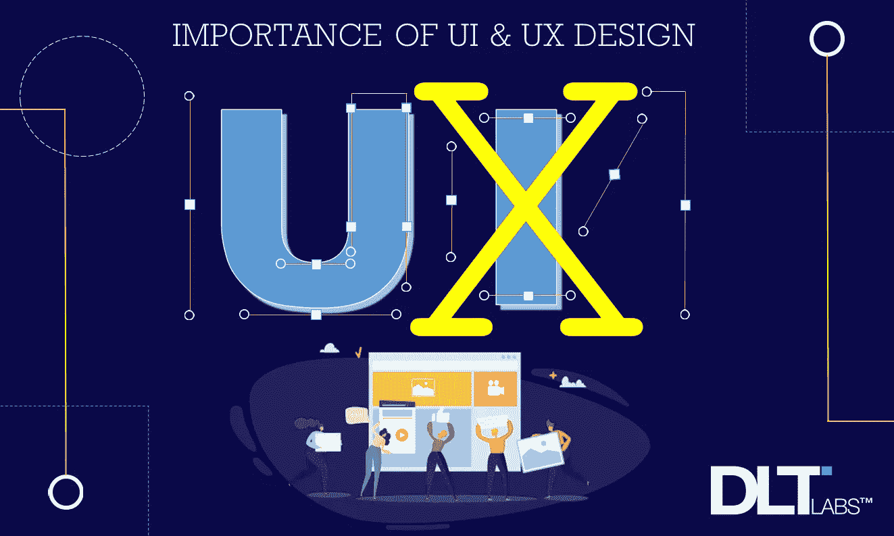
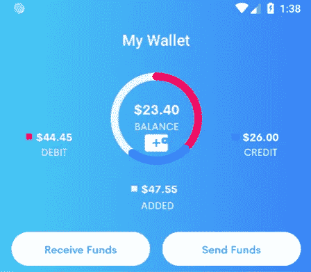
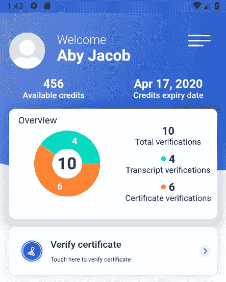

# 为什么 UI/UX 对你的业务至关重要？

> 原文：<https://blog.devgenius.io/why-is-ui-ux-crucial-for-your-business-1895bfbc75ff?source=collection_archive---------16----------------------->

# 什么是用户界面/UX？

当计算机首次问世时，人们必须知道如何编写代码才能操作它。它不是为普通用户设计的。缺少的是由图形和简单布局组成的更加用户友好的方式。

这种想法导致了图形用户界面(GUI)的产生，它由窗口、按钮、图标等组件组成，可供大众使用。这种方法使计算机更容易使用，并且一直沿用至今。

但是你有没有想过你使用的应用程序或软件是如何拥有如此华丽的设计的？要理解这一点，我们必须意识到四个需要结合在一起的概念:

*   **用户界面(UI)** —包括屏幕、页面、控件和大量其他视觉元素，将帮助用户轻松地与应用程序/软件进行交互。
*   **用户体验(UX)** —包括用户与网站、页面或窗口交互的整体体验。
*   UI 设计者是图形设计者，他们确保应用程序界面吸引人，并且设计得与应用程序的目的相匹配。
*   **UX 设计师—** UX 设计师也关注应用程序的用户界面。UX 设计师监督并确定用户界面将如何为用户操作，然后确定界面的结构和功能。

# **为什么 UI/UX 很重要？**

设计网站或应用程序时，吸引人的图形和内容并不是唯一重要的东西。许多设计师经常忽略的网页和应用程序设计的一个方面是需要好的 UX 设计。但是到底什么是用户体验设计(UX 设计)，为什么它如此重要？

UX 设计完成软件设计和开发的整个过程，包括架构、交互/视觉设计、线框和可用性(UX 设计的 5 个核心组成部分)。

设计师必须超越简单地创造可用的产品。他们还应该考虑用户在购买和使用产品时的愉悦和享受。换句话说，UX 设计是构建相关和有意义的应用程序的过程，在创建应用程序时有 3 个广泛的目标:用户想要使用的应用程序，用户喜欢的应用程序和用户容易理解的应用程序。

DL Creds 证书验证屏幕| [来源](https://play.google.com/store/apps/details?id=com.dltlabs.dl_certify&hl=en_IN)

# **这一切是如何组合在一起的？**

UX 设计师决定用户界面*如何运行*，而 UI 设计师决定用户界面*看起来如何*。 **UX** 团队处理应用程序的流程，然后检查你用来导航任务的按钮，界面根据用户的需要提供信息。UI 团队致力于美学，致力于不同的界面元素如何出现在屏幕上，以及它们如何组合在一起。

假设在设计过程中，需要添加一些额外的控件来改变用户界面。在这种情况下，UX 团队将确定控制布局的最佳方式。

然后，UI 团队会在将该设计添加到现有布局之前对其进行调整。这需要用户界面和 UX 设计者之间的有效沟通和协调，以交付一个看起来不错且功能良好的界面。

# **UX 设计的 5 大核心要素**

DL 钱包 App 屏幕| [来源](http://www.dltlabs.com)

## **信息架构**

信息架构，也称为 IA，关注于创建一个应用程序设计，通过交付业务需要的东西来补充业务的目标。换句话说，它是关于以一种人们容易理解的方式将人们与应用程序联系起来，使得通过使用索引、导航等在应用程序中找到内容变得容易。

## **交互设计**

交互设计，如 word 所说，就是用户与屏幕的交互。更多的是通过*图形*、*颜色*、*图像*、*字体*、*颜色*等与用户交流。

## **可用性**

你怎么知道从哪里开始？驱动某种设计选择的标准是什么？一些美学上令人愉悦的东西，可能对用户不友好。这就是可用性的来源。

可用性，又称*有效性，*利用数据来确定设计决策的有效性。这些数据是通过调查、访谈、现场访问等方式收集的，以了解应用程序将如何使用。

## **线框**

这使您能够深入了解设计的功能和任何需要的更改。除了可视化用户界面，线框允许你设置设计优先级，并帮助你识别逻辑约束和实现冲突。这一点很重要，因为在将时间和资源投入应用程序开发之前，它会让您更接近产品的最终功能。

## **视觉设计**

视觉设计处理产品的视觉方面，以改善 UX 和用户界面设计，并对最终应用程序的外观和感觉产生影响。

但是 UX 对企业有什么好处呢？

# **以下是 UX 设计能给企业带来好处的 4 种方式**

## **它迷住了用户**

当任何用户开始使用你的应用程序时，你只有很少的时间，不到几秒钟来给他们留下印象。只有当你的应用程序设计足够强大，足以迫使他们使用你的应用程序时，他们才会决定继续使用，否则他们就会离开。参与也起着重要的作用。如果用户觉得它有趣，更吸引人，只有这样他们才会进一步使用*这个应用。*

## **增强客户满意度&提高投资回报率**

当你的应用程序有一个令人印象深刻的设计时，它为你的用户提供了易于导航的好内容。这导致在使用您的应用程序时有很高的满意度。一个好的和满意的客户往往会欣赏和推荐你的应用程序给他人，反过来导致客户的增加，从而增加你的业务的投资回报率

## **节省时间和成本**

没有人会喜欢一个漏洞百出或者导致用户体验不佳的应用。如果你在良好的用户界面/UX 设计和质量保证上投资，你的客户在使用你的应用程序时就不太可能发现任何问题或困难。一个完美的产品不需要频繁更新，帮助你节省时间和金钱，让你专注于其他业务领域。

## **在应用商店获得特色**

你的用户是最强有力的拥护者。补充我们之前的一点，一个应用好不好用，和喜欢它的用户数量是成正比的。满意和快乐的用户的积极评价和评论将使你的移动应用程序达到顶峰。

在移动应用程序的情况下，应用程序商店通常会推荐受到高度关注并获得用户积极评价的应用程序，通常会在应用程序商店的主页上展示它们或向用户推荐它们。这大大增加了你的应用程序的曝光率。这也是为什么好的用户界面和 UX 很重要的另一个原因，它可以成为应用程序设计者的动力来源。

DL Creds 概览页面| [来源](https://play.google.com/store/apps/details?id=com.dltlabs.dl_certify&hl=en_IN)

# **改进您的应用程序 UI/UX 的建议**

## **保持整个应用程序的一致性**

设计者应该确保设计在整个应用程序中是一致的。不限于控制，应用程序必须有相同的颜色和模式。一致的应用程序设计有助于用户轻松地与应用程序交互。

## **减少装载次数**

设计者应该以一种允许更短加载时间和消耗更少资源的方式来设计。速度和时间是 UX 设计的重要因素。用户希望节省时间。加载时间越长，他们就越有可能有负面体验。

## **使其易于使用**

在应用程序上使用熟悉的传统控件，使用户更容易使用应用程序。用户不需要参考额外的应用程序使用指南。

应用程序的设计应该是这样的，所有的服务都可以用最少的输入访问。具有复杂设计和功能的应用程序可能会让客户不满意。

## **让你的应用程序互动**

交互式应用程序更加用户友好。当用户与应用程序交互时，它会在用户和应用程序之间创建一个连接。它给用户使用应用程序的自由，让他或她轻松地从一个窗口导航到另一个窗口。

# **结论**

UI/UX 是任何应用程序的一个非常重要的方面。为了使一个应用程序成功，设计师必须建立一个令人愉快的用户界面，同时提供积极的用户体验。

通过了解用户的需求和他们的市场偏好，设计师可以使用我们上面讨论的一些 UI/UX 设计技术来使应用程序更具交互性和吸引力。希望这能帮助你理解 UI/UX 是如何设计的。

*作者——DLT 实验室的 Sunayana Paikaray*

**关于作者:** *Sunayana* 是 DLT 实验室的商业分析师，她已经完成了金融& HR 的工商管理硕士学位。在业余时间，她喜欢跳舞、唱歌和沉溺于创造性活动。她也喜欢在空闲时间冥想。

