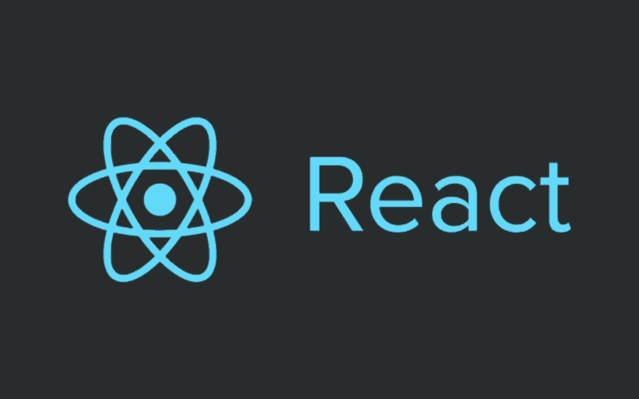

# 为什么必须在 React 事件处理程序中使用箭头函数

> 原文：<https://blog.devgenius.io/why-it-is-necessary-to-use-arrow-functions-with-react-event-handler-e0b278710310?source=collection_archive---------0----------------------->



# 简介:

在过去的几年里，我注意到许多初级 react 开发人员直接在事件处理程序中调用函数，如 onClick、onChange 等，然后他们会遇到一些奇怪的错误，浪费他们的时间。在本文中，我将分享和解释当我们不使用箭头函数而直接在事件处理程序中调用函数时的常见错误。

> 请通过媒体**跟随我**，获取下一篇新文章的通知。我也活跃在推特 [**@IbraKirill**](https://twitter.com/IbraKirill) 。

## 所以我们将在本文中解释:

1-当我们在事件处理程序中直接调用函数时会发生什么

2-常见错误

# 当我们在事件处理程序中直接调用函数时会发生什么:

```
<button onClick={setIsOpen(true)}>Open Modal</button>
```

这里我们已经直接调用了 **setIsOpen()** 方法，该方法在组件挂载阶段后不久就被调用，无需用户点击按钮。我们只想在用户点击按钮时执行这个函数。

**再比如:**

```
<button onClick={removeBill(index)}>remove</button>
```

这里，onClick 内部的表达式将在挂载上执行。一旦应用程序启动，这将删除列表中的所有账单。

# 常见错误:

## 1-未捕获的错误:太多的重新渲染。React 限制渲染的数量以防止无限循环:

**示例:**

```
import React, {useState} from 'react';import Modal from '../components/Modal';export default function App() {const [modalIsOpen, setIsOpen] = React.useState(false);return (<div><h1>Hello World!</h1><ModalIsModalOpened={modalIsOpen}/><button onClick={setIsOpen(true)}>Open Modal</button></div>);}
```

上面的代码导致:【未捕获的错误:重新渲染次数过多】，我们来理解一下这个错误实际上是什么意思，它意味着我们的组件在无限时间内被渲染。现在一个问题可能会浮现在脑海中，为什么我们的组件会在无限长的时间内被渲染。

**原因是当我们的组件被渲染时，我们的状态会立即改变。我们知道当状态改变时，我们的组件将被再次呈现。所以它形成了一个无限循环。**

让我们看看下面的陈述:

```
<button onClick={setIsOpen(true)}>Open Modal</button>
```

我们用来处理状态的功能组件 [**useState**](https://medium.com/swlh/react-hooks-from-scratch-a-z-bf8f7b404f7f) ，这里我们直接调用了 **setIsOpen()** 方法。它在组件挂载阶段后很快被调用，并不断重新呈现状态，陷入无限循环。

所以我们需要重写上面的代码:

```
<button onClick=={() => setIsOpen(true)}>Open Modal</button>
```

现在 **setIsOpen()** 将只在点击时被触发，并且在组件挂载阶段之后不会被调用。

**再比如:**

```
export default function App() {
const [paymentComp, setPaymentComp] = React.useState(false);
const goTo = (par) => {// ... some codes thensetPaymentComp(true);
}return (<div><h1>Hello World!</h1><button onClick={goTo("next")}>Complete</button></div>);}
```

甚至，如果我在事件处理程序中直接调用这个函数&这个函数包含一些改变状态的代码，它也会导致这个错误，所以最好用一个箭头函数在事件处理程序中调用这个函数。：

```
<button onClick={() =>goTo("next")}>Complete</button>
```

## React 事件处理程序中未定义的“this”或 setState 未定义:

这个错误发生在 React 类组件上，让我们看看下面的例子:

```
class App extends Component {state = {name: "Mark"}id = 20;handleClick(){//console.log('Clicked');//here will produce undefinedconsole.log(this);
console.log(this.id);//here will produce errorconsole.log(this.state.name);}render() {return (<> <button onClick={this.handleClick} >click</button> </>);
}
}
```

在这个 **App** 组件中，我们从事件处理程序中访问类的成员&状态。我们认为`this`指向了`App`类，但是我们得到了一个严重的错误。**类型错误:无法读取未定义的属性“id”。**

我们在函数内部定义(this)的时候有一个问题，然后在 Event 内部调用，但是 React.js 不理解(this)指的是什么？？所以我们想让 React 明白(this)内部事件处理程序指的是当前类。

另一个例子:

```
class App extends Component {constructor(props) {super(props);this.state = {msg: 'Hello World'}}onSetDefaultMsg() {this.setState({welcomeMsg: 'Hello User!'});}render() {return (<div><h1>{this.state.welcomeMsg}</h1><button onClick={this.onSetDefaultMsg}>Generate Message</button></div>);}
```

上例的另一个错误: **setState 未定义**。但是我们知道 setState 方法之前是由 React 在类组件中定义的，那么为什么这个错误会出现在我们面前。

`this`关键字必然取决于它在哪里被定义。在这种情况下，`this`恢复到其默认绑定。在我们以非严格模式运行的情况下，这是全局窗口对象，但在严格模式下，这是`undefined`。

我们需要将事件处理程序绑定到组件。绑定的方式有很多种。我将试着展示并描述其中的大部分:

**1-使用显式绑定:**

在这个选项中，我们将`this`值显式绑定到我们希望它在函数中引用的对象，我们有两个选项:

**A-选项 1:**

```
<button onClick={this.handleClick.bind(this)} >click</button>
```

**B 选项 2:**

通过在组件的构造函数中添加这一行，这将引用事件处理函数中的组件:

```
constructor(props) {this.handleClick= this.handleClick.bind(this)  // Just Bind here}
```

虽然这种方法可行，但有两个问题:

让我们项目中的某个地方的代码修改我们项目中其他地方的代码不是一个好的做法。这是可行的，但这不是一个很好的实践。

当我们将当前组件绑定到方法时，假设页面上有十个这样的按钮。这意味着我们将这个组件的 10 个实例绑定到函数上。虽然在这个简单的例子中不会产生很大的影响，但是一些复杂的组件可能会产生更大的影响。

**2-使用箭头功能:**

第二个解决方案是箭头函数:当我们使用箭头函数时，事件处理程序自动绑定到组件实例，因此我们不需要在构造函数中绑定它。箭头函数将在函数内部绑定&定义(this)引用类组件。**配合箭头功能更好。**

我们有两个选择可以做到这一点:

**A-选项 1:**

我们将用箭头语法重写处理函数:

```
onSetDefaultMsg = () => {this.setState({welcomeMsg: 'Hello User!'});}
```

**B 选项 2:**

我们不会重写处理函数，但另一个选择是在回调中包含箭头函数:

```
<button onClick={() => this.handleClick()} >click</button>
```

> 如果您想在 React 中深入研究 [**最佳实践模式。我劝你用下面的**](https://click.linksynergy.com/link?id=GGg4no0HUcA&offerid=1060092.2815357&type=2&murl=https%3A%2F%2Fwww.udemy.com%2Fcourse%2Fadvanced-react-render-performance-best-practices-patterns%2F) **[**课程**](https://click.linksynergy.com/link?id=GGg4no0HUcA&offerid=1060092.2815357&type=2&murl=https%3A%2F%2Fwww.udemy.com%2Fcourse%2Fadvanced-react-render-performance-best-practices-patterns%2F) **。****
> 
> 如果你喜欢看文章，想支持我当作家，你可以 [**请我喝杯咖啡！**](http://buymeacoffee.com/kirillibrahim)
> 
> 如果你想一头扎进[**反应 18**](https://click.linksynergy.com/link?id=GGg4no0HUcA&offerid=1060092.1411694&type=2&murl=https%3A%2F%2Fwww.udemy.com%2Fcourse%2Fthe-complete-react-fullstack-course%2F) 用实际例子，我奉劝你用下面的 [**课程**](https://click.linksynergy.com/link?id=GGg4no0HUcA&offerid=1060092.1411694&type=2&murl=https%3A%2F%2Fwww.udemy.com%2Fcourse%2Fthe-complete-react-fullstack-course%2F) 。