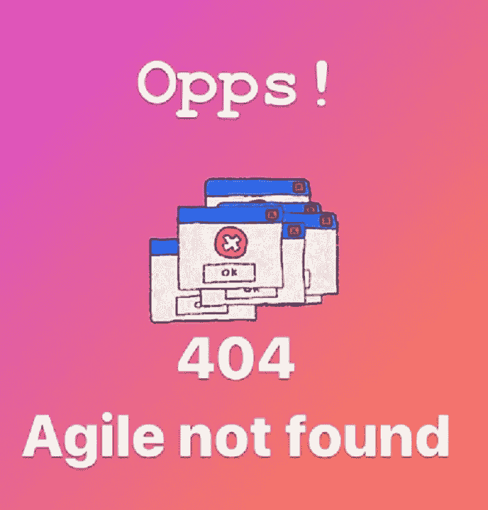
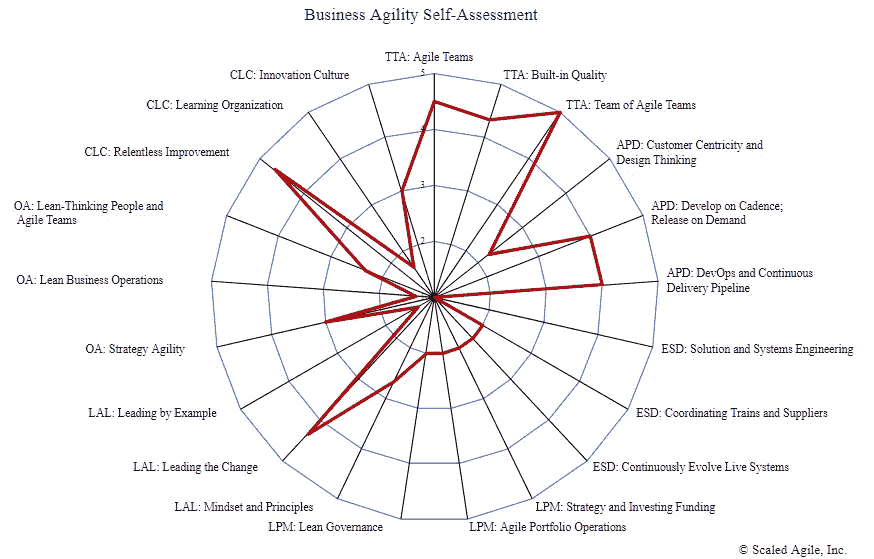
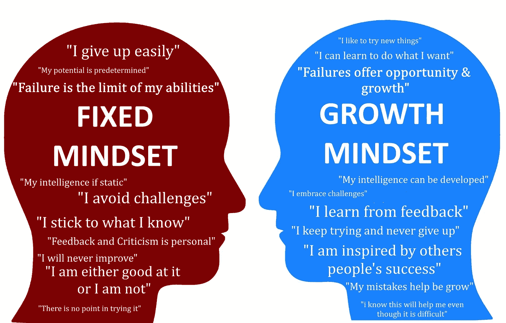
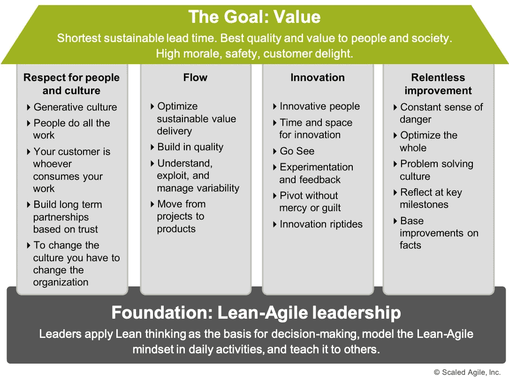
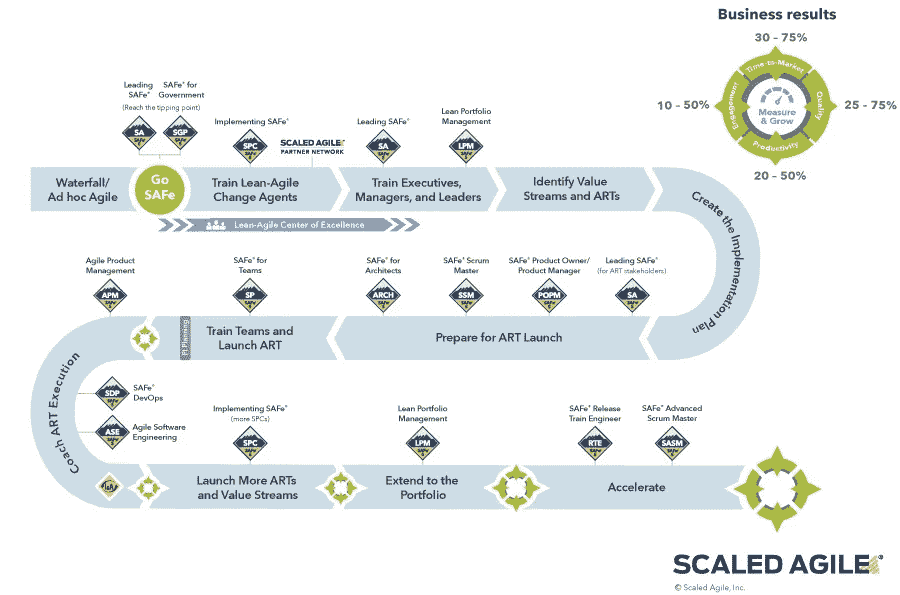

# 为什么只有敏捷很难做到敏捷

> 原文：<https://blog.devgenius.io/why-its-hard-to-be-agile-with-just-agile-b7565b6c1112?source=collection_archive---------7----------------------->

## 使用 SAFe 要避免的 5 个常见错误可能会破坏敏捷转换

很多次我听到人们抱怨敏捷不起作用。尽管我同意它在许多情况下会带来有争议的结果，但我也认为这是因为它通常没有被准确地应用，就像管弦乐队中的音乐家必须被正确地放置才能让我们听到交响乐。

敏捷交响乐没有发挥作用的原因可能有很多，但是本文将关注最基本的原因。

# 1.通常，敏捷之所以失败，是因为它没有在组织层面上得到应用。

直到最近，敏捷还仅仅被认为是团队级别的。但是仅仅在那个层面上应用会让你很快碰壁，因为游戏的其他部分不在那里。

> 记住:“优化组件并不能优化系统”，这是一种新的安全方法所坚持的，我也相信这一点。

即使你优化了整个企业的所有开发团队，如果你让他们成为 scrum 团队，并强迫他们以敏捷的方式工作，系统中仍然有许多重要的部分以旧的方式运行:商业模型、组织层级、技术基础设施、组合/产品管理和预算。这可能会让我们看起来像是在一家公司里创造了两个平行的现实，每个人都说自己的语言，服务于自己的价值观，这些价值观通常非常不同，如果不是相反的话。这很可能会在这两个世界(传统世界和敏捷世界)之间造成紧张，这可能会影响精益价值流，减缓决策过程，并且很可能会破坏工作氛围。

现在我觉得我们有安全来帮助我们解决这些挑战。它涵盖了剩下的其他企业领域，这些领域是局外人，因此是敏捷转换的阻碍者。请看这张反映了七个主要组织领域(21 个维度)的图表，这些领域的变化会影响组织中的敏捷工作。现在更容易理解“实现敏捷性”，特别是对于一个大公司来说，可能是一个目标，但却是一个非常理想且难以实现的目标。知道这一点不应该让我们失去动力，而是激励我们把它看作一个持续的过程。古训说，“这不是短跑；这是一场马拉松，“享受旅程更好。

# 2.通常，敏捷之所以失败，是因为没有首先将转型作为一种文化变革来对待，没有将其作为一种特定的价值观和思维模式。

## a)心态:

采用新的思维方式

所谓的人的因素往往是价值传递失败的一个根本原因。这个因素始于我们对生活的思维模式、观点或结论。所有这些构成了我们的心态，它支配着我们的行为，如果这种心态是有限的，那么我们的选择和行动也会是有限的。

对于一个人来说，改变心态通常是一件很难的事情。在敏捷中，我们谈论的是一大群人的组织变革，因此这种规模的变革可能更具挑战性。

敏捷被正确地称为一种工作方式，它使得项目、过程和组织更能适应不断变化的环境。然而，适应的能力并不始于技术层面的一些技术改进，而是始于我们的头脑，它应该能够不断地适应不断变化的现实。

> 在外管局，这被称为固定与增长思维模式:

*   能够接受**尝试新事物**(包括意见、观点、方法等)。)
*   能够**在更广阔的背景下看待事物**(例如，在看似消极的结果中看到积极的一面)
*   不管你的头衔有多大，都欢迎建设性批评的能力
*   **能够将**错误视为必要的学习曲线和成长机会**，由于上面提到的一切，这可能是一个根本性的挑战)**

**这种心态使整个组织能够看到别人看不到的机会。*关于什么是“成长心态”的更详细的描述你可以在这里找到******。*******

****一般来说，对一个人来说，学习一项新的技术技能比更新他们的信仰体系或学会从不同的角度看问题要容易得多。这就是为什么在招聘过程中了解候选人是否有成长的心态以适应成长和创新的组织文化是很重要的。****

## ****b)新文化和基本精益-敏捷原则:****

****安全、敏捷和 DevOps 方法首先基于文化变革，这意味着一些基本原则和价值观的转变。只有这样，我们才能谈论创造持续价值流的其他技术部分。这些原则包括:****

*   ******快速反馈**，能够更快地发现最重要的东西——数据****
*   ******可变性和选项**由于在创造价值的道路上有很多不确定性和持续的发现，在新的现实中变得比更严格的方法更有价值****
*   ******分散决策**意味着减少垂直层级对价值开发的控制和参与，尤其是在时间紧迫和需要本地信息的情况下。这鼓励和分担各级的责任，并使组织更加横向。****

****如果组织中的人不经常用他们的行动支持这些原则，他们的行动将破坏敏捷工作流的本质。*对文化变革所必需的价值观的完整描述你可以在这里找到***。******

# ****3.通常，敏捷之所以失败，是因为组织领导没有给予应有的支持。****

****其实领导才是这个游戏的核心人物。只有他们能够承担起变革的责任，并积极引导变革走向新的工作方式。他们——也只有他们——有权创造环境、指明方向和提供资源。这就是精益安全屋将领导力放在金字塔底部的原因:****

********

****精益的安全屋****

****至关重要的一点是，每个真正的领导者都必须以身作则。领导者是员工的榜样。假设一个领导者正式支持变革，但有一个固定的思维模式，他们不重视对持续学习的投资，或者不愿意接受建设性的反馈，也不讨论它。在这种情况下，他们向员工发出了一个令人困惑的信息，员工会自动适应领导者的行为作为标准。我们不应该低估领导行为的积极作用。如果一个缺乏成长思维的团队成员看到了领导者的榜样，他们将更有可能学习新的规范。这种新行为模式的体验是非常有价值的。这就是为什么我认为，在 21 世纪，控制和指导他人将成为领导者急需的技能，因为暴政的旧领导方式越来越不受欢迎。****

****这就是为什么领导人如果没有完全参与进来，就很容易成为主要的阻碍者，并且几乎不可能克服这一挑战。这就是为什么组织领导需要在启动和实施转型之前花时间进行适当的培训。他们确实需要对精益-敏捷方法的深入了解，以便将这些行为范例作为常规。这将给予他们权威和机会，让组织真正掌握敏捷性。*关于精益-敏捷领导力的更多信息，你可以在这里找到***。******

# ****4.通常，敏捷失败是因为它没有一个转型计划。****

********

****安全实施路线图****

****然而，在敏捷环境中，整个计划的思想正在改变。一个预先的和详细的计划不是我们的目标，因为细节在他们的过程中不断增加。然而，我们需要一些策略来开始，因为组织在转向敏捷时往往会跳过基本步骤。这可能会造成混乱——不仅在工作过程中，而且在员工的心目中，这可能会更糟。外管局强调了该组织在这条充满挑战的道路上需要采取的 12 个必要步骤。可以为在扩展敏捷方面面临困难的大公司创建一个可扩展的敏捷框架。不过，我相信这 12 个步骤也有助于小公司围绕转型制定战略。 [**安全实施路线图**](https://www.scaledagileframework.com/implementation-roadmap/) 系列文章中涵盖的思想、主题和挑战可以缩小规模并适用于各种规模的组织。****

# ****5.通常，敏捷失败是因为它没有技术元素。****

****最后，假设解决方案没有足够的可伸缩性、灵活性，并且运行的代码没有持续更新和验证。在这种情况下，公司无法从技术方面支持核心的精益-敏捷原则。为了避免这种情况，我们需要 CI/CD 自动化。对于组织的敏捷性来说，能够在一次迭代中构建、验证和部署更新是至关重要的，这一点我不能再强调了。如果一个交付管道在许多层面上被限制执行，公司将会发现自己处于一个水-scrum 失败的现实中，甚至在团队层面上。****

****优先考虑找到一种方法，投入资源建立一个连续的交付管道，不仅在吉拉董事会上，而且在现实中运行敏捷。****

> ****O 组织必须理解敏捷转型应该在组织的所有层面上运行，从人们的心态开始。它应该得到领导层行动的大力鼓励，得到战略路径的指引，得到技术能力的支持，这样企业才有机会从他们的转型中获得最大的收益。****