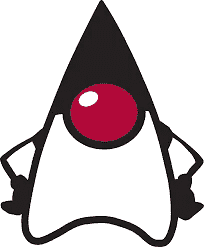

# 为什么 Java 在 90 年代末和 21 世纪初如此流行(不像其他语言)？

> 原文：<https://blog.devgenius.io/why-java-was-so-popular-unlike-other-langs-in-the-late-90s-and-the-2000s-8f1fd691cf45?source=collection_archive---------2----------------------->

杰西卡·路易斯在 [Unsplash](https://unsplash.com?utm_source=medium&utm_medium=referral) 上的照片

有利于它流行的 3 个主要因素是:垃圾收集、跨平台兼容性和营销*(大量营销)*

尽管许多其他语言是在 Java*(1995 年)*发布的前几年创建的，或者其他一些语言在此之前就已经存在，但是 Java 变得非常流行，部分原因是因为消除了某些限制，这些限制在 IT 社区中非常令人讨厌；比如副标题中提到的一些:

**> >自动内存管理*(又称垃圾收集)* :**

尽管现在手动内存分配在某些情况下不再是编程中的沉重负担，因为它的主要优势是它实际上可以帮助提高代码性能*(像在 Rust 或用 C++开发的游戏中)*，但在那些年里，它只是简单的，并且最终有了一种可以自动执行内存分配的语言*(现在仍然是)*一种创新和令人惊叹的帮助工具。

**> >跨平台兼容性:**

程序员不再担心如何让一段代码兼容各种平台(不同的操作系统，CPU 架构等等)。)，但是它可以在任何安装了 Java 虚拟机*(也就是 JVM)* 的机器上运行，这对于一个编程语言来说也是一个创新的特性。

现在是它越来越受欢迎的原因:

**> >营销，字面意思是在营销上投入数百万:**

回想当年*(2003 年)*，当时 Sun Microsystems 还存在，还没有被甲骨文完全收购，**光是宣传 Java** *(是的，你没看错，* ***五亿美元****)就投入了大约 5 亿美元的市场营销费用，各种各样的广告和商业活动都是围绕这个被称为“Java 驱动的活动”*进行的**

*甚至还制作了一个类似詹姆斯·邦德电影的商业广告，内容是这样的:“代理人，你有这个用 JAVA 技术制作的小工具，另一个用 JAVA 技术制作，最后这个也是用 JAVA 技术制作的；如果你认为这是我瞎编的，我会把这个视频的网址附在这里**)*。**

****> >满足了当年市场的需求:****

**面向对象的范例过去是，并且在一定程度上现在仍然是满足 it 领域市场需求的范例。**

**在 Java 之前创建的一些语言不能“满足”市场的需求，要么是因为其他语言主要基于的主要范式不是面向对象的(比如 Python，它一开始是基于函数范式的)，要么是面向对象的语言没有包含 Java 最需要的独特特性。**

****> >太阳微系统公司几乎垄断了市场:****

**这篇 [**博客文章**](https://www.kickstartall.com/documents/KS_Articles/Sun.html) 引用了 Mike Grospe 关于**“营销活动开发”**的一本书中关于 Sun 如何构建更好的营销策略的特定章节，该文章指出，在 1997 年，互联网所依赖的大约 75%的服务器都运行在 Sun *(具体来说是 Sun Solaris OS)*创建的操作系统上，没有人真正知道这一点，您可能会想知道:**这到底是什么****

**嗯，比如说，大多数人已经依赖于 Sun 的服务和产品，因此 **Sun Microsystems 不再需要继续考虑开发和创造全新的产品，而是考虑如何在 IT 市场中脱颖而出，成为该市场的领导者，并开始考虑如何增强他们已经存在的产品**，例如，在这种情况下，是“Java Applets”， 这些代码可以附加或“嵌入”在 HTML 页面中，以使网页更具交互性和风格化*(概括地说，它是 HTML 中的嵌入式代码，也是已经完全被 JavaScript 和 CSS 取代的东西，* ***因此现在已被弃用*** *，但要重申的是，在当时，这是一项非常创新的技术)*。**

**因此，在 Sun 意识到这一点后，他们创建了一个全新的团队，不仅负责营销他们的产品和服务，还负责**他们在市场上已经存在的优势，因此他们开始营销 Java** *(以及所有的“Java Powered”活动)* **，以使其成为并显示其在市场上的主导编程语言。****

**不仅如此，在“Java Powered”运动期间，**基于 Java 的操作系统是许多设备的标准配置，包括某些型号的手机和移动设备品牌** *(过去生产* ***【支持 Java 的手机】*** *的一些知名品牌是阿尔卡特、黑莓、戴尔、惠普、摩托罗拉、诺基亚和其他许多公司，名单还很长，可以看到正确的***

****(另外，它被高度用于移动游戏开发，在一个视频中看到的游戏列表* [***就在这里***](https://www.youtube.com/watch?v=twuZ5WLHy1s) *和另一个视频中的此类游戏列表* [***这里***](https://www.youtube.com/watch?v=-sEdD6TbuDc) *)。****

****> >从发布之日起，它就开始(部分)开源:****

**正如詹姆斯·高斯林几年前曾经陈述过的*(而这样的陈述可以从**[***这篇文章***](https://www.infoworld.com/article/3138505/open-source-java-at-10-big-benefits-but-detractors-remain.html) *由“infor world】)*:***

> **“Java 的源代码从 1995 年发布的第一天起就对所有人开放；我们希望社区能够帮助我们进行安全分析、错误报告、性能增强、理解极限情况等等。非常成功”**

**显然**最初的许可是为了检查和内部使用源代码**，但是它的再分发是不允许的。**

**终于在 2006 年，它变得“完整”*(我写了中间的引号，因为显然是由于 it 社区的一些成员声明，即使在今天，lang 仍然不是完全开源友好的，这样的声明* ***也可以在以前的链接文章*** *)* 在 GNU 许可下开源，旁边是 Java 的吉祥物**【公爵】**。**

****

**杜克，爪哇的吉祥物**

**这给了 Sun 超越其竞争对手的巨大优势*(不，我不是说杜克，而是说 Java 部分开源)*，例如，在 21 世纪初的微软*(确切地说是 2001 年)*…比如说，对所有形式的开源软件发动战争， 当年曾表示，Linux 是与 **GNU GPL *(GNU 通用公共许可证)*** 并列的毒瘤，正如他*(含蓄)*所描述的那样，它可能会严重影响他们产品上的商业模式*(此处* *)* (这种说法可以正确解读为[***)； **虽然在 2004 年微软开始慢慢改变他们的心态，** **但是这还不足以让 C#比 Java 更受欢迎**，并且作为微软在开源软件开发中扩展 lang 使用的极少量努力的一部分，**它只是在 2005 年同意不起诉任何在创建非营利项目时拥有或正在侵犯 lang 专利的开发人员。*****](https://www.theregister.com/2001/06/02/ballmer_linux_is_a_cancer/)**

**(事实上，在 2000 年代，C#刚刚被创造出来，并且还在一步步发展成为我们今天所知道的语言)。**

**(此外，正如前面提到的，F# lang 并没有试图推动 C#在开源上的使用，而是在 2005 年获得了 Apache 许可；对于那些不了解 lang 的人来说，这篇文章是基于函数范式的。**

## **总之，**

**不仅仅是 Java 的独特功能帮助它脱颖而出，还有 Sun 在许多依赖其产品和服务的设备上的市场垄断地位，以及他们资金雄厚的营销策略，这些都使它比许多其他语言更受欢迎。**

## ****引用来源:****

**[“了解你的历史——Java 的流行”](https://jaxenter.com/java-know-your-history-149484.html)jaxen ter 著。com**

**"[孙筹备 5 亿美元 Java 品牌推](https://www.theregister.com/2003/06/09/sun_preps_500m_java_brand/)"通过注册**

**“[太阳微系统公司启动闪电战，创造 Java 驱动’的忠诚度](https://www.wsj.com/articles/SB105510454649518400)”作者华尔街日报**

**“[孙如何在 kickstartall 重新发明营销活动](https://www.kickstartall.com/documents/KS_Articles/Sun.html)”。com**

**十年后，开源 Java 仍然备受争议**

**[鲍尔默:《Linux 是一个毒瘤》](https://www.theregister.com/2001/06/02/ballmer_linux_is_a_cancer/)《由注册**

**微软:我们在《The Verge》上关于开源的观点是错误的**

**维基百科上的“[微软和开源](https://en.wikipedia.org/wiki/Microsoft_and_open_source#2000s)”。（同 organic）有机**

**LoadHow 的“[支持 Java 的手机列表](https://www.loadhow.com/java-enabled-phones/)”。com**

## **一些 JAVA 驱动的商业活动:**

**[Java《间谍》广告](https://www.youtube.com/watch?v=NVuTBL09Dn4)**

**[《Java 无处不在》商业](https://www.youtube.com/watch?v=SRLU1bJSLVg)**

**[《爪哇无处不在》](https://www.youtube.com/watch?v=av5y5X5Eyrg)商业**