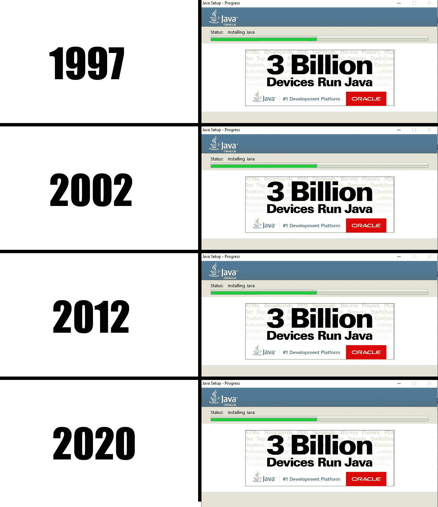

# 为什么 Java 不会死？

> 原文：<https://blog.devgenius.io/why-java-wont-die-7046096d06da?source=collection_archive---------4----------------------->

## 初级 Java 开发人员对 Java 和相关技术的狂言

内森·杜姆劳在 [Unsplash](https://unsplash.com?utm_source=medium&utm_medium=referral) 上的照片

浏览今天的文章，你会看到一些关于为什么 **Java 会消亡**的文章。检查评论，很多读者不同意。

 [## 为什么 Java 正在消亡

### Java 的未来会怎样？

medium.com](https://medium.com/better-programming/why-java-is-dying-b02b5fd44db9) 

虽然 30 亿台设备的数量没有改变，但 Java 不会去任何地方。

[Java 设备计数](https://www.reddit.com/r/ProgrammerHumor/comments/g62qm7/java_evolution_through_the_years/)

我从事 Java 工作已经一年多了。添加我的两美元在为什么 **Java 不会死，**澄清一些误解。

## 为什么企业不关心炒作驱动的技术？

学习 Java 仍然有利可图。根据这份 2020 年开发者调查[显示，Java 仍然能很好地对抗另一种技术。](https://insights.stackoverflow.com/survey/2020#technology-programming-scripting-and-markup-languages-professional-developers)

企业不太关心新技术。他们关心稳定。他们与皮尔森合作了一年多，关心终端消费者。句号。

提供无障碍、优质服务和良好的客户支持至关重要。科技紧随其后。围绕 Java 构建的技术提供了安全性、信心和出色的业务体验。

学习 Java 打开了新机会的大门。再次检查这个调查，看看有哪些[高薪职位](https://insights.stackoverflow.com/survey/2020#top-paying-technologies)。Scala，基于 Java 的批评，仍然运行在 [JVM](https://en.wikipedia.org/wiki/Java_virtual_machine) 上。

即使我想得到一个更好的前端，那也不会发生。开发、测试和发布的商业成本将会飙升。据我所知，后端是在这里停留，改变甚至没有计划。

## 为什么 Java 是久经考验的技术？

詹金斯为这个项目的建设立下了汗马功劳。Selenium 凭借其强大的界面，帮助 QA 完成他们的工作。

Sonar 检查 Java 代码，以确保我们用干净的代码构建伟大的产品。使用[黄瓜](https://cucumber.io/docs/installation/java/)进行测试已经为我们节省了无数个小时的错误行为。

提到的技术在引擎盖下使用了 **Java** 。浏览上面的技术，你可以看到它给任何项目带来了多大的稳定性。

Java 开发者社区很有帮助，也很大。当我将 Google API 与 Elixir 集成时，我必须自己解决所有问题。

每个有 API 的 web 服务都有相应的 Java SDK。到目前为止，用 Java 进行开发对我来说还算顺利。

## 春天为什么不好？

我和春天和 Spring Boot 都合作过。没有大的变化。我以前的工作是和 Angular 一起工作。Angular 中也使用了依赖注入，所以 Spring 很容易学习。

在两种框架下工作，以创纪录的时间完成了任务。OOP 和依赖注入的基础知识对 Spring 帮助很大。

企业关心[上市时间](https://en.wikipedia.org/wiki/Time_to_market)。Spring 提供了稳定、易于测试的应用。通过测试正确和关键的路径，可以提高性能。

我想说这不是最好的框架，但是 Spring 也不是最后一个。

## 感谢阅读！我希望你一切都好！

以一位媒体读者的睿智之言结束:

## [编码器:76](https://medium.com/@adebreli?source=responses-----b02b5fd44db9----0----------------------------)

> 在过去的 15 年里，Java 对于那些希望得到一些关注的编程博客来说已经奄奄一息了。