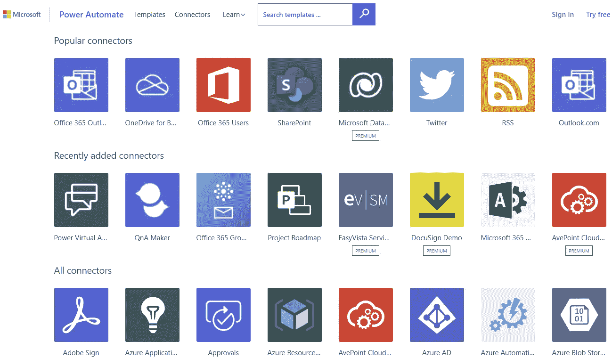

# 为什么低代码软件开发正在吞噬世界

> 原文：<https://blog.devgenius.io/why-low-code-software-development-is-eating-the-world-ca5d9644a821?source=collection_archive---------0----------------------->

## 为什么低代码软件开发和商业应用呈爆炸式增长？

照片由 [Pexels](https://www.pexels.com/photo/person-holding-world-globe-facing-mountain-346885/?utm_content=attributionCopyText&utm_medium=referral&utm_source=pexels) 的 Porapak Apichodilok[拍摄](https://www.pexels.com/@nurseryart?utm_content=attributionCopyText&utm_medium=referral&utm_source=pexels)

> 低代码正在吞噬世界，开发者可以选择加入盛宴或者被吃掉 [#HoskWisdom](https://twitter.com/hashtag/HoskWisdom)

低代码开发者就像 YouTube 之于电视，或者 twitter 之于博客文章。它发展很快，因为您可以不用代码就创建解决方案，并在几天内部署到生产环境中。这种类型的功能需要多个开发人员和数周的开发，尤其是集成。

低代码正在爆炸，导致高速增长，并从传统软件开发中攫取大量份额。有一个问题[低代码软件会减轻还是增加 IT 团队的负担？](/will-low-code-development-reduce-the-burden-for-it-teams-or-increase-it-6abe70f05d2a)有人认为这可能是开发人员和代码的末日(剧透警告不会)[为什么低代码开发不会是开发人员或代码的末日](https://medium.com/geekculture/why-low-code-development-will-not-be-the-end-of-developers-or-code-a942d4c91c1b)

来自 Gartner Inc .的预测称，低代码开发今年将增长近 23%，达到 138 亿美元，2022 年将达到 170 亿美元

[本条](/This article)规定

> “全球低代码开发平台市场规模预计将从 2020 年的 132 亿美元增长到 2025 年的 455 亿美元，预测期内的复合年增长率(CAGR)为 28.1%”

# **初看微软动态 CRM 4**

我曾经是一名 C#开发人员，在你可以编写业务逻辑代码之前，有很多管道代码要写。设置数据库，设置安全角色，在页面上创建按钮，在我能够编写业务逻辑之前需要很多代码。

有一天，有人展示了 Microsoft Dynamics CRM 4，它并不出色，实际上是微软产品(SQL 数据库、Microsoft Active directory、ISS、Exchange)与用于创建定制(代码和工作流)的框架的集合。

我所看到的 CRM it 做了大量的管道工作，并拥有 GUI 工具来创建表单，向数据库添加表格和字段。为了安全，它使用了微软的活动目录。您可以快速建立系统框架，并专注于创建满足业务需求的解决方案。

一看到 Microsoft Dynamics CRM 4，我就不再是 C#开发者，开始和 Microsoft Dynamics 合作。

Power Platform 低代码方法可能会对以前的软件开发产生同样的影响，并在未来 5 年内大规模增长。

还有其他的[低代码开发平台](https://msdynamicsworld.com/story/microsoft-power-apps-among-leaders-low-code-development-platform-space-new-analyst-rankings)但是我将坚持我所知道的关于微软的 Power 平台的讨论。

# 低代码中断

我使用微软 Power 平台作为例子，但也有其他类似的低代码平台。

# **服务**

低代码解决方案和 Dataverse/Dynamics 是需要支付许可和消费的服务。消除了托管服务器的成本以及雇佣技术专家来维护服务器的需要。维护包括升级、灾难恢复和性能。开发人员可以专注于创建解决方案，而微软则负责环境。

# **无代码**

Power 平台不需要开发者写代码。Power 应用程序使用拖放组件来创建用户界面，可以在浏览器和移动设备上运行。更多的人可以学习使用低代码平台创建解决方案，这降低了成本，因为你不需要支付开发人员工资。

**集成**

创建软件的一个困难是将独立的系统集成在一起..微软有数百个连接器，不用编码就能把两个系统连接在一起。有超过 300 个连接器([这里](https://gov.flow.microsoft.us/en-us/connectors/)是一个列表)连接你的电力应用和电力自动化

*   推特
*   Azure DevOps
*   SharePoint
*   观点
*   文档签名/Adobe 签名
*   MailChimp
*   ServiceNow
*   功率 BI
*   销售力量
*   特维利奥

您可以创建定制的连接器，一旦创建，它们就可以被低代码开发人员使用。

# **速度**

Dynamics 365 和 CRM 框架通过将通用功能链接在一起而中断了软件开发，并加快了开发速度。所有公司都想要账户、联系、活动，许多公司想要核心销售(线索、机会、发票)或营销等。它简化了安全性和服务，并允许客户将现有支出用于微软产品(Office、Active directory 等)

Dynamics 365 加速了开发，但通常会导致更大的项目，因为您需要证明许可成本的合理性。

大项目是昂贵的，在你看到任何投资回报之前有很大的前期成本。

低代码软件开发速度很快，它擅长为业务问题创建小型战术解决方案，可以在几天或几周内投入使用，而不是几个月或几年。

低代码为创建解决方案的投资带来了几乎即时的回报。

# **赋予非编码者权力**

低代码软件允许快速开发应用程序，通过一些技能提升，客户有可能获得低代码解决方案的所有权并创建自己的解决方案。

微软出售高级 Excel 公式技能所需的技能，学习创建 Power 应用程序和 Power Automates 可以由更多人创建，不需要成为开发人员。

公民开发人员的推销忽略了开发人员的专业性不在于他们编写代码的能力，而在于他们带来的步骤和方法，这使得维护、部署和测试更容易。开发人员所做的质量步骤是最大限度地降低复杂性，简化应用程序的维护和扩展。创造可能需要几天或几周的时间，但是维护解决方案需要几年的时间。维护成本被掩盖了，因为它破坏了低代码梦想。

# **结论**

低代码开发是敏捷的，能够快速创建和部署解决方案。投资回报比传统 IT 项目更快，初始成本更低。

低代码应用程序可以部署到生产环境中，这意味着它们可以立即产生影响，并且比其他替代产品便宜得多。对于已经安装了 Microsoft office 的公司来说，这是一个划算的选择，而且费用是基于许可和消费的，这意味着前期成本很低。

向 Power 平台和低代码开发的转移将创建许多更小的解决方案，而不是一个大的解决方案。这就增加了维护开销，每年需要维护和升级两次。低代码解决方案会遇到大规模的问题吗？，支持数百或数千个小型应用程序有多容易？

想到这一点，我可以听到 IT 支持人员已经在抱怨了。这个难题的这一部分还没有触及现实世界的支持，因为非开发人员正忙于创建大量的低代码应用程序。

# 要阅读的其他文章

*   [软件开发是失败者的游戏](https://thehosk.medium.com/software-development-is-a-losers-game-fc68bb30d7eb)
*   [我们如何尝试加快 IT 项目的速度，以及为什么行不通](https://thehosk.medium.com/how-we-try-to-speed-up-it-projects-and-why-it-doesnt-work-ca3bdc5d7413)
*   [对开发者最大的危险](/the-greatest-danger-to-developers-82565fefb83d)
*   [开发人员需要跟上技术变革，避免将职业生涯浪费在划水上](/developers-need-to-surf-technological-change-and-avoid-spending-their-careers-paddling-out-a06c054d12b1)