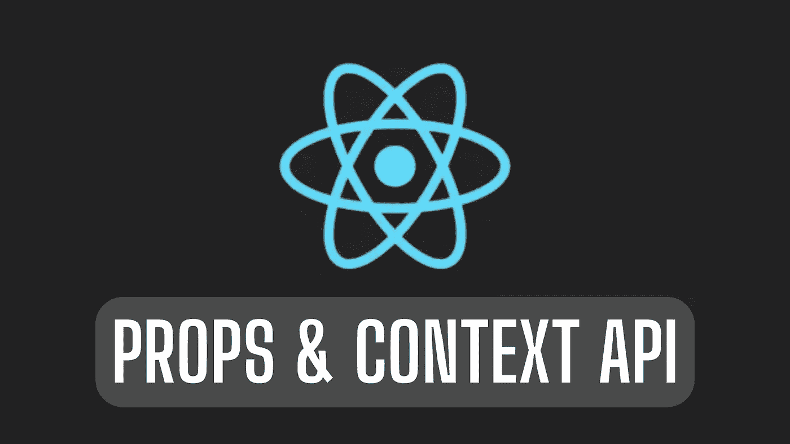
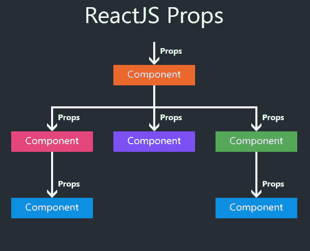
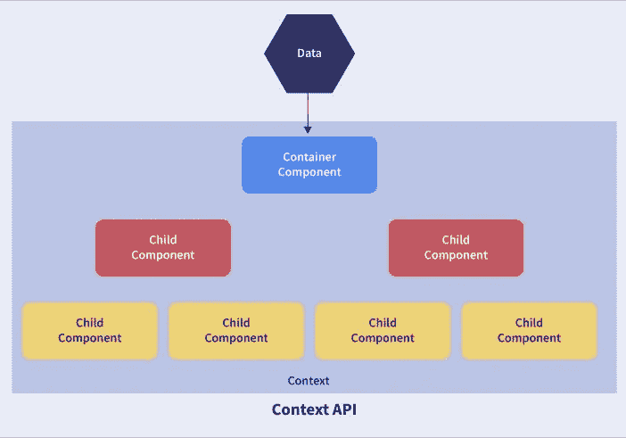

# 为什么道具在组件中而不是在上下文 API 中？

> 原文：<https://blog.devgenius.io/why-props-in-components-and-not-context-api-7749b6a9450a?source=collection_archive---------12----------------------->



道具 vs 上下文 API

首先，我想提供一些关于这篇文章内容的信息。本文的目的不是详细解释什么是上下文 api 或 props。


我将只寻找这个问题的答案:在什么地方，什么时候，我们应该更喜欢他们而不是其他人。但我会更侧重于为什么在组件中使用道具，而不是上下文 api。

为什么我们应该在组件中选择 props 或 context api，这个问题让我们独自思考它是好是坏，就像在其他事情中一样。

在这种情况下，我们做出的决定有时对我们的工作非常重要。一如既往，在回答“是好还是另一个好”这个问题之前，我想指出许多因素是重要的。比如何时何地的问题是我们选择哪些的重要因素。

如果你愿意，首先从 React 自己的文档中简单解释了什么是 context api 和 props 之后，我们再来寻找这些问题的答案，回答为什么 props 优先于 context api。

**什么是上下文 API？**

> 上下文提供了一种通过组件树传递数据的方式，而不必手动遍历每一层的属性。

**什么是道具？**

> 从概念上讲，组件就像 JavaScript 函数。组件可选地接受称为“props”的输入，并使用这些 props 返回要在屏幕上显示的 React 元素。

现在，如果我们已经简单地记住了它们是什么，我们就可以继续讨论哪一个在何时何地使用的问题。

**道具在何时何地使用？**



道具-父母对子女

让我们从解释道具的使用地点和时间开始。正如定义中所述，props 是一种结构，它覆盖了 react 中组件架构中从父节点传输到子节点的数据。有了这个结构，我们可以将数据从父节点传递到子节点。但是，我们的 react 应用程序主要由多个组件之间的通信组成。

```
function Welcome(props) {  
  return <h1>Hello, {props.name}</h1>;
}

const element = <Welcome name="Sara" />;
ReactDOM.render(
  element,
  document.getElementById('root')
);
```

因此，我们只能通过其子组件将数据从一个组件传递到另一个组件。我们不能从一个父母转移到另一个。所以我们只有在父子之间有数据流的时候才使用 props。这种情况也叫道具钻。因此，我们学会了何时何地使用道具。

现在我们来看看为什么要用 props 而不是 context api。

*   如果我们的 react 应用程序由少量组件组成，并且这些组件不包含很多子组件。
*   我们有很多组件，但是这些组件是相互独立的，道具结构应该是首选的。因为相互独立的组件很少有相互覆盖的结构。

因此，当我们想要只将数据传输到一个组件时，我们可以在 props 的帮助下轻松地传输它。

好吧，至于什么地方什么时候不应该用。当情况与我上面提到的情况相反时，即；

*   如果我们的应用程序有许多子组件。
*   这些组件相互依赖。

在这种情况下，如果我们更喜欢 props 结构，那么 React 应用程序的时间成本和工作量都会增加。

上下文 API 在何时何地使用？



context API-包装所有组件

在我上面提到的案例中，在不应该首选道具的情况下，会根据应用的规模使用不同的方式。这些方法的例子有 Redux 或上下文 API。我将在这里解释上下文 API 的方式。

首先，正如上下文 api 的定义中提到的，通过使用这种结构，我们可以从应用程序中的任何地方访问我们想要的数据。换句话说，它有一个可以从任何地方访问的使用结构。在此之前，创建一个上下文，我们希望组件到达的数据和功能保存在那里。然后，通过用这个上下文包装我们的应用程序，我们可以从任何地方访问我们的数据。

```
const ThemeContext = React.createContext('light');class App extends React.Component {
  render() {
    return (
      <ThemeContext.Provider value="dark">
        <ThemedButton/>
      </ThemeContext.Provider>
    );
  }
}

class ThemedButton extends React.Component {
  static contextType = ThemeContext;
  render() {
    return <Button theme={this.context} />;
  }
}
```

这种结构通常用于:

*   有很多成分。
*   有许多相互连接的父组件和子组件。

但是这种结构也有一些缺点。正如我在开头所说的，有些东西不可能在任何地方和任何时候都是最好的。它的缺点之一；

*   当成分数量增加时，语境结构变得非常复杂。
*   我们想要传输到组件的数据数量增加了。

这与我们编写代码的困难和我们称之为干净代码的结构相反，但它也造成了我们应用程序中的时间和性能损失。因此，在上下文 api 不够的情况下，我们需要求助于更高级的结构。像 Redux 之类的…

**结果，**
是的，现在我想我们有了一点点关于何时何地上下文 api 和道具应该首选的信息。因此，我们理解了为什么在组件中 props 比 context api 更受欢迎。除了我在这里提到的一些信息之外，还有许多更详细的信息。当然，我们没有人能知道所有的要点，


但是我们可以自己决定什么最有效。😉

我希望这篇文章对你何时何地应该首选 props 和 context api 有用。或者至少它为你提供了一个基础。另外，如果你想获得更多关于上下文 api 和 props 的技术信息，你可以在这里找到 React 自己的文档[。](https://reactjs.org/)

在我的下一篇文章中再见👋

**参考文献**

1.  React Docs| [上下文](https://reactjs.org/docs/context.html)
2.  React Docs| [组件和道具](https://reactjs.org/docs/components-and-props.html)