# 为什么要用 PySpark，我们如何在 Python 中运行

> 原文：<https://blog.devgenius.io/why-pyspark-and-how-can-we-run-in-python-b9e2ddc4d48e?source=collection_archive---------7----------------------->

**Python 中 PySpark 的基本代码**


照片由[詹姆斯·哈里逊](https://unsplash.com/@jstrippa?utm_source=medium&utm_medium=referral)在 [Unsplash](https://unsplash.com?utm_source=medium&utm_medium=referral) 上拍摄

如果你是初学者，并试图选择 PySpark，并有困难开始，那么这个博客希望你一些麻烦，我忍受了。

# 为什么要看这个博客？

在这篇博客中，我会尽量让事情变得简单，目标是让你尽可能快地编写 Spark 代码。如果你已经很好地掌握了某个特定的主题，你可以随意地跳来跳去。

我将带您使用 Jupyter notebook 在本地机器上运行 Spark 的工作版本。

# 你会学到什么

*   让 PySpark 在您的计算机上运行的相对简单的方法
*   我们将熟悉 PySpark 的基本功能，尤其是数据操作部分。在这里，我们将学习如何加载数据、浏览数据、处理缺失值、执行过滤操作以及对不同的数据组应用聚合。
*   在 PySpark 中构建和评估基本线性回归模型

让我们开始吧:

# 什么是火花

Apache Spark 是一个快速而强大的框架，它提供了一个 API 来对弹性数据集执行大规模分布式处理，简而言之就是**分布式数据/分布式计算，**当数据集变得太大或新数据流太快时，单台计算机可能难以处理。这就是分布式计算出现的地方，它支持各种语言，如 Scala、Python、Java 和 r。

在大数据时代，PySpark 被 Python 用户广泛用于对大型数据集执行操作。

## PySpark 安装和设置


照片由[西格蒙德](https://unsplash.com/@sigmund?utm_source=medium&utm_medium=referral)在 [Unsplash](https://unsplash.com?utm_source=medium&utm_medium=referral) 上拍摄

## 1.安装 Java

在开始使用 spark 之前，您需要确保您已经安装了 java(版本应该至少是 java8 或以上)。去 [Java 的官方](https://www.oracle.com/technetwork/java/javase/downloads/jdk8-downloads-2133151.html)下载网站，接受 Oracle 许可，下载 Java JDK 8，哪个适合你的系统。

一旦安装了 Java，我们需要在高级系统设置中设置环境变量

2.下载并安装 Spark

进入 [Spark 主页](https://spark.apache.org/downloads.html)，下载。tgz 文件

将文件解压到您选择的目录中(7z 可以打开 tgz ),并在安装后像我们对 Java 一样设置环境变量。

## 3.火花:更多的东西(winutils)

*   从这里下载 winutils.exe:[https://github.com/steveloughran/winutils](https://github.com/steveloughran/winutils)

## 4.安装 Anaconda 框架

我们需要在我们的系统中安装 [Anaconda 框架](https://www.anaconda.com/products/individual)。我们也可以在 Google colab 上运行 PySpark 代码。

下面是安装指南链接:[链接](https://inblog.in/Install-Spark-PySpark-to-run-in-Jupyter-Notebook-on-Windows-p2eZ2qQPmO)

# PySpark 中的编码

让我们从在 PySpark 中导入数据集开始，你可以从这个 [**链接**](https://github.com/techpathak/PY-Spark-data) 访问数据集。一旦你下载了数据集，我们需要导入必要的库，导入后，我们将需要创建一个 Spark 会话。一旦创建了 Spark 会话，就可以访问 Spark web 用户界面(Web UI)。

```
`# importing findspark 
import findspark
findspark.init()  # init the sparkimport pyspark
findspark.find()from pyspark.sql import SparkSession 
#The entry point to programming Spark with the Dataset and DataFrame API
```

现在，我正在使用下面定义的“教程”创建应用程序名称，该名称将作为应用程序名称显示在 Web UI 的右上角。在这篇文章中，我们不会使用 Web UI，但是，如果你有兴趣了解更多，请查看官方文档。

```
from pyspark.sql import SparkSession 
#The entry point to programming Spark with the Dataset and DataFrame APIspark = SparkSession.builder.appName('tutorial').getOrCreate()
spark# To create a SparkSession, use the following builder pattern appName(name)[source]
# Sets a name for the application, which will be shown in the Spark web UI.
# If no application name is set, a randomly generated name will be used
# getOrCreate()[source] Gets an existing SparkSession or, if there is no existing one, creates a new one based on the options set in this builder.
# builder — gives access to [Builder API](https://spark.apache.org/docs/2.2.0/api/java/index.html?org/apache/spark/sql/SparkSession.Builder.html) which is used to configure the session
```

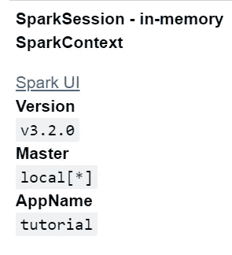

将数据集加载到 PySpark。

```
df = spark.read.json('people.json') # similarly we can read other flat files like (.csv, excel,etc..)
df.show()
```

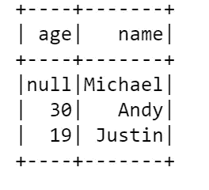

```
df.printSchema()
```

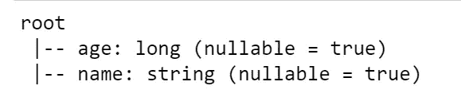

```
df.columns
```

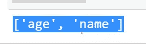

输出

```
df.describe().show()
```

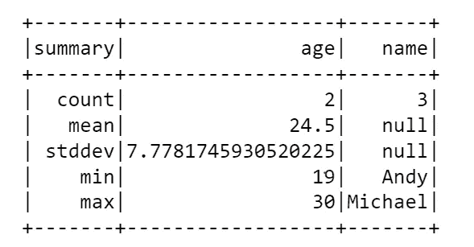

输出

# PySpark 结构类型&结构字段

PySpark StructType & StructField 类用于以编程方式指定数据帧的模式，并创建复杂的列，如嵌套结构、数组和映射列。 [StructType](https://github.com/apache/spark/blob/master/sql/catalyst/src/main/scala/org/apache/spark/sql/types/StructType.scala) 是 [StructField 的](https://github.com/apache/spark/blob/master/sql/catalyst/src/main/scala/org/apache/spark/sql/types/StructField.scala)的集合，它定义了列名、列数据类型、用于指定该字段是否可为空的布尔值以及元数据。

通过运行以下代码来导入结构类型和结构字段，以更改变量的数据类型:

```
from pyspark.sql.types import (StructField,StringType,IntegerType,StructType)data_schema = [StructField('age',IntegerType(),True),
               StructField('name',StringType(),True)]
final_Struct = StructType(fields=data_schema)
df.printSchema()
```

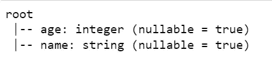

年龄的数据类型现在转换为整数，名称转换为字符串。

选择变量:

```
df.select('age').show()
```

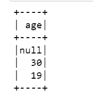

```
df.head(3)
```

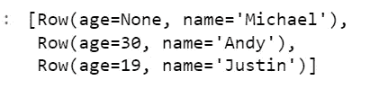

```
# Extract second row of this dataset
df.head(3)[2]
```


```
Extract Top 2 rowdf.select(['age','name']).show(2)
```

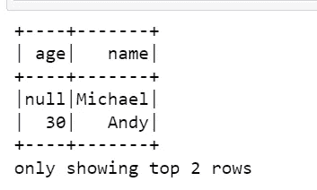

```
Extract all rowsdf.select(['age','name']).show()
```

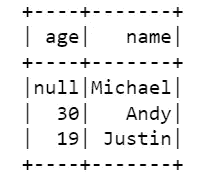

```
# create new columns 
# Approach - 1 : using withColumn function
df.withColumn("double_2", df.age * 2).show()
```

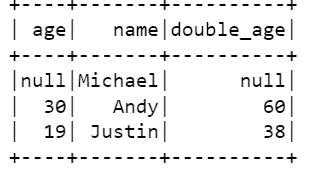

```
Approach - 2 : using select with alias function.
df.select("*", (df.age * 3).alias("new_age")).show()
```

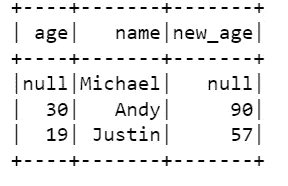

```
# Approach - 3 : Using as clause in SQL statement.
df.createTempView("temp1")
spark.sql("select *, age * 2 as new_age from temp").show()
```

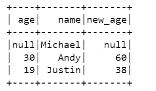

```
# Drop any row that contains missing data
df.na.drop().show()
```

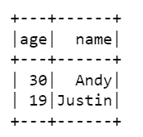

```
df.na.fill(0).show()
```

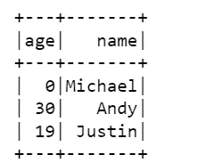

# py spark . SQL . data frame . createorreplacetenview

用数据框创建或替换本地临时视图，我们可以运行 SQL 查询来提取信息。

```
df.createOrReplaceTempView('temp1')temp1#if view is already created then it will replace and create new view with name temp1spark.sql('select * from temp1').show()
```

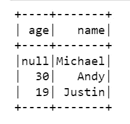

```
# Filtering the variables using SQLspark.sql('select * from temp1 where age<20').show()
```

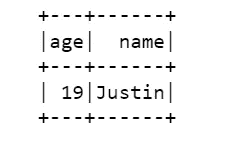

# 从头开始创建数据框架:

我们可以使用`toDF()`和`createDataFrame()`方法手动创建 PySpark 数据帧。

```
columns = ["language","users_count"]
data = [("Java", "20000"), ("Python", "100000"), ("Scala", "3000")]rdd = spark.sparkContext.parallelize(data)dfFromRDD_1 = rdd.toDF()dfFromRDD_1.show()
```

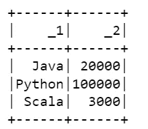

如果我们想为数据帧提供列名:

```
dfFromRDD = spark.createDataFrame(rdd).toDF(*columns)dfFromRDD.show()
```

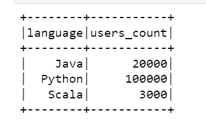

# 结论

在本教程中，我们介绍了如何在本地系统中安装 Py-spark，以及如何在 Py-Spark 中执行基本操作，如读取平面文件，如何更改现有数据帧中任何变量的数据类型，如何在某些条件下选择不同的变量，我们还从头开始创建了视图和数据帧。

希望您觉得这些代码有用，并了解了一点 PySpark 语法。在下一篇教程中，我将讨论 Py-Spark 和 MLlib 的一些其他功能。

我希望这篇文章能帮助你并节省大量的时间。如果你有任何建议，请告诉我。

快乐编码。

***Prabhat Pathak****(*[*Linkedin 简介*](https://www.linkedin.com/in/prabhat-pathak-029b6466/) *)是数据科学顾问。*


照片由 [Bhushan Sadani](https://unsplash.com/@bhushan07?utm_source=medium&utm_medium=referral) 在 [Unsplash](https://unsplash.com?utm_source=medium&utm_medium=referral) 上拍摄