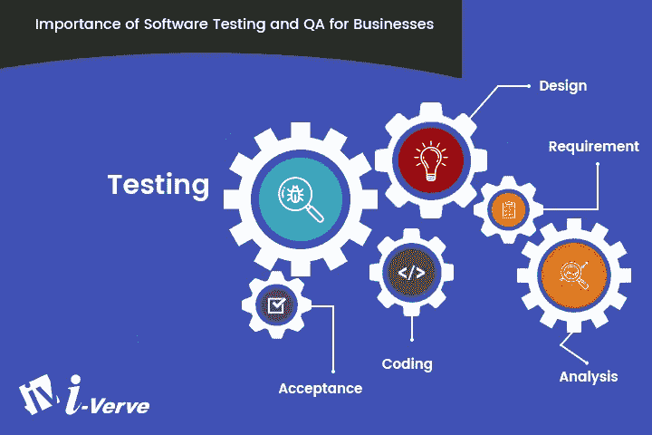

# 为什么质量保证在 Web 应用程序中很重要？

> 原文：<https://blog.devgenius.io/why-quality-assurance-is-important-in-web-application-e53a3ed51398?source=collection_archive---------3----------------------->

质量保证在 Web 应用程序中的重要性怎么强调都不为过。没有质量保证和测试，web 应用程序开发生命周期是不完整的。
事实上，这个至关重要的过程和发展阶段本身一样重要。但是它也经常被误解为人们问是否有必要。
对网络应用程序项目进行适当的质量保证有助于确定和分析应用程序或网站的质量和可用性，这对于作为消费者的最终用户来说是可见的。用户体验将有助于对功能有一个总体的了解，也有助于找到更多的方法来交付最大的可用性和随后的最佳用户体验。
网络应用现在是全球商业不可或缺的一部分。越来越多的企业正在从过时的应用程序迁移到一种新型的组合电子商务设计。由于需要在线托管如此大量的应用程序，现在迫切需要质量保证(QA)可测量和可量化的分析，以帮助衡量这些网站和 web 应用程序的质量。这是为了确保质量通常的经验(UX)。然而，今天的网络应用面临着无数的限制，大多数企业选择上网，关键的问题是，如果引入质量保证，网络应用的工作没有缺陷。

**什么是 QA？** 质量保证(QA)是应用程序开发的一个重要方面，它证明并保证使用 web 应用程序的最终用户的功能用户界面、质量体验和反馈
Web 应用程序质量保证(QA)确保高质量应用程序的开发。QA 实践是在大多数类型的软件开发中实现的，不管底层的软件开发模型是什么。
在更大的范围内，web 应用整合并实现测试方法。
为金融机构或企业团体开发 web 应用程序时，通过测试和分析阶段来验证应用程序的功能和响应能力至关重要。web 应用程序开发生命周期中的这个测试阶段就是质量保证(QA)。
向市场交付产品或解决方案时，需要部署质量保证(QA)。产品、服务和解决方案必须满足客户的需求，但是解决方案也不能包含不必要的风险或缺陷。一个网站可能非常直观，看起来也不错，但是如果它不能像预期的那样工作或者充满了恼人的 bug，它就会赶走客户。

为什么质量保证很重要？
对于任何热衷于交付高质量产品解决方案的 web 应用程序项目来说，质量保证是一个长期的先决条件。即使在开发完成后，也应该定期进行 QA 测试。这样做可以让你不断地定位和纠正你的网站或网络应用程序中可能出现的任何问题。
常规 QA 测试的好处对于已部署项目的成功非常重要，我们不能在不提及质量保证(QA)在 web 应用程序开发生命周期中的重要性的情况下谈论它。在 web 应用程序开发生命周期的早期捕获缺陷，比在产品几乎完全开发或发布之后修复它们要划算得多。如果 QA 专家从一开始就参与进来，他们将有助于确保产品不会随着会影响其质量的错误而发展得太快，一旦到了最后阶段，解决这些问题将更加困难，也更加昂贵。

**质量保证保证网络应用程序工作时没有错误** 质量保证是将产品推向市场不可或缺的一部分。质量保证确保在将应用程序部署到最终用户之前，遵循正确的步骤和程序

通过实施质量保证，有助于识别在初始测试和设计期间无法确定的缺陷
可以检测并纠正可能导致数据泄漏或数据泄露的安全漏洞和风险，从而提高 web 应用的整体性能

**QA 测试将有助于提升 UX(用户体验)** 在过去，质量保证测试通常在开发周期的相对较晚的时候被引入到流程中。
质量保证影响用户体验:当事情不工作时，用户质疑他们的理解，并产生迷信和低效的变通办法。
质量保证(QA)、测试和用户体验(UX)有着三方关系。除了用户界面本身，许多其他问题也会影响整体用户体验(UX)。

Web 应用程序测试中 QA 的作用软件公司的目标是将最好的产品交付给最终消费者。然而，当软件被创建时，希望有无缝的开发、设计、发布和交付。然而，这种情况很少发生。过去，当您试图访问或完成 web 应用程序或网站上的任务时，可能会遇到令人惊讶的软件错误、意外的停机时间或崩溃。或者，也许你已经被一个难以使用的软件解决方案所挫败，不能像预期的那样工作，或者就是太慢了。

Web 应用程序中的 QA 和测试将通过识别影响最终用户体验的 bug、错误、漏洞和其他缺陷来帮助解决源问题。

QA 测试预防灾难
预防灾难、最小化缺陷风险、同时最大化最终用户体验的最佳方式是在整个开发过程中引入软件和质量保证测试。QA 测试防止灾难。大多数时候，相互冲突的开发方法使团队之间信息的跟踪和可见性变得复杂。在测试过程中，尤其是部署和集成过程中，软件团队知道他们在测试什么以及测试的原因是非常重要的。这包括了解对哪些数据做了哪些更改，是什么触发了更改(需求、规范、风险缓解等。)，使用哪些软件版本和补丁，以及特定测试方法需要哪些硬件抽象级别。另一方面，负责实现的团队需要测试结果的可见性，以便他们可以进行更新并解决测试中发现的问题。现在有一些解决方案可以帮助跟踪和管理应用程序开发和质量保证过程中涉及的复杂和并发的任务。

**质量保证和软件测试如何协同工作** 虽然修复软件缺陷是必不可少的，但重要的是要记住软件测试和质量保证是交织在一起的，它们代表着同一枚硬币的两面。如果不提到应用程序测试，你就不能谈论质量保证。除了减少和消除错误，确定什么样的“质量属性”应该到位也是至关重要的。因为就用户体验而言，任何不符合最终用户需求的东西都可能被视为缺陷。

**结论** 质量保证测试不仅仅是解决问题。它是关于建立质量标准和实施所需的检查和平衡，以确保最终产品符合上述标准。