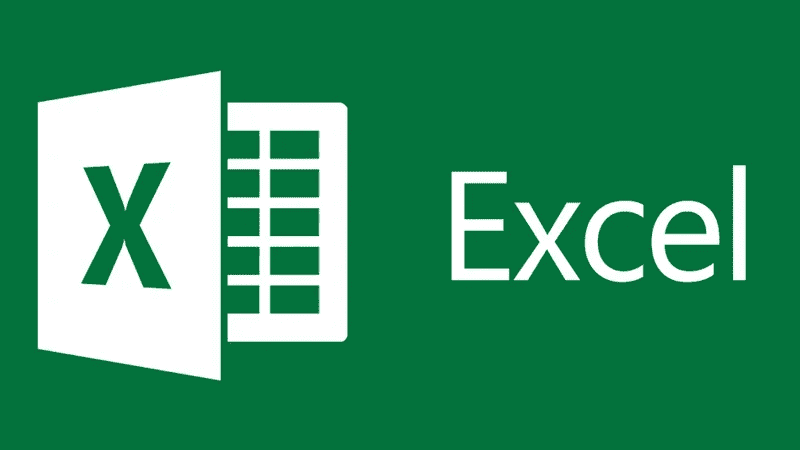

# 为什么是 R？不是 Excel，不是 Python

> 原文：<https://blog.devgenius.io/why-r-not-excel-not-python-3ffd7668f854?source=collection_archive---------8----------------------->

它存在于数学和统计计算的便利之下。

尽管 excel 在统计和数学计算中得到广泛应用，但它的不便之处导致 Excel 被用作. csv 文件。但是，这并不妨碍它在 python 和 R 正在兴起的工作场所中的使用。然而，R 变得更加流行，因为它在需要执行统计和数学计算时非常方便。在这里，我们将概述为什么在进行数据分析时，R 变得比 python 和 excel 更方便。

**不过在此之前，我们先来说说微软 Excel**

Excel 是一个办公应用程序，已经在工作场所广泛使用了几十年。它的流行通常是因为它是 SPSS 的一个革命性的替代品，并且是由微软开发的。但是当 R 和 python 为了更方便的使用而被引入数据分析时，它的受欢迎程度开始下降。因此，R 的专业特性帮助这种编程语言在数据分析师中更受欢迎。

**没过多久，微软就意识到他们的平台正在走下坡路**

因此，他们推出了 Power BI，以在数据分析市场份额中占有一席之地，SAS、R、Python 和 Tableau 在数据分析软件中占据主导地位。因为 R 和 Python 是开源的，对用户直接免费，而 Tableau 和 SAS 有很好的市场份额，这高度依赖于手头的利润。

**当 python 抢尽风头的时候**

分析数据变得简单多了。但是与 r 相比，它仍然有它的不方便之处。尽管所有的不方便可能导致分析困难，但它仍然在数据分析方面做得很好。这些困难包括即使以前下载过也很难下载的库，以及 Jupyter 平台可能会在分析数据时造成问题。尽管如此，大多数人并不在乎，因为 python 是最容易学习的编程语言之一，而且在使用应用程序时，它通常不会产生任何问题。

**R 如何走红**

它是开源软件和它在分析数据、进行统计和数学计算时所带来的便利的结合。他们甚至扩展了他们的功能范围，以包括更多的学科，便于专门使用。因此，R 成为当今最流行的专业编程语言之一。最后，R 使用更高质量的图形以更简单的方式完成了 python 中可以完成的大部分分析。

*为什么会用 R 而不用 excel 和 python？在下面的评论区分享你的想法和经历。*