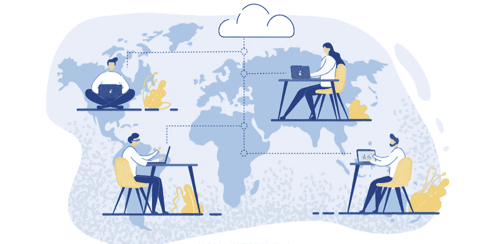

# 为什么在新冠肺炎危机之后，远程团队会变得越来越普遍。

> 原文：<https://blog.devgenius.io/why-remote-teams-is-going-to-be-a-lot-more-common-after-the-covid-19-crisis-6f51b961d4fd?source=collection_archive---------0----------------------->

截至 2020 年 5 月 16 日，世界各国都在抗击一种 2019 年 11 月起源于中国的神秘病毒。疫情在很多方面改变了我们的生活，一些人从中受益，另一些人因为它失去了很多。我想对每一个因为这个病毒而失去至亲的人说，对不起。

我们将揭示新冠肺炎危机的积极一面，即远程团队。为了确保生存和连续性，科技公司被迫以超快的方式走向远方。我的猜测是，这些公司中的大多数起初并不相信远程团队，或者对此有所怀疑。这一切都是因为我们习惯了这样一个想法，即我们需要监督供应链，以确保它总是能够交付，这是一个从技术革命和万物数字化之前的其他行业继承下来的原则。

我们需要这样的推动来进行大规模的尝试。我们人类倾向于拥抱我们的舒适区，这是我们本能的一部分，这就是为什么流行病和灾难会发生。你可能会说，这家伙可能是疯了，但把它想象成一种机制，它被放置在适当的位置，以使我们回到我们的那里，并使用我们相同的生存本能来生存，这反过来会让我们回到一个舒适的区域，这将去而复去。它就像一条正弦曲线。

回到我们的主题，远程团队有很多优点和缺点，也许现在判断还为时过早，但我们已经可以看到差异，正如我们所知，这不是新的。一些很棒的公司已经采用了它，他们成功地使用它来增强他们的业务。

# 利弊

远程团队将最终消除建立工作场所的物理空间和后勤需求。团队将无处不在，这最终将使企业所有者更容易优化空间和最小化运营成本。它不仅仅停留在空间成本上，它还进一步扩展到包括运输费用(如果公司提供运输服务的话)、雇佣负责工作场所物流及其需求的人员、公用事业账单…

当人们在舒适的工作场所工作时，他们往往会更有效率，这就是为什么许多公司都在努力实现这一目标。没有比穿着睡衣工作更好的了。

远程工作，为员工节省了很多钱，不需要支付交通费、午餐、咖啡…很多我们过去为了高效工作而需要的东西。

远程工作似乎与弹性工作时间密切相关，因为人们在不同的时间段比其他人更有效率。如果处理得当，在空间和时间上的灵活变化只会带来很多好处。

我们开发人员需要专注和安静，物理空间往往更容易分散注意力，同事往往会在错误的时间问很多问题，当人们和其他人在一起时，他们会更少依赖自己。因为我们把自己隔离在我们完美组织的工作环境中，这种工作环境离床很近，我们有能力在晚上工作并且很晚醒来。没有比那更好的了。当我们对此感到高兴时，我们的生产力就会提高。

这样做的唯一缺点是，我们失去了在工作场所工作的社交部分，例如:与同事一起喝咖啡、共进午餐、下班后、团队建设……有时我们将远程工作的失败归咎于这样一个事实，即人们不能被远程管理，而必须被监督。以我的拙见，如果失败了，那是因为他们做的方式不对，如果没有让人们变得敏感，没有将视角转向一个新的里程碑系统，你就不能指望成功，这个系统是基于目标和指标的实现，而不是你工作的时间和地点。

# 我的案子

这就是为什么我考虑雇佣那些相信你的愿景的有责任心的人。就我而言，当我远程工作时，我总是更有效率，我可以用三件事来解释这一点:当我远程工作时，我更少被请求，我更专注，更有创造力，最后，我可以有效地利用每一秒钟。

作为一名经理，我倾向于鼓励我的团队在他们感觉更舒适并适应例外情况时工作。这不仅会赢得他们的好感，还会显示出你有多在乎他们，反过来，这会让他们在危机时刻站在你一边，努力工作，时间会成为一股潮流，把我们拖向理想的目的地，而不是把我们困在监狱里。

我认为，我们应该始终保持灵活性和限制之间的平衡，鼓励最佳实践的常规活动最好在特定时间举行，不能像每天的站立和会议一样被跳过…因此，每个团队都需要在进入完全灵活模式之前达成共识。

我相信，关于这个话题，我们还有很多东西要学，甚至像谷歌、脸书、推特这样的科技巨头也开始看到它的光明前景。

# 我的建议

我的建议很简单，我们不断学习，不断进步，不要等着回到旧的模式，只是拥抱它，跟着它走，因为灵活地对待你的同事和团队，将为他们提供必要的能量，使他们非常非常富有成效。员工越舒服，他的工作效率就越高，压力也就越小。雇佣并留住有责任心的人。