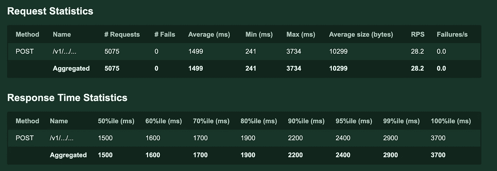
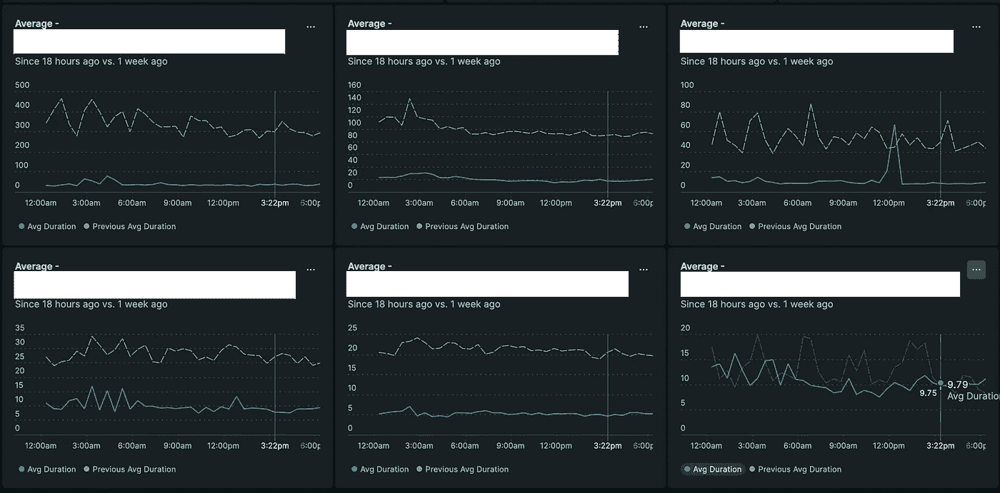

# 为什么要小心使用 Redisson 活对象服务？

> 原文：<https://blog.devgenius.io/why-should-be-careful-about-using-redisson-live-object-service-32fc1a3afdeb?source=collection_archive---------5----------------------->

杰森·登特在 [Unsplash](https://unsplash.com?utm_source=medium&utm_medium=referral) 上拍摄的照片

首先，我想解释一下我为什么写这个标题。有一段时间，我们有机会在代码库的不同地方使用 [Redisson](https://redisson.org/) 库的一些特性。到目前为止，在我们需要快速开发特性的情况下，它通过给我们一个易于使用的 Redis 库减少了我们的开发工作。不久前，我们想到了这样一个问题:我们能否使用 Redisson 在一个非常繁重且对性能至关重要的点上降低数据库的负载？

为了测试我们的理论，我们想快速尝试一下，看看结果。实现之后，我们观察了系统在负载下的行为。我可以说这一次**雷迪森辜负了我们的期望**。在分享 [Locust](https://locust.io/) 负载测试结果和 [New Relic](https://newrelic.com/) APM 仪表板之前，让我给出一些关于 Redisson 的细节。

[Redis on](https://github.com/redisson/redisson/wiki/1.-Overview)是一个 Redis Java 客户端，具有内存数据网格[ [1](https://github.com/redisson/redisson/wiki/Table-of-Content) ]的特性，它具有分布式对象、集合、锁、同步器和服务。Redisson 的一个我们最喜欢的特性是来自分布式服务的**活动对象服务**。一个活动的 Redisson 对象(LRO)是一个实例引用，不仅可以在单个 JVM 中的线程之间共享，还可以在不同机器上的不同 JVM 之间共享。2

Redisson live objects 最有意义和最强大的方面是它像搜索引擎一样工作，并允许在多个字段上查询。能够**将每秒接收数百个请求的数据库查询转发到 Redis** 并**减少数据库负载**的想法让我们非常兴奋。很容易创建一个缓存模型，并通过 Live Object Service 使其可查询。要通过多个字段查询一个对象，只需在必要的字段中添加 [@RIndex](http://twitter.com/RIndex) 注释。这是一个示例 MarketCalendar live 对象，可以在它的所有字段上进行查询。

准备好缓存模型后，就该编写查询来查找今天的市场日历了。您可以在下面找到一个示例查询。我们使用了大于 **(Conditions.gt)** 和等于 **(Conditions.eq)** 条件的组合 **(Conditions.and)** 。

有不同类型的搜索条件，如:`Conditions.and`、`Conditions.eq`、`Conditions.or`、`Conditions.in`、`Conditions.gt`、`Conditions.ge`、`Conditions.lt`、`Conditions.le`

更多请看:[https://github.com/redisson/redisson/wiki/9.-分布式服务# 923-按对象属性搜索](https://github.com/redisson/redisson/wiki/9.-distributed-services#923-search-by-object-properties)

在实现了一个基本的缓存模型和查询之后，我们在一个使用今天的市场日历的端点上执行了一个负载测试。这是在 Kubernetes 上对具有 1 个 pod、2000m CPU 和 2048 mi(2.147484 GB—1 兆字节等于 1.04858MB)的资源进行的负载测试结果之一。负载是 10 个工人，100 个用户，10 个种子率。该测试需要在市场日历上执行两个不同的 select 查询来检索端点结果。你可以在下面找到一个蝗虫任务的例子。

更详细的蝗虫例子请看:
[https://performancelabus.com/load-testing-using-locust/](https://performancelabus.com/load-testing-using-locust/)

在我们的开发环境上执行负载测试之后，很明显，我们的重型服务不能与 Redisson 活动对象服务共存。有了这些结果后，我们开始寻找一个替代的解决方案。我们认为在内存中实现可能是这种情况的合适解决方案。

在测试环境中加载测试结果

在开发内存解决方案时，我们让 Redisson 解决方案在开发环境中保持活动一段时间。这样，我们就有机会将结果与内存中的方法进行比较。在内存实现之后，我们能够通过在开发环境中使用 [**New Relic**](https://newrelic.com/) 来比较内存和 Redisson 方法。

在下面的 New Relic 仪表板中，您看到的“以前的平均持续时间”绿线是我们在 Redisson 实施活动时的平均响应时间。另一方面，蓝线显示了内存中的实现，这似乎更适合我们这里的问题。

我们对 Redisson 活动对象服务的发现如下:

*   随着索引列表中元素数量的增加，查询时间**会变得更慢**。
*   如果您将大量活动对象作为查询结果带入内存并进行排序等。在这些物体上；查询时间可能会更慢，因为活动对象充当代理，并且字段的 **getter 方法每次都通过询问 Redis 来检索字段的最后一个值**。
*   您可以在活动对象服务上使用 **detach** 来消除这种情况，但是它仍然不能提供永久的、可接受的响应时间。

**注**:我还想告诉你我们在测试中遇到的一个奇怪的 bug。我们观察到在任何 getters 期间都有可能获得 NullPointerException，因此 retrieve 方法应该用可重试的注释来保护，以防止 NPEs。

我们用了[**redisson-spring-boot-starter**](https://github.com/redisson/redisson/tree/master/redisson-spring-boot-starter)**今天报道的就是这个库的结果。还有 [Redisson PRO](https://redisson.pro/) 库定义为超快。(在他们的官方文档上看到这句话的时候我就应该怀疑了)**

**我们的实验工作最终因为这个问题放弃了 Redisson 活对象服务。另一方面，例如，我们在使用[时间序列集合](https://redisson.org/articles/redis-based-java-time-series-collection.html)时没有任何问题。所以，我们的建议是**不是每个库或者库的一部分都适合每个问题和用例，所以通过负载测试和观察来确保我们选择的方法是正确的是非常重要的。****

**我希望这是一个有用的职位。我们将继续分享我们的经验。**

****参考文献****

**[1][https://github.com/redisson/redisson/wiki/Table-of-Content](https://github.com/redisson/redisson/wiki/Table-of-Content)**

**[2][https://github.com/redisson/redisson/wiki/9.-分布式服务/# 921-简介](https://github.com/redisson/redisson/wiki/9.-distributed-services/#921-introduction)**