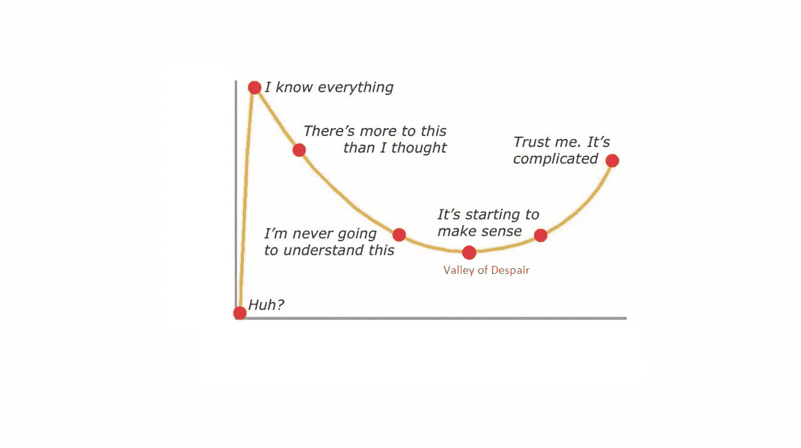

# 为什么副业项目很快消亡

> 原文：<https://blog.devgenius.io/why-side-projects-die-quickly-b1b29d0db1ad?source=collection_archive---------51----------------------->

每个软件开发人员都有一堆从未公之于众的秘密想法，这些想法被称为“副业”。他们很有可能因为同类相食而死亡，这意味着新的副业项目通常会杀死旧的副业项目。即使不是这样，副业项目的半衰期也很短。

副业很刺激。他们开始就好像开发商要建造下一个脸书。但一般来说，它们在邓宁-克鲁格效应的“绝望之谷”部分结束。

让我们把开发者心中的点点滴滴串联起来。

有没有想过为什么办公室工作会随着时间变得无聊？这一切都与“创造力”有关。每当我们被指派一项新工作或新任务时，我们倾向于认为这是一个全新的开始。新想法不断涌现，想象力天马行空。但是当我们拆除作品，记录下本质细节时，我们知道了一切。一旦我们知道接下来会发生什么，想象中的大脑就会进入深度睡眠。

过了这个阶段，头脑会进入一种不兴奋的状态。我们下意识地寻找让自己再次兴奋起来的想法。这样，副业就诞生了。但是为什么它们死得这么快，这里有一些原因——开发者应该面对它们。

# 兼职项目和专业工作一样难，甚至更难

一股新鲜的思想打开了一扇创造性世界的大门。但就像呼吸一样，创造性的想法是短暂的，需要在被遗忘之前记录下来。在专业项目中，一个这样的任务会持续数月甚至数年。但是在副业项目中，挑战太多了。

在办公室里，我们注册了很多资源来工作。我们有经理、同事、处理每项业务任务的专业团队、付费组织工具、办公笔记本电脑。大多数时候，我们需要做的就是不加抵抗地听从指令。

但是当涉及到副业的时候，道路变得更加艰难。例如，合作者可能会竭尽全力挑战我们的想法。该项目需要认真规划和资源利用，并考虑成本因素。我们现在做的是一个组织中多个员工的工作。随着更多挑战的出现，我们的想象力受到了损害。我们也要自学，在没有导师的情况下发展。

这些挑战可能不会影响开发人员的精神，但肯定会让人感到疲惫，它们会让我们质疑这个项目是否值得努力。

# 目标是一切从零开始

开发者不得不忍受保守秘密的负担。这使得在专业网络中讨论副业成为禁忌。这有许多原因

*   同事可能会投机取巧，希望从开发人员的工作中获利。他们可能会主动提出为他们工作。
*   有些法律禁止在与另一家公司合作时兼职赚钱。使用 office 资源可能会让开发人员陷入法律纠纷。可能会有利益冲突和高层管理人员的间接报复。
*   意识形态的冲突出现了。在计划一个项目的时候，有些敏感的领域我们希望用我们的方式去做。创意漏洞可能发生在合作者将整个创意扼杀在萌芽阶段的时候。

由于这种封闭的因素，事情通常以严重缺乏指导而告终。当我们想要构建一个产品时，有必要对工具和库有很好的了解。要了解它们，需要对趋势技术进行大量的研究和参与。但是因为做副业负担不起这样的时间和资源，所以最好的选择是从头开始。这种方法放大了开发工作，消耗了更多的时间。

# 科技日新月异

想象一下，一个 3 个月前启动的应用程序，其技术栈在开发完成后的 2 个月内就被弃用了。除此之外，仅仅因为测试很难，就可能需要几个月的时间来发布项目。然后，当前的技术场景发生变化，最后，当项目结束时，人们可能会转向更好的应用程序。即使他们使用它，也可能会有错误，测试堆栈需要升级。

即使在企业环境中，技术也是快速发展的。令人鼓舞的是，许多可用的语言和工具都有向后兼容性。因此，通过阅读博客和跟踪技术文档来跟上图书馆的步伐是非常重要的。

# 外部因素扼杀了动力

这是阻止副业的最明显的因素。最初的势头持续了几个星期，突然遇到了家庭事件，或者工作变动，旅行计划，工作量增加等等。为项目准备好加速和减速阶段总是有益的，这样以后就可以开始了。

# 期望与现实不符

大多数开发人员在开始副业项目时都认为创意和乐趣会持续存在。在一定程度上，这是事实。但是一旦遇到挑战，就变得乏味了。任何项目在计划阶段之后都被限制在某一组任务中，乐趣也随之减少。留出时间进行富有想象力的思考和研究是很重要的，这样可以更现实地设定期望。

# 不知道怎么做大

单纯做软件不足以吸引用户。用户使用平台，产品解决他们的需求。一旦我们选择了一个像 App Store 这样的开发者平台或者建立了我们的网站，他们将会根据标准进行测试。许多问题出现了，比如当用户活动激增时会发生什么？如何从评论中获得反馈，单个开发人员如何处理大量的 bug？如何支付托管费用？所有这些因素都会阻碍产品周期向前发展。

尽管感觉有点吓人，但旅程比目的地更快乐。我们唯一应该记住的是，没有什么比让我们的想象成真更令人满意的了。