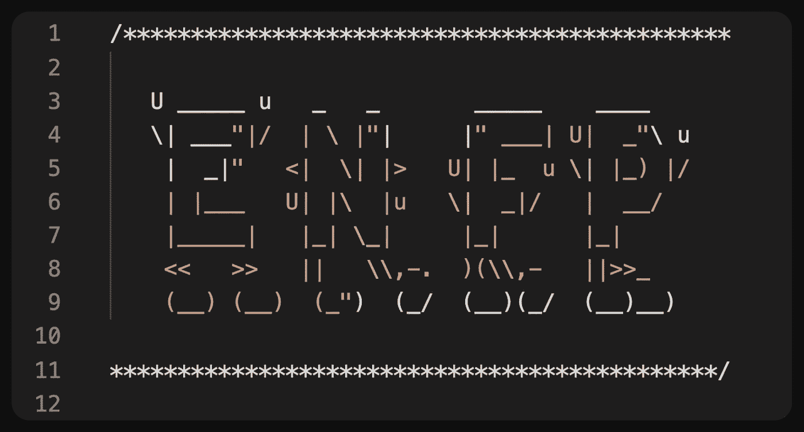
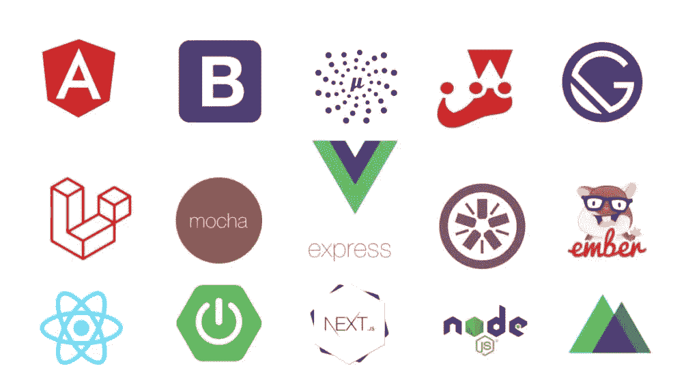
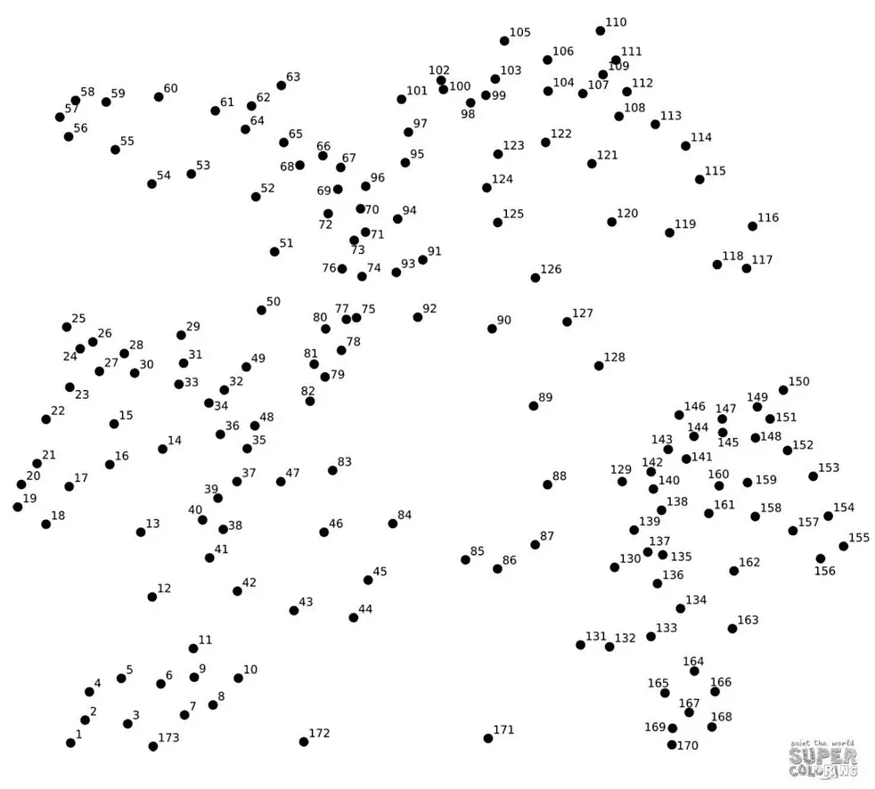
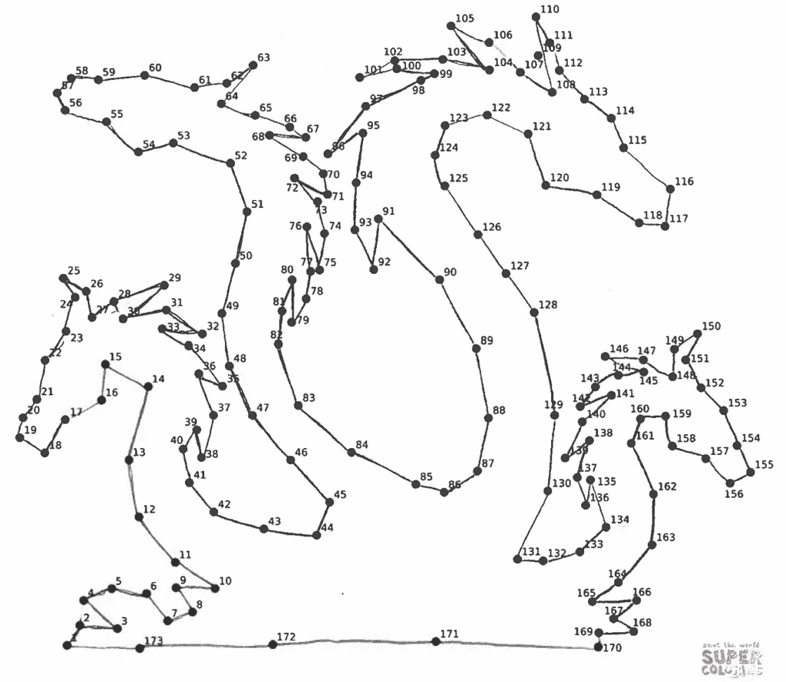
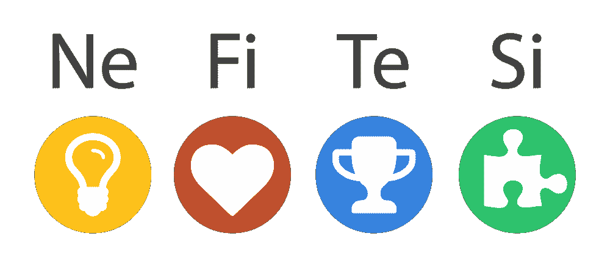

# 为什么软件工程对儿童来说是一个伟大的职业

> 原文：<https://blog.devgenius.io/why-software-engineering-is-a-great-career-for-enfps-27fc74789ead?source=collection_archive---------0----------------------->

## 对于感觉外向的人来说，这似乎不合常规，但事实上，ENFP 的特质非常好地补充了这一领域

来自 patorjk.com 的 TAAG

啊，性格测试。不管你喜欢还是讨厌它们，你不能否认它们最近变得非常流行。

2006 年，我大约 14 岁的时候，我爸爸让我参加了我的第一次 [MBTI](https://www.myersbriggs.org/my-mbti-personality-type/take-the-mbti-instrument/) 考试。我是那种会报名参加所有课程和课外活动的孩子，似乎没有明确的方向。他希望通过参加 MBTI 评估，我能找到符合我天生性格的职业道路。

我的结果也好不到哪里去，因为它囊括了从社会工作者到设计师到企业家再到体育教练的方方面面。不过有一点是肯定的:它告诉我要避开工程师和科学家。

作为一个不喜欢别人说我不行的人，我决定从事计算机科学。

我得到了 T4 ENFP T5。我一生中参加了六次 MBTI 评估，除了 ENFP，我从未得到过其他任何东西。我是个彻头彻尾的 ENFP 人。

现在，在从计算机科学最困难的大学之一(CMU)毕业并作为一名软件工程师工作了近十年后，我可以明确地说，我认为软件工程实际上是一些孩子的一个不错的职业选择。

以下是我相信这一点的原因:

# 这是一个充满新奇感的灵活职业

在[猎人/采集者/农民/牧民](https://www.jstor.org/stable/2156016)范式中，儿童显然是采集型的。

他们通过收集信息生活，无论是通过与人交谈，亲身体验新事物，还是进入维基百科的兔子洞。难怪他们厌恶世俗；他们总是在寻找新的信息，享受新奇的刺激。

对于 ENFP 来说，软件工程的世界可能是无限有趣的。有这么多的编程语言，这么多的框架，这么多的平台，这么多的服务，这么多的公司，这么多的会议，这么多的人，他们可以通过他们来激发想法。至少，信息的世界是如此广阔，他们有一生的信息和经验可以收集。

这么多框架要学！(来源: [CodeMotion](https://www.codemotion.com/magazine/dev-hub/javascript/javascript-frameworks-guide/) )

此外，他们如何定义自己的职业有很大的灵活性。他们可以跨前端和后端堆栈，当他们想要工作或学习不同的东西时可以切换。他们可以坐在设计和前端工程之间，灵活运用左脑和右脑。同样，他们可以坐在任何类型的软件工程和产品管理之间，以几种不同的方式使用他们的全局思维技能。

他们还可以进一步定义自己的职业生涯，并轻松选择成为全职员工、承包商或自由职业者、顾问和/或企业家。有了合适的机会，软件工程师不必在他们的整个职业生涯中日复一日地做同样的工作。

你如何定义你的道路的选择几乎是无止境的，没有什么比选择和自由更让 ENFP 人喜欢的了。

 [## 自我创业后我学到的 3 件事

### 像许多孩子一样，我热爱自由和灵活性，所以我自己当了老板。继续读下去，看看我在自主创业的头几个月里学到了什么。

karomancer.medium.com](https://karomancer.medium.com/3-things-i-learned-after-taking-the-leap-into-self-employment-8bb6d2391fc7) 

# 它需要创造力和插值

作为收集型的人，儿童在寻找每个人和每件事背后的意义时会茁壮成长。因此，他们变得非常擅长插入信息，从字里行间读出信息，以及填空。

你可以把 ENFP 的大脑想象成一幅巨大的连点图:

虽然大多数人可能只看到一组事实或信息(左)，但 ENFP 可能会看到更完整的画面(右)。(来源:[坚韧不拔的工程师](https://grittyengineer.com/interpolation-the-advanced-game-of-connect-the-dots/))

与许多其他 STEM 职业不同，软件工程不是一门精确的科学。没有任何[连续的数学](https://scienceblogs.com/goodmath/2007/03/01/basics-discrete-vs-continuous-1)公式需要按路线输入，没有物理定律需要遵循，也没有全球性的生物或化学真理需要记忆。

相反，软件工程依赖于基于逻辑的创造力。作为一名软件工程师，你会遇到的大多数问题都有很多解决方案，你不仅要集思广益，还要权衡每个潜在解决方案的利弊。

软件工程师必须跟上行业发展的步伐，为问题设计新的解决方案，为产品开发发明新的方法。他们可能会发现自己与同事合作，在决策中权衡指标(如性能和安全性)，提出功能建议，头脑风暴边缘案例，撰写提案，研究竞争对手的解决方案，等等。

不管需要做什么，创造性思维的能力以及在许多相互竞争的兴趣和新信息之间“串联”的能力是一种非常需要的，但经常被低估的技能。

在我看来，用最新的标准写最好的代码并不能造就一个好的工程师。能够创造性地思考，并通过大量的深谋远虑制定出高质量的解决方案。

虽然 ENFP 人可能不想记住一本标准的书，但他们擅长积累和整合复杂的思想和信息网络，并将它们贡献给共同的事业。

# 它强化了外向思维

荣格类型学认为，当我们做决定和与他人交往时，有 8 种认知功能，我们会按优先顺序使用它们。这是 16 种 MBTI 性格类型的基础。

在这个框架中，一个人使用所有 8 种认知功能，但使用最多的是前四种。因此，第三种会稍弱一些，通常会随着年龄的增长而成熟。

ENFP 认知功能。(来源:[在脑海中键入](https://www.typeinmind.com/nefi))

这个框架中的 ENFP 倾向于外向的直觉(Ne)，然后是内向的感觉(Fi)，然后是外向的思考(Te)，最后是内向的感觉(Si)。我不打算详细解释每一个，因为有足够的资源[比我解释得更好。然而，我想重点谈谈计算机科学和软件工程如何帮助 ENFP 人加强他们外向思维的第三功能。](https://www.thecareerproject.org/blog/the-8-jungian-functions-overview-career-implications/)

由于这一功能，儿童往往可能是完美主义者；这是一个致力于提高流程效率和为现有问题寻找更新、更新颖的解决方案的功能。作为一个外向函数，它是客观的，基于事实和逻辑标准。使用证据，一个 Te 用户将基于因果和利弊逻辑地做出决定。

这种功能对儿童来说并不像他们的想象力、对生活的热情和道德感那样自然。然而，这是做出正确决策的必要功能。

作为一门学科的计算机科学和作为一门职业的软件工程都能真正帮助 ENFP 人充实他们的技术。这些主题要求一个人使用逻辑和客观事实来做决策，而软件工程的模糊性有助于基于认知权衡做出决策。

ENFP 人的自然倾向是根据他们内心的道德和感觉做出决定，但最好的判断实际上是用你的[智慧头脑](https://www.dbtselfhelp.com/html/wise_mind.html)做出的，同时运用逻辑和情感。

# 它奖励良好的社交技能

儿童是吸引人的磁铁。很少有人能抗拒他们的魅力和古怪！此外，他们对与他们互动的所有人都有真正的兴趣，而且他们有天生的合作天性。

这些特质在任何职业中都很适合一个人，尤其是在科技行业。作为一名 ENFP 人，我可能没有我的 xxTx 朋友那么聪明，但我似乎比大多数人找到了更多的职业机会。

最大的原因？嗯，我总是从同事和经理那里得到的反馈是，我看起来比大多数人更平易近人、更开放。

这个行业充满了内向的天才。这其中很棒的一点就是 ENFPs 和 INxx 人相处的很好。事实上，【INxJs 应该是我们最好的朋友和生活伴侣！我们相辅相成；内向的人带来一丝不苟、博学和内省的天性，而 ENFP 有助于高层次的创新思维和开放、协作的文化。

在一个内向天才的世界里，另一件伟大的事情是，儿童在社交上脱颖而出……尽可能以最好的方式。他们通常是团队的粘合剂，尤其是当大多数团队成员的默认设置是独立工作时。

这两点导致了很多其他人可能得不到的机会。例如，同事和经理可能会将你视为伟大的文化大使，并在他们跳槽到其他公司时为你提供工作。同样，你可能比你的同龄人更经常被邀请在会议上发言，因为你有很好的舞台表现。

儿童喜欢表达自己，并因其独特的个性得到认可。他们完全有可能在这个领域找到他们渴望的积极肯定和社会回报。

作为一个 ENFP 人，很容易迷失在生活的各种可能性中。我希望这能帮助某处正在犹豫选择专业或转行的 ENFP 人！

 [## 喜欢这篇文章？考虑给我买杯茶吧！

### 我过去常常把我的文章放在中等收费的墙后面，但当谈到教育时，我完全关注可访问性，所以现在它们都是免费的。如果你觉得你从这篇文章中得到了一些东西，并且有一些闲钱，请考虑给我买杯茶来表示你的支持！🫖

www.buymeacoffee.com](https://www.buymeacoffee.com/karomancer)