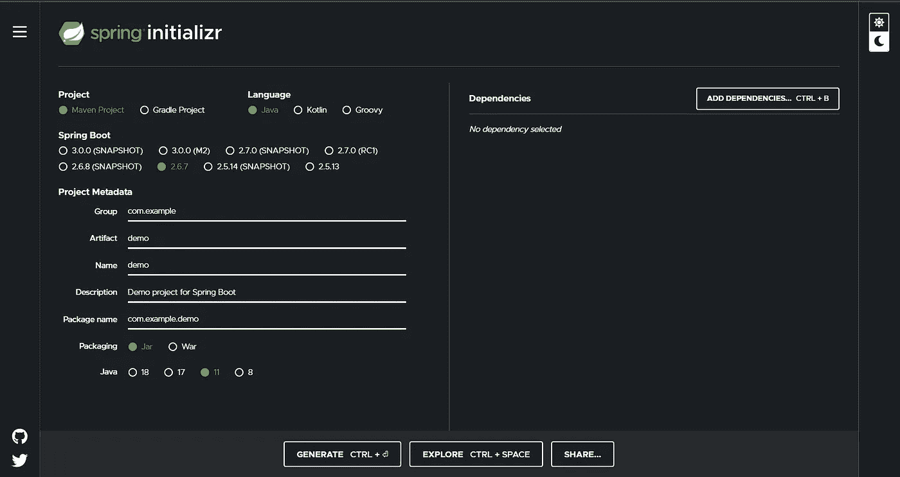
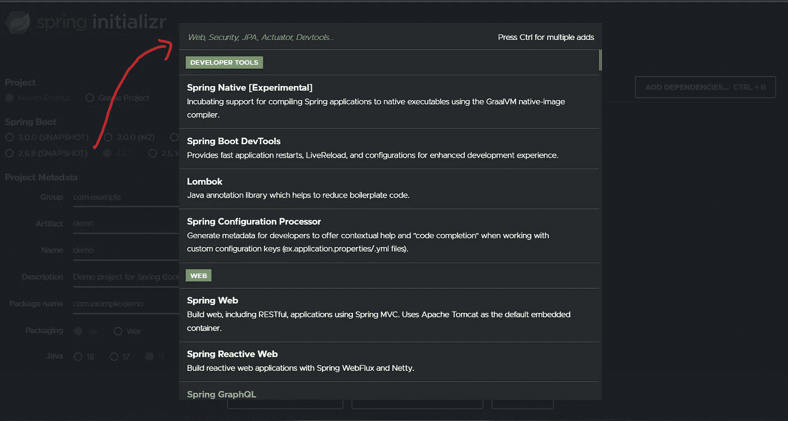
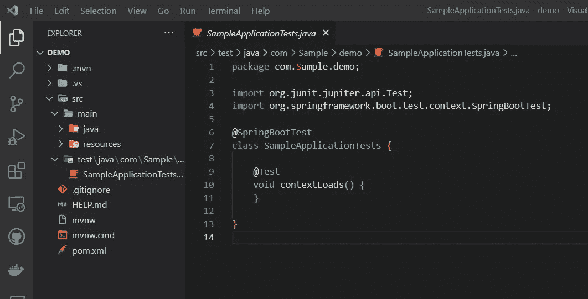
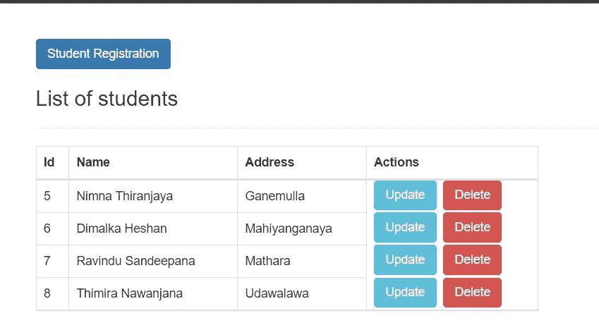

# Java 的变种 Spring boot 为什么这么出名？

> 原文：<https://blog.devgenius.io/why-spring-boot-a-variant-of-java-is-so-famous-2b1d2547235e?source=collection_archive---------8----------------------->

# 什么是 Spring Boot。？

Java 社区已经将 Spring 作为其首选的应用程序开发框架。尽管如此，在过去的几年中，由于新功能的加入，Spring 变得更加难以使用。启动一个新项目通常需要经历许多步骤，并为此花费大量时间。开发 Spring Boot 计划是为了帮助人们避免从零开始，并节省他们的时间。可以使用 Spring 框架开发 Java 应用程序，这是一个简单的开源选项。它为构建企业级 Java 应用程序提供了完整的编程和配置模型。它的目的是使企业 Java 开发更容易，并帮助开发人员构建更加有效和高效的应用程序。

# Spring Boot 的特色

帮助减少花费在开发上的时间，同时提高开发团队的整体效率。

包中包含了嵌入式 HTTP 服务器，如 Jetty 和 Tomcat，用于测试 web 应用程序。

生产就绪的 Spring 应用程序可以在这个帮助下自动配置它的所有组件。

为单元测试和集成测试提供默认配置，这使得开发和测试基于 Java 平台的应用程序变得更加容易。

它有助于消除编写样板代码、注释和大量 XML 设置的繁重任务，从而节省大量时间。

将 Spring Boot 与 Spring 生态系统的其余部分集成起来很简单，Spring 生态系统由 Spring 数据、Spring 安全、Spring ORM 和 Spring JDBC 等组件组成。

提供了各种各样的插件，软件开发人员可以利用这些插件轻松有效地与嵌入式和内存数据库进行协作。

可以用一种简单方便的方式连接数据库和队列服务，比如 Oracle、MySQL、MongoDB 和 ActiveMQ 等等。

提供管理帮助，允许通过使用远程访问来管理应用程序。

提供对命令行界面的快速访问，这加速了使用 Java 或 Groovy 开发的 Spring Boot 应用程序的测试和开发。

# **创建 Spring Boot 项目**

在开始编码之前，我们必须创建文件夹结构。首先我们必须进入[*https://start . spring . io*](https://start.spring.io)*并如下创建 MAVEN 项目。*

弹簧初始化器

当我们生成项目文件时，我们可以选择通过点击位于 Spring Initializer 页面上的 ADD DEPENDENCIES 按钮来添加依赖项。这表明如果我们打算使用 MongoDB，我们需要将“Spring Data Reactive MongoDB”依赖项添加到我们的项目中。

添加依赖关系视图

使用 Spring 初始化器中的 Generate 按钮允许我们在包含了所有的依赖项和项目元数据之后下载应用程序。然后，该文件夹的结构将立即下载为 ZIP 文件。解压缩该文件夹后，您可以使用自己选择的文本编辑器(Eclipse、IntelliJ IDEA 等)打开其中的文件。)

*MAVEN 项目*文件夹结构

我认为每个人都能够理解如何正确地开发一个 Spring boot 项目。因此，我开发了一个样例 CRUD 应用程序，后端使用 Spring Boot，前端使用 ReactJs。我在下面提供了一个到该项目的 GitHub 资源库的链接，以防有人需要参考。

示例 CRUD 应用程序前端视图

GitHub 资源库链接-[https://GitHub . com/nim na-thiranjaya/spring-boot-sample-crud . git](https://github.com/nimna-thiranjaya/spring-boot-sample-crud.git)

*这篇文章中的每一件事都已经讲得很详细了。我真的希望在这篇文章结束时，你能更好地理解什么是 Spring boot，以及我们为什么要使用它，使用"* Spring Initializer "建立一个文件结构。