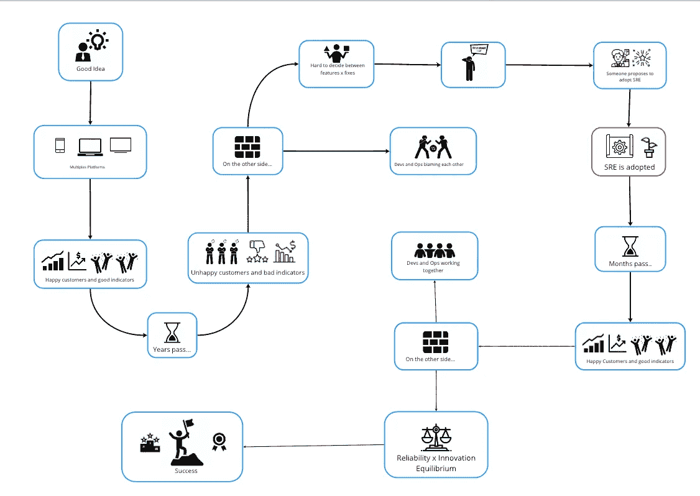

# 为什么是 SRE？

> 原文：<https://blog.devgenius.io/why-sre-3415a47da54f?source=collection_archive---------8----------------------->

假设你有一个好主意，并决定创建一个数字解决方案。服务是创新的，你没有竞争对手。几个月后，你会看到你的用户群呈指数级增长。每个版本都增加了越来越多的功能。

成功敲了你的门。这些数字令人震惊，您的客户也很满意。

时光流逝…

曾经梦幻般的数字开始下降。您的解决方案没有计划支持这么多用户，而且新功能也带来了缺陷和技术债务。您的客户现在对高峰时段反复出现的崩溃和减速感到不安。市场上出现了竞争对手，他们提供更简单但稳定的解决方案。你的客户群慢慢开始离开。

最终，停电会让你一整天都无法工作。简直是一场灾难！

您的开发团队和运营团队会因为这个问题而争吵并互相指责。对于操作人员来说，一切都是由糟糕的和未经测试的代码造成的。反过来，开发人员指责运营团队懒惰，对事件的反应太慢。

被庆祝的释放现在变得紧张和不频繁。为了避免失败，释放之间的空间增加。在新功能和修复这么多问题之间做出决定现在是一个巨大难题。

你，首席执行官兼创始人，迷失了。不知道怎么办。如果没有任何变化，你预计几个月内就会倒闭…

幸运的是，一些员工建议公司采用 SRE。经过调查，得出的结论是值得一试。毕竟其他公司的业绩都不错，你也没什么损失。

时光流逝…

几个月后，果实开始开花。客户又高兴了，开发人员和运营人员之间不再争吵和指责。他们现在一起工作，分担责任。

在特性和修复之间做出决定变得有些琐碎。事故和停机变得很少，并且可以快速解决。你在可靠性和创新性之间达到了完美的平衡。

现在，您不仅用新功能，而且用良好的性能和稳定性让您的客户感到惊讶。

你有一个可靠的解决方案！

你的服务是最棒的。你是你所在领域的领导者。

为了更多地了解 SRE，我推荐我的 Udemy 课程:[https://www.udemy.com/course/sre-the-big-picture/?referral code = fa 215 c 81 b 6 b 26 c 631 f 5f](https://www.udemy.com/course/sre-the-big-picture/?referralCode=FA215C81B6B26C631F5F)