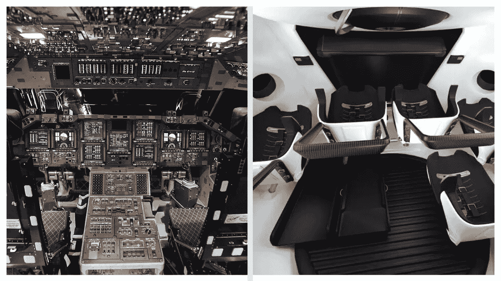
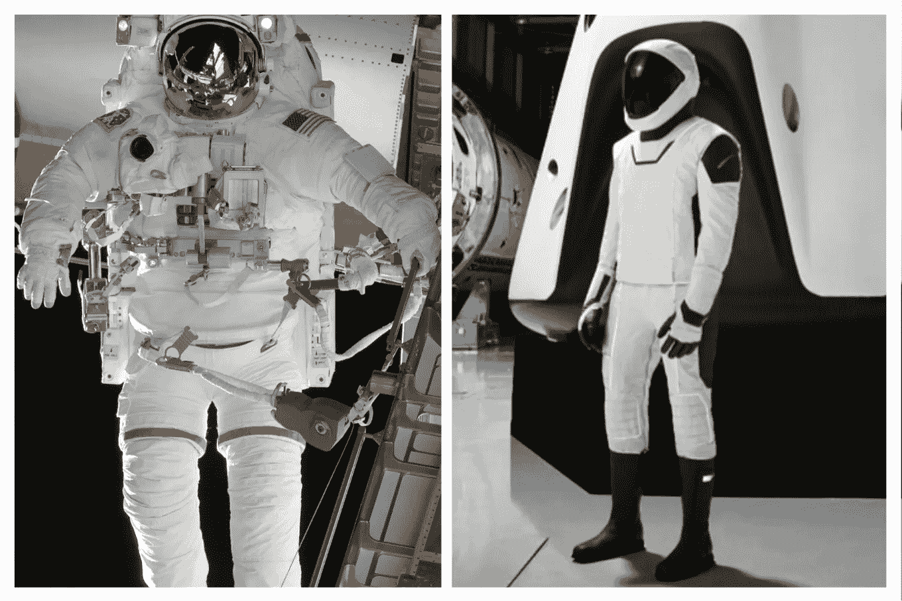
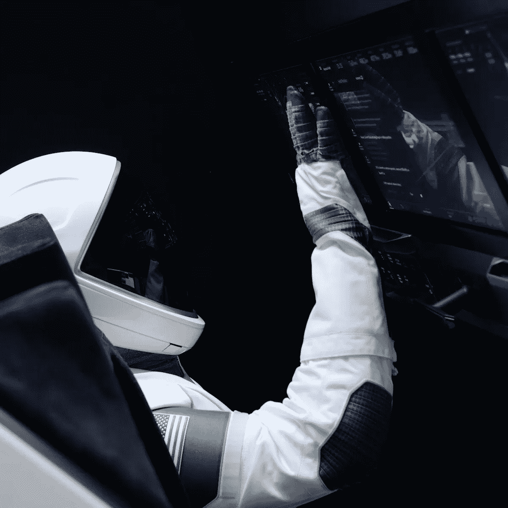

# 为什么 SpaceX 背后的技术是游戏规则的改变者？

> 原文：<https://blog.devgenius.io/why-tech-behind-spacex-is-a-game-changer-56c60995d41e?source=collection_archive---------18----------------------->

## 深入探究用于现代空间技术的编程语言。

来源:左 wikimedia.org，右 spacex

paceX 终于首次将美国国家航空航天局的宇航员(道格·赫尔利和鲍勃·贝肯)送入太空。发射后，一张显示龙飞船和航天飞机内部的照片在互联网上流行开来。第一眼看上去，随着时间的推移，复杂性似乎降低了很多。但这部分是正确的，因为新的航天器可以像以前的航天器一样做所有相同的事情。

主要区别在于，基本上是从纯硬件的硬件接口，如所有那些[旋钮、转盘和开关](https://onezero.medium.com/the-legacies-of-apollo-11-6c8df29fbb3a?source=false---------2)，到处都是，你需要记住正确的顺序。现在，我们正朝着像触摸屏界面这样的方向发展，它可以在特定时刻显示你想要的任何东西，而不会因为你此刻没有使用的所有信息而真正扰乱空间。

# SpaceX 背后的科技栈是什么？

## 用于 Dragon 的开源软件

Linux 内核，Das U-Boot，Buildroot，MUSL

## 显示用户界面的渲染引擎

铬

## 前端技术堆栈

HTML、JavaScript & CSS 和 Web 组件

> 许多人对在关键任务环境中使用 Chromium 和 Javascript 提出了疑问。但 SpaceX 团队澄清了这个问题，称“chromium 仅用作 UI 渲染引擎。具有显示器和容错功能的飞行软件交互层定义明确，并位于显示器的边界之外。我们非常重视可靠性和性能，就像其他车辆软件一样，我们在不同条件下进行了广泛的测试，以了解所有故障模式。”

## 图书馆

内部开发的反应库

## 对于飞行软件、飞行器控制系统

C & C++

## 用于测试、工具和自动化

计算机编程语言

## 任务控制地面显示器

你在“猎鹰”和“龙”的任务控制中看到的当前地面显示是基于 LabVIEW 的，但“星舰”的船员显示和未来的地面显示是基于 web 堆栈的。

要了解更多 SpaceX 的幕后故事和见解，你可以访问他们的 Reddit 页面 r/spacex

 [## r/spacex

### r/spacex:欢迎来到 r/spacex，这是一个顶级的 SpaceX 讨论社区，也是美国最大的粉丝论坛

www.reddit.com](https://www.reddit.com/r/spacex) 

# 宇航服的演变

从笨重、不可移动的宇航服到轻便、未来感、最后但并非最不重要的时尚设计，我们已经走过了漫长的道路。❤️

来源:左维基百科，右 spacex

宇航服完全是在加利福尼亚州霍桑的室内设计和制造的。宇航服是为每个机组成员定制的，以优化机组成员的合身程度，被称为“星际人套装”。它只为 SpaceX 太空舱设计，没有用于太空行走的机械装置。

## [星际服的特点](https://onezero.medium.com/its-time-to-protect-ourselves-from-space-germs-d00c1620ea8e)

*   主要目的保持不变——保护船员免受减压
*   头盔是 3D 打印的，带有麦克风
*   手套是触摸屏感应的
*   提供冷却和调节温度
*   听力保护服的内层
*   防火服的外层
*   为机组人员提供航空电子设备或电子通讯设备
*   通过脐带电缆提供可呼吸的空气

# 令人瞠目结舌的龙内部

当我第一次看到它时，我被它看起来像科幻电影一样的未来感惊呆了。飞船上的大触摸屏绝对是游戏规则的改变者。触摸屏在空间利用上比模拟系统高效得多。

来源:Spacex

作为一名创新者，马斯克从未失败过，他总是用他颠覆性和荒谬的想法给我们带来惊喜。未来的下一件大事是什么仍有待发现。也许在漫长的[星际](https://onezero.medium.com/the-future-of-humanity-is-interplanetary-e9bd32de2f5f)任务中，触摸屏为游戏、视频、信息等打开了大门，这样宇航员就不会感到无聊。😉

很难绝对清晰地预测未来会发生什么，但是谁知道也许太空创业文化的兴起会让人类的星际旅行变得负担得起。

您可以通过以下方式联系我:

1.  跟我上 [**中**](https://medium.com/@yogeshyadav)
2.  通过 [**LinkedIn**](https://www.linkedin.com/in/YogeshJournal) 联系我