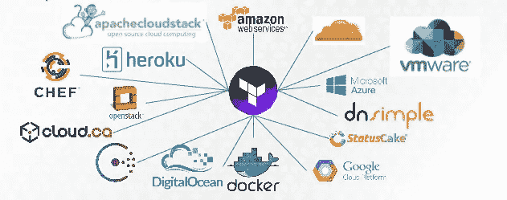
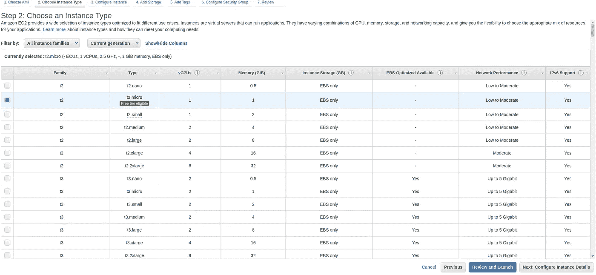
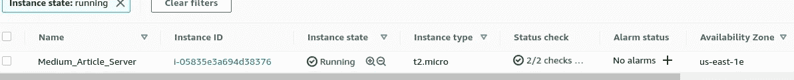
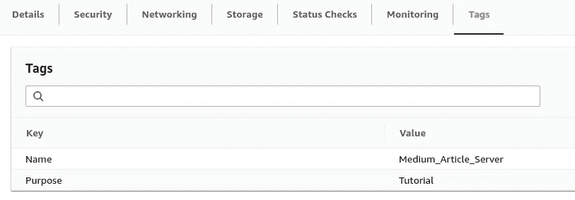

# 为什么 Terraform 让您成为更好的云架构师

> 原文：<https://blog.devgenius.io/why-terraform-makes-you-a-better-cloud-architect-54200065f5e1?source=collection_archive---------1----------------------->



Terraform 云集成

这篇文章的动机来自我的独特情况，我必须同时涉足不同的云，以降低成本，比较效率，并为我们基于云的解决方案之一获得最佳性能。

在继续下一步之前，我假设您对云有一些基本的了解，并且至少完成了在 AWS 中部署 EC2 实例的指导教程(最基本的一个)

**未发起的发起**

**什么是 Terraform？**

[**Terraform**](https://www.google.com/search?q=terraform&source=lmns&bih=981&biw=1920&hl=en&sa=X&ved=2ahUKEwj1ysvq2MjuAhVDXysKHfsyDFUQ_AUoAHoECAEQAA) 是一款开源的基础设施代码软件工具，使您能够安全、可预测地创建、更改和改进基础设施。

让这种想法深入人心。基础设施即代码！！！你是怎么做到的？

让我们开始工作。

还记得部署 EC2 实例的指导教程吗？如果你不能，那么[这里的](https://docs.aws.amazon.com/quickstarts/latest/vmlaunch/step-1-launch-instance.html)是来自 AWS 的文档(虽然不是最好的)

AWS 文档中的最少步骤数是 8 步。但是，您知道您可以从第二步部署您的实例吗？。

看下面的截图，你有一个审查和启动按钮。



为了简单起见，我将带您通过 AWS 的标准本机步骤和 Terraform 来创建 EC2 实例，以便您可以了解 Terraform 的强大功能。

**基于控制台的资源创建:**

虽然只需 2 次点击即可部署虚拟机看起来很方便简单，但这意味着对于文档中描述的其余步骤，AWS 将使用该部署的默认值。

在 EC2 实例的情况下，如果您在步骤 2 中点击按钮，以下内容将被默认。

1.  您的虚拟机将添加到您的 AWS 帐户的默认 VPC 中
2.  添加了默认的 8 GB 存储
3.  没有添加识别标签
4.  将添加一个新的安全组，虚拟机将连接到该安全组

在此之后，您可以选择想要用来远程访问您的虚拟机的密钥对，虚拟机正在创建中。

*默认值太多？。*

**基于 CLI 的资源创建:**

如果你是 CLI 的拥护者，那么你会同意你首先需要安装 CLI 来使用它。因此，如果你在所有前 3 名的云(Azure、GCP 和 AWS)上，那么你最终会安装 3 个不同的 CLI。不仅如此，您还需要记住每个 CLI 的各种语法。**上帝他们太复杂了。**

例如，用于创建 EC2 实例的 AWS CLI 命令

```
aws ec2 run-instances --image-id ami-xxxxxxxx --count 1 --instance-type t2.micro --key-name MyKeyPair --security-group-ids sg-903004f8 --subnet-id subnet-6e7f829e
```

更多细节来自官方文档[这里](https://docs.aws.amazon.com/cli/latest/userguide/cli-services-ec2-instances.html)。

现在想象一下创建相同的资源(当然不是亚马逊机器映像),但是让我们说一个在 Azure 或 GCP 中的基于 UBUNTU 的通用映像？

要做到这一点，你必须设置认证，知道必要的 CLI 命令，或至少谷歌他们。

它们是直觉的吗？。不，一点也不。

**云资源管理步骤中的挑战**

无论是基于控制台的创建还是基于 CLI 的创建，我们都需要注意一些事情。

**让我们举一个在云上标记资源的简单例子。**

请记住您可以为云中的资源分配的标签。它们是非常有用和强大的属性，可用于监控和管理您的基础架构。在管理大型基础设施时，标签是优化计费、访问限制和许多其他事情的救命稻草。

但是，如果您有一个处理资源创建的大型开发团队，该怎么办呢？你认为会有一致性吗？。你可以命令事情，但是遵循这样的规则会使过程变得更加麻烦。

已经讨论了创建资源的最常见方式的基本挑战，让我们看看如何用 Terraform 方式来实现。

**问题陈述:**使用 Terraform 创建一个带有特定 AMI 的 EC2 实例，并分配 2 个标签。

```
{Name : Medium_Article_Server
Purpose : Tutorial}
```

**第一步:**

[Terraform CLI 安装。](https://learn.hashicorp.com/tutorials/terraform/install-cli)

**第二步:**

您可以使用任何您喜欢的文本编辑器来创建 Terraform 脚本。但是我要用 VS Code 我最喜欢的文本编辑器。如果你想知道什么是 VS 代码，请查看我的文章为什么我认为 VS 代码超级酷

```
# create a folder 
mkdir medium_terraform_tutorial# open code from the folder
cd medium_terraform_tutorial#open code --- Here you can use your favorite editor too
code .
```

VS 代码提供了一个我使用的很棒的 Terraform 扩展

[](https://marketplace.visualstudio.com/items?itemName=4ops.terraform) [## Terraform - Visual Studio 市场

### 这是一个 Visual Studio 代码扩展。增加了对 Terraform 和 Terragrunt 配置语言的语法支持…

marketplace.visualstudio.com](https://marketplace.visualstudio.com/items?itemName=4ops.terraform) 

**第三步:**

创建名为 **main.tf 的主配置文件。最好将其命名为 main。然而，您可以将其命名为任何其他名称，并粘贴以下代码**

```
#define the providerprovider "aws" {
region = "us-east-1"
access_key = <your access key from AWS>
secret_key = <your secret key from AWS>
}#define the resource that needs to be createdresource "aws_instance" "web_server_tf" {
ami           = "ami-047a51fa27710816e"
instance_type = "t2.micro"
tags = {
Name : Medium_Article_Server
Purpose : Tutorial
}
}
```

我们先来了解一下代码是做什么的？

定义提供者步骤让我们可以与 AWS 交互的 Terraform CLI。如果你要和 GCP 的 Azure 互动，需要做一个类似的设置。但那是稍后的事。

资源定义步骤告诉 terraform 我们要创建的资源的详细信息。观察 AMI 的细节(为了简单起见，我已经硬编码了)、实例类型和标签。

现在，我们准备在 AWS 上部署仅包含一个虚拟机的基础设施。

让我们开始吧。

**第四步:**

用 init 命令初始化 terraform。

```
terraform init
```

如果您已经正确安装了 terraform，那么您应该会收到一条成功消息。

**第五步:**

使用计划命令查看基础设施调试计划。

```
terraform plan
```

该命令给出了在您发出继续命令后将要执行的操作的估计列表。但是最关键的是输出的最后一行(如下所示)。它显示 terraform cli 将根据脚本添加 1 个资源，并且不需要更改/销毁任何内容。

```
Plan: 1 to add, 0 to change, 0 to destroy.
```

**第六步:**

是时候申请了。

```
terraform apply
```

在这个阶段，terraform 再次验证您的配置，并要求最终确认。

输入“是”确认并等待。资源成功部署后，您应该会收到一条成功消息。

```
Apply complete! Resources: 1 added, 0 changed, 0 destroyed.
```

让我们在控制台中验证一下



我们来验证一下标签。我们希望应用特定的标签。



太棒了，对吧？。

如果你已经走了这么远，并且愿意尝试用 Azure 和 GCP。

**蔚蓝:**

请注意，在 name 参数中，我使用了一个组合。这是 Azure 对唯一命名资源的限制。但是在结构方面，我们的步骤与 AWS 中的步骤相同。

**观察标签。一致性**

```
#define the providerprovider "azurerm" {
 # Azure requires you to have Azure CLI installed anyway to authenticate with the az login command
}#define the resource that needs to be createdresource "azurerm_virtual_machine" "web_server_tf" {
name                  = "med-tut-0102-vm"
location              = "eastus"
resource_group_name   = "my_resource_group"
vm_size               = "Standard_DS1_v2"
tags = {
Name : Medium_Article_Server
Purpose : Tutorial
}
}
```

**GCP:**

注意:GCP 对标签使用了稍微不同的术语。实际上有三种不同的东西:标签、元数据和标记。在我们的情况下，合适的选择是标签。

[](https://acloud.guru/forums/gcp-certified-associate-cloud-engineer/discussion/-L_6TTKxulQgu7XzeqmC/Tags%20vs%20Labels%20vs%20Meta-Data) [## 标签对标签对元数据

### 我很乐意！😀(额外链接 1、额外链接 2)用于组织计费和报告资源。他们让…

咕噜咕噜](https://acloud.guru/forums/gcp-certified-associate-cloud-engineer/discussion/-L_6TTKxulQgu7XzeqmC/Tags%20vs%20Labels%20vs%20Meta-Data) 

```
#define the providerprovider "google" {
  project = "{{YOUR GCP PROJECT}}"
  region  = "us-central1"
  zone    = "us-central1-c"
}#define the resource that needs to be createdresource "google_compute_instance" "web_server_tf" {
  name         = "test"
  machine_type = "e2-medium"
  zone         = "us-central1-a"

  labels = [Name = Medium_Article_Server , Purpose = Tutorial]
```

**离别的思念:**

1.  采用 Terraform 帮助我获得了与云无关的基础架构部署方法
2.  我能够通过更好的控制来识别资源，从而使我的配置标准化
3.  再加上 Github 上良好的版本控制，代表客户端部署基础设施只需点击一下鼠标。
4.  不仅如此，我还发现了我在 Terraform 之外通过导入创建的 scope 基础设施的额外好处。这是一次性的努力，但每一秒都是值得的。
5.  Terraform 的资源依赖锁定特性非常棒。您可以确保您的基础设施在任何时候都是可靠的、设计良好的。灾难恢复从未如此简单。

感谢您的阅读。

**考虑关注我:)。**

**对 Terraform 感到兴奋？**

我建议你看一看 freecodecamp.org 大学的优秀人才开设的速成班。