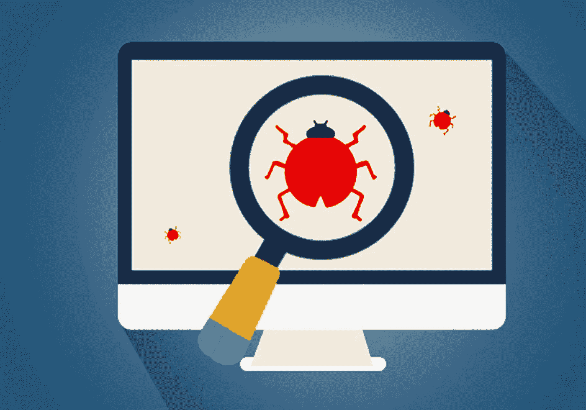

# 为什么要测试以及如何测试？

> 原文：<https://blog.devgenius.io/why-testing-and-how-d7cf96c7223f?source=collection_archive---------5----------------------->

测试是一项有几个目标的实践，最明显的一个是验证你的工作是否正确完成，同时也是改变你设计的一个触发器。

[https://pix abay . com/插图/软件-测试-服务-762486/](https://pixabay.com/illustrations/software-testing-service-762486/)

> **软件测试**是一项调查，旨在向涉众提供测试中软件产品或服务的质量信息。软件测试还可以提供一个客观的、独立的软件视图，以允许企业评估和理解软件实现的风险。测试技术包括执行程序或应用程序的过程，目的是发现软件缺陷(错误或其他缺陷)，并验证软件产品是否适合使用。【https://en.wikipedia.org/wiki/Software_testing】T5
> 

在上面的定义中没有提到如何测试软件，可以用不同的方式测试:

*   人工测试
*   自动测试

手动测试是利用某人的时间进入一个应用程序并试图找到 bug。

自动测试让开发人员编写代码来测试他们正在做的产品代码。

我们如何选择多少测试必须手动完成，多少测试必须自动完成，哪些是要使用的 KPI？。

## 反馈回路

测试的首要任务是告诉你有一个错误，所以我越早得到这个信息，我就能越早修复它。这意味着减少因产生不正确的解决方案而造成的金钱损失。但是我们如何比较自动测试和手动测试来选择它们:

*   你需要多少时间来完成你的测试？。如果时间很长，这些测试的执行频率就会降低。
*   我能在多大程度上相信我的测试结果。那些测试失败是因为测试本身，还是因为被测试的代码。
*   如果一个测试失败，错误在哪里？。如果测试能直接指出导致失败的代码部分，那就更好了。
*   执行这些测试的成本是多少？。
*   创建这些测试的时间是什么时候？。
*   我可以在何时何地执行这些测试？。我能在本地执行它们吗？我需要任何基础设施吗？。
*   测试就绪后重构代码有多容易？。

对于你想做的一个测试，考虑这些值。你会意识到自动测试通常是一种更好的方法。很难避免手工测试，但是我们可以尽量减少数量。

## 自动测试

有几种类型的自动测试，我不打算全部谈论它们，只是一个子集:

*   单元测试，他们测试我们代码的单元。我们将讨论什么是单位。
*   集成测试。它们涵盖了代码的几个单元以及它们之间的集成。有时他们需要一些基础设施来执行。
*   E2E 测试。他们试图从界面测试我们整个系统的最终输出(这可以是用户界面、数据库等)。

基于上面解释的测试特征，单元测试是:

*   编写和执行速度最快的测试。执行单元测试的成本通常非常低，数百个单元测试可以在几秒钟内执行。根据您的策略，编写单元测试可能很少，也可能很多。如果你做 TDD，你通过你的测试写你的产品代码。这也给了你关于设计的反馈，以及更多的好处。如果您在编写代码之后编写测试，那么编写测试的成本会很高。
*   如果一个单元测试失败了，你就知道失败的地方和原因，这取决于测试写得有多好和你的设计是否准确。但是一般来说，单元测试是最准确的测试。

在单元测试之后，我们可以考虑集成测试作为第二个最好的选择，第三个应该是 E2E 测试。这就是[测试金字塔](https://martinfowler.com/bliki/TestPyramid.html)吧？。

## 倒置测试金字塔

为什么 bad 的 E2E 测试比集成测试多，比单元测试多？。问题是执行所有这些测试的时间。当你处于这种情况时，你会意识到开发人员不可能在任何时候都在本地执行所有的测试。所以我们通常决定将测试执行分割在不同的阶段。单元测试在开发时执行，每隔 X 天在持续集成服务器和 E2E 中集成一次。
当你有一个倒置的测试金字塔时，集成和 E2E 测试是更好的发现你的错误的方法，但是这些测试将会比你的单元测试执行的更少。
修复一个 bug 的[成本](https://azevedorafaela.com/2018/04/27/what-is-the-cost-of-a-bug/)取决于你什么时候发现这个 bug。你越早找到它就越便宜。这是[将构建时间](https://martinfowler.com/articles/continuousIntegration.html#KeepTheBuildFast)限制在一个阈值的原因之一，并使用这个限制来实现您的测试方法可以改进。通常在倒金字塔中，极限是不被考虑的，这是倒测试金字塔的一个症状。
另一方面，E2E 和集成测试通常需要调试，以了解引入的错误是什么。调试是开发人员能做的最耗时的任务之一。我开始学习 TDD 是因为调试代码的痛苦。

快速测试和随时执行是很棒的，因为它们为我们打开了一扇可能性之门。如果我所有的代码都记录了我的测试，并且构建很快，那么我就可以开始考虑持续部署了。这里解释 CI/CD 的好处太多了，但是你可以从这篇[文章](https://medium.com/@javi.kata/ci-cd-in-numbers-9647a5da296?sk=30e39554e5be581eff63cb6859eeab1d)中读到它们。
总而言之，执行测试的时间对于代码的质量至关重要。一个覆盖良好的快速测试套件(秒)将帮助你轻松地重构你的代码。

## 单元测试

等等，什么是单位？。
单元测试的问题在于开发人员将单元词与 OOP 语言中的类、函数式编程中的函数等相匹配。所以他们试图用测试覆盖[的每一个班级。解释什么是单元并不容易，但是基于单元测试的特征来定义单元测试更容易:](https://blog.arkency.com/2014/09/unit-tests-vs-class-tests/)

*   执行速度快。
*   与您的基础设施隔离。
*   每个测试失败的原因只有一个。

更深入地说，让我们想象一下，我们有一些代码在我们的系统中存储一个具有这种设计的用户:

*   控制器，用于接收来自另一系统的调用以存储用户。
*   一个适配器将数据转换到我们的域。
*   一个服务，需要为我们的领域计算一些东西，如我们的客户必须支付的税款。
*   存储库负责与我们的数据库通信以存储用户。

我们可以为系统的每个部分编写测试，并模拟其余部分，但是如果我想将这个设计重构为另一种方法，我需要改变多少测试呢？。当我们需要重构的时候，测试的数量是一个很好的值，可以知道在没有引入 bug 的风险的情况下改变你的系统有多困难。

假设我想测试我的控制器，而我的控制器像合作者一样使用适配器。我们将对我的控制器进行测试，在这些测试中，适配器将由测试 double 替换。我的测试 double 将采用真实适配器的一些假设，这是间接的，我没有测试真实适配器(这是隔离的代价)。现在，假设我想重构我的适配器来传递一个新参数，那么我必须改变我所有的测试 doubles 来接受这个新参数。我为了重构而改变了我的测试，这增加了引入 bug 的风险。在某种程度上，将单元设置为一个类并对类中的每个公共方法进行单元测试限制了我们重构的能力，因此也限制了我们设计的发展。这种实践促使我们维护由从事该任务的第一个开发人员完成的第一个设计。

我不想在这里产生误解，要重构任何你需要测试的代码。我只是说，对系统内部部分的重构不应该导致总是失败 10 个不同的测试(我也包括这里的编译问题)。

因此，将测试放在哪里是减少因重构而重写的测试数量的关键。基本上，我们的测试替身定义了我们单元的边界。这个例子中的单元可以是任何东西，直到实现了存储库，而 repo 可以被 test double 代替。有了这种新方法，我们让新开发人员有可能在控制器和存储库之间进行重构，而不会出现这种问题。所以单位不是默认定义的，它取决于每个案例，它取决于我们的设计。
甚至我们可以说，测试告诉我们客户的体验对我们的系统来说有多困难。

但反过来也是如此，有时引入一个合作者并独立测试更好，只是为了减少测试的爆炸。

我建议以你设计的边框作为第一选择。这意味着测试您的域的入口点并模拟您的接口(存储库)。如果因为一个合作者而导致测试爆炸，那么只为这个组件创建测试，并在其余的测试中模仿它。

这就是为什么 TDD 是伟大的，因为当你写代码的时候，你收到了你的设计的反馈。只要听听反馈，你就会改进你的设计和测试。