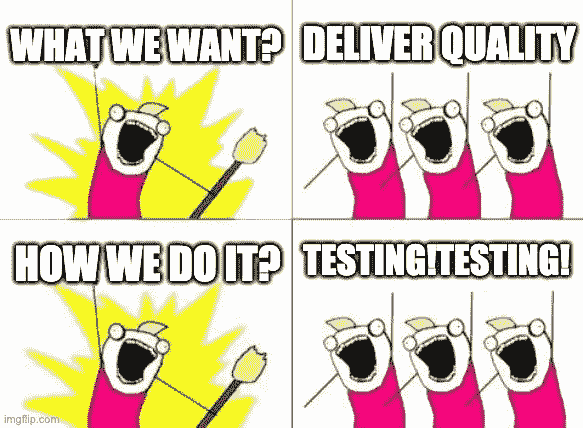

# 为什么要测试？需要 QA 吗？

> 原文：<https://blog.devgenius.io/why-testing-is-qa-needed-e879fbff5854?source=collection_archive---------7----------------------->

久尼尔·费雷拉在 [Unsplash](https://unsplash.com/s/photos/question?utm_source=unsplash&utm_medium=referral&utm_content=creditCopyText) 上的照片

如果你一次又一次地面对这个问题，那么这篇文章可能就是为你而写的！不久前，我还是一个简单的 Android 程序员，你想知道我怎么会发现自己在谈论测试和 QA？

嗯，软件世界的生活变化很大，而且每天都在更快地变化。在我职业道路的某一点上，我选择改变方向，转向 QA，具体地说，我转向自动化 QA(听起来更好，对吗？)我为什么这么做？我只想说→是另一篇文章来讨论它，但是我能告诉你测试的重要性和需要它的原因是这篇文章的主要目的。

# 为什么要测试？

让我们明确一点，不管我们工作的是什么类型的公司或企业(是以产品为导向还是以服务为导向),我们为客户工作，他们想要快乐，对吗？

我们如何让他们快乐？满足他们的期望，并希望让他们的生活更轻松。为此，我们需要创造具有良好**品质的产品或服务，为此，我的朋友，我们需要测试我们交付给客户的产品或服务。虽然听起来很简单，但是做起来很难，而且不仅仅是测试人员/QA 人员参与了归档这个目标。测试通常与测试人员的任务紧密相关，但事实上，它是一个团队任务。**

**那么，我们为什么需要测试呢？**

> 因为我们想为客户提供真正优质的产品/服务

# 测试仅限于 QA 工程师吗？

嗯，我不得不说，这个同样的问题已经困扰我一段时间了。基本上，对于我们作为敏捷团队中的 QA 成员的职责，存在一些误解(或者说，在任何团队中，无论你每天使用什么方法)。

其中一个错误的概念是团队中的开发人员“依赖”QA 质量和所有的测试工作，这意味着什么？这意味着，有时他们可以只做功能代码并合并它。在这些情况下，测试新功能的全部责任直接依赖于 QA。这个例子让我觉得我们仍然在进行**级联**风格的工作，而不是让产品进化。这也让我想知道 is 分析在团队中是如何执行的，以及团队应该如何考虑测试。

在这里它变成了解决方案:敏捷团队应该有**“测试文化】**。如果你考虑生活本身，我们都是测试者，甚至不知道大多数时间，也没有任何关于如何做的线索(因为理性就像 QA 一样，我们有工具和技术)。

今天团队最大的成就是产生了这种测试文化，在这种文化下，所有的成员都参与到产品质量的构建中来。(我最近发现[这篇文章](https://stories.schubergphilis.com/building-a-test-culture-a9386ab7c8aa)，它谈到了测试文化)

# 最后的想法

质量不是一种给定投入就能创造出来的产品，它可以比一株需要精心培育的植物更好。一般来说，我们说“提高”质量，这主要是因为它每天都在发展；我们在不断的变化中工作，更大的挑战是适应变化，而不失去我们投入的努力，并从过去的错误中学习，总是向前看。

**QA 是需要的，并且将一直如此**，这并不意味着其他角色也不能执行这项任务。就像我之前提到的，所有团队都需要开始考虑*“测试文化”*。

下次见！