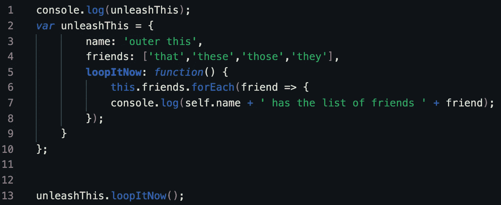

# 为什么“this”在函数中没有定义

> 原文：<https://blog.devgenius.io/why-this-gets-undefined-inside-a-function-d70a39b40d3b?source=collection_archive---------2----------------------->

在进入“这个”关键词之前，我们先来了解一下“未定义”。

简单来说，如果我们试图去理解，“ **undefined** ”就是一个值的缺席。它是原始数据类型之一。

根据 [MDN](https://developer.mozilla.org/en-US/docs/Web/JavaScript/Reference/Global_Objects/undefined) 的定义，

`**undefined**`是*全局对象*的属性。也就是说，它是全局范围内的变量。

尚未赋值的变量属于类型`undefined`。如果被求值的变量没有赋值，方法或语句也会返回`undefined`。如果没有返回值，函数将返回`undefined`。

我们试着通过一个简单的例子来理解。

上述程序的输出如下。

> undefined 有朋友列表，那些
> undefined 有朋友列表，这些
> undefined 有朋友列表，那些
> undefined 有朋友列表，他们

让我们试着一步一步地理解代码。

如果你看到,“unleashThis”是一个对象文字，它有两个属性和一个函数。

让我们看看 JS 引擎将如何执行上面的代码。

代码的第一行是在此时声明但没有赋值的变量。

注意:请不要和“这个”混淆。我们还没有到达终点。

继续前进…

在调用堆栈上，在全局执行上下文中，声明了“unleashThis”。

记住一点，如果你试图把函数赋给一个变量，它会把整个函数放到调用栈上。

注意:当变量被放入调用栈时，它是未定义的，但是如果整个函数被放入调用栈。如果函数没有返回值，则返回 undefined。

第 11 行将被放在调用堆栈中，在那里我们将调用 loopItNow。

现在，转折来了。

> **记住，每当有函数调用时，就会创建一个新的执行上下文。**
> 
> **当调用一个函数时，创建一个激活记录，也称为执行上下文。该记录包含关于从哪里调用函数(调用栈)、如何调用函数、传递了什么参数等信息。**

当执行引擎到达第 5 行时,“this”值应该是什么？🤔

目前，已经创建了一个新的执行上下文，其中范围是对象的本地范围。原因是您必须看到从哪里调用了“this”关键字。

“this.friends”属于 unleashThis 对象的局部范围。所以，friends 数组的值将被放入其中。

现在，执行的下一行将是第 6 行，我们试图将该值打印到控制台。

记住，当 JS 引擎看到“()”时，它会兴奋地创建一个新的执行上下文。

如果您尝试可视化 JS 引擎执行代码。我们来看下图。

所以，在第 6 行，当“this”试图在窗口范围内查找“name”时，没有找到，返回 undefined。

现在，下一个问题是，上述问题的可能解决方案是什么。

> **解决方案 1:在 loopItNow 函数内部使用 var self = this】**
> 
> **解决方案二:使用箭头= >功能**
> 
> **解决方案 3:使用绑定方法**
> 
> **解决方案 4:将“this”关键字显式附加到匿名函数**

让我们试着一个一个去理解每一个解。

> **方案一:使用 var self = this**

本"**var self =本；**"是即使在大型企业应用程序中处理" this "上下文问题最常用的语句之一。

你认为这个声明在做什么？

实际上，当第 6 行开始执行时，loopItNow 上的一个“闭包”被创建来保存“self”对象，理解这一点会很有趣。“自我”对象现在拥有与“释放”对象相同的属性和功能。但是，唯一被创建的是被封闭的新的 ***词法环境*** *。*

使用 var self = this

如果您仔细观察代码，当开始执行循环时，它将外部变量和词法环境一起封装起来，这只不过是一个“闭包”。这可能有点难以理解，但它会得到超时。

> **解决方案 2:使用箭头功能**

如你所知，arrow(= >)函数没有自己的“this”绑定。因此，当使用 arrow 函数时，不会有到“this”的新绑定，它将仍然使用来自 loopItNow 函数的绑定，该函数具有“unleashThis”对象的本地范围。

> **Arrow 函数放弃了这个绑定的所有常规规则，取而代之的是它们的直接词法封闭范围的值。**
> 
> **箭头函数只是匿名的，没有命名。**

使用箭头= >功能

> **解决方案 3:使用绑定功能**

使用绑定方法

> 注意:bind 方法返回一个函数。使用“绑定”方法

当绑定函数被调用时，作为`this`参数传递给目标函数`func`的值。如果使用**新**操作符构建绑定函数，则忽略该值。

当使用`bind`在`setTimeout`中创建一个函数(作为回调函数提供)时，任何作为`this`传递的原始值都被转换成一个对象。如果没有参数提供给`bind`，或者如果`this`是`null`或`undefined`，则执行范围的`this`被视为新函数的`this`。

> **解决方案 4:将“this”关键字显式附加到匿名函数上**

使用回调作为参数“this”。

如果看到上面的解决方案，for-each 方法将“this”作为回调，将“this”作为参数。

“This”包含了从局部对象释放 this。

**“this”关键字的几个关键属性。**

> **记住，这绝不是指函数的词法范围。确实，在内部，作用域有点像一个对象，每个可用的标识符都有属性。**
> 
> **这既不是对函数本身的引用，也不是对函数词法范围的引用。**
> 
> **这实际上是一个函数被调用时进行的绑定，它引用的内容完全由调用该函数的调用点决定。**

我希望，以上所有的解决方案可能会给你使用“这个”的想法。

快乐编码。不断学习。继续探索。😊