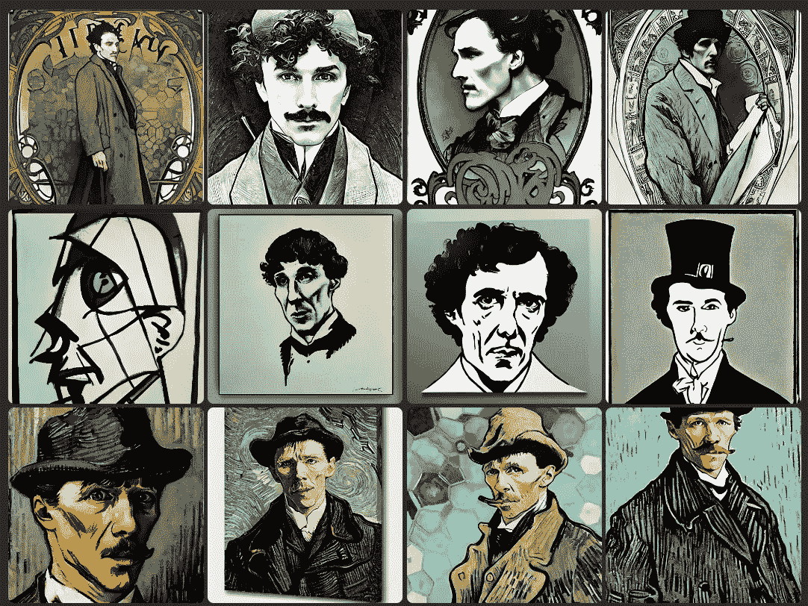
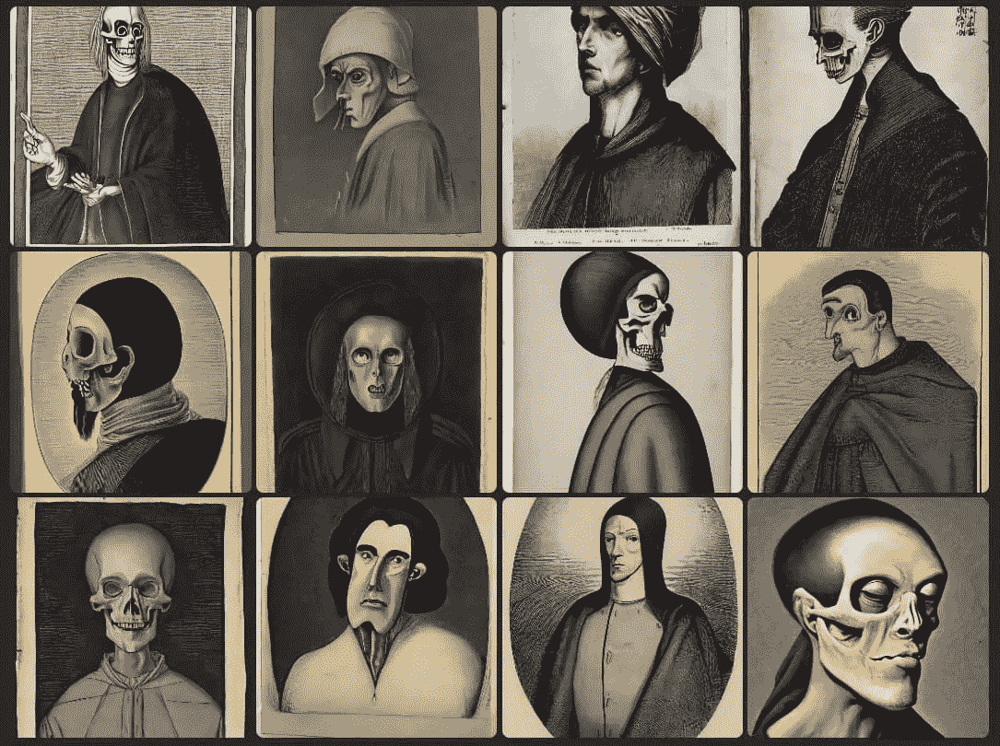
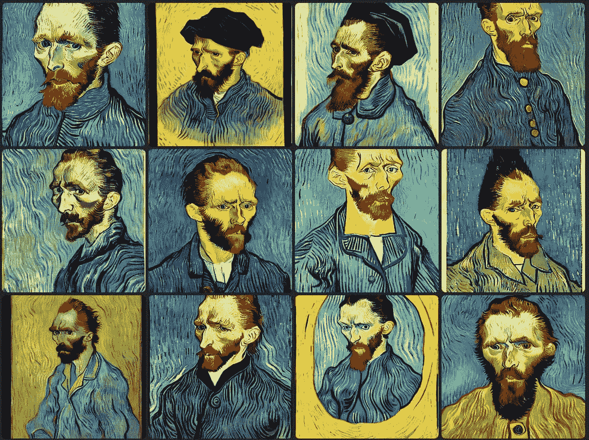
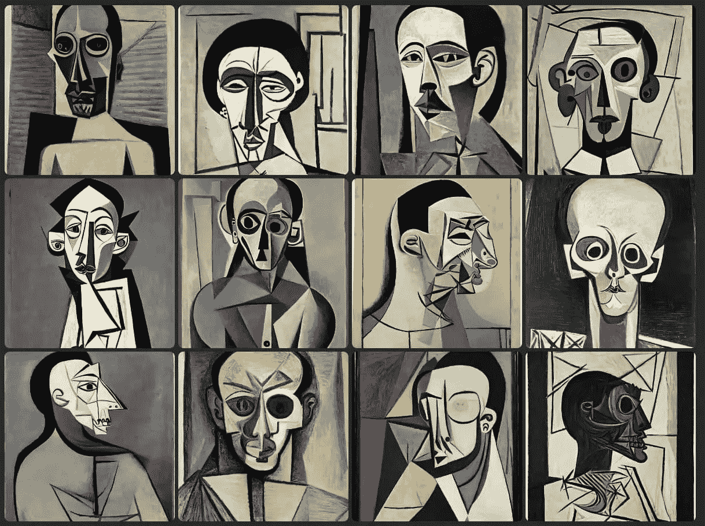
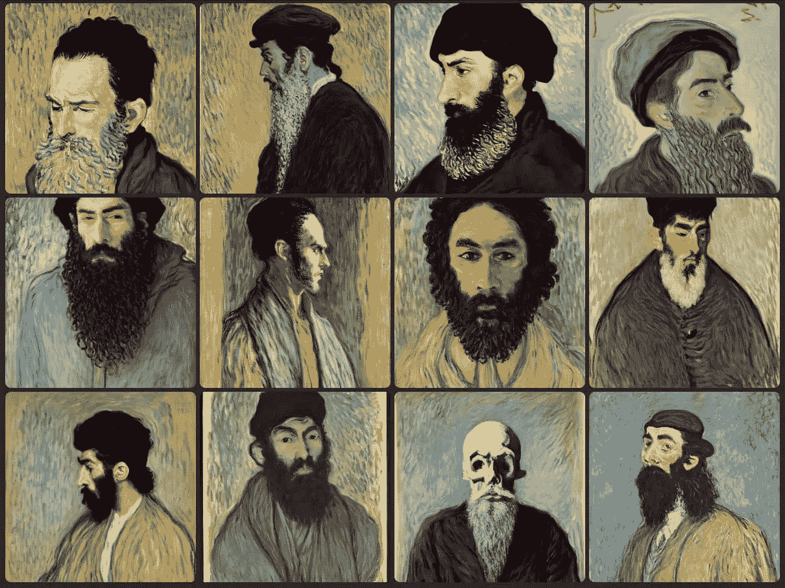
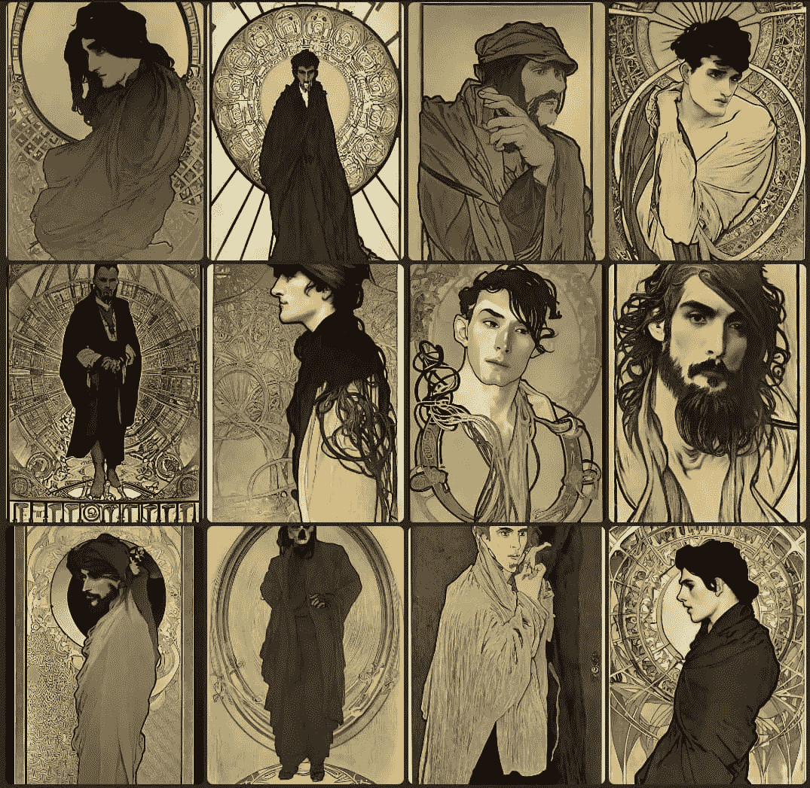
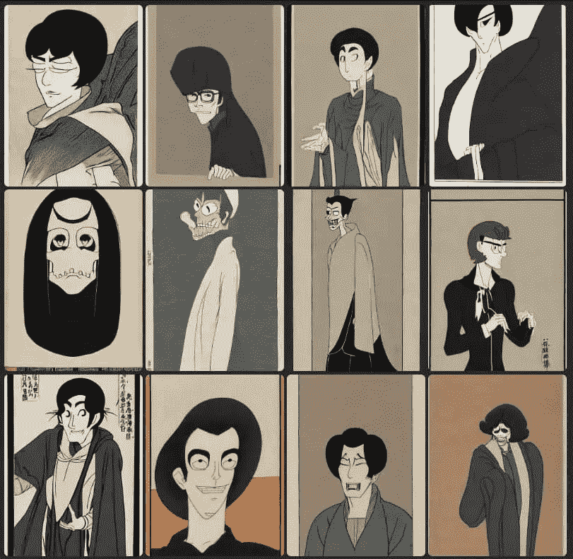
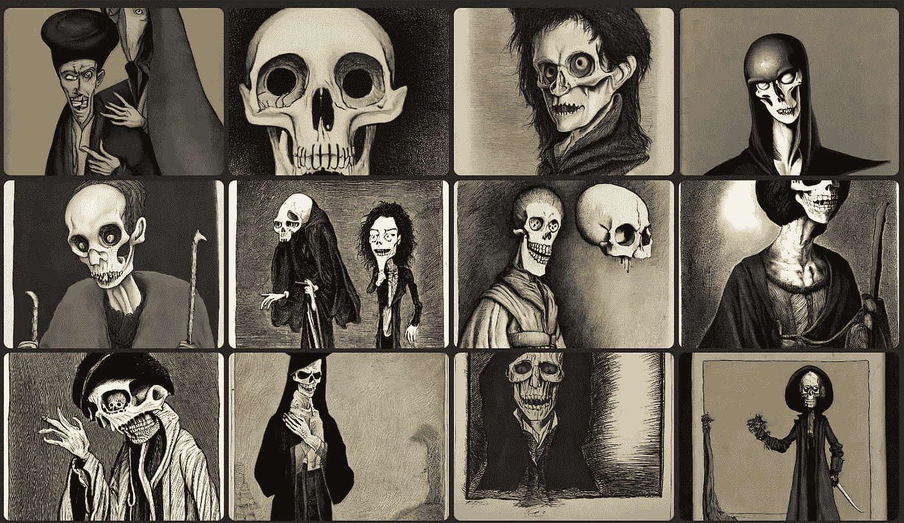

# 为什么用人工智能创建图像时要使用艺术家的名字

> 原文：<https://blog.devgenius.io/why-use-an-artists-name-when-creating-images-with-ai-24b616eae7de?source=collection_archive---------8----------------------->



图片由[塞缪尔](https://medium.com/@el3um4s)

我是一名失语症患者，我发现使用人工智能生成图像非常有趣。对于能达到的结果，我没有太多的期待。我不使用图像来思考，所以我不期望从特定的文本提示中得到特定的结果。另一方面，观察人工智能如何将文本翻译成图像也很有趣。

试了又试，读了又读，很容易看出这些图像生成系统中的模式。其中一个与使用特定艺术家的名字给结果赋予特定风格有关。这是一个强大的工具，可以让你获得非常有趣的结果。但是应该小心使用。

如果你仔细想想，这是很符合逻辑的。用于训练这些程序的数据集由图像组成，并且它们通常是著名艺术家的图像。人工智能学习识别风格特征是训练过程的一部分。相反，使用一个不知名艺术家的名字可能会导致非常不同的结果。而且经常是一些奇怪的事情，并不总是好的方面。

让我们试一个例子。这一次我想试着重现夏洛克·福尔摩斯的肖像，但基于[柯南·道尔的描述](https://www.arthur-conan-doyle.com/index.php/Sherlock_Holmes#Physical_appearance)。通过这种方式，人工智能没有办法识别霍姆斯的名字:因此它不能使用他的数据集来生成图像。结果挺有意思的。

```
Portrait of a man. He had a tall, gaunt figure made even gaunter and taller by his long grey travelling-cloak and close-fitting cloth cap. He had a dolichocephalic skull with well-marked supra-orbital development. His hair were black.
```



图片由[塞缪尔](https://medium.com/@el3um4s)拍摄

尽管结果令人不安，但这些图像中还是有一些有趣的东西。但是现在是时候尝试相同的提示了，只是添加了艺术家的名字。我先从最具代表性的文森特·梵高开始。

```
Portrait of a man. He had a tall, gaunt figure made even gaunter and taller by his long grey travelling-cloak and close-fitting cloth cap. He had a dolichocephalic skull with well-marked supra-orbital development. His hair were black. By Vincent Van Gogh
```



图片来自[塞缪尔](https://medium.com/@el3um4s)

嗯，这个夏洛克·福尔摩斯和上一个很不一样。很明显，仅仅是艺术家的名字就能完全改变作品的基调。

让我们试试另一位艺术家[巴勃罗·毕加索](https://en.wikipedia.org/wiki/Pablo_Picasso)



图片由[塞缪尔](https://medium.com/@el3um4s)拍摄

毫无疑问，这是毕加索的风格。酪但它是最著名的毕加索，立体派时期的。添加其他项，如`Blue Period`或`Rose Period`，并不会实质性地改变结果。人工智能无法理解毕加索有多种不同的风格，因此无法生成符合特定时期的图像。


图片由[塞缪尔](https://medium.com/@el3um4s)拍摄

这就凸显了这类 AI 井的局限性。同时，它解释了为什么用好提示很重要。

让我们试试另一位艺术家，[克洛德·莫内](https://en.wikipedia.org/wiki/Claude_Monet)



图片由[塞缪尔](https://medium.com/@el3um4s)

到目前为止，我们已经生成了正方形图像。但是一些艺术家在更高的形象下表现得更好。让我们试试[阿尔丰斯·穆夏](https://en.wikipedia.org/wiki/Alphonse_Mucha)，看看会发生什么。



图片由[塞缪尔](https://medium.com/@el3um4s)

结果颇让人想起这位艺术家的风格。即使有了手冢治虫，我也能得到一些好的结果。



图片由[塞缪尔](https://medium.com/@el3um4s)拍摄

另一方面，蒂姆·伯顿很好地运用了稍长的图像



图片由[塞缪尔](https://medium.com/@el3um4s)

但是如果我们试图用一个重要但不那么有名的艺术家呢？我试着和雨果·普拉特一起


图片由[塞缪尔](https://medium.com/@el3um4s)

在这种情况下，结果一点也不令人满意。

所以，总结一下:在文本提示中添加一个艺术家的名字来用 AI 生成图像是一个很棒的想法。但是人工智能不能识别所有的艺术家。最重要的是，他仍然不能区分艺术家在其艺术生涯中经历的各种风格。

感谢阅读！敬请关注更多内容。

***不要错过我的下一篇文章—报名参加我的*** [***中邮件列表***](https://medium.com/subscribe/@el3um4s)

[](https://el3um4s.medium.com/membership) [## 通过我的推荐链接加入 Medium—Samuele

### 阅读萨缪尔的每一个故事(以及媒体上成千上万的其他作家)。不是中等会员？在这里加入一块…

el3um4s.medium.com](https://el3um4s.medium.com/membership)