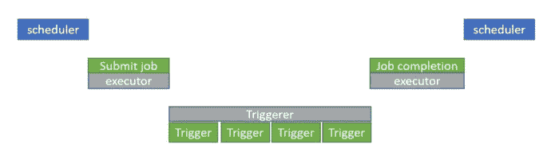

# 为什么使用阿帕奇气流可推迟运营商？

> 原文：<https://blog.devgenius.io/why-use-apache-airflow-deferrable-operators-e2178ea105d7?source=collection_archive---------2----------------------->


由 [Samuel Sianipar](https://unsplash.com/@samthewam24?utm_source=unsplash&utm_medium=referral&utm_content=creditCopyText) 在 [Unsplash](https://unsplash.com/s/photos/pipe?utm_source=unsplash&utm_medium=referral&utm_content=creditCopyText) 上拍摄的照片

而如何在你的气流任务空转的时候节省资源？

距离 Airflow 2.2 发布已经有一段时间了，引入了一种新型的算子，叫做**可延迟算子**。

每次在 Airflow 中运行任务时，它都会占用一个 worker 槽。因此，如果您有 100 个工作插槽和 100 个传感器同时运行并处于空闲状态，您将无法再运行任何任务，即使整个气流可能处于空闲状态。

**可延期操作员如何提供帮助？**

可延迟操作符在到达该点时被挂起，此时需要等待某些外部条件得到满足。一旦操作员到达这一点，它将进入一个新的状态，称为**延迟**，并将任务执行移交给**触发器**(下面将详细介绍触发器)。
处于延迟状态时，操作员将被停止，一个工作插槽将返回到池中。
一旦来自触发器的 await 条件得到满足，操作者将使用操作者定义的某种方法恢复操作。



归功于[阿米特·辛格·拉索尔](/airflow-deferrable-operators-5a7c90aaa14f)

**触发。**

Trigger 是一个小型的异步 Python 函数，可以快速连续地评估给定的条件。一个典型的例子是检查集群上运行的 Spark 作业的状态。由于这个函数被设计得又快又小，所以单个进程可以处理数千个这样的小任务。这个过程称为 Trigerrer。

**特里格勒过程。**

这是一个新的 Airflow 服务(比如 scheduler 或 worker)，它在您的 Airflow 环境中运行一个 asyncio even 循环。它被设计成高度可用的，即你可以同时在不同的机器上运行多个服务，它们将通过正确的锁定和 HA 自动共存。

**切换现有运营商，使用可延期运营商。**

某些运营商已经有一个可推迟的版本。例如，如果您正在使用数据块，您需要做的就是将常规的`DatabricksSubmitRunOperator`替换为`DatabricksSubmitRunDeferrableOperator`，如下例所示:

```
json = {
    'new_cluster': {'spark_version': '2.1.0-db3-scala2.11', 'num_workers': 2},
    'notebook_task': {
        'notebook_path': '/Users/airflow@example.com/PrepareData',
    },
}
notebook_run = DatabricksSubmitRunDeferrableOperator(task_id='notebook_run', json=json)
```

**使用传感器的区别。**

Airflow 也有一个针对传感器的`reschedule`模式解决方案，它允许传感器只在固定的时间间隔运行，但这没有那么灵活，因为它只允许使用时间作为恢复的理由，而不是其他任何东西。

**使用可延迟运算符的好处。**

*   减少资源消耗——一个触发器可以处理数千个延迟任务，从而释放更多的工作线程。
*   高度可用的触发器确保管道在基础设施出现故障时不会中断。
*   这是朝着事件驱动 Dag 迈出的一大步。

好好呆着，让你的管道平稳运行！