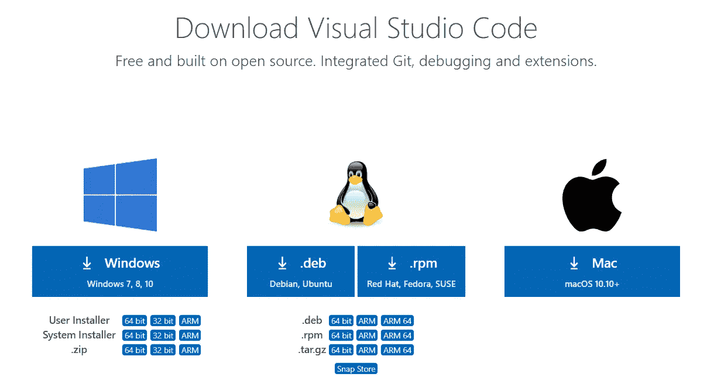
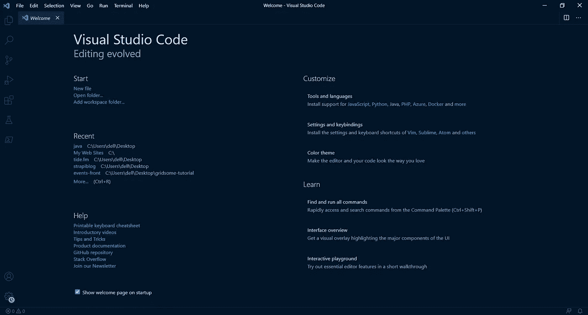
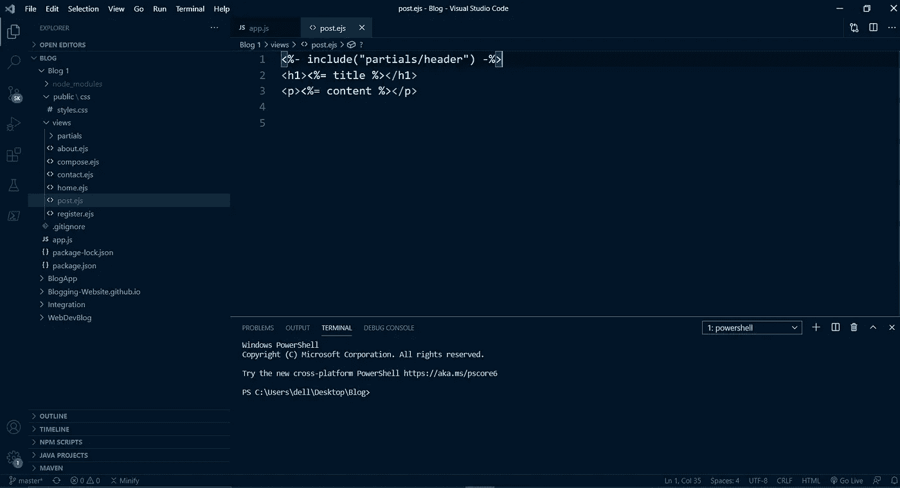
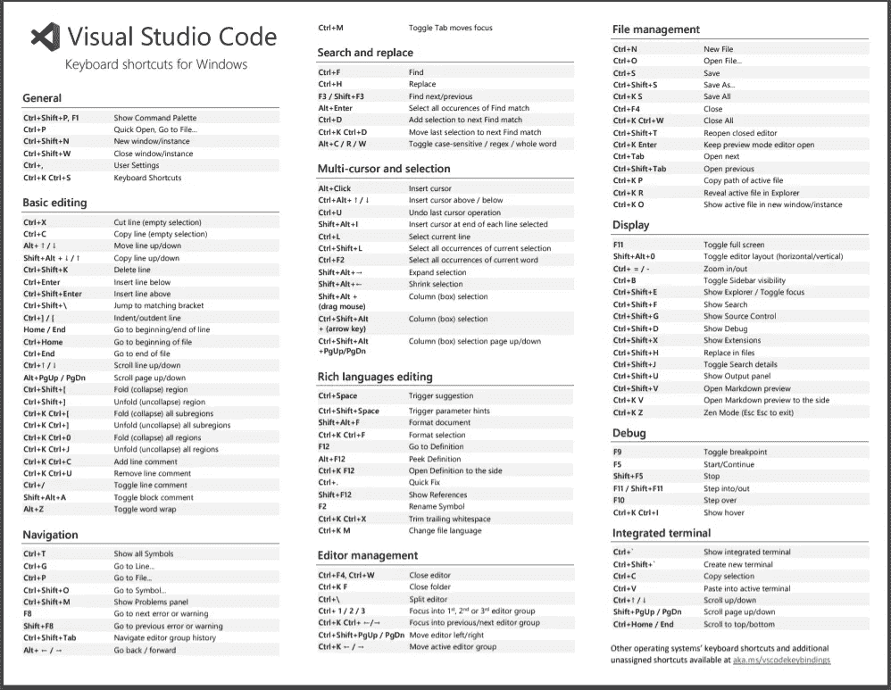
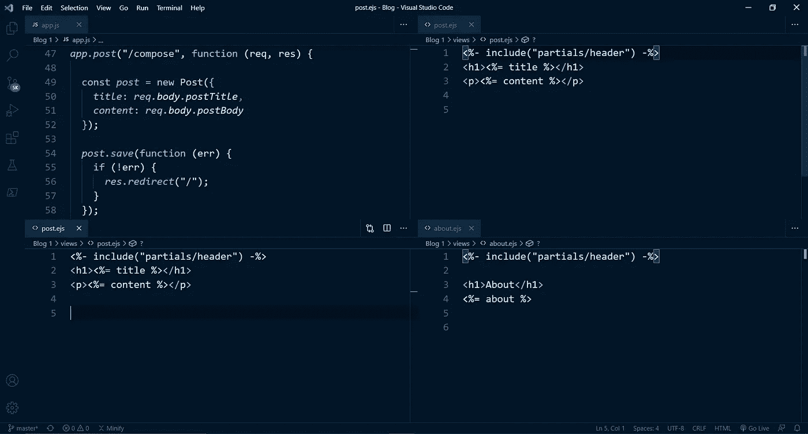

# 为什么 Visual Studio 让你成为编码专家？完全指南。

> 原文：<https://blog.devgenius.io/why-visual-studio-makes-you-a-coding-expert-a-complete-guide-723e64e84ad5?source=collection_archive---------2----------------------->

## 成为专家的基本指南以及大量的学习资源。

[安德鲁·尼尔](https://unsplash.com/@andrewtneel?utm_source=medium&utm_medium=referral)在 [Unsplash](https://unsplash.com?utm_source=medium&utm_medium=referral) 上拍照

你在这里会学到什么？可能是开始使用 Visual Studio 代码所需要学习的一切。介绍、下载、快捷方式、视频、主题、插件等。好了，在这里我们将学习所有的 Visual Studio 代码。

你们中的许多人希望节省时间，所以我写了一篇文章，你们可以参考这篇文章来获得 Visual Studio 代码的基础到高级知识。这肯定会节省你的时间，让你更有效率。

最后但同样重要的是，即使你不明白某些东西，你甚至可以看下面 Freecodecamp 的视频演示。

# Visual Studio 代码简介

Visual Studio 代码是目前最流行、最强大的编辑器。

Visual Studio 代码是 Web 开发的领域。它是由微软开发的集成开发环境，它不像 Eclipse 或 IntelliJ for java 或 C#，C++，它远不止于此。它更像是一个轻量级的文本编辑器，所以你可以将它与 Atom 或括号等进行比较。

VS 代码真正酷的地方在于它是跨平台的，这意味着它可以在 mac、windows 甚至 Linux 上运行。

# VS 代码入门。

现在你知道它是一个跨平台的源代码编辑器。基于您的操作系统通过 [Visual Studio 下载](https://code.visualstudio.com/)下载。它甚至可以自动检测您当前使用的操作系统的类型。它运行在您的桌面上，内置了对 JavaScript、TypeScript、Node.js 的支持，并为 Python、Java、C++等其他语言提供了丰富的扩展生态系统。

在这里你可以运行 HTML，CSS，JavaScript，Node.js，Express.js，安装大量的 npm(节点包管理器)包，C++，Python，Java 等等。

甚至可以在 VS 代码中运行 Flutter。是的，对于模拟器，你需要 Android Studio。你还需要一些在 VS 代码中出现的扩展来运行特定的语言。

React.js、Vue.js、Angular 等等也可以在 VS 代码中轻松运行。

它还支持 Git 和 Github 将您的代码直接分发到开源。嗯，它还包括一个内置的命令提示符，所以你不需要在一个新的标签中打开 Windows 或 Mac 命令提示符。

要开始使用 VS 代码，下载它，做一些简单的事情来安装它，然后打开它。您将会看到两个选项卡、欢迎屏幕和发行说明。欢迎屏幕为您提供入门的基本介绍。

屏幕上显示程序运行的图片

您可以从这里获得键盘快捷键、介绍性视频、提示和技巧、产品文档、Github 资源库、堆栈溢出、加入我们的时事通讯，甚至更多。看看欢迎屏幕和发行说明。

发行说明将向您介绍最新的功能，以及来自 Visual Studio 代码团队的更新。

还可以自定义安装支持 JavaScript、Java、PHP、Azure、Docker 等。查看设置和按键绑定，更改颜色主题。

如果你不了解 Azure、Docker，甚至 PHP，也不用担心。

现在可能你要做的最重要的事情是在 VS 代码中打开一个文件夹。如果你没有创建网站或运行编程语言的文件夹，你可以在任何位置创建并在 VS 代码中打开它。

打开后，你会看到，

里面的文件。我已经打开了一个名为 Blog1 的文件夹来创建一个博客网站。在左侧栏，您可以看到文件的数量。

# 减少您在 Visual Studio 代码中的时间的重要快捷方式。

Visual Studio 代码的键盘快捷键。

1.  **允许我们切换侧边栏**

在 Windows 中按“Ctrl+B”或 Mac 中按“Cmd+B”来切换侧边栏。作为一名开发人员，当我们想要移动文件时打开侧边栏，当我们想要编写代码时关闭侧边栏变得很重要，这可以通过快捷方式轻松完成。

**2。转到侧边栏中的特定选项卡**

Windows 的 Ctrl+Shift+E 或 Mac 的 Cmd+Shift+E 可直接进入浏览器。

Windows 的 Ctrl+Shift+F 或者 Mac 的 Cmd+Shift+F 直接去搜索。

Windows 的 Ctrl+Shift+G 或 Mac 的 Ctrl+Shift+G 直接进入搜索控制。

Windows 的 Ctrl+Shift+D 或 Mac 的 Cmd+Shift+D 直接进入运行和调试模式。

**3。命令面板**

使用 Windows 的 Ctrl+Shift+P 或 Mac 的 Cmd+Shift+P 打开命令面板并搜索 init。要在命令选项板中运行的任何命令。

比如用 Ctrl+Shift+P 或者 Cmd+Shift+P 打开命令调板，现在搜索 zen 模式。禅模式将摆脱一切，不必要的因素，而写代码，即边界，侧边栏。大多数人喜欢这种模式，以便专注于代码。不要分心，只要专注于代码。

通过运行相同的代码，即 Ctrl+Shift+P，关闭 Zen 模式。

还有一个众所周知的小地图功能。按 Ctrl+Shift+P 或 Cmd+Shift+P，搜索在 VS 代码右上方显示地图的小地图。小地图允许我们轻松地滚动一个更大的文件。

**4。搜索一个单词并替换它。**

可以直接按 Ctrl+F 或者 Cmd+F 搜索一个词，搜索这个词。

甚至替换单词只需按 Ctrl+F 或 Cmd+F，然后键入要替换的单词。就在搜索框前面，您可以看到一个大于号“>”，单击它，您将看到另一个带有占位符 replace 的框，并键入您要替换的单词。

**5。打开一个文件**

按 Ctrl+P 或 Cmd+P，并键入要在其中工作的文件名，然后按 enter。它将给定的文件与类型化的文件进行切换。如果一个文件夹包含几个文件。

**6。HTML 和 CSS 的 Emmet】**

打开一个空的 HTML 文件，点击“#”并输入你将得到一个完整的 HTML 样板文件，否则你可能不得不写。从[埃米特那里了解更多。](https://emmet.io/)

**7。自动完成**

Visual Studio 代码使我们能够编写代码并为其提供自动完成的单词。您将会看到，在键入一些代码的前缀之后，您将会得到一个所有可能的方法和与之相关的属性的列表。

# VS 代码中基于网格的系统

格子

VS 代码有很好的特性，你可以选择几个文件，并通过如上所示显示它们来同时处理它们。这里我们选择了 app.js，post . ejs(2 次)，about.ejs 以网格的形式可视化。不要担心。此处存在 ejs 扩展。它基本上是 Web 开发所需的[嵌入式 JavaScript 模板](https://ejs.co/)。

只需选择文件并在指定的屏幕上拖动，VS 代码做进一步的处理。

您还可以通过拖动选定的文件来查看列和行中的文件。

# 设置

只需点击“Ctrl+，”(Control +逗号)或(Cmd+，)即可打开设置。

根据您的喜好更改字体、外观、截屏模式、功能、面包屑等等。

搜索，属性如设置中的字体大小，并更改它。

# 通过观看视频来学习

想通过看视频来学习，那么你可以试试 Freecodecamp 的免费视频。由 James Q Quick 创建的完整的 Visual Studio 代码速成课程。我真的很喜欢它，并从中把握一切。

来源:Freecodecamp

# **为 Visual Studio 代码更改主题。**

看看下面的帖子来改变 VS 代码中的主题。

 [## Visual Studio 代码的 8 个精彩主题

### 漂亮地编码

medium.com](https://medium.com/better-programming/here-are-8-awesome-themes-for-visual-studio-code-1bd173f8b10d) 

# **对程序员非常有帮助的 10 个 Visual Studio 代码插件**

 [## 对程序员非常有帮助的 10 个 Visual Studio 代码插件

### 让你的程序员生活变得更容易的插件列表

medium.com](https://medium.com/better-programming/10-extremely-helpful-visual-studio-code-plugins-for-programmers-c8520a3dc4b8) 

# 结论:

学习和练习 Visual Studio 的功能，它是节省时间的捷径。你知道的键盘快捷键越多，工作效率就越高。

感谢阅读和学习。

 [## 2021 年为网页设计师和网页开发者提供 80+免费资源。

### 成为网页开发者的完整指南。

medium.com](https://medium.com/javascript-in-plain-english/80-free-resources-for-web-designers-and-web-developers-in-2021-f400be2875ea)