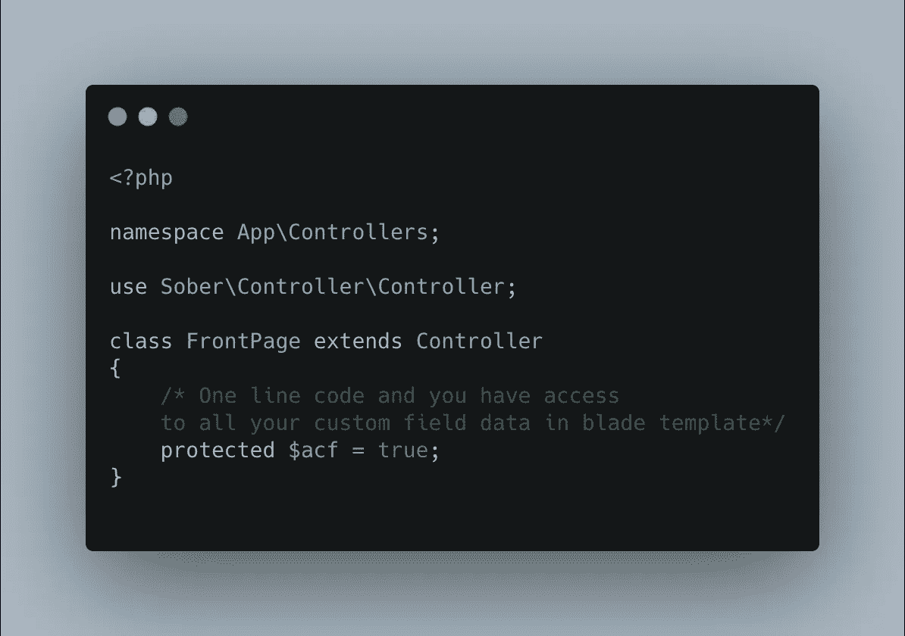

# 为什么，什么时候，如何开发具有 Laravel 特性的 WordPress，实例。

> 原文：<https://blog.devgenius.io/why-when-and-how-to-develop-wordpress-with-laravel-features-live-examples-f7958cf1b7ea?source=collection_archive---------2----------------------->

> 不管你对我的偏好有什么想法，我将展示用 Laravel 和 WordPress 制作的网站。这两种技术我都喜欢，它们都很完美，只是需要知道什么时候用什么。

有两种人(包括程序员和非程序员)。有些人使用 WordPress 的安装模板和最少的代码，而其他人，例如 Laravel 或 Symfony 开发人员甚至没有阅读 WordPress 的文档。是什么把他们团结在一起？对 WordPress 功能和简单性的无知。

让我们想象一下，我们要写一个简单或中等难度的网站，它需要一个附加的大管理面板，在开发过程中有很多例程。每个独特的页面(模板)有许多表格、cruds 和字段，同时，不需要功能、计算或其他硬编码的东西。根据客户的要求，很明显，主题必须是独一无二的，从头开始创建。改变颜色和字体的 WordPress 主题安装人员(认为 WordPress 开发只是主题安装和配置的人)不能处理这样的问题(没有 PHP 和 WordPress 技能)，Laravel 或其他框架开发人员可以构建独特的设计，但他们需要大量的时间，也不会通过做一个例行程序学到特别有趣的东西，这意味着他们的时间被浪费了，没有产出，也不合适。让我们高兴的是，WordPress 提供了有趣的低成本数据库和模型工作，非常简单的管理面板开发工具，如 ACF(自定义字段插件),开发时间减少了几倍。

**关于 WordPress**

你可以争辩说，WordPress 主题结构对开发者不友好，没有 MVC 架构结构，没有 OOP，但只有当第一次看到 WordPress (WordPress 的使用事件驱动(hook)架构系统)主题或插件时，你才能选择任何范式，面向对象，程序性或功能性的，使用任何你想要和喜欢的结构。WordPress 对开发者的突发奇想非常宽容。整个软件公司或独立程序员已经创建了非常好和有用的入门主题和项目，任何人都可以使用。

大多数情况下，我更喜欢使用 [**roots**](https://roots.io/) 产品，启动项目-基岩和主题 Sage9，roots 也提供 WordPress 服务器 Trellis。Sage 是最稳定的主题(bug 修复，更新)，有很大的社区和优质团队。Sage 能够使用依赖管理器，如 composer、重构的主题文件、dry 模板、图像优化、带有实时重新加载的 webpack、SASS、分离的控制器以及带有舒适的 ACF 注册和 e.t.c .的视图。这里有更快、更干净、更现代的开发人员工作流的一切。

Sage 控制器

圣人观

也有非常强大和简约的开始主题。对于更专业更复杂的网站是[**WordPress**](https://github.com/wordplate/wordplate)**-**composer，laravel mix，自定义 SMTP，安全，调试，简单的环境和 e.t.c .让 WordPress 工作流程对所有 PHP 开发者来说更专业更舒适。

[**下划线**](https://underscores.me/) 也是一个很老很流行的首发，但是我不喜欢，因为找不到足够的功能，当然不代表这个主题不好，我只是不喜欢但是很多有经验的 WordPress 开发者推荐。所以你可以检查并选择你喜欢的。如果你不需要上面列出的主题，在谷歌上搜索，我相信你会找到你要找的东西。

别忘了，在你开始用初学者主题开发之前，试着从头开始构建简单的主题，理解 WordPress 的结构、主题剖析、页面、单篇文章、插件、小部件、模板、函数、钩子、Rest API、Ajax 等，最重要的是永远遵循 [WordPress Codex](https://codex.wordpress.org/) 。

**关于 Laravel 和 WordPress**

这里是文章最有趣的部分，Laravel，和 WordPress hybrid。如果你是 Laravel 迷，无法想象自己在其他框架中编码，并且有大量内容的复杂应用，**[**Corcel**](https://github.com/corcel/corcel)**是你快乐所需要的。使用 WordPress 作为管理面板和数据操作，但代码控制器，与 Laravel 的看法。同样，使用 composer u 可以很容易地将它转换成其他 PHP 框架。简单的配置、最快的代码和编写复杂 web 应用程序的能力，使 Corcel 成为有史以来最有趣的 PHP 混合之一。****

******关于我的项目******

****好了，我们进入下一阶段。差不多一年半前，项目经理给我看了一个新项目，有 30 多个独特的结构页面(模板)，有很多内容和字段。这是一个真正的例行程序，功能性很低，只有一些 cron 作业、第三方服务、简单的过滤器和 4-5 个表单，这些都是用 Vue.js 和 WordPress REST API 解决的，在 Laravel 中，这是一样的。我决定用 Sage 9 创建它，并采用 [**这个**](https://credobank.ge/en) 结果。WordPress 的开发速度非常快，这非常重要，因为客户希望尽快得到结果。在 Laravel 或其他 PHP 框架中，没有什么是你不能用 WordPress 和必要性做的。关于安全性…使用定制插件和定期更新，恶意软件和病毒的风险极小，也无需用户注册。****

****例如， [**likanimw**](https://likanimw.ge/en) 比完成大得多的[**credocank**](https://credobank.ge/en)花了我两倍的时间****

****我在刚刚做调试的 [**pdp**](https://pdp.ge/en) 的真实项目中看到 Corcel，真的很推荐。****

******结论******

****WordPress 对于初学者来说非常容易学习，对于有经验的 PHP 开发人员来说更容易。即使是复杂的网站也可以用 WordPress 构建，我只是根据我的经验写的，希望它能帮助你。每个项目都需要一个独特的方法，有利弊，并且只有在决定使用哪种技术之后。在农场使用法拉利并不明智。****

****附:有时是 Laravel，有时是 WordPress，有时任务需要其他东西。****

****P.P.S .抱歉我的英语不好:)****