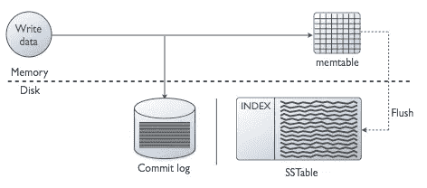

# 为什么卡珊德拉的书写速度这么快？

> 原文：<https://blog.devgenius.io/why-writes-in-cassandra-are-so-fast-ae4ad9413902?source=collection_archive---------0----------------------->

杰克·吉文斯在 [Unsplash](https://unsplash.com?utm_source=medium&utm_medium=referral) 上的照片

Cassandra 是一个分布式数据库，支持难以置信写操作，并以其可伸缩性和可用性而闻名。它非常适合支持具有极高写入吞吐量的应用程序。

为了实现这种高性能，Cassandra 有一种独特的写入模式。Cassandra 使用了几种不同的数据结构:

*   提交日志(磁盘)
*   Memtable(内存)
*   表(磁盘)

所有这三种数据结构都包含在每个写入过程中。

# 步骤 1:写入提交日志

当有写入时，Cassandra 做的第一件事是将其写入提交日志。提交日志是出于持久性目的的仅附加记录日志。如果一个节点在写入过程中关闭或数据损坏，Cassandra 可以使用其提交日志来重放所有事件并重建数据库。

写入提交日志非常快速高效。万一节点在写入完成前关闭，它也能让您安心。

# 步骤 2:写入 Memtable [Memory]

Cassandra 维护一个名为 Memtable 的内存数据结构。写入提交日志后，Cassandra 会将您的数据写入内存中的 Memtable。一旦数据被写入 memtable，节点就确认写操作成功。

你没看错，Cassandra 在写入内存数据结构后认为写操作是成功的。你现在可能会问，如果节点关闭了呢？还是记忆被抹去了？

由于其提交日志和写入冗余，Cassandra 能够在这些情况下进行恢复。提交日志让 Cassandra 在 Memtable 被清除的情况下恢复丢失的数据。写操作还被复制到多个其他节点，因此，如果一个节点丢失了它的 Memtable 数据，有一些机制可以实现最终的一致性。

写入内存数据结构比写入磁盘快得多。正因为如此，卡珊德拉写作速度极快！

接下来你可能会问，卡珊德拉肯定不能把所有的数据都存在内存里吧？当然不是。Memtable 被 Cassandra 用作临时缓冲区。Cassandra 会定期将其内容从 Memtable 刷新到名为 SSTable 的磁盘数据结构中。现在让我们来看看。

# 步骤 3:刷新到表[磁盘]

Cassandra 在实际保存数据的磁盘中包含多个表。

Cassandra 可以通过两种方式决定何时将其 Memtable 内容刷新到磁盘:

1.  周期性地。经过一段固定的时间后，它会将其内容写入磁盘。
2.  内存表大小。每当 memtable 达到一个固定的大小时，比如说 4 MB，它就会刷新 memtable。

一旦数据写入表中，内存表就会被清除，为更多的输入数据做好准备。

写过程(从 [DataStax](https://docs.datastax.com/en/cassandra-oss/3.0/cassandra/dml/dmlHowDataWritten.html) docs 获得)

# 结束语

这就是卡珊德拉写得如此之快的原因。当节点将数据写入其内存中的 Memtables 时，写入操作会得到确认。正因为如此，卡珊德拉可以处理疯狂的写卷。