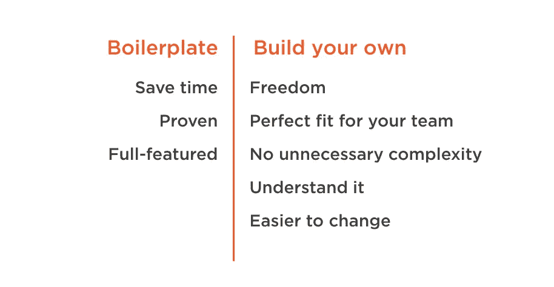

# 为什么您需要自己的初学者工具包

> 原文：<https://blog.devgenius.io/why-you-need-your-own-starter-kit-210fef1278b9?source=collection_archive---------48----------------------->

JavaScript 在过去几年里发生了巨大的变化。一下子接受这么多变化并不容易。正在发生的一个大转变是建筑。我们从一个非常简单的东西，包括带有脚本标签的 JavaScript，到将我们的语言编译成一个巨大的难以理解的文件的构建步骤。从头开始真的不再现实了。

如今，JavaScript 领域中可用的选项数量多得令人应接不暇。在创建一个健壮的 JavaScript 开发环境时，我们可能要考虑很多决策。决策超载不应该影响每个新项目的整个团队。一个团队应该一次性做出所有这些决定。

此外，工具是当今 JavaScript 最难的部分之一。有太多复杂的依赖关系，以至于设置一个新的应用程序需要很长时间。是的，知道所有东西是如何工作的很好，但这并不意味着你需要在开始之前全部学会。最好是边走边学。快速起步可以让您更专注于代码，避免因设置困难而气馁。

今天，许多团队都有自己的开发环境。你可能听说过样板文件、初学者工具包、框架应用程序或示例项目这样的术语。构建自己的开发环境有很多好处。您可以自由选择最适合您需求的技术。你可以用最适合你的团队的方式来构建它，只放那些你关心的特性。这有助于避免不必要的复杂性，使修复错误和调整设置久而久之变得容易。任何现有的样板项目都可能包含您不想要或不需要的技术，或者删除功能或调整它们的工作方式既费时又容易出错。

值得构建自己的初学者工具包吗？首先，它整理了一长串决策、一致同意的工具、最佳实践和经验教训。它还鼓励一致性。它可以防止你忘记重要的细节。它提高了质量，因为做正确的事情变得自动。最后，它避免了重复工作。每次你开始一个新项目时，你不必考虑如何处理缩小、自动化、传输文件、捆绑、缓存破坏等等。初学者工具包为您概括了所有这些决定，它就像一个活的、自动化的、交互式的清单。它确保即使在你最激动的时候也能完成正确的事情。做正确的事情变得很容易，这是一个巨大的胜利。

做正确的事情有很多步骤，很容易忽略一个步骤。对于大多数人来说，JavaScript 中的最佳实践列表已经变得太长，无法记住。当你发现每个人都应该开始做的新事情时，你现在就有了一个可以整理实践的地方，这样从现在开始它就会自动发生。一个结构良好的开发环境可以对您的工作提供快速的反馈，在您点击 save 时，可以快速报告任何林挺、测试或编译错误。它确保开发人员不会忽略重要的问题或在开发过程中犯常见的错误。所以，制作自己的初学者工具包是个好主意。