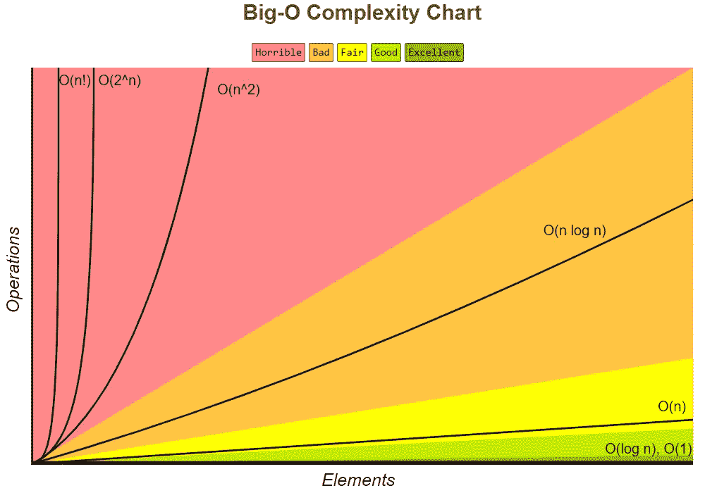

# 为什么你应该改变你的正则表达式引擎

> 原文：<https://blog.devgenius.io/why-you-should-change-your-regex-engine-4c26a66ebf23?source=collection_archive---------9----------------------->

约书亚·阿拉贡在 [Unsplash](https://unsplash.com?utm_source=medium&utm_medium=referral) 上拍摄的照片

也许你不*需要*改变你的正则表达式引擎，但是有件事你绝对应该知道。大多数 regex 引擎实现使用[回溯](https://en.wikipedia.org/wiki/Backtracking)，它以***【o(2^n】***的指数时间运行，这意味着当提供恶意输入时，可能需要很长时间才能完成。

简单回顾一下，这是一张在[https://www.bigocheatsheet.com/](https://www.bigocheatsheet.com/)看到的 Big-O 复杂度图:

Big-O 复杂度图:[https://www.bigocheatsheet.com/](https://www.bigocheatsheet.com/)

如果你想了解更多关于时间复杂度的信息，请看以下页面:

*   维基百科:[https://en.wikipedia.org/wiki/Time_complexity](https://en.wikipedia.org/wiki/Time_complexity)
*   走向数据科学:[https://towardsdatascience . com/understanding-time-complexity-with-python-examples-2 bda6e 8158 a 7](https://towardsdatascience.com/understanding-time-complexity-with-python-examples-2bda6e8158a7)

此外，一旦你对时间和空间的复杂性有了很好的理解，在准备编码面试时，这里有一个很好的资源(上面给出的图表的来源):

*   Big-O 小抄:[https://www.bigocheatsheet.com/](https://www.bigocheatsheet.com/)

回到手头的问题，不用多久就会注意到，在某些条件下，即当输入数据大到足以引起问题时，指数运行时间算法可能会成为真正的噩梦。有时候，足够多的数据并不意味着大量的数据，它可能是一个 100 个字符的字符串。

同样以这个例子为例，当试图将一个由一个重复多次的字符组成的 100 个字符的字符串与一个畸形的正则表达式进行匹配时，总的执行时间将超过 10 个⁵年，正如这篇伟大的文章[https://swtch.com/~rsc/regexp/regexp1.html](https://swtch.com/~rsc/regexp/regexp1.html)中所讨论的:

> 注意，Perl 需要 60 多秒来匹配一个 29 个字符的字符串。另一种方法被标记为汤普森 NFA，原因将在后面解释，它需要二十*微秒*来匹配字符串。那不是错别字。Perl 图以秒为单位绘制时间，而汤普森 NFA 图以微秒为单位绘制时间:在运行 29 个字符的字符串时，汤普森 NFA 实现比 Perl 快一百万倍。图表中显示的趋势还在继续:Thompson NFA 在不到 200 微秒的时间内处理一个 100 个字符的字符串，而 Perl 需要超过 10 ⁵年。(Perl 只是大量使用相同算法的流行程序中最显眼的例子；上面的图可能是 Python，或者 PHP，或者 Ruby，或者其他语言。本文后面更详细的图表展示了其他实现的数据。)

也许这一事实最具标志性的含义是广为人知的*正则表达式拒绝服务* (ReDoS)攻击。根据 [OWASP](https://owasp.org/) 基金会的说法，这种攻击的定义强调了最常见的正则表达式库实现的指数级运行时间所导致的问题。可以在[https://owasp . org/www-community/attacks/Regular _ expression _ Denial _ of _ Service _-_ ReDoS](https://owasp.org/www-community/attacks/Regular_expression_Denial_of_Service_-_ReDoS)找到:

> **正则表达式拒绝服务(ReDoS)** 是一种[拒绝服务](https://owasp.org/www-community/attacks/Denial_of_Service)攻击，它利用了这样一个事实，即大多数正则表达式实现可能会遇到极端情况，导致它们运行非常缓慢(与输入大小成指数关系)。然后，攻击者可以使使用正则表达式的程序进入这些极端情况，然后长时间挂起。

好吧，那么你能做些什么来避免这个问题呢？答案可能会有所不同。如果您的用例只涉及评估众所周知的、行为良好的正则表达式，这些表达式用于匹配一组众所周知的、非恶意的相对较小的输入，那么您可能根本就不应该为此费心。但是如果你仍然不确定，试着看看这些项目:

*   https://github.com/substack/safe-regex
*   rxxr 2:[https://www.cs.bham.ac.uk/~hxt/research/rxxr2/](https://www.cs.bham.ac.uk/~hxt/research/rxxr2/)

另一方面，如果您的应用程序接受用户输入并使用易受攻击的正则表达式引擎对其进行评估，您可以考虑选择一种新的编程语言，其正则表达式实现不会受到这个问题的影响(好吧…我知道说起来容易做起来难)，或者您可以使用另一个正则表达式库。

例如，目前我一直在试验 RE2([https://github.com/google/re2](https://github.com/google/re2))，它是回溯正则表达式实现的一种快速而安全的替代方法，它提供了一个***【n】***的线性运行时间(如果有疑问，请参考 Big-O 复杂度图)，它已经满足了我所有的期望和要求。你可能已经注意到了，这是谷歌[库](https://github.com/google)中可用的项目之一，目前是[Golang](https://golang.org/)([https://golang.org/pkg/regexp/](https://golang.org/pkg/regexp/))使用的 regex 引擎。它是由 [Russ Cox](https://swtch.com/~rsc/) 开发的，他还写了 3 篇很棒的文章解释他的代码的所有理论基础:

*   [正则表达式匹配可以简单快速(但在 Java、Perl、PHP、Python、Ruby 等语言中比较慢)](https://swtch.com/~rsc/regexp/regexp1.html)
*   [正则表达式匹配:虚拟机方法](https://swtch.com/~rsc/regexp/regexp2.html)
*   [野外正则表达式匹配](https://swtch.com/~rsc/regexp/regexp3.html)

这三段文字对任何打算扩展他/她的计算机科学理论知识的人来说都是极好的资源。

虽然 RE2 是用 C++编写的，但是其他编程语言也可以使用包装器:

*   一个包装厂在 https://github.com/marcomaggi/cre2/。
*   一个 Erlang 包装器在[https://github.com/dukesoferl/re2/](https://github.com/dukesoferl/re2/)和十六进制(hex.pm)上。
*   一个地狱般的包装在 https://github.com/powerman/inferno-re2/。
*   Node.js 包装器在 https://github.com/uhop/node-re2/和 NPM。
*   一个 OCaml 包装器在 https://github.com/janestreet/re2/和 OPAM (opam.ocaml.org)。
*   一个 Perl 包装器在 https://github.com/dgl/re-engine-RE2/的 T2 和 CPAN (cpan.org)。
*   一个 Python 包装器在 https://github.com/facebook/pyre2/的 T4 和 PyPI (pypi.org)上。
*   一个 R 包装器在 https://github.com/qinwf/re2r/和 CRAN (cran.r-project.org)上。
*   一个红宝石包装器在 https://github.com/mudge/re2/和 rubygems.org 的 RubyGems 上

最后，下面是不同正则表达式引擎的详细比较。您可以使用它来比较 RE2 与其他库的特性:

*   正则表达式引擎比较:[https://en . Wikipedia . org/wiki/Comparison _ of _ regular-expression _ engines # Language _ features](https://en.wikipedia.org/wiki/Comparison_of_regular-expression_engines#Language_features)