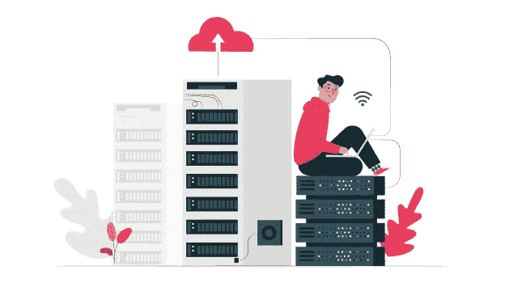
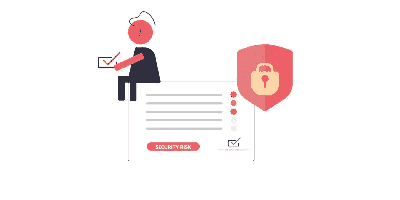

# 为什么您应该定期进行安全评估？

> 原文：<https://blog.devgenius.io/why-you-should-conduct-regular-security-assessments-910d9f2786c2?source=collection_archive---------5----------------------->

贵公司的 IT 环境是否得到了充分的保护？

如果您的企业严重依赖互联网和技术，网络安全必须成为运营中至关重要的一部分。为了确保您采用的**网络安全措施**对您的业务来说是适当和充分的，应该进行安全评估以评估外部和内部威胁。不能忽视定期的安全评估。在这篇博客中，我们将讨论什么是安全评估以及为什么任何企业都需要它。

# 什么是安全评估？

安全评估是一个组织建立网络安全政策和对抗**安全威胁**的起点。它提供了组织在某个时间点的**网络安全态势**的视图。它有助于找到您的企业支付的资源，但要么利用不足，要么过度利用。

例如，安全审计有助于发现几个低效的设置，为了加强 it 基础设施并让您高枕无忧，应该修复这些设置。

此外，您会意识到过时的安全措施和其他漏洞。长期被忽视的安全失误可能会导致重大问题，威胁公司数据的安全并削弱系统运行。

*让我们看看不同类型的安全评估，它们有助于发现和评估风险，并检查您组织的控制效率。*

# 安全风险评估的类型

## 脆弱性评估

漏洞评估旨在对组织的系统和架构中的安全失误和弱点进行系统审查。它的工作原理是为漏洞指定严重级别，并推荐补救措施。

## 渗透测试

Pen 测试包括针对组织系统、内部和外部网络、API、云设置等的模拟网络攻击。目的是发现可利用的漏洞。

## 风险评估

网络安全风险评估是识别、分析和评估组织 IT 环境中的风险并量化风险导致的潜在损失的过程。

## 合规性评估

合规性评估旨在确定现有系统控制与安全网络要求之间的差距。它涉及对特定标准的遵从，如适用于组织的 PCI-DSS 和 HIPAA。合规性评估是关于基于风险的控制，以保护数据的机密性和可访问性。

*定期运行这些安全评估是必须的；让我们看看为什么。*

另请阅读:[2021 年电子商务公司面临的网络安全威胁和措施](https://securetriad.io/cyber-security-threats-and-measures-for-ecommerce-companies-in-2021/)

# 安全风险评估的重要性

## 1.确保数据的安全性

一听到网络攻击，人们首先想到的是数据的安全性。定期进行安全评估有助于通过实施安全措施来确保关键数据的安全。

它测试用来保护数据的方法是否能有效地保护数据免受所有潜在的攻击。
医疗保健行业就是一个很好的例子。医疗保健中生成的数据，如患者信息、医疗条件和疾病、处方和药物、医疗程序等。本质上是极其敏感的。

医疗机构存储、传输、处理或维护的任何此类数据都应得到充分保护。数据可以驻留在任何或所有数据库、服务器、连接的医疗设备、移动设备和云存储中。

所有这些平台都需要以尽可能好的方式进行保护。
安全措施包括风险评估、封锁网络以及在极端情况下关闭系统。它们有助于防止医疗欺诈和窃取患者的个人信息。

采用一系列服务来确保数据安全，包括内部和外部渗透测试、数据库安全评估和 web 应用程序测试。

## 2.重新分配资源并确定培训需求

在进行安全评估之前，您可能不知道您的公司有哪些资源使用不足或过度使用。对于已识别的漏洞，安全评估会指出并帮助优先组织所需的资源。另一方面，通过审计，安全评估也有助于减少您的公司不需要但仍在继续支付的资源和工具。

这对于减少不必要的开支和释放您的 IT 预算以投资于其他关键方面大有帮助。除此之外，安全评估还为确定员工的培训需求提供了一个平台。

员工教育和运营与公司标准之间的差距可以通过培训和技能提升策略得到有效识别和弥补。

## 3.了解网络安全政策和程序

数据泄露会给组织造成重大损失，并导致法律纠纷、财务损失和公司形象受损。不是所有的企业都能从中恢复。

因此，建立健全的政策和程序来加强组织的整体安全状况是没有坏处的。为了有效地做到这一点，从战略安全评估开始，并让行业专家对其进行审查。

通常，网络安全政策和程序应涵盖以下主题。

*   与访问控制和用户帐户管理相关的指南。
*   信息安全治理和风险管理。
*   提高工作站和设备安全性的标准。
*   业务连续性计划、灾难恢复计划和其他补救措施。
*   安全架构和设计，重点关注 IT 系统和安全控制的适当实施。

## 4.战略后备计划

进行定期安全评估的另一个重要原因是为灾难恢复制定应急计划，加强整体安全计划，并随着网络威胁环境的变化保持更新。

无论您组织的数据是存储在内部、云中还是两者都存储，安全评估都有助于指出需要备份的关键信息。首先是优先考虑公司最有价值的资产；灾后的主要目标是尽快重建主要业务运营。

在组织的信息安全出现紧急情况和违规时，通过安全评估制定的应急计划将为从备份中恢复数据和服务以及其他活动提供指导。

另请阅读:[流行渗透测试工具](https://securetriad.io/popular-penetration-testing-tools/)

## 5.识别潜在的安全风险

安全威胁既可以是外部的(黑客试图闯入组织的系统)，也可以是内部的(愤怒的员工想要造成破坏)。或者可能已经进入您的系统寻找重要信息的恶意软件。

定期安全评估会暴露与整个 IT 环境相关的漏洞和安全风险。如果组织意识到漏洞，而不是简单地盲目防御，他们就可以准备好并配备必要的工具和资源来抵御外部攻击。

安全评估还将包括根据影响的严重性和可能性对发现的漏洞进行分类，以及补救准则。

## 6.安全合规性

安全合规性也是一个组织必须进行安全评估的重要原因。安全评估有助于根据全球公认的标准和最佳实践的实施情况，对公司的信息安全状况进行评估和评分。人们可以把它看作是一种差距评估，它确定了满足既定标准所需的内容。

例如，医疗保健行业的常见安全法规遵从性是 HIPAA(健康保险便携性和责任法案)，它适用于所有医疗保健提供商和相关服务，如保险公司。

根据该法案，这些组织必须披露其数据存储和数据共享做法，并接受审查。另一个例子是涵盖处理持卡人数据的实体的 PCI DSS(支付卡行业数据安全标准)。任何存储、处理或传输持卡人数据的企业都必须遵守 PCI DSS。

我们已经详细讨论了定期和及时进行网络安全评估的理由。如果您计划进行全面的安全评估或想了解更多关于安全实践的信息，请通过 Secure Triad 联系我们。

我们是一家[渗透测试服务公司](https://securetriad.io/)，我们可以为您的企业进行公正独立的安全风险评估。我们致力于确保您的企业免受不断演变的网络威胁。

*原载于 2021 年 3 月 24 日*[*https://securetriad . io*](https://securetriad.io/importance-of-security-assessments/)*。*