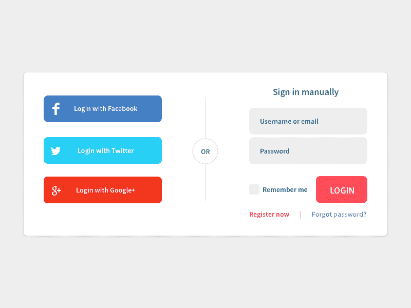
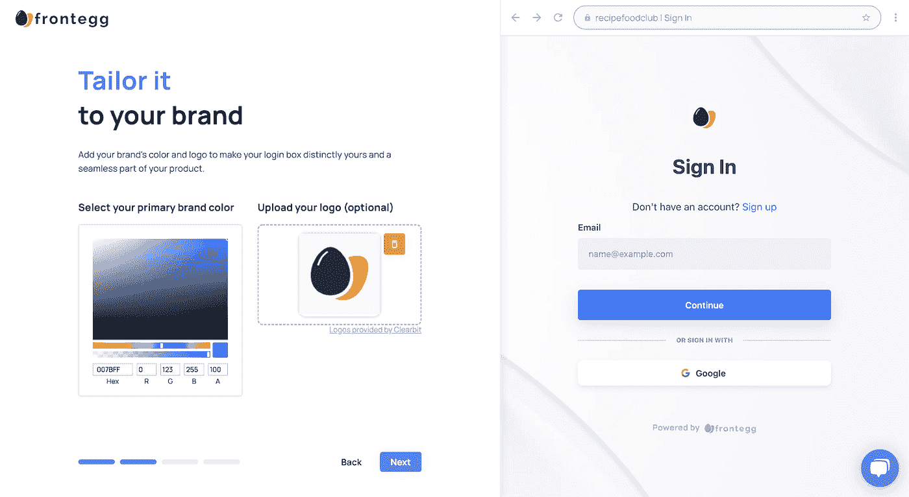

# 为什么您应该为 React 应用程序尝试社交登录

> 原文：<https://blog.devgenius.io/why-you-should-experiment-with-social-logins-for-react-applications-8a1c9432fc54?source=collection_archive---------11----------------------->

[Firmbee.com](https://unsplash.com/@firmbee)途经 [unsplash](https://unsplash.com/photos/DfMMzzi3rmg)

前端和后端环境变化非常快，新的集成技术也在不断涌现。利用社交登录进行身份验证对于您的最终用户来说是一种更快速的注册方式，并且可以节省单个工程师数周的开发时间。这些服务通常在较低的基础架构成本、实现价值的时间、一致的用户体验和易用性方面获得数倍的回报。今天，我们将探索如何为一个示例 react 应用程序设置和实现社交登录。

# 为什么要考虑 SaaS 的社交登录？

开发人员应该考虑为他们的 web 应用程序实现社交登录的原因有很多。也许最令人信服的原因是，它可以节省大量的时间和开发工作。通过允许用户使用他们现有的社交媒体帐户登录，您可以减少他们开始使用您的应用程序所需的时间。这可能是一个很大的优势，尤其是对于那些可能还没有庞大用户群的新应用。

考虑社交登录的另一个原因是，它可以改善整体用户体验。当用户可以使用现有帐户登录时，他们不必记住新的用户名和密码，也不必经历创建新帐户的过程。这使他们更容易开始使用你的应用程序，并能带来更高的转化率。

最后，社交登录还有助于降低您的基础设施成本。当用户使用他们的社交媒体帐户登录时，您不需要为他们创建和管理单独的用户帐户。这可以节省你的开发和托管成本的时间和金钱。

[来源](https://medium.com/@golman.alan/social-login-3rd-party-app-authorization-f228a3f8ae23)

# 如何为 React 应用程序实现社交登录

当您准备好将社交登录添加到 React 应用程序时，您需要做几件事情。首先，你需要在你想要支持的各种社交媒体提供商那里创建账户。然后，您需要为这些提供者设置身份验证和授权机制。最后，您需要将社交登录按钮集成到您的应用程序中。

将社交登录集成到 React 应用程序的过程会因您使用的社交媒体提供商而异。然而，一般来说，您需要在应用程序中包含几段代码:加载社交登录库的脚本标记、初始化库的代码和处理身份验证响应的代码。

我们将使用名为 [Frontegg](https://frontegg.com/) 的免费 SaaS 服务。我过去曾使用这个平台进行用户认证和管理——它的用户界面非常容易理解。其结果是一个低代码但易于实现的用户管理体验，我今天将向您展示社交登录实现。

所以，我将创建一个名为/frontegg 的项目目录并`git init`它用于源代码控制。然后，我将运行`npx create-react-app –template=typescript web`来设置一个带有现成 typescript 的 react 应用程序。一旦安装了所有的依赖项，我们应该能够通过`npm start`运行它。

现在，让我们[配置我们的应用](https://docs.frontegg.com/docs/quickstart)。我们将创建一个帐户，设置我们的应用程序，并将其配置为本地身份验证。为了让事情变得更简单，我将与谷歌签约，但选择您喜欢的任何身份验证。

[[https://files . readme . io/f3ee 57 b-Screen _ Shot _ 2022-04-11 _ at _ 20 . 39 . 20 . png](https://files.readme.io/f3ee57b-Screen_Shot_2022-04-11_at_20.39.20.png)]

你会被提示很多事情——公司名称、徽标(带有时髦的实时更新组件！)，以及您想要集成的认证策略/社交网站的几个选项。我会选择 Google，Github，和 Password 来覆盖大部分基地。还有安全性提示，如身份保护，包括多因素身份验证、设备指纹识别和 recaptcha。最后，可能还有额外的配置，比如密码保护。这些选项可以在以后更改。

接下来，您将创建一个登录框并配置附加选项。由于这是一组个人选择，我不会在下面的部分提供太多的细节，因为这些都是实现相关的。当你完成登录框后，点击右上方的“发布到开发人员”按钮，你将到达堆栈选择页面。在这里，我们将单击 React 获得一个指南。我们将在这里继续，跳过 Frontegg 模板 CRA 的初始步骤，以防你是一个现有的应用程序交换到 Frontegg。

运行`npm install @frontegg/react react-router-dom`可以让我们访问 Frontegg 的包，并允许我们开始编写登录代码。我将在应用程序根文件夹的. env 文件中配置 baseUrl 和 clientId，但是您可以随意选择不同的路径！

在设置好加载的客户端 URL 和基本 URL 之后，我们对`index.tsx`做了以下更改，并让应用程序运行，Frontegg 提供者包装我们的应用程序，如代码所示。

在这一点上没有什么太大的不同，但是我们将立即进行一些修饰性的更改，以便更清晰地组织我们的一些内容。我还将对 CRA App.tsx 模板进行一些快速编辑。我将删除

元素中的所有内容，并在它下面创建一个新的 div 来存放我们的用户信息。然后，我将更改 App.css，将标题的高度设置为 5vh，而不是 100vh，这样新内容就不会超出折叠范围。

让我们通过创建 Login.tsx 在页面顶部放置一个登录组件，并放置 react 快速入门中的一些代码来测试我们的集成。我将在这里包含一个注销按钮，这也需要我`npm install @frontegg/rest-api`，但是我想确保登录和注销功能在这一点上起作用:

在对我们的谷歌账户整合进行了一轮快速测试后，我们顺利地登录了！您还应该注意访问令牌——通过 https://jwt.io/的[运行它会显示令牌中包含的大量用户信息。Frontegg 对所有令牌使用 JWT 标准声明，因此无论您在后端使用哪种服务，您都可以利用 sub 和/或电子邮件来连接任何客户数据，更多数据可在](https://jwt.io/) [JWT 站点](https://jwt.io/introduction)获得。

现在我们有一个组件来做一些进一步的平滑体验。我们将获取用户的帐户信息，并在应用程序的主窗口中显示一个小的个人资料图标和其余的个人信息。为此，我们将快速向应用程序添加一个 ProfileIcon.tsx 文件

但是首先，我们想为这个图标组件的外观建立一些参数。

> 假设我已经登录到应用程序
> 
> 当我看着屏幕的右上角
> 
> 然后我会看到一个盒子，里面有我名字和姓氏的首字母
> 
> 假设我已经登录到应用程序
> 
> 当我看着屏幕的右上角
> 
> 该框应该有一个特定的颜色为基础的第一个字母的名字根据一个红色，橙色，黄色，绿色，蓝色，靛蓝，紫色的主题
> 
> 假设我已经登录到应用程序
> 
> 当我看着屏幕的右上角
> 
> 那么字体颜色不应该与框的背景颜色冲突

这些看起来都很容易实现。创建一个从用户姓名中提取首字母的框将非常简单，只需按空格分割全名，并抓取每个单词的首字母，然后将它们连接起来。根据第一个字母改变颜色是对一些模数魔法的尖叫。因为我们的主题非常简单，所以我们也可以将底层的背景颜色与可感知的文本颜色相匹配。来实施吧！

替换 Login.tsx 组件中的内容后，我们可以看到该组件工作得相当好。根据您姓名的第一个字母，背景颜色和文本颜色会发生变化，并且根据您是否输入了姓氏和/或名字，您的姓名首字母也会自动填充。

然而，通过实施这种控制，我们已经丢失了相当数量的数据。因此，让我们添加一个看起来不错的组织组件，为一些数据提供一个容器，并把它放在主应用程序中。我们将把一个类似于纸张的样式放在一起，并对它的布局非常不固执己见，以便可以重复使用。为了让控件在页面上看起来像一张纸，我们需要一个非常浅的[框阴影](https://cssgenerator.org/box-shadow-css-generator.html)在它后面。请参见下面生成的输出。

现在，我们可以将我们的 paper 组件放入应用程序中，检索我们之前删除的代码，并在新创建的 UserInfo.tsx 组件中将它显示在应用程序代码的前端和中央。该组件将为用户提供对 logout 按钮以及随之而来的任何用户数据的访问，包括一个配置文件图像，如结果代码所示。

现在，我们可以将 UserInfo 组件切换到 App.tsx 中。因此，我们的主要应用程序代码非常容易阅读，并且我们为我们的认证应用程序提供了一个极好的起点。

# 结论

我希望这对 Frontegg 的新用户来说是一个信息丰富且快速的例子。该平台为那些希望专注于核心产品而不是通过社交应用管理身份认证的开发人员提供了大量价值。这个快速简单的实现运行起来不到一个小时，如果您熟悉 jwt，那么解析它们的访问令牌很简单。