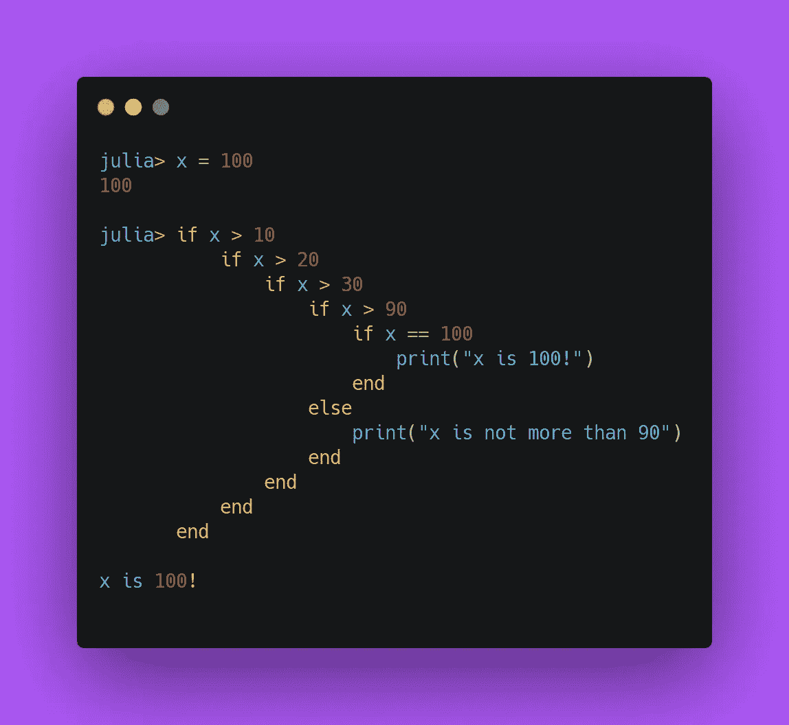
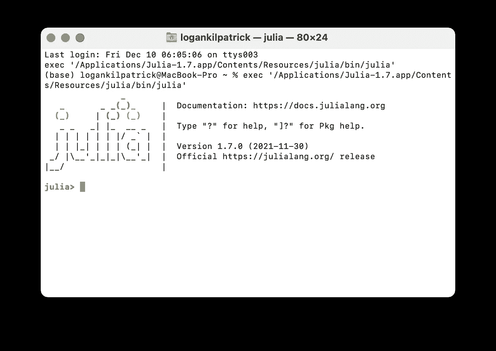
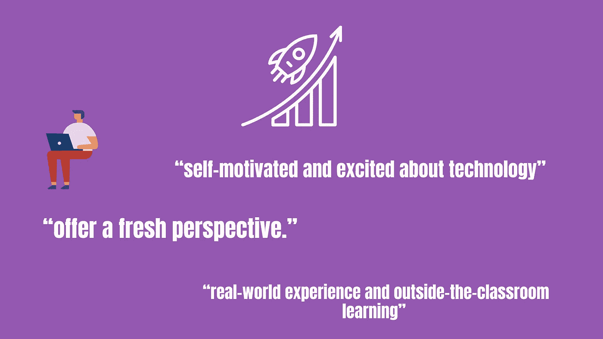

# 作为一个初学者/第一次程序员，你为什么应该学习 Julia

> 原文：<https://blog.devgenius.io/why-you-should-learn-julia-as-a-beginner-first-time-programmer-96e0ad33faba?source=collection_archive---------2----------------------->


照片由[戴恩·托普金](https://unsplash.com/@dtopkin1?utm_source=medium&utm_medium=referral)在 [Unsplash](https://unsplash.com?utm_source=medium&utm_medium=referral) 拍摄

在过去的几年里，已经有很多关于 Julia 编程语言以及谁能从中受益的文章。我希望在这篇文章中消除的一个常见误解是“Julia 不是学习编程的好语言”。这里有几个想法，我将更详细地介绍，以使您相信 Julia 是那些刚刚踏上编程之旅的人的理想语言:

*   直观语法😌
*   朱莉娅·REPL📖 🖨
*   包装生态系统📦
*   学习资源🎓
*   🧑‍就业机会💻

如果您不熟悉 Julia，它是一种为技术计算而构建的高级动态语言。它的语法像 Python 一样简单，但运行速度和 C / C++一样快。

*编辑:我和我的合著者很高兴地告诉大家，我们的新书《朱莉娅速成教程》已经开始预售了:*

[](https://logankilpatrick.gumroad.com/l/juliacrashcourse) [## 朱莉娅速成班(电子书预购)

### Julia 速成课程是使用 Julia 编程语言的实践指南，是为初学者编写的。我们接受…

logankilpatrick.gumroad.com](https://logankilpatrick.gumroad.com/l/juliacrashcourse) 

# 直观语法

当我刚开始编程时，我用的是 C++，很难掌握。在今天这个时代，我猜大多数人都是从 Python 开始他们的旅程的。让我们来看看一些基本的语法，看看 Julia 的实际操作。很快，在我们开始之前，你会想[下载朱莉娅](https://julialang.org/downloads/):

既然您已经启动并运行了 Julia，我们可以从一些基本示例开始:

```
**julia>** print("Hello world")Hello world**julia>** 10+10 # basic math20
```

好吧，这看起来很简单。定义一个函数怎么样？对于那些可能不熟悉的人来说，函数只是链接在一起的代码块:

```
**julia>** function myFunc() print("This is what a function looks like") end**julia>** myFunc() # here we call the function we defined aboveThis is what a function looks like # and here we see the output 
```

为了在 Julia 中定义一个函数，我们使用了`function`关键字。正如你在上面会注意到的，我们在函数定义行上既不使用`{}`也不使用`:`(这是你在 Python 中做的)。Julia *是否执行了使用`end`关键字的范例，我发现这在编写深度嵌套代码时非常有用(请继续关注示例)。*

## 基于 1 的索引🥇

人们经常评论说，鉴于从零开始的索引是如此普遍，他们对 Julia 的从 1 开始的索引感到惊讶。这里有一个简单的例子:

```
**julia>** numbers = [10, 22, 7, 94]4-element Vector{Int64}:1022794 **julia>** numbers[1]10**julia>** numbers[4]94
```

简单地说，当你引用一个 iterable(数组、列表等)中的一个条目时，你从 1 开始计数。如果您是编程新手，您可能会想:

> “当然，我会从 1 开始计数，这就是我一生计数的方式”。

对我来说，这是基于 1 的索引最有说服力的理由。让一个第一次学习计算机科学的学生在第三天出现，并告诉他们在某些情况下，你必须从零开始计数，而不是从 1 开始计数，这对我来说没有意义。我知道对于那些热衷于从零开始的索引的人来说，这是一个相当敏感的话题，所以我们可以转向另一种语法。

## 条件句和循环🔂

如果你以前见过其他编程语言，Julia 没有任何古怪的条件语法:



作者图片

在上图中，您可以大致了解在嵌套代码中使用 end 关键字的 if 语句是什么样子。我非常喜欢 end 关键字，所以我写 python 代码时，我倾向于在应该添加注释的地方添加`# end`,以便在视觉上更容易描述代码块的结尾。

让我们来看一个 for 循环的基本例子:

```
**julia>** words = ["Julia", "is", "a", "great", "language"]5-element Vector{String}:"Julia""is""a""great""language"
**julia>** for word in words print(" ", word) # each iteration of the loop, it prints           one more work endJulia is a great language # output
```

现在，您已经对使用 Julia 时将会看到的一些常见语法有了基本的概念。在这篇文章的后面，我们将会看到更多的例子。如果你想看一些更基本的例子，看看下面的视频:

# 朱莉娅 REPL(阅读评估打印循环)🖨

在上面的所有例子中，我们一直在 REPL 运行代码。朱莉娅 REPL 是非常强大的，可以帮助快速原型和测试代码。



作者图片

运行 Julia 代码的另一种方式是创建一个`.jl`文件，并通过键入`Julia some/path/to/the/file.jl`或使用类似 VS 代码的 [IDE 来运行它。在我们继续之前，我想给一些关于朱莉娅·REPL 及其用法的提示。](https://code.visualstudio.com/docs/languages/julia)

## 外壳模式🐚

你可以通过输入`;`在朱莉娅·REPL 中运行终端命令。它将打开外壳模式，允许您执行以下操作:

```
**shell>** pwd/Users/logankilpatrick**shell>**
```

## Pkg 模式📦

包模式允许您管理活动环境中的包。如果你想添加一些包，只需输入`]`进入 pkg 模式，然后:

```
**(@v1.7) pkg>** add Plots
```

其中 plots 是要添加的包的名称。我们将在后面详细介绍软件包管理器！

## 帮助模式🆘

这是一个非常有用的特性，可以节省您寻找合适的函数的大量时间。如果你在 REPL 中输入一个`?`，你会得到帮助提示。您只需按下 enter/return 键，无需输入任何内容即可快速查看功能。

```
**help?>** sinsearch: **sin** **sin**h **sin**d **sin**c **sin**pi **sin**cos **sin**cosd **sin**cospi a**sin** u**sin**g i**sin**f a**sin**hsin(x)Compute sine of x, where x is in radians.See also [sind], [sinpi], [sincos], [cis].(full output omitted for space reasons)
```

在这里，我们可以看到`sin`函数的 docstring(文档),而无需离开 REPL。

# 包装生态系统📦

关于 Julia packages，我想提出两个要点。首先，管理和使用包的实际机制非常简单。第二，已经存在覆盖大多数需求的高保真软件包(每天都有更多的软件包被注册)。

在上一节中，我们展示了如何添加包。让我强调一些其他的软件包管理器技巧。记住，您可以通过输入`]`通过 REPL 进入软件包管理器:

```
**(@v1.7) pkg>** st**Status** `~/.julia/environments/v1.7/Project.toml`[587475ba] Flux v0.12.8[add582a8] MLJ v0.16.11**(@v1.7) pkg>** status**Status** `~/.julia/environments/v1.7/Project.toml`[587475ba] Flux v0.12.8[add582a8] MLJ v0.16.11
```

这个`status`或`st`(简写)命令将允许您查看当前环境中安装的所有软件包。我目前有两个，MLJ 和通量。你也可以看到每个软件包的版本，这往往是非常有用的。如果我想删除一个包，我可以这样做:

```
**(@v1.7) pkg>** remove MLJ**Updating** `~/.julia/environments/v1.7/Project.toml`[add582a8] - MLJ v0.16.11
```

这个`remove`命令也有一个简写，`rm`。如果你再输入`st`，你会看到包不见了。这些是您将在日常开发中使用的主要命令。安装软件包后，要使用它，您需要:

```
**julia>** using Flux
```

其中`Flux`是我想要加载的包的名称。有关使用包的更多详细信息，请查看下面的视频:

# 学习资源🎓 📑

学习朱莉娅有很多不同的方法。你可以看书，看视频，做练习题，等等！我们在[https://julialang.org/learning/](https://julialang.org/learning/)整理了一份非常详尽的清单

我最喜欢的资源之一是朱莉娅学院:

[](https://juliaacademy.com/courses?preview=logged_out) [## JuliaAcademy

### 由 Julia 核心开发人员与 Julia Computing 合作编写。要了解更多关于 Julia 的信息，请访问…

juliaacademy.com](https://juliaacademy.com/courses?preview=logged_out) 

如果你以前从未编程过，我们可以帮你。“紧张的初学者的 Julia”课程是一个很好的 Julia 计算入门课程:

[](https://juliaacademy.com/p/julia-programming-for-nervous-beginners) [## 紧张的初学者的 Julia 编程

### 课程什么时候开始和结束？课程现在开始，永远不会结束！这是一个完全自定进度的在线…

juliaacademy.com](https://juliaacademy.com/p/julia-programming-for-nervous-beginners) 

如果你想在专家 Julia 导师的免费支持下学习，请查看:

[](https://exercism.org/tracks/julia) [## 朱莉娅谈锻炼

### 通过解决 71 个练习流利地掌握朱莉娅。然后在我们世界级团队的指导下升级。

exercism.org](https://exercism.org/tracks/julia) 

如果你想通过看书来撩起朱莉娅，我个人最喜欢的是:

[](https://www.amazon.com/Tanmay-Teaches-Julia-Beginners-Springboard/dp/1260456633) [## Tanmay 为初学者教授 Julia:所有年龄段机器学习的跳板

### Tanmay 教初学者 Julia:所有年龄段机器学习的跳板[Bakshi，Tanmay]在亚马逊网站上…

www.amazon.com](https://www.amazon.com/Tanmay-Teaches-Julia-Beginners-Springboard/dp/1260456633) 

所有这些都是说有很多朱莉娅资源。尤其是对初学者来说，不管你怎么学都是最好的，你会发现很多不同的学习途径！

# 🧑‍就业机会💻

一般来说，每个人都想要/需要一份工作。总的来说，编程是最酷的工作之一。这简直是魔法！但是，是什么让学习朱莉娅成为一项如此重要的技能呢？



作者图片

上图显示了招聘人员的一些观点，他们期望新毕业生在被雇佣时能给工作带来什么。现实是，公司需要新知识和新观点。在这种情况下，我想不出比这更吸引人的语言了。也有很多很酷的公司围绕着朱莉娅建立业务:

[](https://medcitynews.com/2021/11/neurotech-startup-beacon-biosignals-scores-27m-to-bring-ai-to-eeg-analysis/) [## 神经科技初创公司 Beacon Biosignals 获得 2700 万美元，将人工智能引入脑电图分析

### 脑电图是一项有几十年历史的捕捉大脑活动的技术，数据用于评估大脑…

medcitynews.com](https://medcitynews.com/2021/11/neurotech-startup-beacon-biosignals-scores-27m-to-bring-ai-to-eeg-analysis/) [](https://insidebigdata.com/2019/08/04/pumas-ai-launches-julia-language-based-software-to-advance-drug-development-patient-care/) [## Pumas-AI 推出基于 Julia 语言的软件，以推进药物开发、病人护理…

### Pumas-AI -由马里兰大学药学院成员 Vijay Ivaturi 博士建立的新公司

insidebigdata.com](https://insidebigdata.com/2019/08/04/pumas-ai-launches-julia-language-based-software-to-advance-drug-development-patient-care/) [](https://www.reuters.com/technology/julia-computing-raises-24-mln-funding-round-led-by-dorilton-ventures-2021-07-19/) [## Julia Computing 在由 Dorilton Ventures 牵头的一轮融资中筹集了 2400 万美元

### 7 月 19 日(路透社)-朱莉娅计算公司在由风险投资公司 Dorilton Ventures 牵头的一轮融资中筹集了 2400 万美元…

www.reuters.com](https://www.reuters.com/technology/julia-computing-raises-24-mln-funding-round-led-by-dorilton-ventures-2021-07-19/) 

这些只是公司使用和雇佣 Julia 开发者的几个例子。在#jobs 频道上也有源源不断的关于 Julia Slack 的询问。

# 结束语💭

这是学习 Julia 并加入社区的最佳时机。有这么多很酷的事情发生，大量惊人的资源被创造出来。有一件事我到目前为止还没有提到，但总是值得一提的是 Julia 社区本身。根据我的经验，他们非常欢迎那些加入语言生态系统的人，并且对他们很有帮助。如果你在旅途中遇到任何问题，请不吝赐教。

感谢阅读！如果您有任何问题/反馈，请随时在 Twitter 上 ping 我:【https://twitter.com/OfficialLoganK