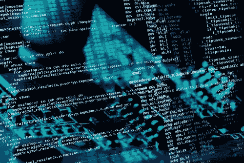
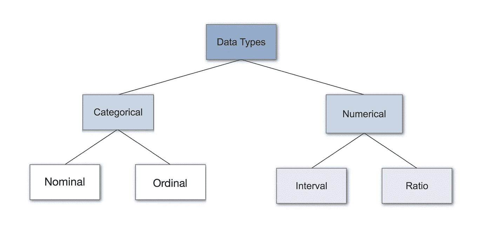
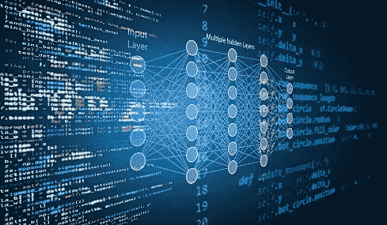

# 为什么你应该学习统计编程

> 原文：<https://blog.devgenius.io/why-you-should-learn-statistical-programming-18d3fd72fad5?source=collection_archive---------13----------------------->

它通常涵盖统计学、数学、物理学、经济学、商业和管理学。这里，我们就去那些本科生学习统计编程的不同原因。

## 1-他们处理数据

所有这些职业都有一个共同点:他们都在某种程度上与数据打交道。有些程序需要数据密集型，有些则与数据密集型无关。经济、统计、商业和管理等数据密集型项目；如果你想在数据分析、数字营销和管理等特定岗位工作，了解统计学和统计编程已经成为职业发展的必要条件。

## 2-我们有更多的数据和更少的时间来评估数据

信息时代起源于伟大的奇迹。此外，不断积累的数据很难理解。这就是统计程序解决问题的地方:他们为决策者进行数据清理、分类、分析和结果解释。

## 3-大多数研究生课程需要一定水平的统计编程

如果你看大部分研究生项目；他们对编程有要求。尤其是涉及到研究生项目相关的统计学和经济学。这取决于你的领域。但是数据密集型的程序因为各种原因需要你懂 python 和 R。首先，它们被用于学术研究，以更快地评估数据。第二，更多的公司从 excel 转向 python 和 R 来分析数据。第三，数据需要在短时间内正确可视化。

## 4-数据科学与统计编程和计算统计密切相关

差不多就是这样。因为数据科学结合了统计分析和编程的方法。因此，作为一名优秀的数据科学家，你需要理解统计学，以最大限度地提高你的结果。尽管统计编程的整个概念是占主导地位的，计算机科学和工程；理解数据科学的整个概念需要强大的统计基础。

*你认为学习统计编程的原因是什么？在下面的评论区分享你的想法和经历。*