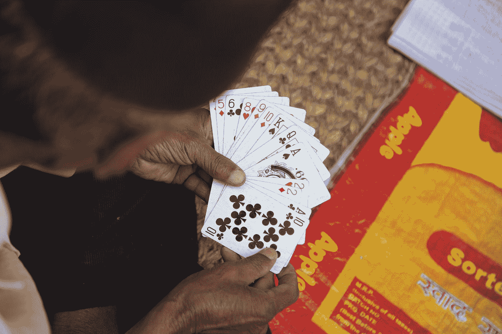

# 为什么你应该密切关注规划扑克

> 原文：<https://blog.devgenius.io/why-you-should-pay-close-attention-to-planning-poker-30f86b92e74c?source=collection_archive---------3----------------------->

## 不要回避玩规划扑克

米罗斯拉夫·乔纳斯在 [Unsplash](https://unsplash.com?utm_source=medium&utm_medium=referral) 上的照片

我读了这篇[文章](https://dzone.com/articles/confession-i-cheated-during-planning-poker)关于策划扑克作弊。不能说我一点都没作弊。

你在计划扑克游戏时作弊吗？

面对现实吧，你没有听完整个对话。午餐的想法和休息时间都在你的脑子里，而不是虫子。

Scrum master 说:“问题？”，你在浏览这张票。

让我们来看看为什么你不应该作弊，以及如何改善这些训练。

# 低估票

当有人不注意时，这种情况经常发生。他或她选择普通号码，没有任何解释。

开发商给出了一个虚假的解释。将其与其他票据进行比较，或与以前的票据进行匹配。没有一张票和以前的一样。

策划环节结束后，有人来取票。可能是开发商没注意。别做那种人。

一旦票证正在处理中，开发人员就失去了熟悉上下文的时间。这就是训练课的重点。开发人员有时会迷失在票证中，无法满足截止日期。

如果你不立即倾听和提问，这些情况就会发生。

# 避免未知代码

某个特性导致了几个错误，现在它是待价而沽。整饰环节采用了相关的故事。

你不听。

这位开发人员表示，实施将影响登录功能。梳理会话结束。你拿起票，在预计时间内完成。你根本不检查签到。

新的 bug 出现了，你要负责。如果你以这个故事为例，倾听是至关重要的。

你可以想象还能发生什么故事。不注意可能会导致另一个会话重复范围解释。在任何情况下浪费时间，只要适当注意，都是可以避免的。

# 在票上加上你的想法

倾听很好，但你需要提问。问愚蠢但相关的问题，因为它们往往会揭示领域。你可以看看我关于 XY 问题的文章，从现在开始质疑每一个解决方案。

 [## 克服 XY 问题的 3 个技巧

### 当你不理解问题 X 时，不要试图找出解决方案 Y

medium.com](https://medium.com/better-programming/3-tips-to-overcome-the-xy-problem-19abc9e5b693) 

你熟悉这个问题中的特征。在对话中加入您的疑虑、问题、可能的解决方案和边缘案例。怀疑可以触发范围扩展，或者解决方案可以揭示新的问题。

如果你认为预期的时间不够，要求应急时间点。别人会和你争论，但是会引出健康的对话。

# 做好车票和必要物品的记录

开发者很少在票上做笔记。你应该做笔记。写下在培训会议上发言的人、疑虑和问题。记下你不知道的，并询问相关信息。

这可以大大减少你的门票介绍。你不会做同样的事情两次，因为你提前做了准备。查看我关于如何记笔记的文章。

 [## 没人告诉你的简单体面的个人日记

### 为什么你应该有一个稳定的个人发展日志

medium.com](https://medium.com/dev-genius/what-no-one-tells-you-about-simple-decent-personal-journal-4a9de184696a) 

感谢阅读！