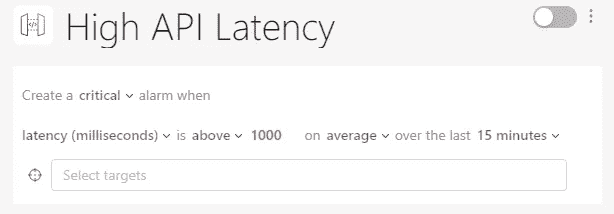
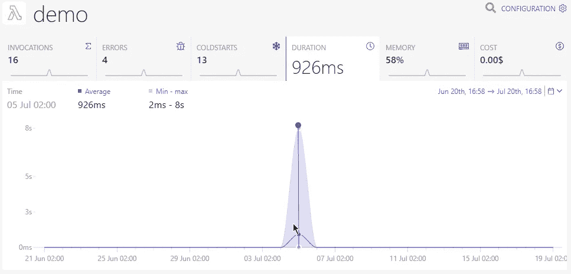
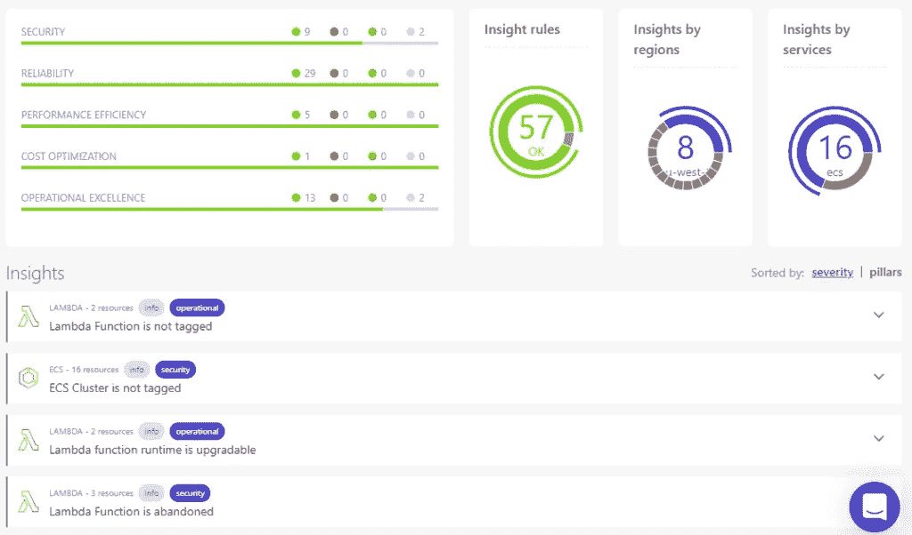

# 为什么你应该停止囤积指标

> 原文：<https://blog.devgenius.io/why-you-should-stop-hoarding-metrics-d9ff84c16a85?source=collection_archive---------5----------------------->

无服务器允许您在云提供商的数据中心部署远程应用程序。**这减轻了您的大部分运营负担**。你在云提供商的生态系统中购买的越多，**你自己需要做的就越少**:不再有操作系统更新或数据库错误修复安装。

但是**你还是需要自己做一些运营相关的工作**。例如，[监控您的应用程序](https://dashbird.io/serverless-observability/)以了解在那个遥远的数据中心发生了什么。

通常，云中新软件产品的监控之旅是这样的:

第一个版本只有基本的监控功能，或者更糟，没有任何监控。然后事情就像往常一样出错，没有人真正知道为什么。在调试完问题后，人们得到的想法是他们没有足够的度量。根据问题的严重性，这要么导致**更多的指标被添加到监控设置中**每个新事件要么导致**过度破坏解决方案**，其中**一切都被监控**。

无论哪种方式，在应用程序出现足够多的问题后，会有**如此多的指标和警报被设置**，以至于您从对基础架构一无所知变成了有如此多的洞察力，以至于**重要的部分被淹没在数量庞大的指标和警报中**。

# 为什么太多的指标和警报是不好的？

如果你遇到严重的失败威胁到你的生意，你会变得小心翼翼。你不想让任何东西从缝隙中溜走，所以你添加了你能找到的所有东西。但最终，**它淹没了重要的数据，而这些数据本可以在下一次即将发生的事件中拯救你。**

如果你看不到长满树木的森林，那么你又回到了起点——没有洞察力。关键的问题是，你和你的团队，**那些看着监控仪表板的人**，能合理地感知多少数据？

所有你不需要的指标都会分散你对重要部分的注意力。**他们还可以引导你优化无关紧要的指标**。

# 你应该摆脱你的指标吗？

简答:**不，不应该**。

长的回答:所有这些指标都潜在地**隐藏着重要信息**。你应该停止储存它们吗？嗯，问题不在于度量标准保存在某个地方。虽然**在某些情况下这可能会成为财务和性能问题**，但它不会直接影响您的运营。**问题是你的团队无法理解它们**。根据未来的需求，最好将指标存储在某个地方，这样您可以在需要时显示它们。

你应该削减这些指标的仪表板和图表，以**将你的团队从信息过载中解放出来**。

# 从服务级别协议、服务级别协议和服务级别协议的角度考虑

服务水平协议(SLA)包括您在与客户签订的合同中向客户做出的承诺。例如，您的服务将在一秒钟内对 99%的请求做出响应。你在法律上受那个承诺的约束，所以它绝不能被打破。您可以查看 AWS Lambda SLA 来了解这在实践中意味着什么。当 AWS 的服务中断太长时间时，他们会损失很多钱。

服务水平目标(SLO)是您如何重新定义 SLA，以有意义的方式衡量它。在上面的一秒钟响应示例中，这可能很容易测量，但情况并非总是如此。**SLO 是您为您的指标定义的不应被突破的阈值**。成功回复率不应低于一定比例；响应等待时间不应超过某个值等。

在图 1 中，您可以看到这样一个 SLO 是如何被设置为 Dashbird alert 的。在这里，平均延迟应该总是低于一秒。

图 1:API 延迟的 Dashbird 警报——当 API 响应超过 1，000 毫秒(1 秒)时，严重级别的警报将通过电子邮件、Slack、SMS 等向您发出警报

服务水平指标(SLI)现在是我们囤积问题的解决方案所在。SLI 由一个或多个重要指标组成，用于检查您的系统当前是否违反了任何 SLO。**“一个或多个指标”是关键词**。如果您可以从显示您的 SLO 得到满足的多个指标中计算出一个值，您就不必查看每个指标来检查事情是否进展顺利。

在图 2 中，您可以看到这样一个 SLI，一个 Lambda 函数执行的持续时间以毫秒计。

图 AWS Lambda 的 Dashbird 函数细节

这是一种自上而下的方法。你写合同；它解释了你的 SLAs 您基于这些需求定义您的 SLO，然后设置 sli，以便您可以检查 SLO 是否保持不变。

# 智能触发器有助于解决实际业务问题

最后，当您的 SLO 不再满足时，或者更好地说，在它们不再满足之前，就会触发**警报，这样您就可以解决即将发生的问题。**

磁盘空间或 CPU 利用率对您的 SLO 有影响吗？如果不是，就不要显示它们。

**这并不意味着您应该在合同中只为 SLA 定义 SLOs】。很有可能**你的合同没有提到**一些可能是重要的 SLA 的东西；毕竟，合同并不完美，如果你不能提供客户期望的东西，你的客户仍然会生气。这只意味着他们最终不能起诉你，这对你的公司很重要，但只是**基本最低**。**

# Dashbird 的构建考虑了最佳实践

Dashbird 提供了大量开箱即用的无服务器技术。毕竟，它的创建是因为创始人直接看到了缺乏可观察性或过多的信息会如何阻碍产品开发。

在您将 Dashbird 与您的 AWS 帐户集成之后，它开始从 CloudWatch 收集监控数据，并且**立即为您的基础架构构建重要的指标，而无需任何额外的编码**。

Dashbird 会为所有受支持的 AWS 资源设置指标和警报，因此您不必这么做。这些都是基于多年来为 Dashbird 客户监控无服务器系统的经验，当然还有 [AWS 架构良好的框架](https://aws.amazon.com/architecture/well-architected/)，AWS 的官方资源**用于在 AWS 云上构建和维护应用程序。**

图 3 显示了这些见解的一个例子。Lambda 函数运行时是可升级的，这一点很重要，因为运行时版本不是永远受支持的。Dashbird 在当前运行时版本不再受支持之前就展示了升级的可能性。

图 3: Dashbird 架构良好的镜头

Dashbird 只向您展示**什么是重要的**，因此您的团队不会不知所措。这为您的团队提供了为您的合同中定义的 SLA 添加 sli 和 SLO 的空间，同时强调了您应该记住的关键指标。

延伸阅读:

*   [无服务器应用监控终极指南](https://dashbird.io/blog/ultimate-guide-monitoring-serverless-applications/)
*   [您应该监控的λ指标](https://dashbird.io/blog/lambda-metrics-monitoring-what-matters/)