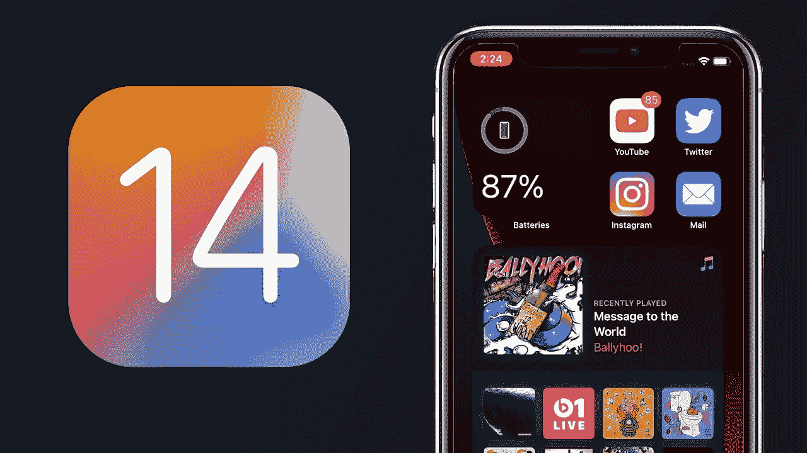
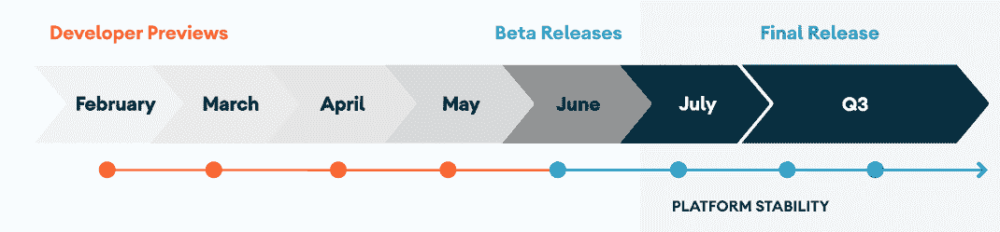

# 为什么您应该为您的应用测试测试版操作系统

> 原文：<https://blog.devgenius.io/why-you-should-test-beta-os-versions-for-your-app-50e376b93b88?source=collection_archive---------17----------------------->

iOS 14 将于 2020 年秋季发布

**为什么您应该为您的应用测试 Beta 版操作系统**

今天，我想试着说明一下为你的应用程序测试操作系统版本的重要性，以及为什么我们在我们的机构中非常重视它。

我们将这篇文章分成三点:

1.  早期采用者和用户期望:乘风破浪！
2.  新的行为可能是问题的来源，会破坏你的应用程序
3.  降低风险

# 早期采用者和用户期望:乘风破浪！

开发一个应用程序需要大量的精力、投入、时间和金钱。一旦你的应用幸运地获得了足够多的用户来满足你的业务需求，你就需要维持你的客户的期望。

当苹果或安卓发布新的测试版操作系统时，他们是在正式发布前几个月为开发者发布的。这不仅是为了向科技迷和 youtubers 展示新的功能。这主要是为了让开发者为你的应用的下一个版本做好准备。他们希望你能适应并跟上他们平台指南的趋势。

作为一名应用程序业务所有者，你最不希望的事情就是被你的用户视为科技浪潮的背后。技术进步非常快。如果你打盹，你的用户知道，你就输了。就这么简单。

现在你可能会说:嗯，在手机上安装这些测试版操作系统的用户只是少数“早期采用者”。这可能是真的。

然而，低估早期采用者对你的业务的重要性将是一个严重的错误。他们通常是最有影响力的人。他们是决定当前和未来趋势的人。他们是传播消息的人。

不使你的应用适应测试版操作系统的特性，可能会对你的业务产生负面影响。

对于苹果开发者来说，测试版本在 6 月发布，直到最终版本在 9 月/10 月左右发布。

对于 Android 来说，时间线甚至更长。以 Android 11 的发布为例，开发者预览早在二月就开始了，最终版本将在第三季度发布。(见下面的时间线)。

所以现在，我们已经正确地确定，你的应用程序的声誉取决于这些测试版。你想向你的用户展示你正在驾驭创新的浪潮，你能够快速适应和拥抱新技术。这反过来会建立对你的应用程序的信任和忠诚度。

# 新的行为可能是问题的来源，会破坏你的应用程序

接下来，认为操作系统版本之间唯一的主要区别是设计上的调整是错误的。

以 Android 11 为例，我们来看看行为变化:

以下行为变化适用于所有运行在 Android 11 上的*应用，不考虑 targetSdkVersion。您应该测试您的应用程序，然后根据需要进行修改，以正确支持这些应用程序。*

*   *隐私*
*   *安全性*
*   *照相机*
*   *连通性*
*   *性能和调试*
*   *易接近*
*   *用户界面*
*   *应用兼容性*

*是的，这是很多。最吸引我的是**隐私**。用户信任我们，他们的一生都储存在一台小型个人袖珍电脑中:智能手机。隐私是最重要的。*

*坚持 Android 11 上的隐私变化，下面是该版本的系统更新示例:*

*   *存储和用户数据*
*   *许可*
*   *位置请求*
*   *与其他应用程序交互*
*   *前台服务*

*有时出现的另一个问题是，随着新操作系统的出现，出现了新版本的编程语言。对于 Android 来说，Kotlin 已经变得相当稳定，变化微乎其微。Java，是给恐龙的。*

*然而，对于 iOS 来说，除非你因为某种原因被困在 Objc 中，否则你永远不应该公开分享，Swift 是一种相对较新的语言(好吧，它不是那么新，但我说的是相对而言)，它在过去几年中发生了许多变化。现在更稳定了，语言本身的变化一年比一年小。*

*然而，如果应用程序使用一些第三方库和其他古老的依赖项，这可能会产生问题。作为应用程序的保护者，我们必须测试并报告这些问题。*

*依我拙见，一个 OS 的改变值得从第一个版本开始进行完整的回归测试。(如果你同意这篇文章下面的评论，请告诉我..)*

# *降低风险*

*最后但并非最不重要的一点是，测试你的应用程序的 Beta 操作系统版本在降低风险方面是巨大的。与以前的版本一样，新的 Android 11 版本包括行为变化，以帮助提高性能、电池寿命、安全性和隐私。在某些情况下，这些可能会影响应用程序，直到它们被更新为支持新的 Android 版本，所以你可能会看到从小问题到更重要的功能限制的影响。一般来说，大多数应用程序都会像预期的那样工作，大多数 API 和功能也是如此。*

*作为一名质量工程师，你在其中扮演什么角色？*

*你需要密切关注 iOS 和 Android 新操作系统的发布。*

*记下可能会影响您当前正在测试的应用程序的更改。*

*但是不要只注意可能出错的地方。记下笔记并与您的团队交流，了解可用于提高应用程序质量的新功能和新方法。*

*站在技术的最前沿。你的用户会注意到并欣赏它。你的股东会注意到这一点，并欣赏它。最重要的是，你将驾驭技术的浪潮。*如果你在科技行业工作，这不是必须要做的，而是必须要做的。**

**

*拉斐尔·赖特尔*

*拉斐尔·赖特 *在苹果公司担任质量顾问。在此之前，他是一名 iOS 开发人员，对应用心理学和可用性充满热情。你可以在* [*推特*](http://www.twitter.com/raphaelreiter) *，*[*insta gram*](http://www.instagram.com/raphael.reiter)*，*[*Youtube*](http://www.youtube.com/raphaelreiter)*，*[*Spotify*](https://open.spotify.com/show/6ZKxEM3XJjhdZXoevmKNmi)*，以及*[*LinkedIn*](https://www.linkedin.com/in/raphael-reiter-24504549/)*上找到他。**