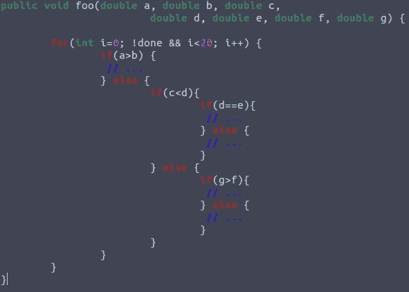

# 为什么你应该测试你的软件

> 原文：<https://blog.devgenius.io/why-you-should-test-your-software-1745962351a8?source=collection_archive---------17----------------------->

## 软件测试的简单介绍，为什么你应该这样做，为什么我们不想要 100 万亿个测试用例。

在 [Unsplash](https://unsplash.com?utm_source=medium&utm_medium=referral) 上由 [Austin Distel](https://unsplash.com/@austindistel?utm_source=medium&utm_medium=referral) 拍摄的照片

**测试包括运行软件，以确定它是否在做它应该做的事情**——并找到 bug，即与目标行为的偏差。

测试远不是处理软件质量的唯一活动。软件质量管理包括各种建设性的和分析性的措施。
设计措施有助于从一开始就实现最高的质量。这些包括，例如，使用统一的风格指南，使用合适的开发工具，使用合适的设计原则，比如松耦合，使用设计模式，等等。
另一方面，分析方法用于检查软件开发中创建的工件(草稿文档、源代码和可执行程序)。您寻找现有的问题和错误，以便可以在以后修复它们。这方面有许多程序，例如代码审查或确定质量相关的指标。这样的关键数字可以通过深层嵌套来评估代码的复杂性。过度的代码复杂性是不利的，因为它很容易导致错误。除了这些静态过程，测试作为一个动态过程在每个软件项目中扮演着重要的角色。

## 学习基础知识

当我们谈到错误时，我们区分以下几点:

1.*错误* —错误是指，例如，算法执行不正确。这也包括最终用户错误操作应用程序的情况！

2.*故障* —这包括在执行时导致故障的不正确子程序，也包括过载时损害整个系统功能的组件状态。

3.*故障* —这是出现在外部的故障的影响。我们可以通过将实际值与预期目标值进行比较来发现这一点。

> 不是每个错误都会导致失败！一种排序算法可以在美国公司中发挥数十年的巨大作用，但一旦被送到德国，它就会爆炸。为什么？因为实现不能处理变音。该死的。

## 测试阶段

每个开发人员每天都在忙着测试自己刚写好的代码。如果你用 Java 写了一个新方法，你用一些示例性的值调用它，并检查它是否做了你期望它做的事情。你对此熟悉吗？这被称为单元测试(因为只检查了一个单元)。我们大致区分了开发阶段的三个不同级别的测试:

*   **单元测试**(单个方法、类和工件的测试)
*   **集成测试**(将现有的工件连接到被测试交互的子系统)
*   **系统测试**(测试整个系统)

照片由[卢卡·布拉沃](https://unsplash.com/@lucabravo?utm_source=medium&utm_medium=referral)在 [Unsplash](https://unsplash.com?utm_source=medium&utm_medium=referral) 上拍摄

我们可以从这三个层面着手。但是我们实际上从哪个角度来看待我们的系统呢？我们看到的是内部结构，还是客户也会看到的“发送”按钮？我们与众不同:

***白盒***
我们洞察到了源代码的内部结构。这样，我们可以遍历代码中的所有分支，并确保所有方法和指令都被执行。

***灰色方框***
我们来看不同的组件。例如，我们可以测试组件之间的接口。我们不再看到组件本身的内部结构。

***黑盒***
我们的测试对象是一个黑盒。我们不知道内部结构，也不知道哪些组件以何种方式进行通信。我们只检查某些输入是否导致某些输出。

## 测试用例爆炸

大家都喜欢爆款吧？嗯，不是在软件工程领域。尤其是在测试中。所以我们遇到了测试的一个基本问题:我们不能测试所有可能的情况。我们已经用最小的方法达到了这个极限，如下所示。

测试用例展开示例

该方法有 7 个输入参数。如果我们想要完全测试，我们必须测试参数 a 到 g 的不同组合。我们必须浏览所有的指令。所以我们需要测试用例，其中 **a > b** 和那些 **a < = b** 。你看到 if-else 分支在循环的**中了吗？热！因此，我们必须开发循环运行 1-20 次的测试用例，变量“完成”有不同的情况。我将为您保存一个控制流图。我们只做一个快速计算，所以每次计算后再看一遍代码。**

如果你遍历一次循环，有 5 条路径可以遍历。通过两次传递，已经有了⁵路径。如果我们在环路上走 20 次，我们可以走⁵ ⁰路。但是请记住，我们开发的测试用例中，循环运行了 1、2、3、4……次。所以我们得到:5 + ⁵ + ⁵ + …+ ⁵ ⁰.这就产生了大约 100 万亿个测试用例。进一步阅读如何避免这种情况。

**等价类**
我们把这一节缩短一点。你应该知道那是什么以及如何使用它。你可以就这个主题写一整本书。
等价类的形成是一个*黑箱过程*。我们将所有可能的输入值集合划分为等价类。我们假设我们的测试对象对一个等价类中的所有值表现相同。
下面以一个函数*计算绝对量*为例。对于正值(包括零)，它返回值本身，对于负值，它改变符号。
如果我们想测试这个函数，我们只需输入一个(或多个)正值和一个(或多个)负值。你注意到这个错误了吗？我们只测试有效的输入值。**但是我们也要对无效值形成等价类！**这应该回答了以下问题:如果我们将值 *XY* 传递给函数会发生什么？ *XY* 可以是字符串或其他复杂数据类型，但也可以是值“null”。我们还应该查看等价类的*边界*以及这些边界附近的值，因为这些可以揭示错误。我们还检查超出范围的违规(例如，对于数据类型“int”)。

## 即将结束

在本文中，您了解到编写合适的测试并实现测试场景的良好覆盖并不容易。然而，你绝对应该试一试——有许多工具可以帮助你做到这一点。甚至免费社区版中的 IntelliJ IDEs 也能帮助 Java 开发人员编写单元测试——试试吧！