# 为什么应该使用 Git(举例)

> 原文：<https://blog.devgenius.io/why-you-should-use-git-with-examples-a6207b920ffa?source=collection_archive---------11----------------------->

这比你想象的要容易

安朵斯·瓦斯的图像

# 故事时间

我第一次找工作是一次痛苦而累人的经历。即使是在科技这个让人感觉就业市场已经火热了近十年的行业，想要打入市场也很难。我花了大量时间回答个人问题和技术问题，但在对十几家公司的采访中仍然没有得到回答。在一个特别尴尬的例子中，面试官问我能否说出 5 个 git 命令的名字以及它们是做什么的。我不能。在另一次采访中，有人问我如何解决合并冲突，我也不知道。两次采访都没有回电话。当时，我感到很羞愧(*你*本不该如此)。然而，重要的是快速度过失败的时刻，用你的新经验为下一次挑战做好准备。

如果您是新技术人员，或者您已经加入了 git 并且不熟悉 git，请不要再犯我以前犯过的错误。Git 是开发人员可以使用的最重要的工具之一，理解它对于任何编写代码的工作都是必要的。每天有数千万的开发者使用它。

## 为什么要离开？

当你在学术环境中或来自学术环境时，很难理解 git 的用处。当我获得本科学位时，几乎所有的评估，如测试或编码项目，都是单独进行的，协作被认为是作弊。当我做团队项目时，代码库相对来说既小又简单，所以我和我的团队成员,*通过电子邮件将我们编写的代码片段发送给了对方。如果您正在这样做，请停止。花 2 个小时学习 git 至少可以在你的学术生涯中节省几十个小时。让我们来谈谈协作者之间通过电子邮件发送代码片段的一些问题:*

1.两个人不能同时对同一文件进行更改。您必须轮流编辑单个文件，或者在不同的计算机上进行编辑，并以某种方式手动组合它们。

2.您没有自己的代码历史。如果你让你的项目运作起来，然后做一些改变和改进，有些东西坏掉了，你就完蛋了。

3.没有简单的方法来比较代码的过去版本和现在的版本。

4.你不知道谁写了什么。

5.本地文档和电子邮件中不同版本的代码不是在一个地方组织或集中的。

我可以继续。如果你和我一样，你可能会想*如果我不知道代码以前到底是什么样子，那又有什么关系呢？我写了一次，我可以再写一次*或*我知道谁写了我项目中的哪个代码，如果我不知道，我可以问问我的 4 人小组中的每个人。*这些解决方案在某些时候会奏效，但不是所有时候。你昨天写了你的学校项目，你当然能修好它！但是如果我让你在 6 个月后修复这个项目的一些 bug，你能做到吗？如果你与 500 名学生合作(包括早已去世的校友)，你能找到 myFile.py 的第 196 行是谁写的吗？)而不是 4？当然不是！这些都是荒谬的问题，但是在这种规模的项目中工作是你需要 git 的原因，也是你在面试中被问到 git 的可能性不是零的原因。

## git 是什么？

好吧，咆哮结束。Git 就像代码的 Google docs。它记录了谁写了什么，以及你每次提交的代码状态。而且，你可以在网上免费发布你的代码，这样你的合作者就可以很容易地访问它。简单吧？

我希望这里有更多的东西可以写，这样这一节就不会太短，但是 git 的概念真的很简单。您有一个可以在本地机器上编辑的在线目录或“存储库”。您对 repo 进行更改，并偶尔将代码“提交”到提交记录或“日志”中。当您的代码工作时(或不工作时😉)并且您准备在本地存储库上发布您的更改，您将它们“推”到 GitHub 上的远程存储库。现在，您的协作者可以在线查看和编辑自己所做的更改！如果您的合作者之一对在线回购进行了更改，并且您希望将它们放在您的本地，您可以将它们“拉”到您的本地。

## 你需要做的是

对于本教程，您需要安装 git。我不会在这里解释如何做。你可以在网上找到一些教程。一旦您初始化了一个存储库并将其连接到 GitHub 上的远程 repo，您就为我的示例做好了准备。我也在用 VSCode。这是可选的。您可以使用另一个 IDE，或者根本不使用。

# 带示例的常用命令

对于这些例子，我将使用几个 JavaScript 文件…但是本教程的伟大之处在于，如果你想继续学习，你可以使用任何东西。我鼓励你做一些和我在这里写的相似但不完全相同的事情。

## 开始

首先，让我们做一个文件。在 VSCode 中，您可以在导航栏上的“源代码管理”选项卡中看到您当前的更改。我们对代码库的更改还没有出现在远程 repo 中。甚至还没有任何关于他们的记录。为此，我们需要做出承诺。

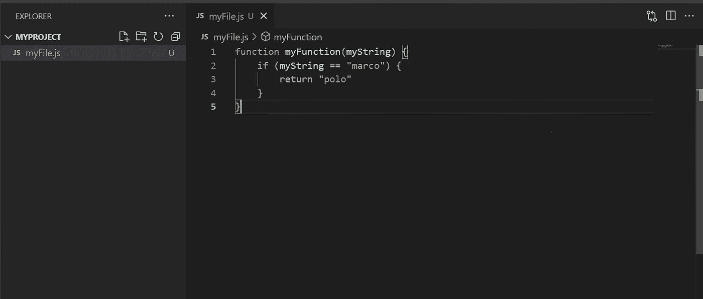

我们最初的文件。

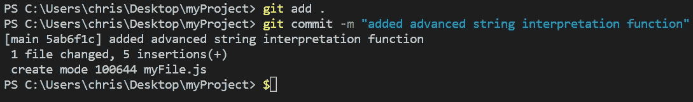

我们的第一次承诺！

首先，我们用`git add`来“上演”我们的变化。我们可以通过指定文件名来存放单个文件，或者通过使用句点来存放每个编辑过的文件，如上图所示。

然后，我们用`git commit -m "added advanced string interpretation function"`提交。每当你看到一个破折号，就把它当成传递一个参数给一个函数。这些被称为“旗帜”。在第二个命令中，我们使用带有参数`"my first commit"`的`-m`标志的`commit`命令。这将使用消息作为参数提交您的更改(消息是可选的，但很重要！它们通常应该是你所做的改变的快速总结)。

**现在，这一次你自己去做吧。**如果您正在使用 VSCode，请花一点时间查看“源代码控制”,看看您所做更改的直观展示:

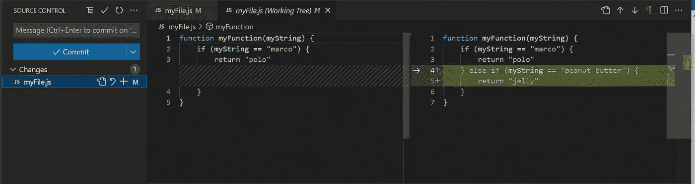

“源代码管理”选项卡显示您所做的未提交的更改

我们已经做了更改，但它们仍未在 GitHub 上发布。现在用`git push`发布它们。这个命令很简单。它将您的更改“推”到您已经配置的远程分支上。

让我们从另一个位置(比如通过 GitHub 在您的浏览器中)进行更改，模拟一个合作者向 repo 添加代码。

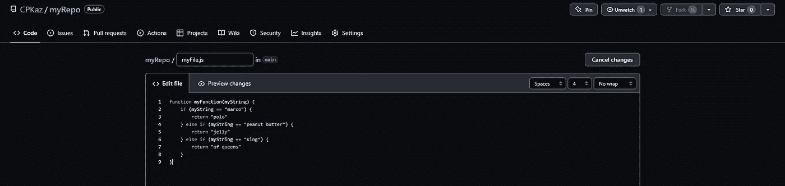

直接在 GitHub 上编辑一个文件！

提交您的更改

回到你当地的回购。您可以使用`git status`检查您的代码是否是最新的:

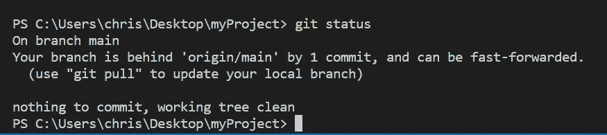

git 状态

该死。我们落后了！让我们通过调用`git pull`来解决这个问题:

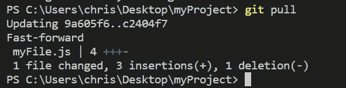

git 拉

这才是我要说的。

## 提交日志

现在，让我们用`git log`来看看我们的提交历史:

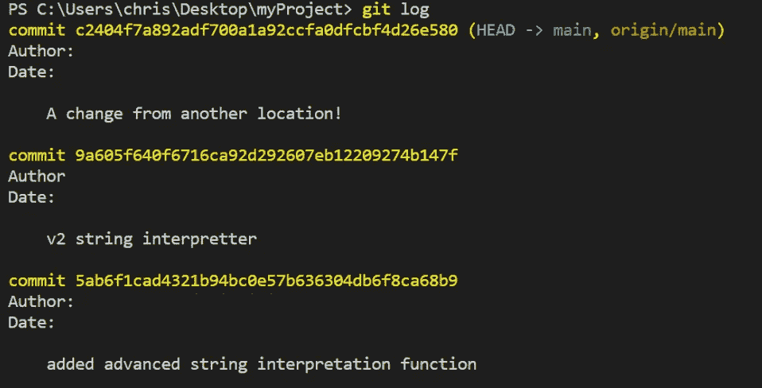

git 日志

在这里，我们可以看到历史或多或少像一个堆栈，最新的条目出现在最前面。每次提交时，您都将它放在日志堆栈的顶部。如果我们想通过消息搜索提交，也可以使用`grep`:

使用 grep 的 git 日志

在这里，我们看到消息中包含字符串“interpret”的所有提交。

如果我们决定要回到之前的提交，那么我们调用 reset:

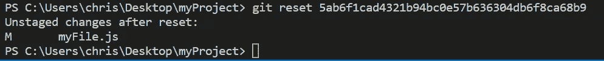

git 重置

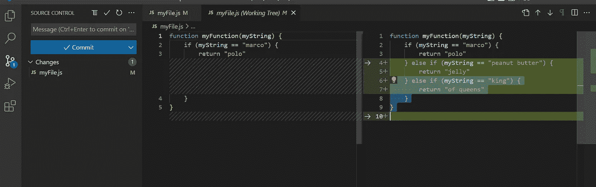

git 重置的结果

为了重置到某个提交，我们传递了一个参数，阿沙。SHAs 背后有有趣的理论，但我们真正需要知道的是它是一长串的废话。每个提交都有出现在日志中的阿沙。与提交消息不同，它是唯一的标识符。

重置不会移除您的所有更改。它会将它们从日志中弹出，并作为变更添加到您的回购协议中(实际上，什么都没有改变。您的提交刚刚被转换为编辑)。如果您想撤销您的提交**并**清除更改，那么使用`--hard`标志。

## 分支

到目前为止，我们已经直接对主要分支进行了更改。然而，如果你和别人一起工作，这不是一个好习惯。添加新功能时，您应该为该功能创建一个分支。分行是你回购的另一个版本。您可以将提交推送到一个分支，而不改变另一个分支。让我们从主干创建一个分支，并将其命名为`myNewBranch`。然后，使用`checkout`切换到分支。

git 分支和检验

如果你用`git log`。您将会看到提交历史与您的 main 相同。这是有意义的，因为您只是从 main“分支”而没有做任何更改。在前面相同文件的第一个函数之后添加一个函数，然后提交它。

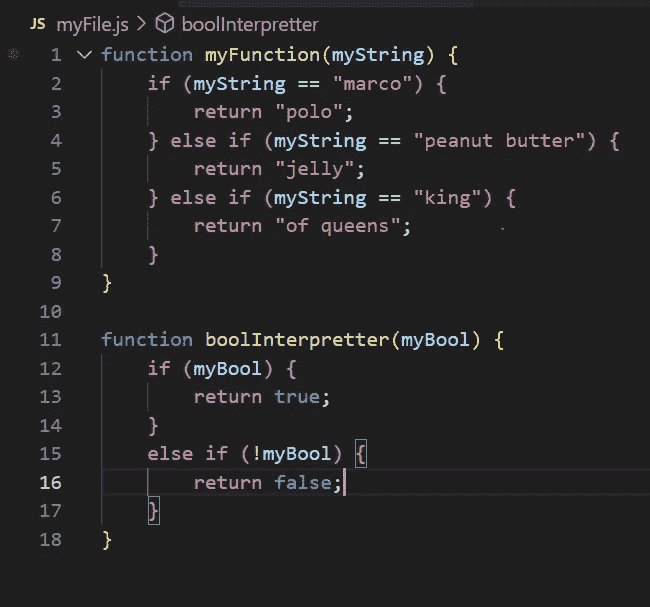

我们对 myNewBranch 的承诺

要切换回我们的主分支，我们可以做`git checkout main`。您应该注意到您最近的更改消失了。

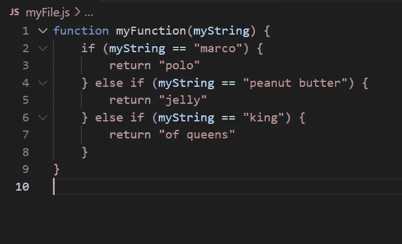

回到主界面

您也可以使用`-b`标志切换到一个不存在的分支。这和先做`git branch myBranch`再做`git checkout myBranch`是一样的。

让我们假设您的一个合作者在您的新特性影响的同一文件和行上添加了一个 commit。我们可以通过进行更改并将其添加到`main` 分支来模拟这种情况:

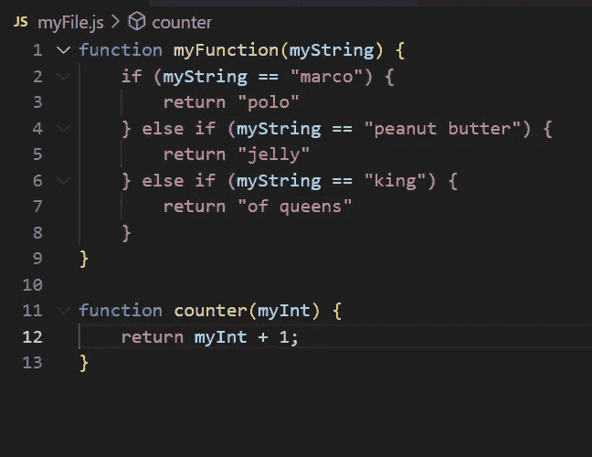

好了，现在我们转回`myNewBranch`。这个分支来自于现在已经过时的版本`main`。我们可以使用`rebase`命令来更新它。

在我们继续之前，我们应该讨论一下`rebase`是如何工作的，因为这是我们讨论过的第一个需要解释的命令。如前所述，当您创建一个新分支时，它作为您当前所在分支的副本开始存在。一旦您向其中任何一个添加了提交，它们就开始出现分歧。如果我们可以在“分支”发生的地方重新定义提交，那会怎么样呢？所以，我们不是从`main`的过时版本分支，而是从最近的提交分支？这正是`rebase`要做的！现在让我们用`git rebase main`来做这件事。

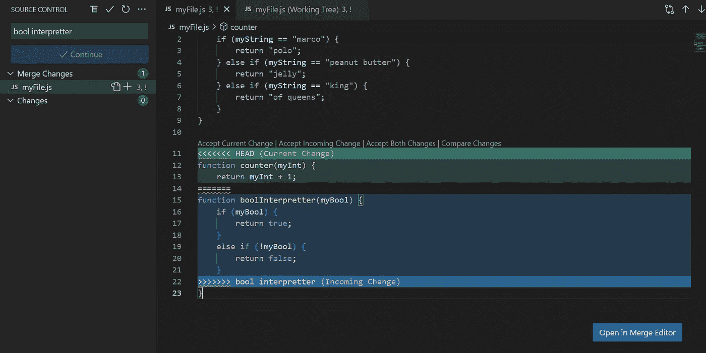

合并冲突！

啊！这里发生了什么？嗯，两个分支都提交了更改同一文件的相同部分的操作。Git 不知道怎么办！**我们需要输入您或您的合作者的变更，或者两者都输入**。我们希望我们的分支拥有这两种功能，所以让我们接受这两种更改。

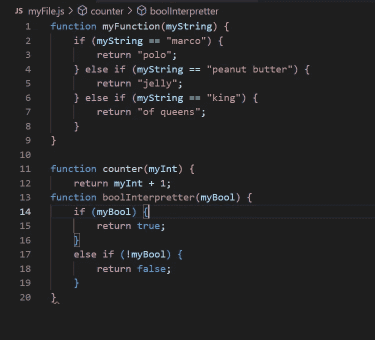

点击“两个都接受”后

这就是我们得到的结果。请注意，它有语法错误。当合并代码时，Git 有时会有点困惑。确保你清理干净，并测试它的工作。

一旦解决了这个问题，用合并冲突暂存你的文件，然后做`git rebase --continue`。冲洗并重复，直到重新碱化结束。

现在我们的分支已经更新了`main`，我们如何合并代码呢？有几种方法。我们将发布到一个远程分支，然后创建一个拉请求。首先，做`git push -u myNewBranch`。然后，在 GitHub 上打开你的 repo，你会看到一个大按钮，上面写着“创建拉取请求”。点击它，并添加一条消息。在那里，您的合作者可以对其进行评论以提出改进建议，并且一旦您有时间与您的同事一起审查它，您可以合并它。搞定了。很简单，对吧？

非常感谢您的阅读！