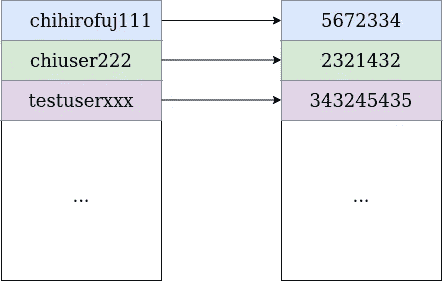

# 为什么你应该写你自己的数据库——从我的电报用户缓存中得到的启示

> 原文：<https://blog.devgenius.io/why-you-should-write-your-own-database-an-insight-from-my-telegram-users-caching-d960ce67bd93?source=collection_archive---------8----------------------->

当我在构建一个涉及 Telegram bot 的授权流时，我在当前的项目中遇到了一个特定的问题:如何将用户昵称映射到聊天 id(因为这是与 bot 进行私人对话所必需的)？嗯，我可以简单地为它创建一个散列表:



到目前为止还不错…但是…如果不是 100 个用户，而是 1000，10000 个呢？RAM 不是无限的。那么如何限制记录数呢？我想到的最佳解决方案是只存储有限的一组最近登录的用户。这就是 LRU 缓存政策开始发挥作用的地方

# **1) LRU 缓存**

它的工作很简单:如果缓存已满，并且您要向其中插入一个条目，那么最早访问的条目将从缓存中删除。当我们访问缓存中的一些现有条目时(除了“删除”操作)，它成为缓存的最新条目:


好的。我用有限的内存解决了这个问题。还有一个问题:永久存储持久性。如果某个老访问者想再次登录该服务怎么办？我可以以某种方式建议他/她/他们再次向电报机器人发送确认，但这有点让他/她/他们恼火。我和这位用户希望有更舒适的方式再次登录网站，即使我们很长时间没有登录。所以是时候更多地考虑缓存策略了…

# 2)我对缓存策略有什么期望？

*   能够永久存储所有对“昵称:聊天 id”；
*   对于最热的条目，具有与基于 RAM 的 LRU 高速缓存相同的性能；
*   如果高速缓存客户端查询高速缓存未命中条目，则它应该被传播到最热的条目；
*   如果高速缓存客户端查询在时间上接近最近查询的条目的一些条目，则应该以接近热条目的性能来访问它；
*   写不如读频繁；
*   对热条目的写入应该具有非常接近原始 LRU 缓存的性能；

有了所有这些属性，我就有了这些缓存层:


*   LRU —代表最热门的访问条目；
*   保留页—代表按时间顺序接近某个最近访问的缓存未命中条目的条目。我期望访问它们的可能性比一些年代久远的项目更大；
*   来自磁盘的页面——即使在按时间顺序最接近的集合中也没有条目时加载该页面；

因此，让我们在初始化代码中反映它们:

```
package microdb

import (
 "fmt"
 "gitlab.com/john-byte/jbyte-lru-cache-microdb-v1.1/types"
 errorsutils "gitlab.com/john-byte/jbyte-lru-cache-microdb-v1.1/utils/errors"
 fileutils "gitlab.com/john-byte/jbyte-lru-cache-microdb-v1.1/utils/file"
 lrucache "gitlab.com/john-byte/jbyte-lru-cache-microdb-v1.1/utils/lru_cache"
 orderedmap "gitlab.com/john-byte/jbyte-lru-cache-microdb-v1.1/utils/ordered_map"
 trie "gitlab.com/john-byte/jbyte-lru-cache-microdb-v1.1/utils/trie"
 "log"
 "path"
 "sync"
)

type TMicroDb struct {
 index           *trie.Trie
 indexLock       *sync.Mutex
 hotCache        *lrucache.LruCache
 reservedPage    *orderedmap.OrderedMap
 writtenPageLock *sync.Mutex
 writtenPage     *orderedmap.OrderedMap
 writtenPageId   uint32
 pageCapacity    uint32
 rootPath        string
}

func New(rootPath string, pageCapacity uint32) *TMicroDb {
 index := trie.New()
 hotCache := lrucache.New(uint64(pageCapacity))
 reservedPage := orderedmap.New()
 writtenPage := orderedmap.New()
 return &TMicroDb{
  index:           &index,
  indexLock:       &sync.Mutex{},
  hotCache:        hotCache,
  reservedPage:    &reservedPage,
  writtenPageLock: &sync.Mutex{},
  writtenPage:     &writtenPage,
  writtenPageId:   0,
  pageCapacity:    pageCapacity,
  rootPath:        rootPath,
 }
}

func readConfig(rootPath string) (*types.TDbConfig, error) {
 configPath := path.Join(rootPath, "index.json")
 configFile, err := fileutils.ReadFileWTimeout(
  configPath,
  6000,
 )
 if err != nil {
  return nil, errorsutils.LogError(
   "MicroDb",
   "readConfig",
   err,
  )
 }
 parsedConfig, err := parseConfig(configFile)
 if err != nil {
  return nil, errorsutils.LogError(
   "MicroDb",
   "readConfig",
   err,
  )
 }

 return parsedConfig, nil
}

func readPage(rootPath string, pageId uint32) (*orderedmap.OrderedMap, error) {
 pagePath := path.Join(
  rootPath,
  fmt.Sprintf("page-%v.dat", pageId),
 )
 pageFile, err := fileutils.ReadFileWTimeout(
  pagePath,
  6000,
 )
 if err != nil {
  return nil, errorsutils.LogError(
   "MicroDb",
   "readHottestPage",
   err,
  )
 }
 parsedPage, err := parsePage(pageFile)
 if err != nil {
  return nil, errorsutils.LogError(
   "MicroDb",
   "readHottestPage",
   err,
  )
 }

 return parsedPage, nil
}

func FromFile(rootPath string) (*TMicroDb, error) {
 config, err := readConfig(rootPath)
 if err != nil {
  return nil, errorsutils.LogError(
   "MicroDb",
   "FromFile",
   err,
  )
 }

 hottestPageId := 1
 if config.WrittenPageId > 1 {
  hottestPageId = int(config.WrittenPageId) - 1
 }
 hottestPage, err := readPage(rootPath, uint32(hottestPageId))
 if err != nil {
  return nil, errorsutils.LogError(
   "MicroDb",
   "FromFile",
   err,
  )
 }

 writtenPage, err := readPage(rootPath, uint32(config.WrittenPageId))
 if err != nil {
  return nil, errorsutils.LogError(
   "MicroDb",
   "FromFile",
   err,
  )
 }

 hotCache := lrucache.FromOrderedMap(
  hottestPage,
  uint64(config.PageCapacity),
 )

 reservedPage := orderedmap.New()

 return &TMicroDb{
  index:           config.Pages,
  indexLock:       &sync.Mutex{},
  hotCache:        hotCache,
  reservedPage:    &reservedPage,
  writtenPageLock: &sync.Mutex{},
  writtenPage:     writtenPage,
  writtenPageId:   config.WrittenPageId,
  pageCapacity:    config.PageCapacity,
  rootPath:        rootPath,
 }, nil
}
```

(如果你对索引和页面使用哪种格式感兴趣:你可以在我的 GitLab 资源库中看到源代码:[https://git lab . com/jbyte 777/jbyte-LRU-cache-microdb-v 1.1/-/blob/master/lib/microdb/utils . go](https://gitlab.com/john-byte/jbyte-lru-cache-microdb-v1.1/-/blob/master/lib/microdb/utils.go))

你可能会注意到一个“奇怪”的东西:“索引”。那么这个奇怪的实体是什么？这听起来并不像火箭科学:这是一个实体，仅仅服务于如何快速定位包含所请求的键的数据块(页面)。我使用了 trie 数据结构，因为电报昵称更容易被人阅读，而不是被机器以其他方式改变的东西。你可以在这里阅读更多关于这个数据结构是如何工作的:[https://en.wikipedia.org/wiki/Trie](https://en.wikipedia.org/wiki/Trie)；

初始化完成。让我们编写代码，使用定义的层从请求的键中读取值:

```
func (self *TMicroDb) Get(key string) (string, error) {
 val, hasInHotCache := self.hotCache.Get(key)
 if hasInHotCache {
  return val.(string), nil
 }

 val, hasInReservedPage := self.reservedPage.Get(key)
 if hasInReservedPage {
  self.putInHotCache(key, val.(string))
  return val.(string), nil
 }

 self.indexLock.Lock()
 rawPageId, hasPage := self.index.Get([]rune(key))
 self.indexLock.Unlock()
 if !hasPage {
  return "", nil
 }
 pageFilePath := path.Join(
  self.rootPath,
  fmt.Sprintf("page-%v.dat", rawPageId.(uint32)),
 )
 pageFile, err := fileutils.ReadFileWTimeout(
  pageFilePath,
  6000,
 )
 if err != nil {
  return "", errorsutils.LogError(
   "MicroDb",
   "Get",
   err,
  )
 }
 reservedPage, err := parsePage(pageFile)
 if err != nil {
  return "", errorsutils.LogError(
   "MicroDb",
   "Get",
   err,
  )
 }
 self.reservedPage = reservedPage
 val, _ = self.reservedPage.Get(key)
 self.putInHotCache(key, val.(string))

 return val.(string), nil
}
```

`self.putInHotCache(key, val)`从保留页面查询后的语句服务于上述第三个属性:

如果缓存客户端查询缓存未命中的条目，则应该将其传播到最热的条目

这个语句只是在每次写请求时调用(记住:“写不如读频繁”):

```
func (self *TMicroDb) Put(key string, val string) {
 self.putInHotCache(key, val)
}
```

让我们将它实现为我设计的缓存的第二个主要流程:

```
func (self *TMicroDb) putInHotCache(key string, val string) {
 self.hotCache.Put(key, val)

 self.indexLock.Lock()
 _, entryInIndex := self.index.Get([]rune(key))
 self.indexLock.Unlock()
 if !entryInIndex {
  currPageId := self.writtenPageId

  self.writtenPageLock.Lock()
  self.writtenPage.Put(key, val)
  currPage := self.writtenPage
  if currPage.Len() == uint64(self.pageCapacity) {
   newPage := orderedmap.New()
   self.writtenPage = &newPage
   self.writtenPageId++
  }
  self.writtenPageLock.Unlock()
  self.flushWrittenPage(key, val, currPageId, currPage)

  self.indexLock.Lock()
  self.index.Put([]rune(key), currPageId)
  self.indexLock.Unlock()
  self.flushIndex(key, currPageId)
 }
}
```

有一点需要注意:“writtenPage”。它用于当前插入的、带有条目的未填充页面。index 知道插入的键是否是这种情况。如果当前写入的页面已满，将会写入新的页面；

以及如何“刷新”修改过的索引和修改过的页面？记住最后一个属性:

“写入热条目的性能应该非常接近原始 LRU 缓存”

所以刷新(写入磁盘)是在单独的 goroutines 上运行的。这就是为什么我在索引和当前编写的页面周围也有一堆锁。让我们把这些有用的例程写在最后:

```
func (self *TMicroDb) flushWrittenPage(
 key string,
 val string,
 currPageId uint32,
 currPage *orderedmap.OrderedMap,
) {
 go func() {
  self.writtenPageLock.Lock()
  defer self.writtenPageLock.Unlock()

  pageFilePath := path.Join(
   self.rootPath,
   fmt.Sprintf("page-%v.dat", currPageId),
  )
  pageBytes := serializePage(currPage)
  err := fileutils.WriteFileWTimeout(
   pageFilePath,
   pageBytes,
   0666,
   6000,
  )
  if err != nil {
   formatedErr := errorsutils.LogError(
    "MicroDb",
    "flushWrittenPage",
    err,
   )
   errStr := fmt.Sprintf(
    "%v",
    formatedErr.Error(),
   )
   log.Println(errStr)
  }
 }()
}

func (self *TMicroDb) flushIndex(key string, currPageId uint32) {
 go func() {
  self.indexLock.Lock()
  defer self.indexLock.Unlock()

  indexFilePath := path.Join(
   self.rootPath,
   "index.json",
  )
  indexBytes, err := serializeConfig(&types.TDbConfig{
   WrittenPageId: currPageId,
   PageCapacity:  self.pageCapacity,
   Pages:         self.index,
  })
  if err != nil {
   goto errorPoint
  }

  err = fileutils.WriteFileWTimeout(
   indexFilePath,
   indexBytes,
   0666,
   6000,
  )
  if err != nil {
   goto errorPoint
  } else {
   return
  }

 errorPoint:
  {
   formatedErr := errorsutils.LogError(
    "MicroDb",
    "flushIndex",
    err,
   )
   errStr := fmt.Sprintf(
    "%v",
    formatedErr.Error(),
   )
   log.Println(errStr)
  }
 }()
}
```

这就是微型数据库的主要功能。让我来回答文章最初的问题:“为什么您应该编写自己的数据库？”。嗯，有流行的通用解决方案，如 SQL 数据库、MongoDB、Redis 等。但是我的缓存数据:

1.  在 SQL 数据库为这种情况提供通用解决方案的情况下，不太依赖关系；
2.  不是关于在 MongoDB/Redis 提供解决方案的情况下灵活地对象结构化文档流；
3.  已经基于 LRU 热缓存策略；
4.  只是“key:val”字符串对的集合；

我主要是寻找解决方案。如果某样东西更适合高抽象层次，我很可能会使用它。

这里是我开发的迷你数据库的源代码:[https://gitlab.com/jbyte777/jbyte-lru-cache-microdb-v1.1](https://gitlab.com/john-byte/jbyte-lru-cache-microdb-v1.1)

*请随意留下您的经验建议等。我感谢任何有益的反馈；)*

*我的 git lab:*[*https://gitlab.com/jbyte*](https://gitlab.com/john-byte)*777*