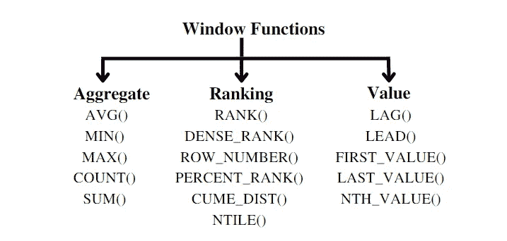
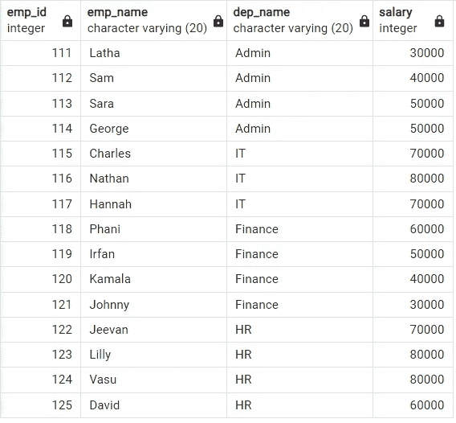
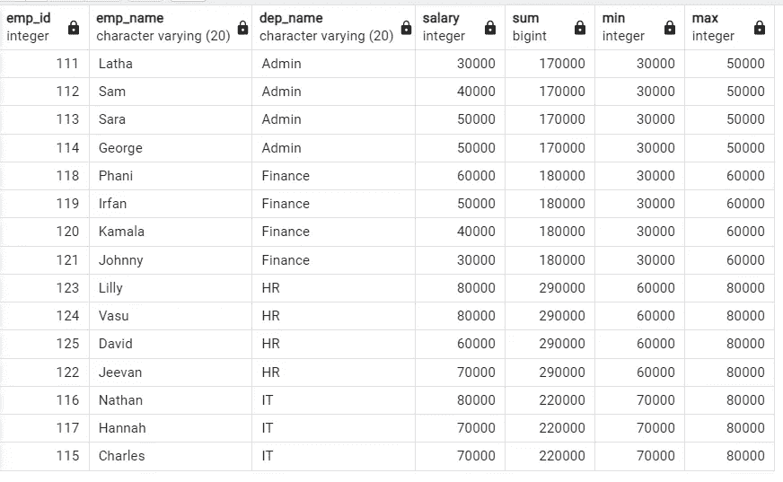
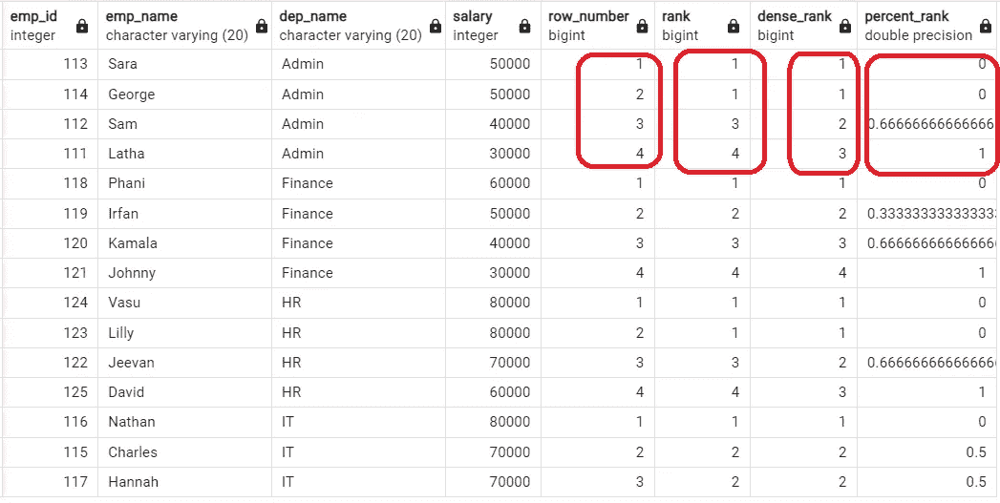
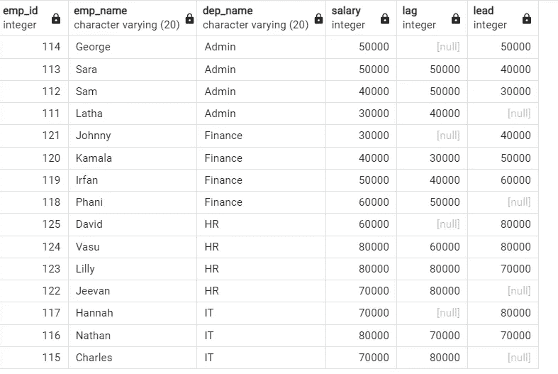

# POSTGRESQL 中的窗口函数

> 原文：<https://blog.devgenius.io/window-functions-in-postgresql-ff192d0d249a?source=collection_archive---------16----------------------->

窗口函数对一组与当前行有某种关系的表行执行计算。这些也称为分析函数，类似于对集合中的所有表格行执行分析函数的计算。窗口函数对其进行操作的一组行称为窗口。

聚合函数在聚合一组行中的数据后返回一行。而对一组行进行操作的窗口函数不会减少查询返回的行数。

窗口函数的语法:

窗口功能分为三种不同的类别:

用 OVER 子句调用常规聚合函数时，它充当窗口函数。行保留它们的标识，并且还显示每一行的聚合值。排名窗口函数将对指定字段的值进行排名，并根据其排名对其进行分类。而值窗口函数将窗口内的值从其他行复制到其他行。

# 窗口功能的用例

窗口函数通过提供对更复杂的 SQL 概念的替代，提高了效率并降低了分析数据集分区(窗口)的查询的复杂性。

。排名函数最常见的用途是根据某个值查找前(N)条记录。例如，前 10 名收入最高的员工、前 10 名排名靠前的学生、前 50 名最大订单等。

*   从特定窗口内的另一行访问结果(例如，在分区内显示与最高工资相关联的值，显示前一行的销售额，等等)。)
*   特定窗口内的汇总(例如，销售总额、运行销售总额、运行销售平均值等。)

以下是 postgress 中的窗口函数:

**累计距离**:

该函数返回一组值中某个值的累积分布。换句话说，用于查询作为一组给定值中的值的相对位置。

有时，您可能希望创建一个报表来显示数据集中前或后的 x%值，例如，按收入排列的前 1%的产品。

这将返回一个≥ 0 且≤ 1 的双精度值。

**Row_Number:** 该函数为每个分区中的每一行分配一个序列号。

**Rank:** 该函数在有序分区内分配等级。该函数为具有相同值的行分配相同的等级，跳过下一个等级。

**Dense_Rank** :该函数为有序分区中的每一行分配一个等级，相同的等级被分配给多行，并且不跳过任何等级。

**Percent_Rank** :该函数类似于 cume_dist()函数。Percent_rank()函数计算一个值在一组值中的相对位置。

0 < PERCENT_RANK() <= 1

**First_Value:** 该函数返回结果集的排序分区中的第一行或第一个值。

**Lag:** 返回在分区内当前行之前的指定物理偏移行处评估的值。

**Last_Value :** 返回对其分区内的最后一行进行评估的值。

**Lead :** 返回在分区内当前行之后偏移行的行上计算的值。

**NTile:** 尽可能均等地划分分区中的行，并为每一行分配一个从 1 到参数值的整数。

帮助您确定给定行属于哪个百分点(或四分位数，或任何其他细分)。

**第 n 个值:**返回针对有序分区中的第 n 行计算的值。

我们讨论上面的几个函数如下。我们使用下面的雇员表作为示例表来描述。

**聚合函数:**

我们将看到几个带有 employees 表的聚合函数示例:

输出是:

行保留它们的标识，并且还显示每一行的聚合值。在上面的示例中，它汇总了每个部门的数据，并在新列中分别显示了标记为 sum 的每个部门的总计、标记为 max 的每个部门的最大薪金值和标记为 min 的每个部门的最小薪金值。

**排名功能:**

现在我们将通过示例来了解最常用的排名函数 Row_number、Rank、dense_rank 之间的区别。

输出是:

因此，我们可以看到，正如 ROW_NUMBER()的定义中所提到的，行号是每个分区中的连续整数。此外，我们可以看到秩和密集秩之间的差异，在密集秩中，如果两行具有相同的秩值，则跳过一个秩，而在重复秩后，DENSE_RANK()值中没有跳过任何秩。

**价值函数:**

我们将看到带有雇员表的几个值函数示例:

输出是:

LAG 函数允许访问同一结果集中前一行的数据，而 LEAD 函数允许访问同一结果中下一行的数据，而无需使用任何 SQL 连接。您可以在上面的示例中看到，使用 LAG，LEAD 函数来检查当前员工的工资是低于还是高于上一个员工。

## 结论

PostgreSQL 窗口函数用于比较对比数据，它是 PostgreSQL 中分析和各种用例的关键。Windows 函数是聚合函数(SUM()、COUNT()、MIN()等。)、排名函数(ROW_NUMBER()、RANK()和 DENSE_RANK()等。)和值函数(LEAD()和 LAG()等)。)返回表中的每一行而不是单个行输出，并用于比较当前行之间的值以及与表中所有值的当前行相关的值。