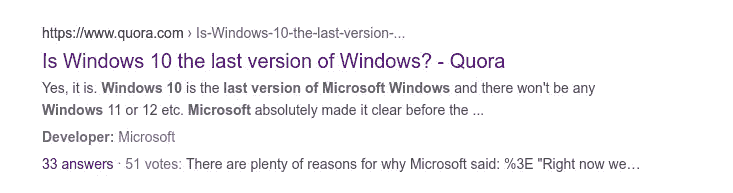
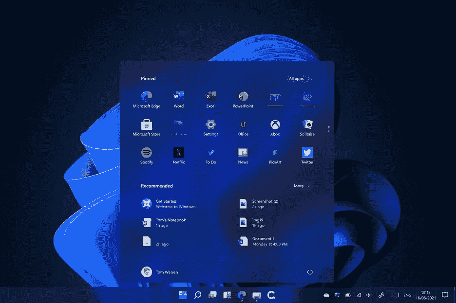

# Windows 11:Windows 10 不是 Windows 的最后一个版本吗？

> 原文：<https://blog.devgenius.io/windows-11-isnt-windows-10-the-last-version-of-windows-93ff21fa0d32?source=collection_archive---------5----------------------->

前不久 Windows 11 被泄露，随后被微软公布。有些人很兴奋，有些人不在乎，但我个人非常困惑。

我之所以感到困惑，是因为我记得当我的谷歌新闻被标题为“Windows 10 将是 Windows 的最后一个版本”的新闻文章轰炸时。

那是 2015 年，Windows 10 还没有发布的时候。在很短的一段时间里，每个人都在谈论这件事。Reddit、Twitter、脸书都有很多分享它的帖子。

写 Windows10 是 Windows 的最后一个版本的新闻网站基于微软高级软件工程师 Jerry Nixon 的声明。

该声明是在[微软 2015](https://channel9.msdn.com/Events/Ignite/2015/BRK2352)Ignite 活动期间说的。这是引发所有混乱的引语(15 分 32 秒)。

> “现在我们正在发布 Windows 10，因为 Windows 10 是 Windows 的最后一个版本，我们都还在开发 Windows 10”——杰里·尼克松

你可以看到为什么很多记者和 YouTubers 都搞错了，这个引用非常模糊。他说的上一个版本是什么意思？是上次还是现在的上次？或者这是一个错误，他的意思是最新的。

Quora 上的很多热门回答也是这么认为的

现在[微软表示将在 2025 年](https://www.bbc.com/news/technology-57443598)退役 Windows 10，很明显 Windows 10 并不是“最后”版本。而无论是微软改变了他们的想法，还是声明错了，现在都没多大关系了。

此外，我做了一些研究，似乎**微软从未“正式”**提到 Windows 10 将是 Windows 的最新版本。

# **视窗 11**

Windows 11 菜单

我之所以说没多大关系(除非你不喜欢 Windows 11 的外观)，是因为这个新版本看起来像 Windows 10，上面有一个不同的皮肤。

就我个人而言，我讨厌 Windows 10 的外观和菜单，这是我换成 Linux 的最大原因之一。这个新版本的外观在我看来好多了，它更简单，更干净。

现在，我不是 Windows 作为一个操作系统如何工作的专家，但我相信这种改变可以在不需要新版本的情况下完成。同样，我可能是错的，但没有足够的功能值得升级。

看视频，看[微软官方网站 Windows 11](https://www.microsoft.com/en-us/windows/windows-11) 提到的功能，感觉这更像是 Windows 10+而不是 Windows 11。

但我不能为此责怪微软，因为这是一个更好的营销举措。当有新版本的视窗操作系统时，很多人都很兴奋。只要升级过程简单，新的外观和感觉对普通用户来说已经足够了。