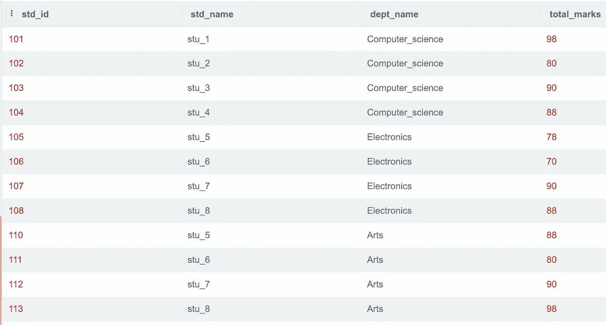
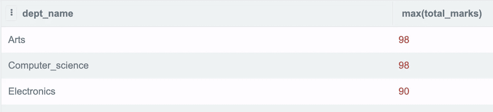
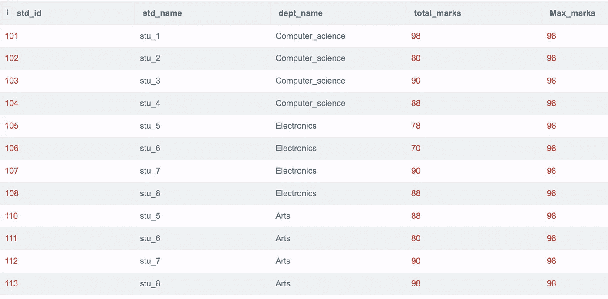
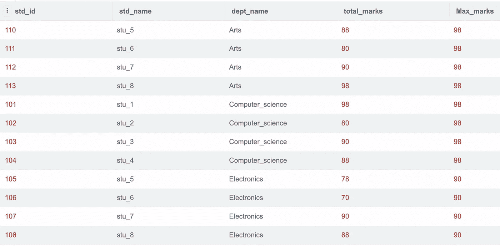
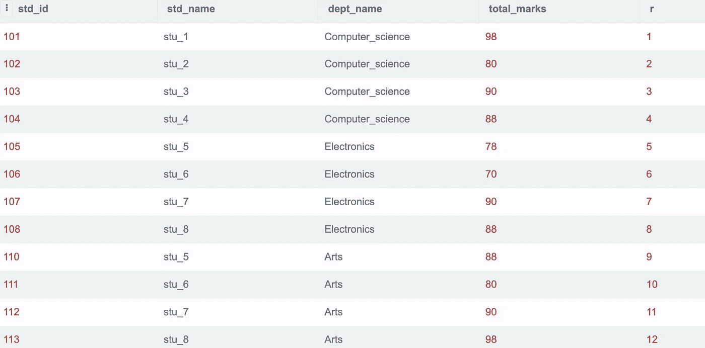
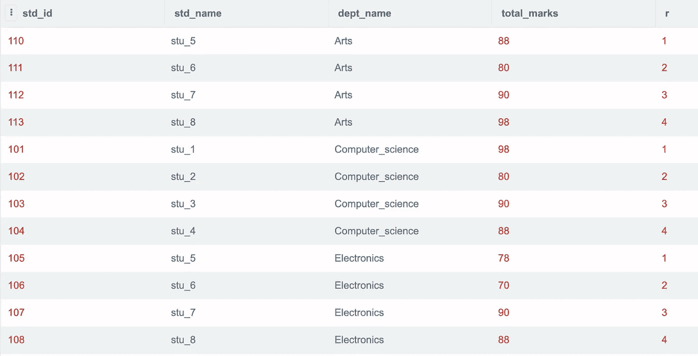

# SQL 中的 Windows 函数-第 1 部分:

> 原文：<https://blog.devgenius.io/windows-function-in-sql-part1-5dd072728a47?source=collection_archive---------5----------------------->

**概要:**

基于来自 [Postgres](https://www.postgresql.org/docs/9.1/tutorial-window.html) 的官方定义，窗口函数的定义是:

窗口函数是一个聚合函数，它对与当前行相关的一组行执行计算，同时保留单个行。

通常，窗口函数是用最少的代码聚集和显示全部信息的实用方法。窗口函数比使用子查询或复杂的物化表结构更容易。

仅供参考:代码可以在许多在线编辑器上执行。我用过 https://sqliteonline.com/的

**创建表格的语法:**

创建表 student_table(

std_id 整数不为空，

std_name 文本不为空，

dept_name 文本不为空，

total_marks 整数不为空，

std_year 整数不为空

);

**插入样本数据的语法:**

插入 student_table 值(101，' stu_1 '，' computer_science '，90，2015)；

可以根据需要插入任意多的行。

考虑一个名为“student_table”的表，该表包含列 std_id、std_name、dept_name 和 total_marks。student_table 中的数据可以使用以下方式显示:

Select * from student_table

**Max():**

MAX()函数返回选定列的最大值。学生获得的最高分数可通过以下方式获取:

**查询:**

从 student_table 中选择 max(total_marks)

**o/p:** 98

每个系学生的最高分数可通过以下方式获取:

**查询:**

select dept_name，max(total _ marks)From student _ table

组

按部门名称

o/p:

使用窗口功能可以显示每个系学生的最高分数以及学生的其他详细信息。

**over() :**

Over 函数用于指定创建记录窗口所需的 SQL。Over 函数从以上 12 行中查找每行的最大总分数，并在整个窗口中显示。

在上面的输出中，如果必须指定每个部门的总分数，那么可以在 partition 子句中指定 dept_name

**查询:**

选择 s.*，

max(total_marks)超过()作为 Max_marks

从 student_table 作为 s；

**o/p:**

在上面的查询中，当 over()函数与 max()一起指定时，SQL 将 max 视为 windows 函数，而不是聚合函数。

**Partition_by() :**

Partition_by()用于将结果集划分为多个分区，并对每个分区数据子集执行计算。

**查询:**

选择 s.*，

Max(total _ marks)over(partition by dept _ name)作为 Max_marks

from student _ table as s；

o/p:

当 partition by 子句中提到 dept_name 时，对于部门中存在的每个不同值，max_value 都显示在每一行中。在这里，计算机科学系学生的最大值是 98，电子系是 98，艺术系是 90。因此，显示了每个部门的 max_marks。

**Row_number ():**

Row_number 用于为表中的每条记录分配一个唯一的值

**查询:**

选择 s.*，

row_number() over() as r

from student _ table as s；

**o/p:**

总共有 12 行，当使用 row_number 函数时，会为每一行分配一个唯一的值。

对于系里的每个学生，使用 row_number()函数分配一个唯一的行号，因为系被添加到 partition by 子句并按 std_id 排序。

**查询:**

选择 s.*，

row _ number()over(partition by dept _ name order by STD _ id)作为 r

from student _ table as s；

**o/p:**

结论:

SQL 窗口函数是类似于聚合函数的计算函数，但与“group by”等普通聚合函数不同，它可以访问单个行，甚至可以将它们的一些属性添加到结果集中。