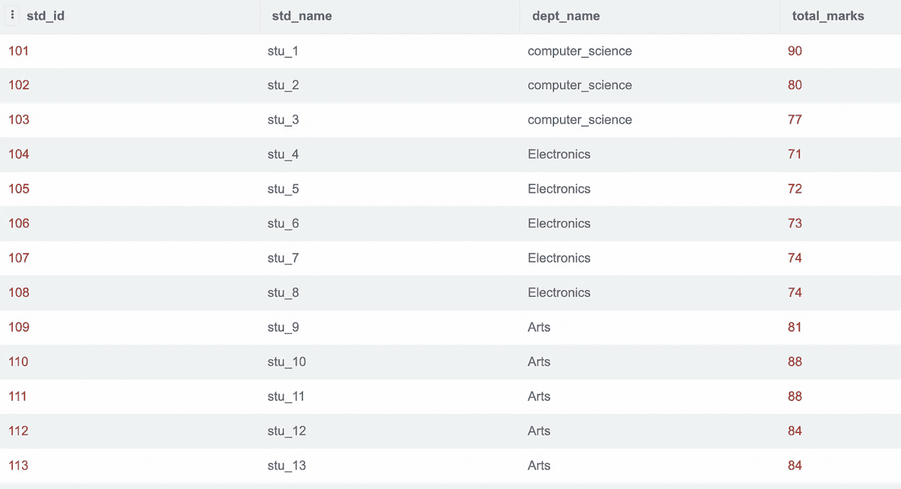
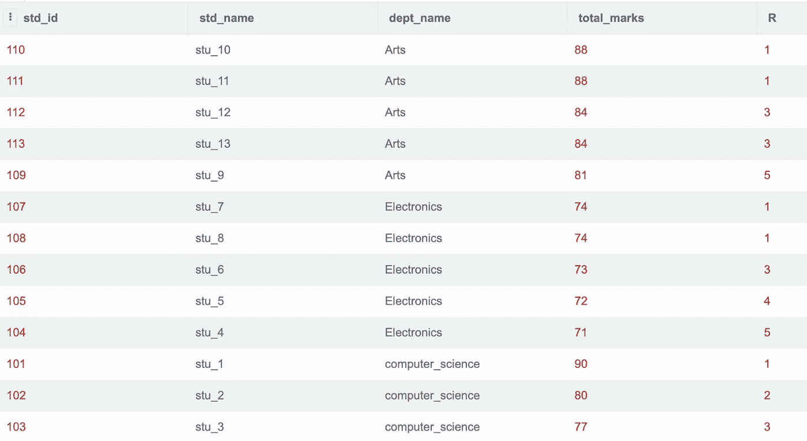
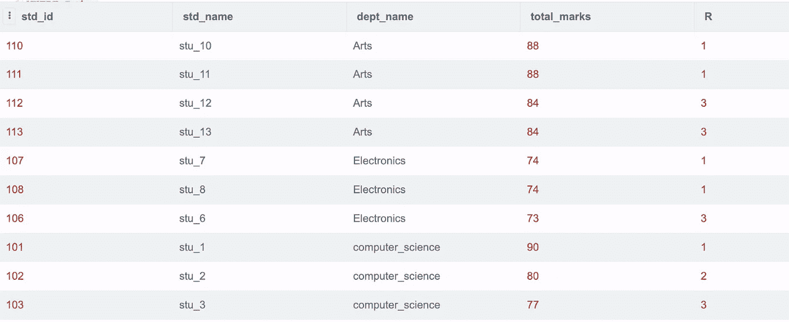
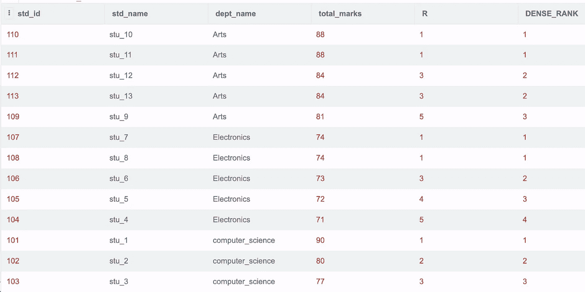
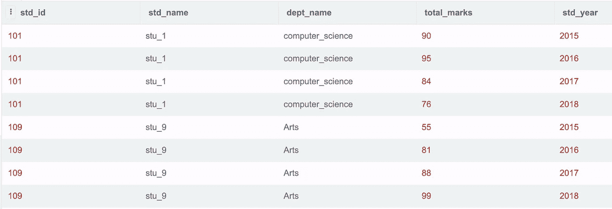
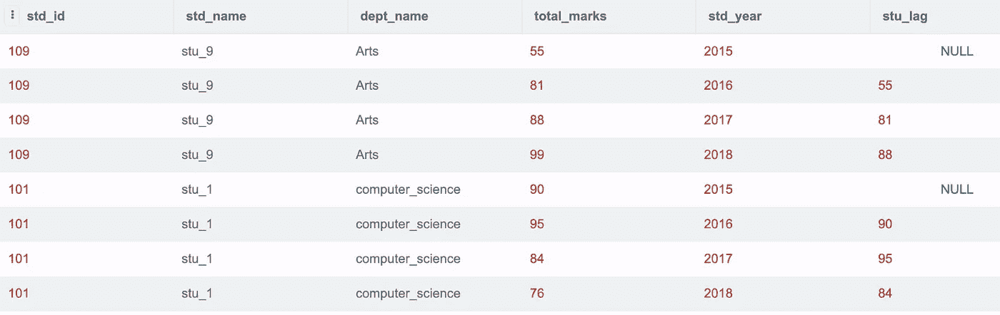

# SQL 中的 Windows 函数-第 2 部分:

> 原文：<https://blog.devgenius.io/windows-function-in-sql-part2-a9cd99562eaa?source=collection_archive---------8----------------------->

**概要:**

窗口函数是一个聚合函数，它对与当前行相关的一组行执行计算，同时保留单个行。

通常，窗口函数是用最少的代码聚集和显示全部信息的实用方法。窗口函数比使用子查询或复杂的物化表结构更容易。

仅供参考:代码可以在许多在线编辑器上执行。我用过 https://sqliteonline.com/[的](https://sqliteonline.com/)

**创建表格的语法:**

创建表 student_table(

std_id 整数不为空，

std_name 文本不为空，

dept_name 文本不为空，

total_marks 整数不为空，

std_year 整数不为空

);

**插入样本数据的语法:**

插入 student_table 值(101，' stu_1 '，' computer_science '，90，2015)；

可以根据需要插入任意多的行。

考虑一个名为“student_table”的表，该表包含列 std_id、std_name、dept_name 和 total_marks。student_table 中的数据可以使用以下方式显示:

Select * from student_table

**RANK ()**

RANK()函数是一个窗口函数，可在 SQL Server 中用于计算结果集的分区内每一行的排名。相同的等级被分配给分区中具有相同值的行。第一行的等级是 1

可以使用 Rank()函数(这是一个 windows 函数)根据学生的总分数对系里的每个学生进行排名。根据分数，我们会给每个系的每个学生分配一个等级。

**查询:**

选择 s.*，

将(按部门名称划分，按总分数排序，desc)排名()为 R

from student _ table as s；

在上面的例子中，系里的两个学生有相同的总分数，因此将为他们分配相同的等级，对于每个重复的值，等级函数将跳过下一个值。在艺术系 stu_10，stu_11 得了 88 分，因此他们两个都被指定为排名第一，然后排名第二被跳过。

在同一个部门 stu_12 和 stu_13 得到了相同的 84 分，因此将等级 3 分配给他们两个，然后跳过下一个等级。

使用 Rank()函数可以获得每个系中基于最高分数的前 3 名学生。

**查询:**

select t.* from(

选择 s.*，

将(按部门名称划分，按总分数排序，desc)排名()为 R

从 student_table 作为 s ) t

其中 R <4 ;

o/p:

in the above example students who have rank less than 4 or the top 3 students who have got the max total marks are displayed.

**DENSE_RANK():**

DENSE_RANK()是一个窗口函数，它为结果集分区内的每一行分配一个等级。与 RANK()函数不同，DENSE_RANK()函数返回连续的等级值。如果每个分区中的行具有相同的值，它们将获得相同的等级。

在上面的示例中，如果两个人具有相同的等级 1，则跳过等级 2，然后正在分配等级 3，如果必须在不跳过的情况下分配等级 2，则可以使用 dense_rank()。

**查询:**

选择 s.*，

RANK()over(partition by dept _ name order by total _ marks desc)为 R，

DENSE_RANK()over(partition by dept _ name order by total _ marks desc)作为 DENSE _ RANK

从 student_table 作为

**滞后()**

我们使用 Lag()函数根据定义的偏移值访问前面的行数据。这是一个窗口函数。大多数组织使用或比较同比增长。rank()函数可以用来做这件事。

使用 Lag()函数可以将学生的成绩与去年进行比较。该查询将获取前一年的分数，然后将它们插入同一行。

第一行没有任何先前的值，因此插入 null。使用 Lag()函数有助于避免报告层的复杂计算。

**查询:**

选择*，

作为 stu_lag 的滞后(total_marks)超过(按部门名称分类，按标准年份、标准标识 desc 排序)

来自学生 _ 表

**o/p:**

**结论:**

SQL 窗口函数是类似于聚合函数的计算函数，但与“group by”等普通聚合函数不同，它可以访问单个行，甚至可以将它们的一些属性添加到结果集中。