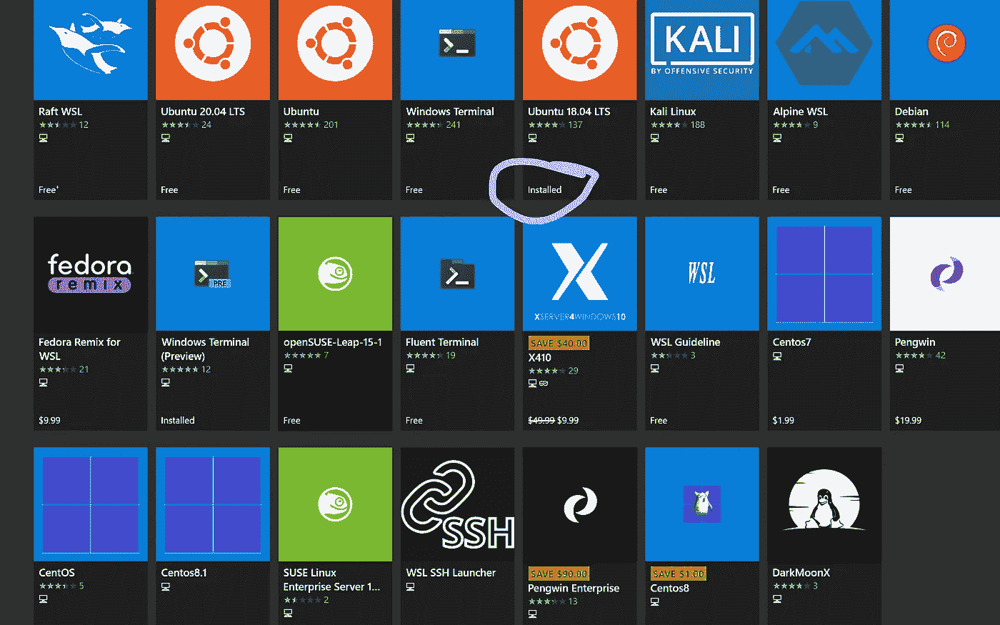
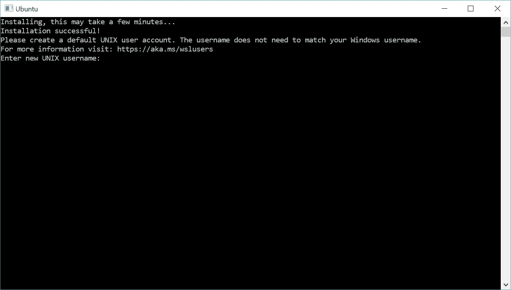

# 用于 Linux 的 Windows 子系统

> 原文：<https://blog.devgenius.io/windows-subsystem-for-linux-b0b8903505da?source=collection_archive---------13----------------------->

## 权威指南

## 为什么作为程序员应该使用 Linux，以及如何通过同时使用 windows 来做到这一点。


照片由[安朵斯·瓦斯](https://unsplash.com/@wasdrew?utm_source=medium&utm_medium=referral)在 [Unsplash](https://unsplash.com?utm_source=medium&utm_medium=referral)

在我们的生活中，我们都至少听过一次这样的话:我们应该使用 Linux 而不是其他任何操作系统来编程。你应该使用 Linux 而不是像 Windows 或 macOS 这样的专有操作系统的原因有很多，但是有一些原因使得开发者倾向于走另一条路。有经验的开发人员都知道，Windows 对于 web 开发来说并不是最友好的操作系统(老实说，它对于前端工作很有用)。

在本文中，我们将讨论如果您是 Windows power 用户，您将如何从这两个世界中获益。我们将讨论 Linux 的 Windows 子系统(WSL ),它是什么以及为什么应该使用它。然后我们将经历如何安装它的过程。

# 什么和为什么

Linux 的 Windows 子系统允许开发人员直接在 Windows 上运行 GNU/Linux 环境，包括大多数命令行工具、实用程序和应用程序，无需修改，也无需使用任何虚拟化软件，如 VMware 或 VirtualBox。截至目前，以下 Linux 发行版在 windows store 上可用。



你可以看到我已经安装了 Ubuntu 18.04。还有更好的消息给你。WSL 2 最近与 5 月发布的 Windows 10 2004 版本一起发布。它支持 Linux 的 Windows 子系统在 Windows 上运行 ELF64 Linux 二进制文件。它的主要目标是**提高文件系统性能**，以及添加**全系统调用兼容性**。

这种新的架构改变了这些 Linux 二进制文件与 Windows 和计算机硬件的交互方式，但仍然提供了与 WSL 1(当前广泛使用的版本)相同的用户体验。

关于 WSL 是什么已经说得够多了。现在来说说为什么要用。首当其冲的就是每次更新后的破窗。其次，与其他操作系统相比，Linux 给了开发者更多的工作自由。此外，Linux 支持几乎所有的主流编程语言( *Python、Golang、JavaScript、C/C++、Java、Perl、Ruby 等)..).此外，它还提供了大量对编程有用的应用程序。我最喜欢的是 bash shell，当然还有 Vim。你可以在这个写得很好的自由/开源软件博客中找到更多使用 Linux 而不是 Windows 的好处。*

# 入门指南

## 1.首先从管理员 PowerShell 启用可选功能。

打开 Powershell，或者如果你像我一样使用 Git Bash，用管理员权限打开终端，复制如下所示的文本。

```
Enable-WindowsOptionalFeature -Online -FeatureName Microsoft-Windows-Subsystem-Linux
```

这将提示您重新启动计算机。你可以为接下来的步骤做些拉面。(如果你知道你知道)

## 2.预先安装您选择的代码编辑器或 IDE。

在本文中，我将假设读者和我一样使用 VScode。当您安装 WSL 时，它将使用您的 Windows 的路径环境。因此，如果您在安装 WSL 之前忘记或未能安装您的 IDE，您将无法在 WSL 中使用该代码编辑器或 IDE，除非您经历一些棘手的 Linux 步骤。

## 3.打开你的 windows 商店，下载你选择的 Linux 发行版。

我们会用 Ubuntu 18.04。你现在必须初始化 Ubuntu。按照要求去做，你的 Ubuntu 发行版马上就可以使用了。



设置您的帐户。

# 设置您的开发环境。

## 1.决定是否要使用您的 Linux 作为 VScode 的默认终端。

如果您想在 VS 代码中使用 Linux 作为默认终端，请搜索“integrated.shell”的设置，并用以下代码替换该行:

```
“terminal.integrated.shell.windows”: “C:\\WINDOWS\\System32\\wsl.exe”
```

如果你想像我一样在我做后端编程时偶尔使用它，你可以通过在 WSL 中打开 VS 代码来实现。为此，请打开您的 WSL 并输入

```
code .
```

您的 VS 代码将会打开，一个名为 Remote-WSL 的扩展将会安装，这将允许您用 VS 代码编写您的程序，并将它们保存在您的 Linux 环境中。

## 2.链接您的工作区文件夹。

我建议您链接您的工作区文件夹，这样您只需一步就可以跳转到该目录。

请遵循以下步骤，并小心操作:

I)通过输入以下命令，打开您的 WSL 并移动到您的主目录

```
cd
```

ii)现在在您的主目录中创建一个到您的工作区目录的链接。例如，我的工作区目录在“D”驱动器中，因此链接过程如下所示。

```
ln -s /mnt/d/go_workspace
```

是的，你猜对了，我是地鼠。

iii)检查它是否工作。如果没有，请检查您是否输入了正确的地址，并重复第二步。

# 对于那些已经在使用 WSL 并想将其升级到 WSL2 的人

你们中的一些人已经在使用 wsl1 了，想把版本升级到 wsl2，那么就按照这个步骤来做。

首先，从[这里](https://docs.microsoft.com/en-us/windows/wsl/wsl2-kernel)下载 Linux 内核更新包。然后，在安装了内核之后，执行下面的步骤。

要将发行版指向 WSL2，需要在同一个 CLI 中执行以下命令:
`wsl --set-version Ubuntu-18.04 2`

这可以通过再次执行`wsl -l -v`来确认。

## 特别感谢 [Patrick_B](https://medium.com/u/77cf44f0fb6a?source=post_page-----b0b8903505da--------------------------------) 在回复中提到这一点。

# 下一步？

安装 Linux 并与 Windows 一起使用是一个很好的利用特性。如果你之前不知道如何在 Linux 环境下工作，我强烈建议你在 WSL 中安装 Ubuntu，并在 O'Reilly 上完成由 Jason Cannon 教授的课程。奥赖利给你 10 天免费试用，不需要任何信用卡，所以最好利用它。

另外，请注意，这是我个人对在 Windows 上使用 Linux 的看法，所以对这篇文章要有所保留。