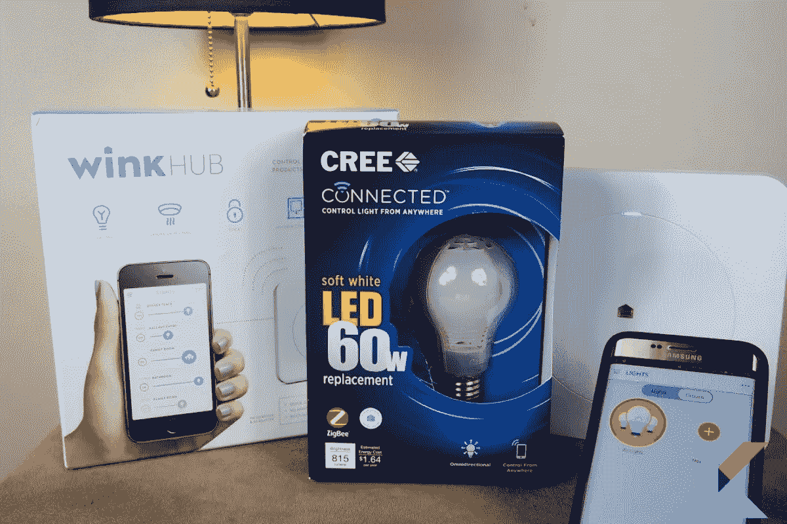
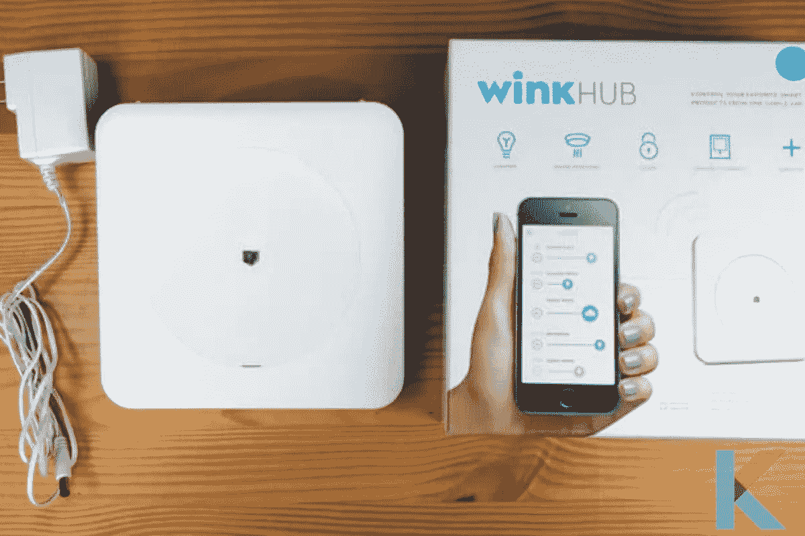
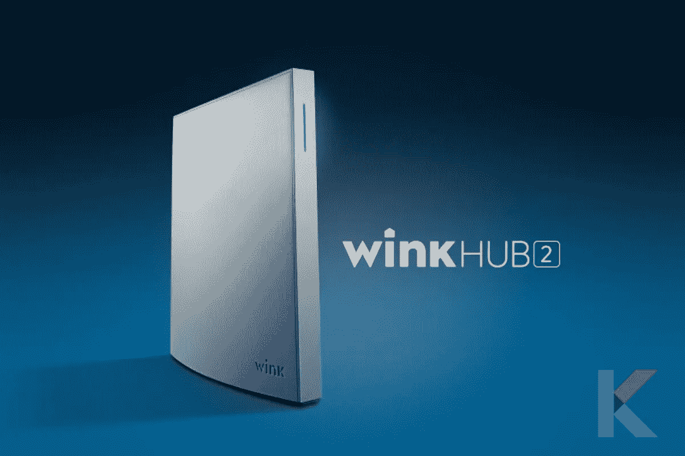
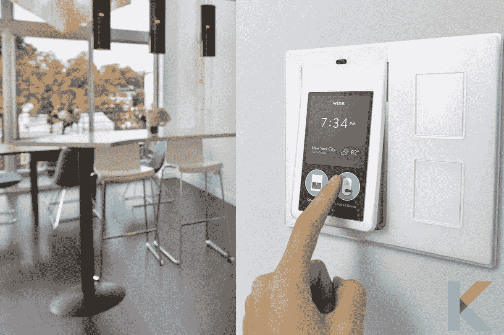
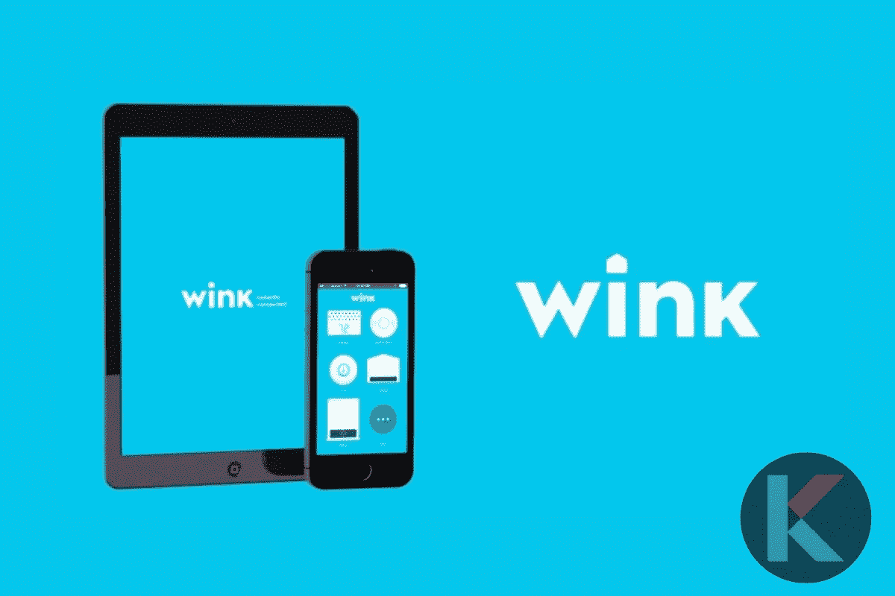
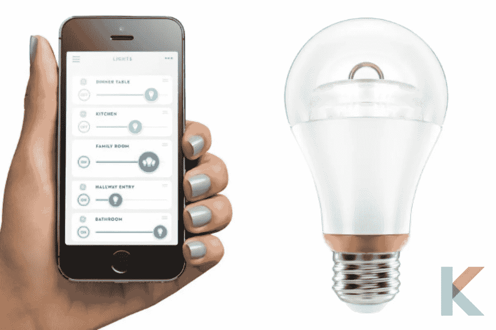
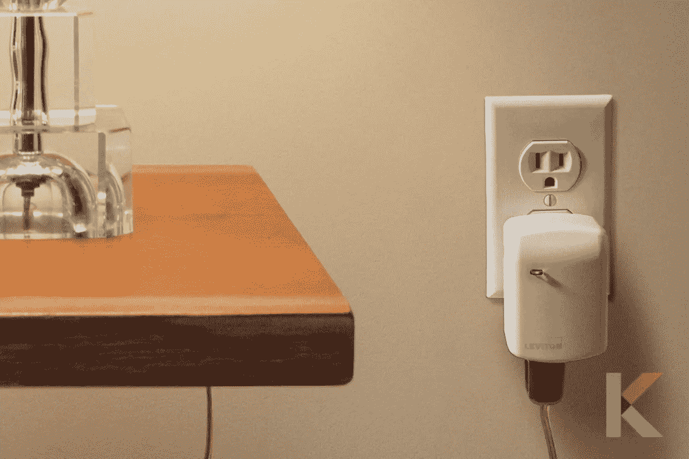
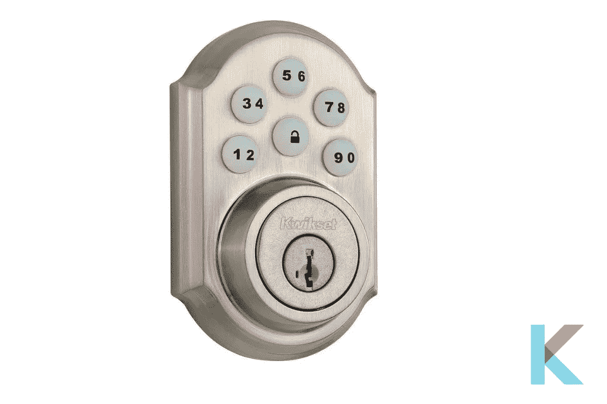

# Wink 智能家居解决方案—您需要知道的一切

> 原文：<https://blog.devgenius.io/wink-smart-home-solution-all-you-need-to-know-ca5c61395ef8?source=collection_archive---------10----------------------->

如果你对[家庭自动化](https://kodmy.com/smart-home-technology/)不熟悉，Wink 智能家居系统是你开始的绝佳选择。有了能满足你特定需求的 Wink 智能家居解决方案，你就能让你的家变得智能。

# Wink 到底是什么？

Wink 是一种简单方便的与家人沟通的方式，Wink 应用程序还可以将您与数十个顶级品牌的数百个智能灯、锁、相机、恒温器和其他设备连接起来，让您可以在任何地方访问它们。

与此同时，有很多 Wink 兼容平台，如 iOS，Apple Watch，Android 和 Android Wear，都可以用来控制物品。此外，它与 [Alexa](https://kodmy.com/alexa-smart-home-devices/) 和 IFTTT(如果这那么那)技术兼容。

最后最好的品牌和 Wink 结合，智能家居品牌数不胜数。雀巢、[、飞利浦](https://kodmy.com/about-philips-hue/)、霍尼韦尔等品牌都在其中。然而，他们并不总是能够相互联系或互动。

另一方面，唯一的缺点是 Wink 组无法转移到 Echo 上的 Alexa 应用程序，所以如果你在 Wink 中设置了一组灯光，你必须在 Alexa 中重新创建这些组。

# Wink 智能家居解决方案

Wink 提供通过单一用户界面连接和控制智能家居设备的硬件和软件。该公司提供 DIY 家庭自动化系统和产品，如 Wink Hub、Wink 移动应用程序、Wink Relay 以及许多其他 Wink 和 [Wink 认证产品](https://kodmy.com/wink-smart-home-solution/)作为他们的 Wink 家庭自动化解决方案。

# 什么是 Wink Hub？

**Wink Hub** 作为系统的中央硬件控制器，通过互联网链接或 Wi-Fi 连接连接到 iOS 和 Android 移动设备。是的。你不需要有线互联网连接来使用这款 Wink 家庭自动化产品，它包括智能锁和本地监控灯光的能力。此外，您需要的只是一个连接到智能家居中枢的 Wi-Fi 链接来为这些小工具供电。

此外，Wink Hub 与 ZigBee、Z-Wave、Wi-Fi 和蓝牙等家庭控制系统兼容。由于不支持蓝牙或 Z-Wave，当与眨眼集线器配对时，眨眼继电器表现最佳。

Wink HUB 将您的所有智能设备连接到您的无线网络，允许您监控它们以及它们如何通过您的智能手机或语音命令相互交互。

Wink app 兼容产品需要 Wink HUB 连接到 Wink App。此外，Wink HUB 使他们能够以相同的无线语言进行通信，允许您直接从 Wink 应用程序监控和定制他们的交互。此外，Wink 应用程序可以从苹果应用商店或谷歌 Play 下载。你只需要一个电子邮件地址就可以开始了。

然而，没有合同或定期付款，在任何时候，你都可以寻求帮助的人。最后，通过下载将你的 HUB 链接到 Wink 应用程序，Wink HUB 在几秒钟内就可以连接。

# 什么是 Wink Hub 2？

**Wink Hub 2** 是 Wink Hub 的第二代产品，它比第一代 Hub 拥有更多的功能。该集线器 2 具有蓝牙功能和比 Wink hub 1 更高存储容量，而且它具有以太网端口和双频带 Wi-Fi 兼容性。

此外，Hub 2 的高级功能包括支持更多无线硬件的能力，使其与更广泛的智能家居设备兼容，并且它也经过了修改。此外，它还包括更友好的用户界面和更灵活的网络选项。

IFTTT 是 Wink 上的一项新功能，它允许小工具触发建筑物中其他小工具的动作。例如，如果你家的烟雾报警器响起，Wink 会向你发送短信或电子邮件。

# 什么是眨眼接力？

**Wink Relay** 是 Wink 提供的一款 DIY 家庭自动化控制器。这款家庭自动化产品是一款高质量的触摸屏，能够在不使用智能手机的情况下控制您的 Wink 智能家居系统。此外，闪烁继电器带有一个集成的对讲机，可以用来取代传统的灯开关。

然而，这个家庭自动化系统的一个突出特点是，它可以连接到 Fitbit 设备，以帮助您监控您的日常健身目标。它也可以连接到优步进行乘车预订。它有两个内置开关，可用作智能按钮或物理轻负载。还使用了温度和湿度传感器。

# 什么是 Wink 智能手机 App？

**如果你有合适的外设，Wink 智能手机应用**很容易使用。这个软件有能力建立时间表和机器人来监控锁、恒温器和灯。当机器感知到特定的刺激时，机器人指的是能够执行基本任务的程序。

例如，当烟雾报警器响起时，这些机器人可以告诉 Wink 打开家庭自动化系统中的灯。您还可以使用 Wink 应用程序创建快捷方式，只需轻按一下即可打开灯。

此外，现在有几种智能家居解决方案。一个很好的选择是使用 Wink 应用程序从智能手机访问 Wink Hub。它适用于多种产品，并允许您以多种方式控制您的 Wink 产品及其功能。

Wink Hub 随时可用，可以监控您家中的各种功能，包括温度、照明、门锁、车库门功能、喷水系统、窗帘等。

通过 Wink hub，你可以用手机控制所有的智能设备，对多个设备进行编程以响应单个命令，并设置 IFTTT 响应，这样你的家人就知道接下来该做什么了。

你不再需要为每种产品开发单独的应用程序，因为它们都通过一个应用程序连接在一起。此外，您可以通过简单的控制来跟踪和处理家中的任何事情。

# 支持传情动漫的设备

Wink 现在支持超过 400 万台联网设备。此外，wink 的使命一直是确保所有集线器和连接的设备高效工作，最大限度地减少停机时间或中断。他们将在未来专注于新的集成、特性和功能。以下设备现在与您的 Wink 集线器兼容。

*   照明:

GE Link 连接的 LED 灯泡

连接 Cree LED 灯泡

Sylvania 智能可调白色

商用电动智能 LED 筒灯

*   SYLVANIA SMART RGBW

汉普顿湾智能 LED 嵌入式安装

Sylvania RGB Gardenspot

Sylvania Smart A19 柔和白色

光环无线改装 LED 筒灯

经典 led 感应元件

传感元件加发光二极管

*   调光器、开关和插座:

Leviton Decora 智能壁式调光器

Leviton Decora 智能插入式插座

Leviton Decora 智能插入式调光器

Leviton Decora 智能墙内开关

Lutron Caseta 墙内调光器和 Pico

lutron casta 墙内调光器

Lutron Caseta 插入式调光器

古怪的+GE Tapt 灯开关

圆顶插入式开关

SmartThings 插座

虹膜智能插头

*   锁:

Kwikset SmartCode 910 电子插销

西勒奇连接卡米洛特/世纪触摸屏插销

采用 Z-wave 技术的西勒奇键盘杆

耶鲁无钥匙触摸屏插销

耶鲁无钥匙按钮/插销

# Wink Easy 智能家居功能

正如我上面提到的，使用 Wink Simple，您可以在一个位置找到不同的智能家居设备、配对说明和安装指南。他们决定汇编最好和最简单的说明，并把它们呈现给你。

然而，你现在可以了解你需要了解的关于全智能家居自动化的一切。当你编程 IFTTT 食谱时，你可以让你的智能家居设备相互监控。此外，使您的智能手机的 GPS 或恒温器能够与您的其他智能家居设备通信，以确定当此类事件发生时该做什么。

亚马逊 Echo 与 Wink Hub 相结合，让你可以对智能家居进行语音控制。是的。然后当它为你完成作业时，你可以高枕无忧。

> ***简单来说，你对 Wink 智能家居产品有所了解。我认为，如果你是第一次使用智能家居设备，Wink Hub 2 是一个可行的选择，这要归功于它简单的安装、用户友好的应用程序和一贯可靠的结果。***