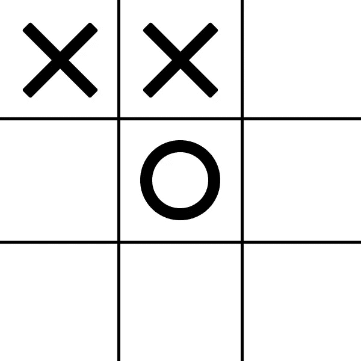
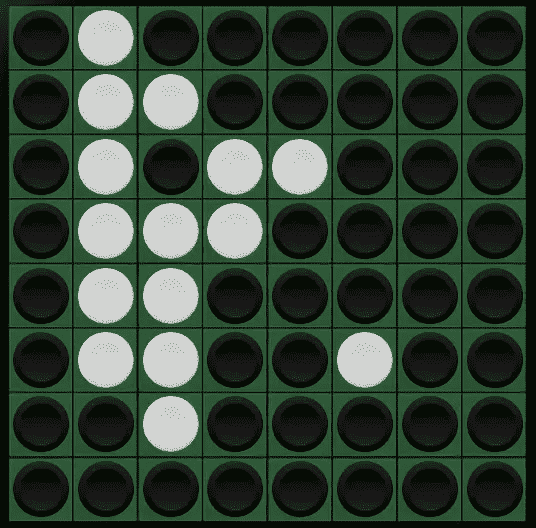
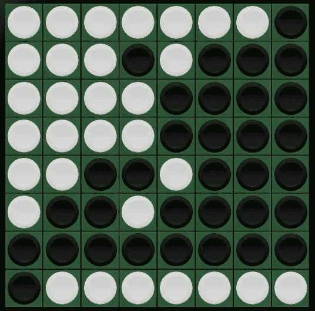
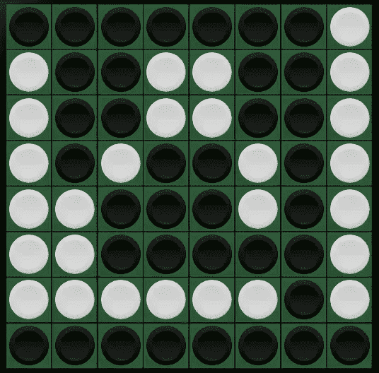
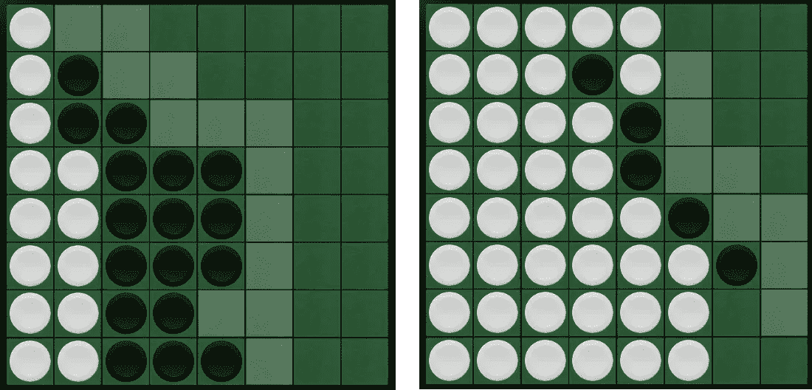
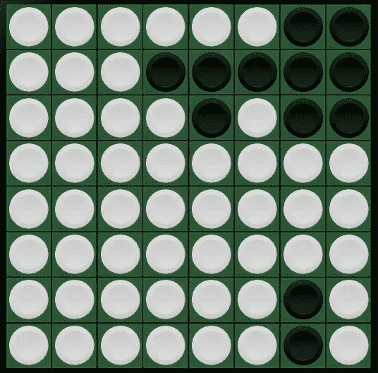

# 用蒙特卡罗树搜索赢得黑白棋

> 原文：<https://blog.devgenius.io/winning-reversi-with-monte-carlo-tree-search-3e1209c160be?source=collection_archive---------6----------------------->

沙哈达特·拉赫曼在 [Unsplash](https://unsplash.com?utm_source=medium&utm_medium=referral) 上拍摄的照片

由于新冠肺炎疫情仍在世界各地肆虐，我们中的许多人都被困在家里，接受[就地避难](https://en.wikipedia.org/wiki/Shelter-in-place)的命令。在新加坡，类似的“[断路器](https://en.wikipedia.org/wiki/2020_Singaporean_Circuit_Breaker)命令已经下达。当我在新加坡时，我的家人还在美国，我们试着在网上寻找可以一起做的活动。作为桌游爱好者，我们决定在网上玩桌游。我们主要用[桌游竞技场](https://boardgamearena.com/)来托管和玩桌游，尤其是那些我们女儿也会玩的。

我们三个玩了各种桌游，比如[寿司围棋！](https://boardgamegeek.com/boardgame/133473/sushi-go)、[彩流行](https://boardgamegeek.com/boardgame/125028/colorpop)、[纽扣](https://boardgamegeek.com/boardgame/181390/buttons)、[战羊](https://boardgamegeek.com/boardgame/54137/battle-sheep)。当我的女儿忙于其他活动时，我和我的配偶有时会玩那些游戏，还有其他像 [7 奇观](https://boardgamegeek.com/boardgame/68448/7-wonders)和[黑白棋](https://en.wikipedia.org/wiki/Reversi)的游戏。不幸的是，所有这些游戏本质上都是竞争性的，很难找到我们可以在线玩的合作棋盘游戏——我们之前在当地棋盘游戏商店[Sunny Pair ' o ' dice](https://sunnypairodice.com/)玩过类似于[疫情](https://boardgamegeek.com/boardgame/30549/pandemic)和[禁岛](https://boardgamegeek.com/boardgame/65244/forbidden-island)的游戏，但是我们找不到好的合作棋盘游戏来在线玩。

说到黑白棋，我的配偶无疑比我强。如果我幸运的话，我可能在 5 场比赛中赢 1 场。于是，我决定写一个算法给我玩游戏*！首先，我认为算法赢我可能不会太难，然后如果它赢了我的配偶，那么从技术上来说，*我*编写了算法，所以我可以把它视为我也赢了我的配偶。😃*

如果你想知道黑白棋和奥赛罗的区别，你并不孤单！我也想知道同样的事情，我看到了这篇比较这两款游戏的文章。出于本文的目的，我将参考黑白棋，因为它是更流行的名字，即使奥赛罗可能更准确。

回到在[卡耐基梅隆大学(CMU)](https://www.cmu.edu/) 的大学时代，家庭作业之一是写一个算法来下[棋](https://en.wikipedia.org/wiki/Chess)，使用[极大极小](https://en.wikipedia.org/wiki/Minimax)和[阿尔法-贝塔剪枝](https://en.wikipedia.org/wiki/Alpha%E2%80%93beta_pruning)。我在做那项任务时获得了极大的乐趣，我的算法在短时间内比我做得更好(我也不擅长下棋)。我在 CMU 大学攻读博士学位期间， [Mike Bowling](http://webdocs.cs.ualberta.ca/~bowling/) 发表了一篇演讲，讲述了他如何使用[蒙特卡罗树搜索(MCTS)](https://en.wikipedia.org/wiki/Monte_Carlo_tree_search) 在德州扑克单挑限注赛中战胜顶级人类玩家。最近， [AlphaGo](https://en.wikipedia.org/wiki/AlphaGo) [打败了职业人类围棋选手](https://www.theverge.com/2019/11/27/20985260/ai-go-alphago-lee-se-dol-retired-deepmind-defeat)，它利用了 MCTS 和[深度学习](https://en.wikipedia.org/wiki/Deep_learning)。

因此，当我考虑写什么样的算法来玩黑白棋时，我决定试试蒙特卡罗树搜索算法。我不会深入算法本身的细节。我跟随在网上有很多很棒的文章和[教程。相反，我将谈谈我在赢得黑白棋的过程中遇到的一些问题、经历的斗争和吸取的教训。](https://medium.com/@quasimik/monte-carlo-tree-search-applied-to-letterpress-34f41c86e238)

**第一课:尽早结束循环并迭代**

我第一次从我的博士导师曼努埃尔·贝洛索那里学到了关于机器人的知识。这个想法是:与其写下所有的东西(无论是复杂的机器人行为还是玩游戏的算法)然后测试所有的东西，不如先用一个更小、更简单的版本“闭环”。然后，在较小的版本工作之后，迭代地添加更多的特性并进行测试。这种哲学与在软件工程和商业中创造一个[最小可行产品](https://en.wikipedia.org/wiki/Minimum_viable_product)有许多相似之处。

在 MCTS 和黑白棋的例子中，我用 C++编写了 MCTS 的通用算法(带单元测试)，然后创建了一个原型 Runner 函数，其中我手工编码了游戏的状态，即棋盘上黑白标记的位置。

我希望现在一切都正常了。毕竟核心算法是经过单元测试的！😇结果，这个算法失败了:它经常放弃棋盘上的角落，而我很容易就赢了。

在我深入研究我的 MCTS 实现的问题之前，有一个更大的痛点——与我的人工智能对战极其乏味。最初，我手工编写了设置游戏状态的代码，例如，*board[3][3]= STD::make _ optional(true)；*然后，我写了一些处理图像的 Java 代码(截图在[灰度](https://en.wikipedia.org/wiki/Grayscale))，输出 C++代码。然而，这意味着(1)我必须手动截屏，(2)将它保存在 [GIMP](https://www.gimp.org/) 中并转换成灰度，(3)用 Java 处理它，(4)将生成的 C++代码复制粘贴到我的 MCTS 代码中，(5)运行 C++代码，最后(6)采取行动。

如果这个过程听起来很痛苦，是的！我选择用 Java 编写图像处理代码，因为用 Java 打开图像文件更容易。但是通过这个过程玩了一两个游戏之后，我就放弃了，直接在 C++里致力于处理截图，用的是 [libpng](https://en.wikipedia.org/wiki/Libpng) 。此外，我用 C++编写了灰度转换代码，这样我就不需要使用 GIMP 来进行转换。我还了解到 windows+printscreen 会将截图保存到文件中，而不是剪贴板中。

优化我的过程后，现在是:(1)获取并保存截图，(2)运行 C++程序(它将处理截图，初始化游戏状态，运行 MCTS，输出下一个动作)，然后(3)采取下一个动作。这个过程更容易也更快，我在开发 Reversi MCTS 算法的剩余过程中保持了这个过程。

第二课:从一个更简单的问题开始

这一课也许是第一课的必然结果，但是我严重低估了黑白棋作为一个游戏的难度。事实上，[存在 10⁵⁴可能的博弈状态，而完整的博弈还没有被强解](https://en.wikipedia.org/wiki/Computer_Othello)。

由于黑白棋固有的困难性质，以及玩一局游戏需要多长时间，调试 MCTS 算法为什么做出明显次优决策的问题具有挑战性。所以，我决定改为编码[井字游戏](https://en.wikipedia.org/wiki/Tic-tac-toe)，并让 MCTS 算法在上面发挥作用。

我编写的 MCTS 算法对任何游戏都是通用的，游戏是通用 GameState 和 GameAction 类的子类，所以在井字游戏中编写和运行 MCTS 并不太难。

下面是我测试的井字游戏状态的图示。人们的预期是，MCTS 算法会决定通过在右上方游戏来阻止 X 获胜，但它选择了在不同的位置游戏。

井字游戏状态，其中 O 的预期下一步应该是右上角。

由于井字游戏比黑白棋更容易解决，所以我能够相对快速地隔离并修复这个 bug。事后看来，我应该从井字游戏这样的游戏开始。但是迟做总比不做好！

**第三课:游戏状态表现很重要(最终)**

现在看来 MCTS 在工作，我又用它玩回了黑白棋。我设置了 MCTS 算法，在决定采取行动之前搜索固定次数的迭代。我开始迭代 10000 次，然后 100000 次，然后 1000000 次。每当我将迭代次数增加一个数量级时，算法似乎都做得更好。事实上，感觉人工智能会玩得相对较好，直到某一点，它基本上放弃了，半随机地玩。随着迭代次数的增加，游戏中“放弃”的点被推得更远，但还不足以实际完成并赢得游戏。

最终状态，我玩黑色和黑白棋 MCTS 算法(100k 迭代)玩白色。

我思考了一会儿，意识到这有点道理——游戏把赢当作赢，把输当作输。它没有区分大比分获胜和小比分获胜，就像它没有区分勉强失败和大比分失败一样。很有可能，在有限的迭代中，它找不到任何“好”的行动，因为这些行动有相似的赢/输概率，所以它基本上是随机选择的。

我试图将迭代次数增加到 1000 万次，但我受到了内存限制的影响——我的 C++程序被编译为 32 位程序，因此它受到 2GB 内存的限制。在与 Eclipse CDT 和 Windows 争论了很久之后，我将程序编译成了 64 位程序。为什么我在 Windows 而不是 Linux 中开发它？我的家用电脑使用 Windows，所以我可以更容易地玩视频游戏，我不想通过 [Virtualbox](https://en.wikipedia.org/wiki/VirtualBox) 进行开发，除非我绝对需要。

无论如何，现在这个程序是 64 位的，从技术上讲，它可以访问我所有的 16GB 内存。尽管如此，我认为使用更少的内存通常更好，所以我努力减少内存占用。

我使用了一种易于编码和易于理解的表示法，包括向量和可选的，它允许任何尺寸的电路板(包括大于和小于 8x8)。但是，该表示占用了过多的内存。我切换到一个位表示，只允许一个 8x8 板。棋盘上有 64 个方块，方便的是一个 long long int 中有 64 位。现在，我可以用两个长整数来表示棋盘，一个表示哪些方格有棋子，一个表示这些方格中有哪种颜色。

有了新的表示，我的内存使用量从 2GB 降到了 15MB，比我预期的要低*很多*(稍后会有更多的细节)。我把迭代次数增加到 1000 万，但是 AI 还是在游戏中期输了。我在几个回合中运行了 1 亿次迭代，但是计算时间非常长(每回合超过 30 分钟)，所以继续下去太乏味了。

**第 4 课:利用以前搜索的信息**

我把 MCTS 算法写成一次性算法:从给定的游戏状态(S₁)，运行固定次数的迭代，输出下一个最佳动作，然后终止。然而，在采取行动到达州 S₂之后，即使另一个(非 AI)玩家采取行动到达州 S₃，游戏州 S₃也可能存在于来自 S₁.的 MCTS 搜索中

通过每次从头开始运行 MCTS 算法，来自 S₃子树的所有信息都消失了，并且被“浪费”了。所以，我的下一个功能是在我的整体 AI 中增加内存，以便后续的 MCTS 搜索从新的游戏状态中利用以前搜索的信息。

我这样做是通过在内存中保存 MCTS 搜索树，并给定新的游戏状态，修剪搜索树，使根现在是新的游戏状态。然后，MCTS 可以使用修剪后的搜索树开始迭代。

起初，我发现在 100，000 次迭代时，内存状态的唯一节点非常少，这似乎很可疑。经过挖掘和调试，我发现在我修改的动作代码中有一些错误(这也可能存在于最初的游戏状态表示中)。特别是，一个玩家采取的行动实际上并没有改变棋盘的状态，单元测试没有发现这个错误，因为单元测试都使用了另一个玩家的回合。

在修复了这个 bug 之后，我发现在 100 万次迭代的情况下，搜索树将会有大约 100 万个唯一的节点(正如预期的那样)，内存使用量大约为 1GB，这大致意味着每个状态 1000 个字节，这看起来仍然很高，但是大约在正确的数量级。此外，修剪后的搜索树大约有 66，000 个独特的节点，这不是很多，但这些节点的统计数据(成功/失败/访问)随着时间的推移会保留下来，所以它们会变得越来越好。

最后，通过 MCTS 算法的一百万次迭代和保存的内存状态，我的黑白棋人工智能赢了我！

最终状态，我下白棋，黑棋 MCTS 算法(1M 次迭代)下黑棋。

MCTS 算法以 33 比 31 获胜，这是一个很小的差距，它一直感觉像一场势均力敌的比赛。由于我的配偶比我更擅长黑白棋，我将不得不增加迭代次数！

**第 5 课:剖析代码，并在代码可用于生产时进行优化编译**

我的 Reversi MCTS 算法在 Eclipse CDT 中以调试模式运行，100 万次迭代大约需要 7 分钟。我想在让我的配偶玩之前增加迭代次数，但我不想在回合之间等待很长时间。

我用 [gprof](https://en.wikipedia.org/wiki/Gprof) 运行了代码，找到了一些要优化的函数，最后，切换了 C++优化编译标志，使得代码执行得更快，但可能更难调试。既然我现在对算法工作正常很有信心，那就差不多是时候和我的配偶比赛了，不需要在飞行中调试。

我用 500 万次迭代和算法对战，现在感觉“更好”了。它拿下了 4 个角球中的 3 个，并以 37 比 27 的较大优势获胜。虽然算法仍然不能区分小赢和大赢，但它始终做出了让我印象深刻的动作，我觉得我所有的动作都不“好”。

最终状态，我下白棋，黑棋 MCTS 算法(5 次迭代)下黑棋。

最后一课:跑步并实现目标！

现在我确信黑白棋 MCTS 算法有机会击败我的配偶。“黑白棋 MCTS 算法”用 500 万次迭代和我的配偶比赛，并且赢了！😁然而，我的配偶似乎对算法很放松，算法在游戏中占据了前两个角落。

游戏中期，黑白棋 MCTS 算法是白的，我的配偶是黑的。

拿下那些角球后，它就推其优势，严重限制了我配偶的移动。尽管我的配偶在算法上很轻松，但胜利就是胜利！我们已经同意进行一次重赛，我的配偶将全力以赴研究这个算法。

最终状态，其中黑白棋 MCTS 算法扮演白色，我的配偶扮演黑色。