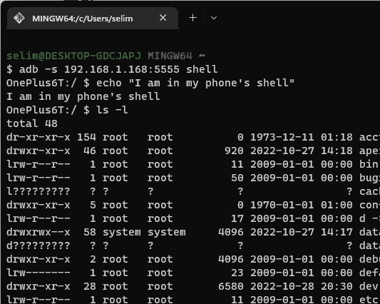

# Android 上的无线调试(带 ADB)，VSCode 和 ADB 备忘单上的颤振测试

> 原文：<https://blog.devgenius.io/wireless-debugging-on-android-with-adb-flutter-testing-on-vscode-and-adb-cheat-sheet-9d4825aaa3a8?source=collection_archive---------2----------------------->

如果你不知道，可以通过 WiFi 运行和调试你的 Flutter 应用程序，而不需要通过 USB 电缆连接到你的开发机器。

无论你只是没有任何空闲的 USB 端口或没有足够长的 USB 电缆，或者你只是因为电缆与你的键盘/椅子纠缠在一起而烦恼。，无线调试可以帮助您解决这些问题。

要做到这一点，你需要做一些事情，但谢天谢地，这一切都很简单。许多开发人员都是在 Windows 机器上工作的，所以有些观点或例子只适用于 Windows。但是，您应该能够将相同的原则应用于其他操作系统。

# 1.安装 ADB (Android 调试桥)或 SDK 平台工具

ADB 或 Android Debug Bridge 是 Android SDK 平台工具工具包的一部分。您可以通过进入您的 **Android SDK 管理器> SDK 工具**选项卡来启用/安装它。然后只需启用 **Android SDK 平台工具**选项并继续安装，如果你还没有这样做的话。


Android SDK 平台-Android SDK 管理器上的工具

您还可以快速检查您是否安装了平台工具，而无需从 SDK 管理器进行检查。只要进入你的 Android SDK 目录，检查一下在`android-sdk`下是否有`platform-tools`目录，以及`abd.exe`是否存在。在我的例子中，它安装在默认目录下，即`C:\Program Files (x86)\Android\android-sdk\platform-tools`。

或者，你可以下载独立的 SDK 平台工具，然后你就可以使用`adb.exe`(假设你在 Windows 机器上)。可以在[https://developer . Android . com/studio/releases/platform-tools](https://developer.android.com/studio/releases/platform-tools)上获取最新版本的单机版。如上所述，将它们解压到您的 SDK 目录中，或者保存在其他地方，因为您将能够直接运行 ADB 命令。


独立软件包 SDK Plata form-Tools 33 . 0 . 3 for Windows

## 1.1 可选；将平台工具添加到环境变量中

如果您想从您选择的控制台直接访问 platform tools 命令(即，您想从任何目录键入 adb 并运行它)，您需要将 platform-tools 目录添加到 PATH 环境变量中。否则，您将得到类似“adb 不是可识别命令”的错误。

只需记下您的平台工具目录，并使用您刚刚复制的完整目录向 Path envrionment 变量添加一个新条目。


将平台工具作为路径值添加到环境变量中

现在，您只需在终端中键入 adb 就可以测试您的命令了。该命令将返回 Android 调试桥版本，并帮助输出。确保在添加变量值后打开一个新的终端窗口，以使更改反映出来。


在终端中验证 adb 命令

# 2.在测试设备上启用无线 ADB 调试

ADB 调试选项需要在您的测试设备上启用。进入**开发者选项>调试**部分，启用**无线 ADB 调试**选项。


在开发者菜单中启用无线 ADB 调试选项

# 3.在网络上找到测试设备的 IP 地址

您需要在网络上找到测试设备的 IP 地址。当然，您的设备需要与您的开发人员机器连接到同一个网络，除非您想要处理暴露端口和添加防火墙规则的问题。就我个人而言，除非万不得已，我会避免瘟疫之类的事情。

最快的方法是进入测试设备的状态页面，找到 IP 地址条目。对我来说这是 *192.168.1.168* ，但对你来说可能会不一样。或者，您可以转到路由器管理页面，查看连接的设备— *，如果您喜欢困难的话*。


获取网络上测试设备的 IP 地址

# 4.将您的设备映射到 ADB

下一步是将 *Android 调试桥*映射到您的测试设备。否则，您将无法在设备列表下看到您的设备，如下所示。在我的例子中，我的一加测试设备没有列在 VSCode 设备列表中，因为我还没有映射它。


我的测试设备一加 A6013 没有列在 Visual Studio 代码中(Flutter 扩展支持)

添加环境变量后，打开您选择的新终端，让 ADB 通过 TCP/IP:5555 进行通信。TCP/5555 是 ADB 与您的测试设备对话的默认端口。但是，您可以覆盖它。

## 4.1 可选；更改默认 ADB 端口

您需要向 adb 进程传递一些参数来覆盖默认端口。需要时执行以下命令；即您的网络中有冲突端口，*或 5555 对您来说是一个被诅咒的数字*。

```
$ adb -d shell setprop persist.adb.tcp.port 6969 #root/admin
$ adb -d shell setprop service.adb.tcp.port 6969 #no root/admin
```

如果您有足够的权限，第一个命令将永久设置新端口(因此有了`-persist`标志)。否则，运行备用命令来更改服务级别的端口。如果运行 service level 命令，下次启动 adb 服务时需要再次执行此操作。

当您对端口设置满意时，**通过 USB 将测试设备连接到您的 PC，并确保您处于 USB 调试模式**。如果您不执行这一步，但仍然执行该命令，您最终会得到一个错误，说找不到设备。


设备未通过 USB 连接到计算机时出错

通过 USB 连接设备后，运行以下命令将所需端口映射到 adb。

```
$ adb tcpip 5555
```

下一步是使用我们在步骤 3 中获得的 IP 地址连接到目标测试设备。通过执行`adb connect`命令，并传递设备的 IP 地址来实现这一点。

```
$ adb connect 192.168.1.168
```

> 为了使以后的工作更容易，您可以在路由器设置中为您的设备分配一个静态 IP 地址，这样您就可以在以后自动完成这个过程。

一旦执行了这些命令，输出应该类似于下面这样。


adb 命令的预期输出

# 5.选择您的设备并在 VSCode 中启动调试会话

现在我们已经完成了所有必要的步骤，我们可以返回到 Visual Studio 代码(或者您正在使用的任何 IDE)中，我们的设备应该列在 device list 下面。简单地说，继续选择您的设备，就像您通常通过 USB 连接时所做的那样，并开始调试。*这里有个小 GIF 给你(或者 GIF，你懂的)。*


现在，我们可以连接到我们的设备，并在 Visual Studio 代码中调试我们的代码！

## 5.1 如果失去连接怎么办？

如果 Android Debug Bridge 因为任何原因失去连接，只要确保设备仍然与您的开发环境在同一个网络上即可。然后，您只需运行 adb connect 命令即可重新连接到您的设备。

```
$ adb connect 192.168.1.168
```

如果您仍然得到错误，尝试终止您的调试服务器，并从第一步开始。要终止服务，只需运行这个 adb 命令。

```
$ abd kill-server
```

# 6.我还能在亚行做些什么？

ADB 在许多其他事情上也很有用。我列出了我每天最常用的命令。当然，还有一些事情我没有在这里列出，因为我最终用 shell 命令完成了大部分事情。说到壳牌…

## 壳

使用 adb shell 命令，您将能够在您的测试设备上启动一个 shell 会话，并且能够在其上运行 Linux 命令。例如，您可以查看目录内容，动态修改文件以便于调试，或者您可以做一些其他很酷的事情。天空是无限的。



使用“adb shell”在测试设备上运行 shell 命令

如果您在尝试使用 shell 访问您的设备时收到一个错误消息，说找到了多个设备，那么您需要列出这些设备，并通过向 adb shell 命令传递 in -s 参数(带有设备名称或 IP 地址)来进行选择。


“存在多个设备/仿真器”错误消息

要列出您的设备，只需键入`adb devices`，并选择您试图访问的设备的名称或 IP 地址。


adb 检测到的列出的活动设备

## 屏幕上显示程序运行的图片

您可以使用 adb shell screencap 命令快速抓取设备的屏幕截图。

```
$ adb -s 192.168.1.168 shell screencap ./test_ss.png
```

## 屏幕录制

您可以创建测试设备的屏幕记录。这对于共享应用程序一部分的简短视图、调查 bug 等特别有用。默认情况下，screenrecord 工具限制为三分钟，但是您可以通过在该命令中传递`--time-limit`参数来延长这个时间限制。参数 timespan 以分钟为单位。

```
$ adb -s 192.168.1.168 screenrecord ./path-to-file/annoying-bug.mp4
$ adb -s 192.168.1.168 screenreecord ./path-to-file/very-annoying-bug.mp4 --time-limit 10
```

此外，您可以指定额外的信息，如记录分辨率，比特率，错误报告(详细说明错误的附加信息)。要查看可以传入的全部细节，请使用`--help`参数。

## 拉/推

您可以在您的开发环境和测试设备之间拉和推文件。不出所料，这些命令被称为`pull`和`push`。

```
$ adb push <system_file_path> <device_file_path>
$ adb pull <device_file_path> <system_file_path># for instance
$ adb push …/screen.png /sdcard/screenshots/screen.png
$ adb pull /sdcard/screenshots/screen.png
```

## 安装/卸载 apk

也可以用这些命令在你的 Android 设备上安装和卸载任何包。我发现这在需要快速比较某些包版本时特别有用。您还可以访问网络上要安装的特定 apk 的文件。

```
$ adb install /path_to_apk/myapp.apk
$ adb install -r /path_to_apk/myapp.apk #-r updates the existing version
$ adb uninstall com.selimb.myapp
```

目前就这些。希望其中一些对你的发展有用。编码快乐！🎉