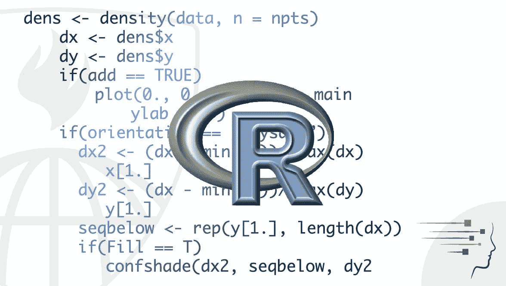
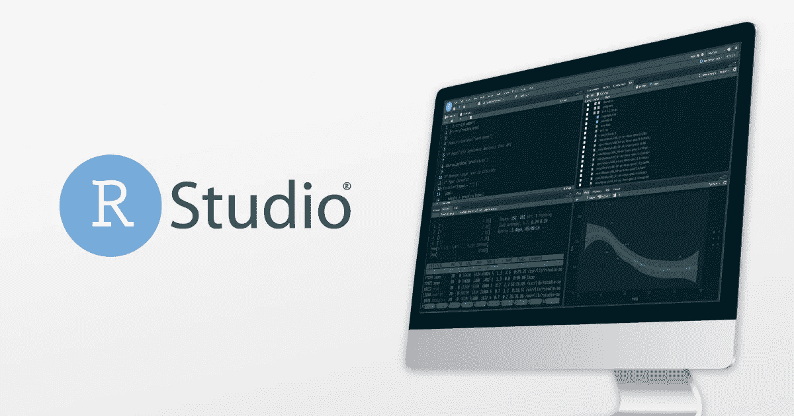

# 我希望在学会 R 之前就知道

> 原文：<https://blog.devgenius.io/wish-i-knew-before-learning-r-473c538615c8?source=collection_archive---------15----------------------->

关于这种健壮的编程语言的一些令人不快的事实。在这一节中，我将帮助你打破某些关于 r 的偏见和神话。

## 1-它不像任何其他编程语言

R 的不同特性使得它很难学习，因为它的特性与其他编程语言有很大的不同。例如，你必须运行每一行代码来使整个程序运行。

## 2-它的数据类型不同

与面向对象的编程语言相比；r 处理向量和 double 数据类型。打破这种局面；它使用 double 数据类型(大多数编程语言中的 float number)而不是整数，R 在这种编程语言中也使用矢量化运算。

## 3-非常容易用于数学和统计计算

不要让陡峭的学习曲线欺骗了你。因为 R 非常擅长数学和统计计算；与其他编程语言(主要是 python)相比，它使得所有的数学和统计计算都很顺利。没有其他编程语言允许你用它的文本编辑器 R Studio 清理它的数据。

## 4-它不像其他编程语言那样经常暴露你犯的错误

这使得学习 R 变得更加复杂，因为它不能像它的对应物一样清晰地展示给你。如果你是一个人，你最好是在文本编辑器中使用你的终端。否则，你可能需要寻求专业人士的帮助来教你这个错误。尽管如此，如果你删除了一个对程序本身不可或缺的东西，它还是会显示出错误。

## 5-你只能在 R Studio 中编码

也许是最激动人心的部分。这让我们不禁要问为什么。因为大多数文本编辑器支持面向对象的语言，而 R 是一种矢量化语言。但是，一些扩展允许各种文本编辑器使用 r。

## 6-它也用在经济学上

特别是对于数量经济学和计量经济学来说，为了获得尽可能可靠的输出。

**对于数量经济学**

对经济模型、图表进行检验，并通过多年获得的实时数据模拟某些情景，以检验模型的可靠性和有效性。由于使用计算手段(尤其是 R)对数据进行了大量测试，其结果可能会增加一些话题，并在很大程度上抵消了世界各地经济学课堂上教授的内容。如果可能的话，它可以将世界各地的现实模型放在一起，供所有人学习。

**为计量经济学**

计量经济学被定义为通过计算和经验手段对经济数据进行统计解释。因此，预测的使用从未像现在这样简单。因此，通过更简单的计算方法对经济学领域进行大规模的测试，将决定全世界的经济学项目会发生什么。

*你觉得 R 怎么样？别忘了在下面的评论区分享你的想法。*

如果你喜欢你所读的，千万不要忘记在 Medium 上喜欢并关注我。