# Wix 事件逐步设置指南:事件和反馈设置

> 原文：<https://blog.devgenius.io/wix-events-step-by-step-setup-guide-event-and-feedback-setup-f323c072de12?source=collection_archive---------12----------------------->

## Wix 历险记

你的生意已经准备好了。你得到了一个令人敬畏的事件，你迫不及待地想与世界分享。现在是时候弄清楚具体怎么做了。

你来对地方了！

在这篇文章中，我将指导你如何使用来自网站 hoster Wix 的优秀的 [Wix Events 应用程序](https://www.wix.com/app-market/wix-events)来组织一次活动。

# 考虑 Wix Events 应用程序的一些理由

销售活动有很多很好的选择。我当然没有全部看过，但我可以提供一些选择这一个的好理由:

1.  集成为 Wix 网站构建器的一部分。它非常容易地集成到 Wix 平台中，为您节省了大量的工作。
2.  包括各种门票、折扣、会员资格、团体等选项。这包括扫描活动参与者的二维码并对其进行检查。
3.  如果您选择进行在线活动，集成在线选项
4.  包含电子邮件形式的一些伟大的 CRM 选项

还有很多，但希望这能给你一些去的理由！

# 系列结构

这个深入的教程系列将教你使用 [Wix Events](https://www.wix.com/app-market/wix-events) 应用程序设置和发布活动所需的一切知识。您将学习如何:

1.  设置事件
2.  使用 Wix 内置的 [CRM](https://www.wix.com/ascend/home) (Ascend by Wix)自动通知和服务您的客户
3.  实施改变游戏规则的工作流程，提升您对业务的可操作见解
4.  在客户与您一起参加活动的关键时刻收集他们的反馈

每一集的底部都有一个完整的剧集列表，并解决了谜题的一个特定部分。

如果你需要额外的帮助，不要犹豫，联系我的公司[创意应用](https://www.creativeappnologies.com/contact-us)。我们很乐意帮助你，❤️

正如我写的所有东西一样，我希望你能找到这个有用的❤️.如果你花时间在 Medium 上给我一个“掌声”，或者订阅我的电子邮件列表，这将对我来说意味着整个世界。如果你想订阅 Medium，请随意使用[我的推荐链接](https://appnologyjames.medium.com/membership)(它不会额外花费你任何费用，但是*是否意味着*我可以得到你的订阅费的一部分)。

尽情享受，并随时在 twitter 上给我发 [DM，在](https://twitter.com/blockchainvalu1) [LinkedIn](https://www.linkedin.com/in/jameshinton84/) / [Github](https://github.com/jimtin) 上发表想法和评论😃

# 安装 Wix 事件应用程序

我们的第一步是创建事件。为此，我们需要 Wix 事件应用程序。完成此操作的步骤如下。

1.  导航到您的仪表板

2.在您的仪表板上，导航至“应用程序”组件

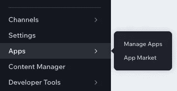

Wix 仪表板:应用程序

3.选择“应用市场”选项

4.在搜索栏中搜索 Wix 事件。对我来说，首先出现的选项是 Wix Events 应用程序(如下所示)

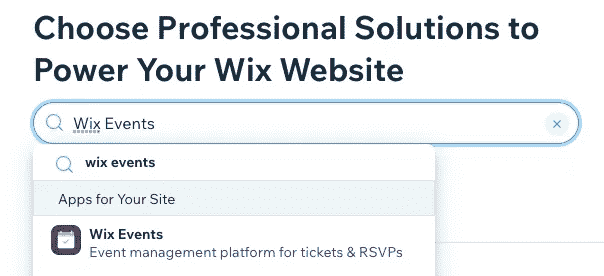

Wix 应用市场:搜索 Wix 事件

5.选择 Wix 事件

6.这将带你到应用程序的概述。

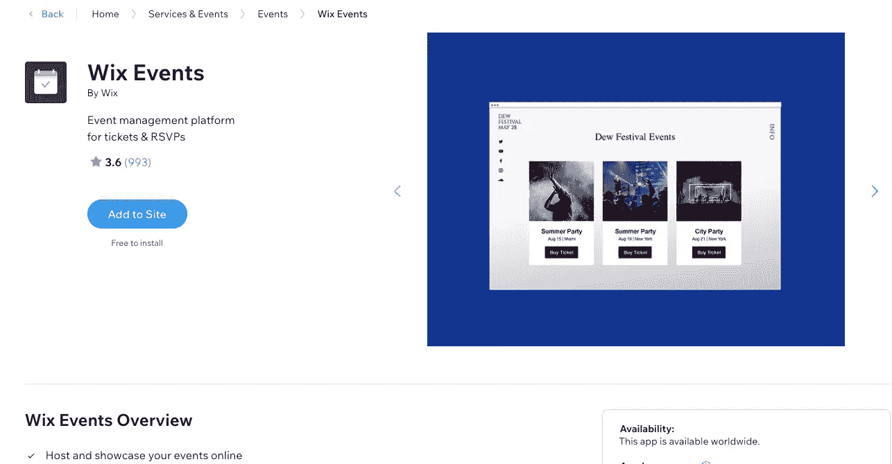

Wix 应用市场:Wix 活动概述

7.选择“添加到网站”。你应该得到一个加载屏幕，然后像这样的东西弹出

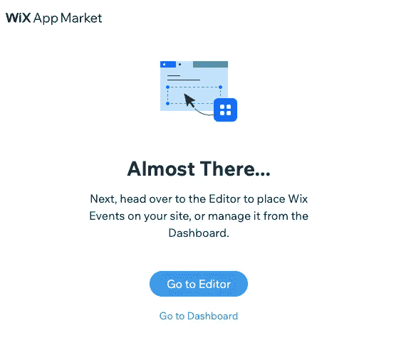

Wix 应用程序市场的安装弹出窗口

在接下来的弹出屏幕中，您有一个选择。

1.  **编辑。**此选项将带您进入网站编辑器，您可以在其中自定义 Wix Events 应用程序的外观。这包括你的配色方案的选项，它在你的菜单上的位置等等。
2.  **仪表盘。**此选项将带您回到您的仪表板。您可以在这里添加要显示的事件。

您可以选择任何一个，但是对于本教程，我们将首先为自己设置一个事件，然后再将其发布到我们的生产站点。

# 创建您的活动

要开始创建活动，您需要导航回仪表板。确保您的仪表板已重新加载，否则您将无法获得“事件”选项(如下)。

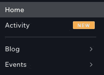

带有事件的 Wix 仪表板

## 创建类别

在创建事件之前，我们希望创建一些类别。类别是将多种事件类型组合在一起的有用方法。您可以在第 5 集使用它们来过滤特定页面的事件显示。

为此:

1.  从事件选项中选择“类别”:

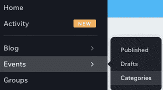

Wix 事件:类别

2.选择“新类别”

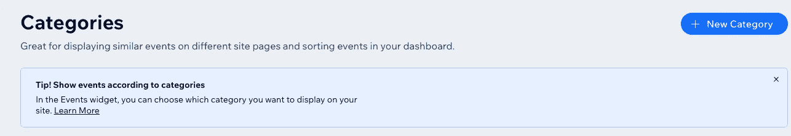

3.填写类别的名称。我把我的叫做“会见和问候顾客”。现在，离开“相关事件”部分。

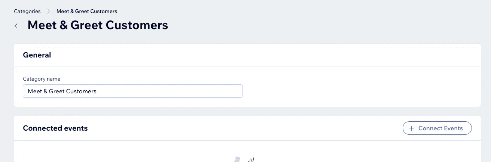

## 创建事件

现在是时候创建我们的事件了。这部分是关于建立我们活动的“线框”的。我们将在以后的章节中讨论更多的配置细节。

为此，请按照下列步骤操作:

1.  导航回您的仪表板，并从您的事件中选择“已发布”。

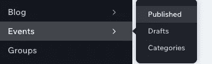

2.选择“+添加事件”。你可以从我下面的截图中看到，我们还没有任何发布的活动。如果您以前创建过活动，这可能会有所不同。

3.选择您的活动类型。有一个可供选择的选项列表，我将在下一节对此进行概述

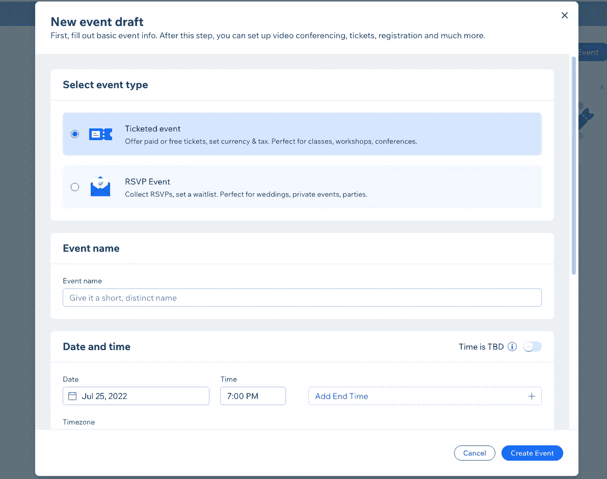

Wix 事件选项

4.添加选项后，选择“创建活动”。

干得好！

## Wix 事件选项

1.  **出票 vs RSVP。**这个在 Wix 网站上有解释，我就不赘述了。
2.  **事件名称。**你想怎么称呼这次活动。您的客户将会看到此活动。
3.  **日期和时间。**在这里，您可以选择设置日期和时间或将其设为 TBD。如果您选择 TBD，您将被限制使用视频会议选项，我们稍后将对此进行介绍。
4.  **地点。**在这里，您可以将您的位置设置为三个选项之一——物理位置、在线或 TBD。如果您选择一个物理位置，系统会提示您输入地址。

选择选项后，选择“创建活动”。

对于我的，我选择了以下选项:

1.  售票
2.  日期 2022 年 8 月 2 日，时间:AEST 时间晚上 7 点
3.  在线，称为“在线见面和问候”

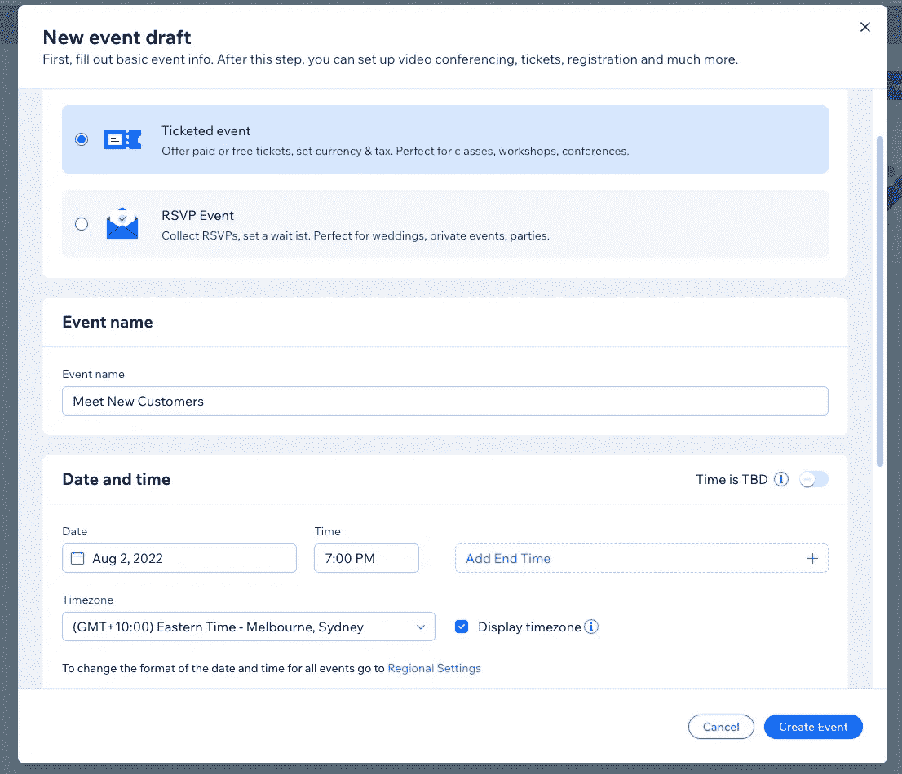

Wix 事件选项示例

4.**创建事件。**

非常酷，做得好！你已经解决了第一步！

# 创建先验知识调查

有效的业务建立在有效服务客户的基础上。今天的数据系统让我们比以往更有效地做到这一点！

服务客户的一个好方法是了解客户在任何时候的需求。这为我们的客户节省了时间，确保我们的答案是相关的，并简化了我们的互动。作为回报，我们实现了更高的销售额和更多的“粘性”客户。

如果你正在寻找发展你的销售策略的洞察力，我已经在这里写了这个。

在这个系列中，我们将开发一个简单的“先验知识调查”。我们希望它能让我们深入了解我们的客户希望从他们的“会见新客户”活动中得到什么。

我们会问三个简单的问题(尽管我相信你能想到更多！):

1.  你是怎么知道我们的？
2.  你希望我们在会议中讨论什么话题？
3.  你有什么问题想问吗？

## 创建表单

要创建表单，请执行以下操作:

1.  导航至您的 Wix 仪表板，并选择“通信”

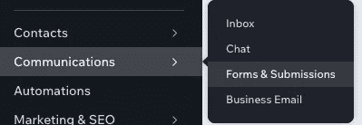

Wix 独立表单仪表板选项

2.导航到“您的独立表单”并选择“+创建独立表单”

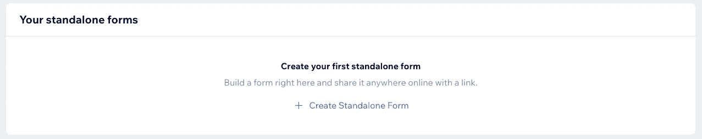

Wix 独立表单

3.选择您要使用的表单模板，然后单击“开始”

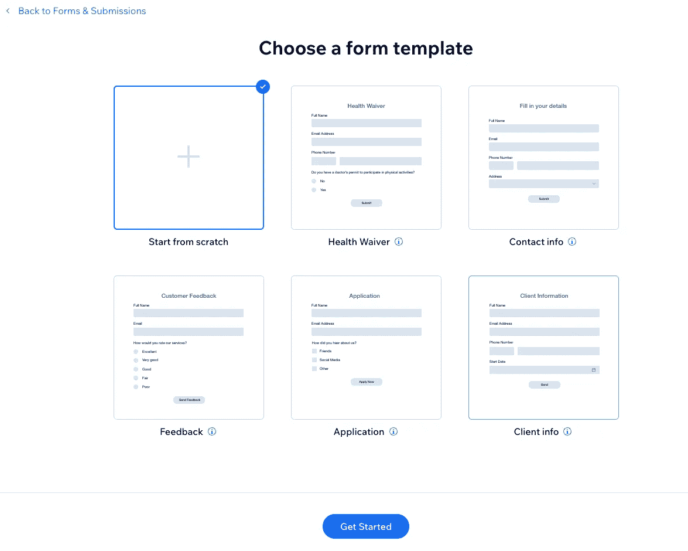

Wix 独立表单:表单模板

我选择了“从头开始”,这就是显示的内容。

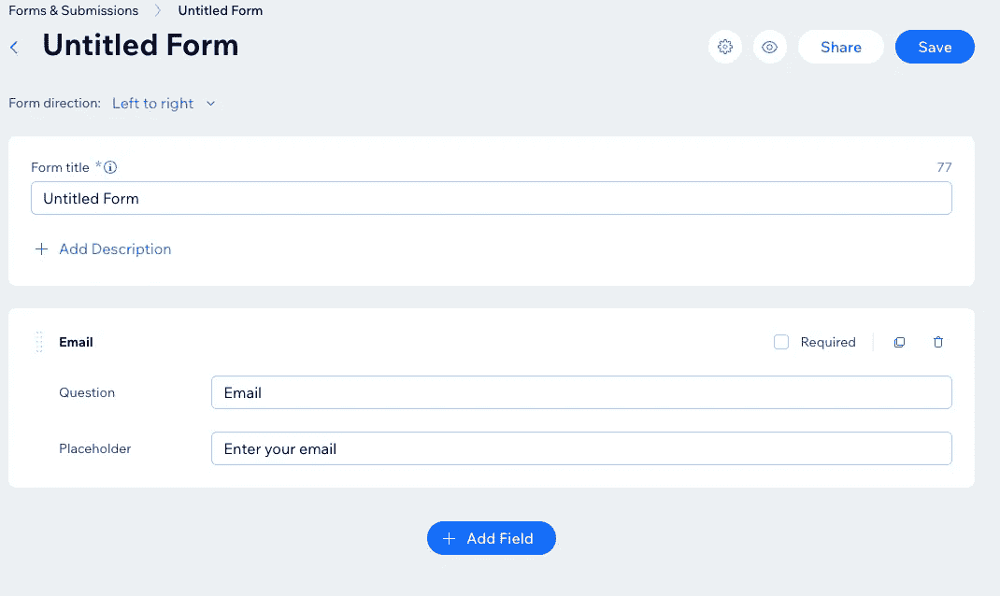

使用“从头开始”的 Wix 独立表单

## 填写表单选项

现在填写表单选项。希望这些字段是不言自明的，但我还是把它们列在这里以防万一:

1.  表单标题—您希望如何命名您的表单
2.  ‘添加字段’—允许您添加供人们填写的字段
3.  ‘提交按钮文本’—提交表单时按下的按钮的外观

现在继续填写你的表格。这是我的样子:

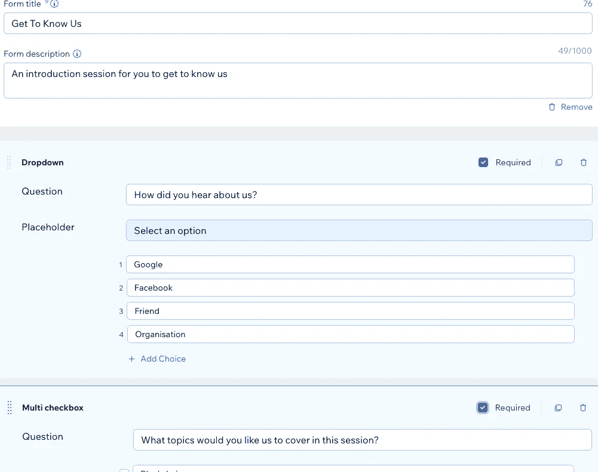

Wix 上事件开发的 Wix 独立表单教程

**快速注意。**对于这个用例，表单是匿名的。因此，我已经删除了任何要求姓名、电子邮件或任何其他识别信息的字段。这可能不适合你，所以请随意将它们包含进来。

## 完成表格并保存

一旦表单中有了您要寻找的问题，请仔细检查设置。您可以包括以下内容:

1.  如何获得通知— ⚙️->通知
2.  预览表单
3.  甚至亲自填写来尝试一下

完成后，保存表格并继续。

# 后续步骤

祝贺您完成 Wix 活动的线框！如果这是你的第一次——非常感谢你与我分享你的旅程！如果你在评论中提到❤️，我会很高兴的

随着我们的线框完成，我们现在准备进入下一步:完整的事件配置！

我在那里等你。

## 剧集列表

1.  [事件和反馈设置](https://appnologyjames.medium.com/wix-events-step-by-step-setup-guide-event-and-feedback-setup-f323c072de12)
2.  [全程赛事配置](https://appnologyjames.medium.com/wix-events-step-by-step-setup-guide-full-event-configuration-618410061620)
3.  [事件 CRM 基础知识](https://appnologyjames.medium.com/wix-events-step-by-step-setup-guide-event-crm-basics-218ab4271202)
4.  [升级 Wix 工作流程](https://appnologyjames.medium.com/wix-events-step-by-step-setup-guide-level-up-with-wix-workflows-45ce721f4f83)
5.  [在 Wix 网站上发布事件](https://appnologyjames.medium.com/wix-events-step-by-step-setup-guide-publishing-event-on-wix-website-791d1a1b61b5)