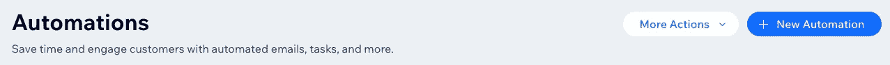

# Wix 活动逐步设置指南:活动 CRM 基础知识

> 原文：<https://blog.devgenius.io/wix-events-step-by-step-setup-guide-event-crm-basics-218ab4271202?source=collection_archive---------14----------------------->

## Wix 历险记

客户关系管理(CRM)无处不在。它描述了我们管理与客户互动的方法。

做得好，它为我们的客户和我们的企业创造了大量的价值。我们的顾客感受到爱、关心、了解和重视。反过来，他们愿意付给我们更多的钱。每个人都赢了。

尽可能多地实现自动化可以节省您的时间，并为您提供可操作的数据。

这就是我们关于 [Wix 事件](https://www.wix.com/app-market/wix-events)系列的这一集所要讲的。您会惊讶于使用 Wix 平台做这件事是多么简单，我迫不及待地想向您展示如何做到这一点。

# 系列结构

这个深入的教程系列将教你使用 [Wix Events](https://www.wix.com/app-market/wix-events) 应用程序设置和发布活动所需的一切知识。您将学习如何:

1.  设置事件
2.  使用 Wix 内置的 [CRM](https://www.wix.com/ascend/home) (Ascend by Wix)自动通知和服务您的客户
3.  实施改变游戏规则的工作流程，提升您对业务的可操作见解
4.  在客户与您一起参加活动的关键时刻收集他们的反馈

每一集的底部都有一个完整的剧集列表，并解决了谜题的一个特定部分。

如果你需要额外的帮助，不要犹豫，联系我的公司[创意公司](https://www.creativeappnologies.com/contact-us)。我们很乐意帮助你，❤️

# 在这一集中

在这一集里，我们将讲述 CRM 的一些基础知识:

1.  自动发送我们的“先验知识”和“反馈”表格
2.  自动将我们表单的结果转移到 [Google Sheet](https://www.google.com.au/sheets/about/) 以便于分析
3.  配置事件通知电子邮件

你会惊讶于这有多简单，所以让我们开始吧！

# 自动化先验知识和反馈收集

一个深思熟虑的企业的一个重要标志是他们如何管理(和自动化)从客户那里获取信息。

Wix 通过使用他们的[自动化](https://support.wix.com/en/article/wix-automations-getting-started)部分，使这变得非常简单。使用这个系统为你节省了大量的工作，因为它们包含了你开始工作所需要的一切。

让我们经历两次自动化。

## 发送先验知识表

我们的第一个自动化是发送我们在[第 1 集](https://appnologyjames.medium.com/wix-events-step-by-step-setup-guide-event-and-feedback-setup-f323c072de12)中开发的先验知识表。

让我们来设置一下:

1.  转到表格和提交

Wix 独立表单

2.从“您的独立表单”部分选择“编辑”

了解我们的独立表单

3.选择“共享”

分享“了解我们”表单中的链接

4.复制提供的链接

5.从 Wix 仪表板导航到“自动化”

Wix 仪表板上的自动化

6.选择“+新自动化”

Wix 自动化中的新自动化

7.选择“从头开始”

8.命名表单。我选择了“通过自动化了解我们”

9.从提供的选项中选择“Wix 事件”

Wix 自动化设置

10.选择“游客购买门票”选项

11.选择触发自动化的事件。根据您的设置，这可能是“所有现场事件”,或者您也可以将其设置为仅适用的事件。

12.选择触发器“发送电子邮件”

触发对 Wix 表单的响应

13.为电子邮件选择“编辑模板”。

14.将模板编辑成您喜欢的样子。例如，我将主题更新为“科技”,并添加了一个反馈按钮。

15.无论您选择将链接放在哪里，都要将链接添加到步骤 4 中的独立表单中。

定制您的自动化电子邮件

16.选择时间为“触发后立即”

就是这样！全部完成！

## 反馈收集

到目前为止，你已经取得了很大的进步！现在，我将挑战你们使用我们刚刚学到的技能构建下一个自动化。

这是我们想要的结果:

1.  设计并制作一个表格，收集每位顾客对我们活动的反馈
2.  在事件发生后 24 小时内自动发送此表格

这是步骤。

设计您的反馈表。如果你需要一本关于如何做到这一点的入门书，请看《T2》第一集。对于我的问题，我提出了以下问题:

1.  用 1-5 分给事件打分
2.  活动回答了你的问题吗？
3.  你还有其他想要提供的反馈吗？
4.  您愿意收到进一步的反馈吗？这有两个字段——一个表示“是”的打勾框和一个可选的电子邮件字段

现在将链接复制到该表单。

**自动发送。**您希望为该自动化选择的选项有:

1.  Wix 事件
2.  触发器:事件结束
3.  时间:触发后 1 天

如果你需要一点时间来弄明白这一点，不要担心。这就是我写这篇教程的原因😸

# 收集回复

有效的分析给企业带来难以置信的洞察力。我们都知道这一点，但对于许多企业来说，数据收集仍然是一项令人烦恼、耗时的任务。因此，许多企业主和领导者永远不会进入分析阶段。

今天，我们将了解如何简化数据收集的许多方面。最后你需要做的就是分析数据！如果我们愿意，甚至这一部分也可以简化——但这是另一个系列的主题😃。

## 收集数据

到目前为止，您应该已经完成了两个自动化，都包含到独立表单的链接。

这些独立的表单解决了我们的第一个问题:收集数据。

## 添加到电子表格

随着我们的数据收集排序，我们现在想把它放入一个电子表格程序。

出于我们的目的，我们将使用 [Google Sheets](https://www.google.com.au/sheets/about/) 。Google Sheets 是 Google Workspace 的[的一部分，Google Workspace 是一套非常强大的基于云的工具。Google Workspace(包括电子邮件)非常有效地集成到 Wix 中，这没有什么不同。](https://workspace.google.com/)

虽然不是本系列的主题，但是使用 Google Workspace 套件可以让您获得许多提升您的商业智能工具集的方法。如果你想进一步讨论，请随时联系[创意公司](https://www.creativeappnologies.com/contact-us)。

## 连接到 Google

1.  返回到您的自动发送“先验知识”的形式。
2.  滚动到自动化的底部，并选择“+添加一个动作”

Wix 自动化:添加一个操作

3.选择“更新谷歌表单”选项

Wix 自动化:连接 Google Sheets

4.如果需要，请连接 Google 帐户(确保您查看并熟悉它要求的访问权限)。如果访问权限对你来说是一个问题，一个很好的选择是创建一个只访问一些非常简单的项目的服务帐户。

Wix 自动化:连接谷歌账户

5.[准备一个 Google 表单供 Wix 使用](https://support.wix.com/en/article/wix-automations-creating-a-google-spreadsheet-for-your-automation)

6.从下拉列表中选择电子表格和工作表

Wix 自动选择 Google 表单

7.匹配对您有意义的列

8.立即安排时间

9.现在对您的反馈表重复这一过程

你都准备好了！多好啊。

现在，根据您的用例，您可以获得对您的业务的各种难以置信的洞察力。

我们继续。

# 配置事件通知电子邮件

我们的最后一部分是配置我们的事件通知电子邮件。

我就直说了。在撰写本文时，我发现通用 Wix 通知电子邮件至少可以说有些欠缺。它们是超级通用的，并且缺少许多可以通过自动化获得的配置选项。例如，你不能包含你自己的品牌。对于一个平台来说，这是一个奇怪的下降，该平台已经通过其自动化平台提供了一个优秀的电子邮件模板生成器。

更糟糕的是，像发送提醒和取消这样简单的事情通过仪表板来做是很有挑战性的。肯定有工作可以做，但是不太理想。

也就是说，Wix 的优势在于难以置信的与平台其他部分的集成。如果你想经历，那是你的决定。

如果您想使用内置的 Wix 活动电子邮件，请按以下方式操作:

1.  转到您的活动->会见新客户->电子邮件选项卡

Wix 事件的电子邮件配置

2.现在浏览并更新您的设置。

## 电子邮件提醒

这决定了你将如何得到关于人们回复的通知。如果您希望收到提醒，可以选择两种类型的电子邮件提醒:

1.  每天地；天天地
2.  根据 RSVP

你选择哪一个完全取决于你自己。

## 确认

这封电子邮件是不可避免的。如果使用 Wix 事件，必须使用这个。好消息是，它包括了客户需要的所有东西——描述的链接，将描述添加到 Google 日历的能力，以及附带的 PDF 链接。

您可以修改:

1.  科目
2.  消息
3.  描述文本
4.  谷歌日历文本
5.  视频会议链接

Wix 事件的标准化确认电子邮件

## 提醒

提醒邮件也差不多(而且你只能有一封)。您的选项有:1 周、3 天、1 天、1 小时、30 分钟。不知道为什么只有这些，但就是这样。

Wix 事件标准电子邮件

## 取消电子邮件

取消邮件也是一样。

## 发票

这是最后一个——购票时自动发送发票的能力。如果你在和公司客户打交道，这是非常方便的，尽管这封邮件还是有点普通

# 后续步骤

这是一个总结(至少这一集！)

我希望在这一点上，你真的得到了一些关于如何帮助你的客户的想法，同时也得到关于他们正在做什么的有价值的见解。

然而，我们只是使用几个简单的自动化工具触及了一些皮毛。在下一集，我们将在这一集的基础上更上一层楼，整合几个工作流来真正简化您的信息循环。

你会惊讶于你对顾客体验的洞察力和控制力，以及你为他们提供优质服务的能力！希望在你的未来有很多 5 星谷歌评论！

## 剧集列表

1.  [事件和反馈设置](https://appnologyjames.medium.com/wix-events-step-by-step-setup-guide-event-and-feedback-setup-f323c072de12)
2.  [全程赛事配置](https://appnologyjames.medium.com/wix-events-step-by-step-setup-guide-full-event-configuration-618410061620)
3.  [活动 CRM 基础知识](https://appnologyjames.medium.com/wix-events-step-by-step-setup-guide-event-crm-basics-218ab4271202)
4.  [升级 Wix 工作流程](https://appnologyjames.medium.com/wix-events-step-by-step-setup-guide-level-up-with-wix-workflows-45ce721f4f83)
5.  [在 Wix 网站上发布事件](https://appnologyjames.medium.com/wix-events-step-by-step-setup-guide-publishing-event-on-wix-website-791d1a1b61b5)

## 跟我来

正如我写的所有东西一样，我希望你能找到这个有用的❤️.如果你花时间在 Medium 上给我一个“掌声”，或者订阅我的电子邮件列表，这将对我来说意味着整个世界。如果你想订阅 Medium，请随意使用[我的推荐链接](https://appnologyjames.medium.com/membership)(这不会额外花费你任何费用，但是*是否意味着*我可以从你的订阅费中得到一部分)。

尽情享受，并随时在 twitter 上给我发 [DM，在](https://twitter.com/blockchainvalu1) [LinkedIn](https://www.linkedin.com/in/jameshinton84/) / [Github](https://github.com/jimtin) 上发表想法和评论😃