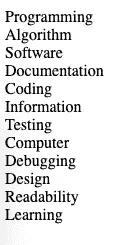
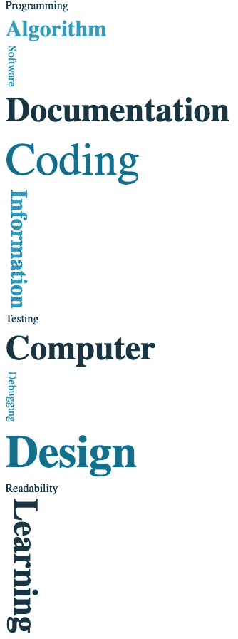
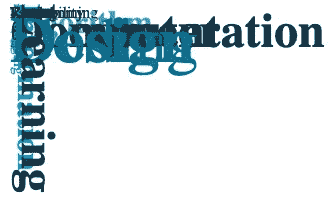
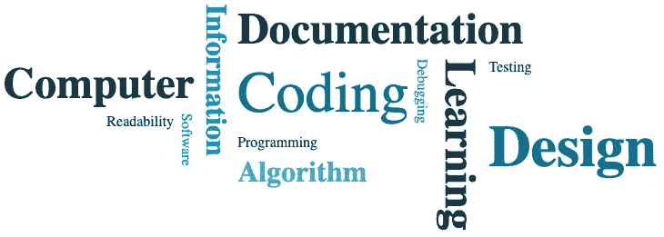

# Word Cloud 与 HTML 和 CSS 教程

> 原文：<https://blog.devgenius.io/word-cloud-with-html-and-css-tutorial-1fa17642391e?source=collection_archive---------2----------------------->

# 介绍

什么是词云？来自维基百科的定义:

> *“文本数据的可视化表示，通常用于描述网站上的关键字元数据，或者可视化自由形式的文本。标签通常是单个单词，每个标签的重要性用字体大小或颜色来表示。当用作网站导航辅助工具时，这些术语会超链接到与标签相关联的项目。”*

[参观现场](https://en.wikipedia.org/wiki/Tag_cloud)

基本上，单词云是根据某种重要性算法以不同风格聚集在一起的一串单词。

在我们的例子中，我们将关注设计。

# 先决条件

*   HTML 和 CSS 的基础知识。
*   带有本地服务器的文本编辑器，我使用带有 Live 服务器扩展的 VSCode。
*   您选择的浏览器。
*   咖啡

# 密码

## 第一步

我们将从一个链接到空 CSS 文件的简单 HTML 样板文件开始:

```
<!DOCTYPE html>
<html><head>
<meta charset="utf-8" />
<meta http-equiv="X-UA-Compatible" content="IE=edge" />
<title>Word Cloud</title>
<meta name="description" content="" />
<meta name="viewport" content="width=device-width, initial-scale=1" />
<link rel="stylesheet" href="style.css" />
</head><body></body></html>
```

接下来，让我们添加一些具有相同名称的“id”的单词，以便我们可以在以后引用它:

```
...
<body>
    <div id="Programming"> Programming</div>
    <div id="Algorithm"> Algorithm</div>
    <div id="Software"> Software</div>
    <div id="Documentation"> Documentation</div>
    <div id="Coding"> Coding</div>
    <div id="Information"> Information</div>
    <div id="Testing"> Testing</div>
    <div id="Computer"> Computer</div>
    <div id="Debugging"> Debugging</div>
    <div id="Design"> Design</div>
    <div id="Readability"> Readability</div>
    <div id="Learning"> Learning</div>
</body>
...
```

如果我们现在启动我们的服务器(在 VSCode 上按下底部面板上的“Go Live”或右键单击资源管理器中的 HTML 文件并按下“用 Live Server 打开”)，我们应该看到我们的文字如下所示:



## 第二步

让我们继续看 CSS 文件:

*   将网格显示添加到带有一些属性的 body 中，使网格居中，其项目之间有一个小间隙。
*   为每个单词添加随机样式，如“书写模式”、“字体大小”、“粗细”和“颜色”，这样我们可以稍后在网格上很好地映射它(这也可以针对每个单词进行)

像这样:

```
body {
    /* center content */
    position: absolute;
    top:0;
    bottom: 0;
    left: 0;
    right: 0; /* grid */
    display: grid;
    justify-content: center;
    align-content: center;
    gap: 5px;
}/* base font color for all words */
body > div {
    color: #022f40;
}/* twice the size, bold and different color for each second word */
body :nth-child(2n) {
    font-size: 2rem;
    color: #38aecc;
    font-weight: bold;
}/* vertical orientation and different color for each third word */
body :nth-child(3n) {
    writing-mode: vertical-lr;
    -webkit-writing-mode: vertical-lr;
    -ms-writing-mode: vertical-lr;
    color: #0090c1;
}/* triple size and different color for each fourth word */
body :nth-child(4n) {
    font-size: 3rem;
    color: #183446;
}/* quadruple size and different color for each fifth word */
body :nth-child(5n) {
    font-size: 4rem;
    color: #046e8f;
}
```

我们现在应该在页面中央看到类似这样的内容:



## 第三步

为了具体映射每个单词的网格，我们需要定义它们的网格区域(为了方便起见，我们称之为与其内容相同),如下所示:

```
#Programming {
    grid-area: Programming;
}#Algorithm {
    grid-area: Algorithm;
}#Software {
    grid-area: Software;
}#Documentation {
    grid-area: Documentation;
}#Coding {
    grid-area: Coding;
}#Information {
    grid-area: Information;
}#Testing {
    grid-area: Testing;
}#Computer {
    grid-area: Computer;
}#Debugging {
    grid-area: Debugging;
}#Design {
    grid-area: Design;
}#Readability {
    grid-area: Readability;
}#Learning {
    grid-area: Learning;
}
```

我们会把单词放在彼此的上面，因为我们没有定义它们在网格上的位置:



## 第四步

向网格中添加一个“网格模板”,它将根据我们之前定义的“网格区域”名称在网格中定位每个单词。

> 网格模板是定义类似于 excel 格式的布局的简写，只是这里每一行都由包含对象名称引用的文本组成(在我们的例子中，它是“网格区域”或定义为“.”的空单元格))用空格隔开。

从 Mozilla [这里](https://developer.mozilla.org/en-US/docs/Web/CSS/grid-template)阅读更多关于“网格模板”的内容

```
body{
    ... grid-template:
    '. . . Information Documentation Documentation Documentation Documentation'
    'Computer Computer Computer Information Coding Debugging Learning Testing'
    '. Readability Software Information Coding Debugging Learning Design     '
    '. . Software Information Programming Debugging Learning Design'
    '. . Software Information Algorithm Debugging Learning Design'
    '. . . Information . . Learning .'; ...
}
```

我们会得到这样一个漂亮的单词网格:



玩它很有趣，可以看到不同的布局，也有助于首先在纸上画出它们，作为获得特定设计的捷径。

最后，让我们给所有单词添加一点“文本阴影”:

```
body > div {
    text-shadow: 3px 5px 8px rgba(1, 1, 1, 0.3);
}
```

# 结果


# 思想

单词云是一种很好的方式来可视化一组单词，这些单词可以代表你想要的任何东西，可以通过重要性算法或随机方式对它们进行样式化，如上所述，它们不难实现，并且实验起来很有趣。

希望你觉得这个小教程有用！